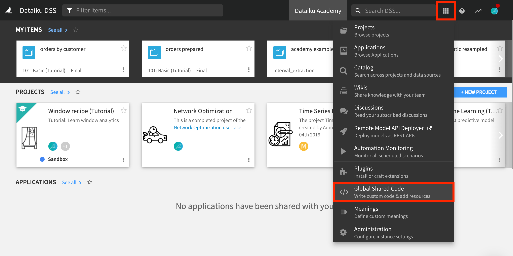
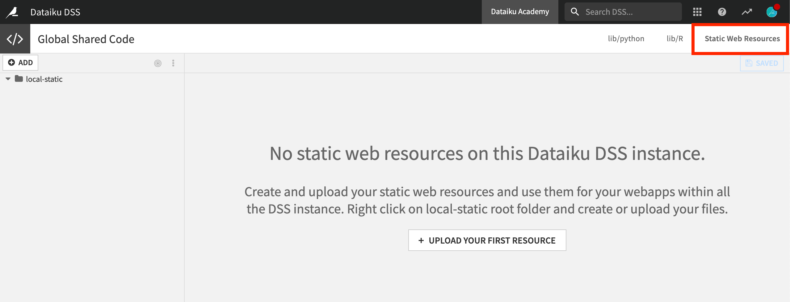

How-To: Display an Image With Bokeh
**************************************

.. meta::
    :tag: code
    :tag: Python
    :tag: webapps
    :description: Discover how to display an image with Bokeh by using a Bokeh Webapp and the Bokeh Python library in a Jupyter notebook with Dataiku

This article applies both to:

- Bokeh webapps;
- Usage of the Bokeh library in a Jupyter notebook.

Add Your Image to the "Static Web Resources"
===============================================

In the global menu of Dataiku, select "Global Shared Code". If you don't see this menu, your administrator needs to grant you additional permissions.

Click on "Static Web Resources" and upload your image.

Reference the Image in Your Code
===============================================

In your Bokeh code, use the ``image_url`` function:

.. code-block:: python

    path = "/local/static/path-of-the-image-within-resources.png"

    p.image_url(url=[path])

What's Next?
================

For more information on using Bokeh in Dataiku, please visit the `reference documentation <https://doc.dataiku.com/dss/latest/python/bokeh.html>`_.
