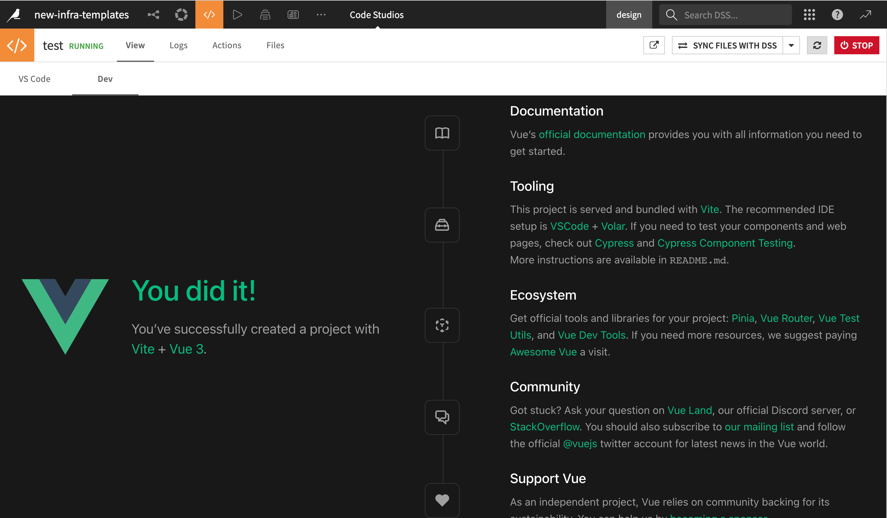

# Basic setup: Quickstart with Angular & Vue Templates

## Prerequisites

- Basic understanding of HTML, JavaScript, and Angular or Vue for frontend development.
- Some experience with Python for backend operations.
- [Code Studio Template](../template/index) is already configured on your Dataiku instance.

This tutorial teaches how to rapidly initiate a web application using pre-configured templates. These templates streamline your workflow by auto-configuring a Node server to host your Code Studio browser path while also routing API requests to the exposed Flask backend.

These templates are also designed for smooth [deployment](../deployment/index) as a standard Dataiku web application.

## Quick Project Setup with Cookiecutter

:::{topic} Note

- Cookiecutter serves as a command-line tool for swift project generation from templates. The Cookiecutter Python code environment will be employed in this scenario, as defined in the Code Studio template.
- All web application projects should be initiated inside the `project-lib-versioned/webapps` directory. Doing so enables seamless synchronization of your source code and build files with the Dataiku project library, thereby simplifying the deployment process.
  :::

### Activating the Cookiecutter Environment

To activate your Cookiecutter environment in the Visual Studio Code (VS Code) UI panel, run the command below:

```bash
source /opt/dataiku/python-code-envs/cookiecutter/bin/activate
```

:::{topic} Note

- The default path for code environments specified in the Code Studio template is `/opt/dataiku/python-code-envs/`. If you've customized this location in the template settings, update the path in the command accordingly.
  :::

### Generating a New Web Application

In this section, we will guide you through the process of creating a new web application using Cookiecutter. You have the option to choose between two templates, VueJS or Angular, for your web application project.

- Navigate to the following directory:

  ```bash
  mkdir ~/workspace/project-lib-versioned/webapps && cd ~/workspace/project-lib-versioned/webapps
  ```

- Execute the following command to instantiate a new project template with Cookiecutter:

  ```bash
  cookiecutter gh:dataiku/solutions-contrib
  ```

  :::{topic} Note

  Cookiecutter is a command-line utility that expedites the creation of project structures using templates. In this context, we utilize it with the `gh:dataiku/solutions-contrib` repository, a public GitHub repository storing templates for Vue and Angular web applications. These templates are specifically designed to streamline the setup of web applications in Dataiku's Code Studio and facilitate smooth deployment to standard Dataiku web apps, ensuring a straightforward and consistent development process for developers.
  :::

- Cookiecutter will then prompt you to select a template:

  ```
  [1/1] Select template
    1 - Vue (./bs-templates/vue)
    2 - Angular (./bs-templates/angular)
    Choose from [1/2] (1):
  ```

  - Select the desired template by entering the corresponding number (1 for Vue and 2 for Angular).

- After template selection, you'll be prompted to enter specific project parameters:

  ```
  [1/6] Choose your (Angular / Vue) project name (Angular Project): tutorial
  [2/6] version (0.0.1):
  [3/6] Choose your client serve port (default 4200) (4200):
  [4/6] Choose your flask backend port (default 5000) (5000):
  [5/6] dss_instance (default):
  [6/6] dku_project ():
  ```

  - "Project Name": your Angular or Vue project name. Though the example uses `tutorial`, you can choose any name.
  - "Version": the project's version.
  - "Client serve port": port on which your frontend (e.g., Angular) will run. The default is 4200.
  - "Flask backend port": port your Flask backend will operate on. The default is 5000.
  - "DSS Instance and DKU Project": these fields are generally optional while operating within Dataiku Code Studio. You can safely leave them blank unless you’re configuring an external development environment that necessitates their input.

- After entering these details, a new project folder will be generated in the `project-lib-versioned/webapps` directory.

Following these steps, you’ll successfully set up a new web application, ready for further development and deployment.

### Launching the Frontend and Backend

Once you've generated your web application using Cookiecutter, you can proceed to launch the frontend and backend. The process is the same for both Angular and Vue templates.

#### Launching the Frontend

- Navigate to your project's directory by replacing **`__PROJECT_NAME__`** with your project folder's name:

  ```
  cd ~/workspace/project-lib-versioned/webapps/__PROJECT_NAME__
  ```

- Install the required dependencies:

  ```
  yarn install
  ```

  The Code Studio template comes pre-configured with `npm`, `yarn`, and `pnpm`. You can use any of these package managers to install dependencies. For instance, you can replace `yarn install` with `npm install` or `pnpm install` based on your preference.

- Run the frontend server

  ```
  ng serve --host 127.0.0.1
  ```

- You can now preview the web application in the **Dev** panel of the Code Studio.

{.image-popup}

#### Launching the Backend

- Activate your backend code environment

  ```
  source /opt/dataiku/python-code-envs/infra37/bin/activate
  ```

  :::{topic} Note
  If you've imported the Code Studio template, an **infra37** code environment with the essential requirements for launching the included Flask server will be available. This environment necessitates **python >= 3.9** or higher and incorporates the following packages:

  ```
  Flask>=0.9
  git+https://github.com/dataiku/solutions-contrib.git@main#egg=webaiku&subdirectory=bs-infra
  python-dotenv>=0.19.0
  dataiku-api-client
  ```

  :::

- Navigate back to your project directory (again, replace **`__PROJECT_NAME__`** with your specific folder name):

  ```
  cd ~/workspace/project-lib-versioned/webapps/__PROJECT_NAME__
  ```

- Execute the following command to launch the backend:

  ```
  python -m backend.wsgi
  ```

By following these steps, you'll successfully initiate both the frontend and backend of your web application within Dataiku's Code Studio environment.

Remember that you can choose between Angular and Vue templates for your project, and the instructions for launching the frontend and backend are the same regardless of your choice.
