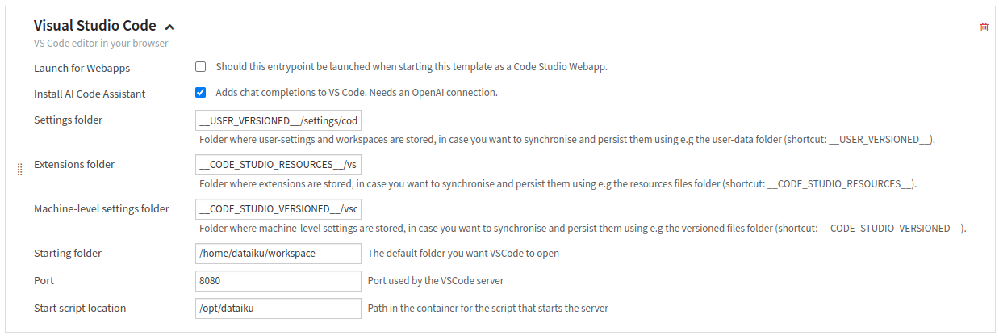
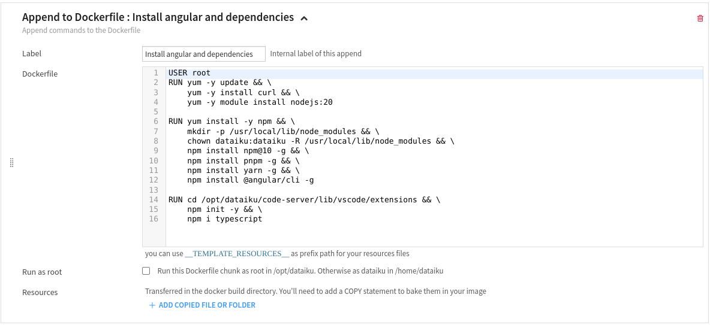
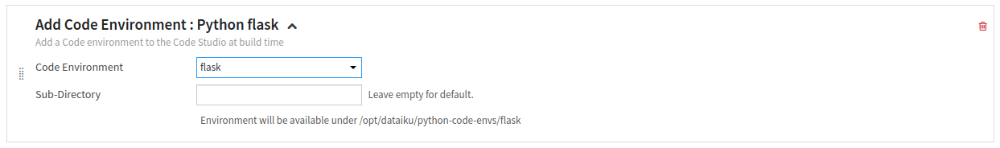
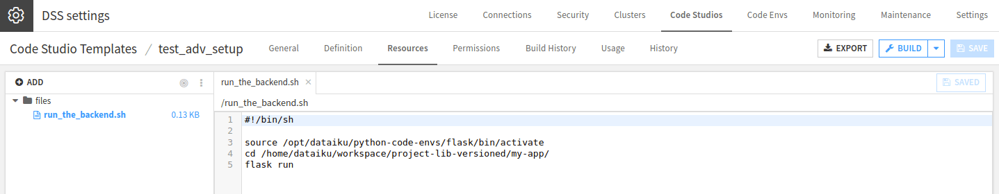
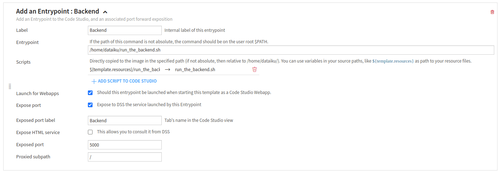
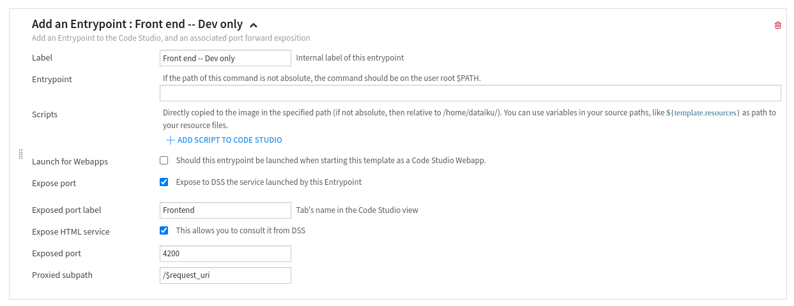
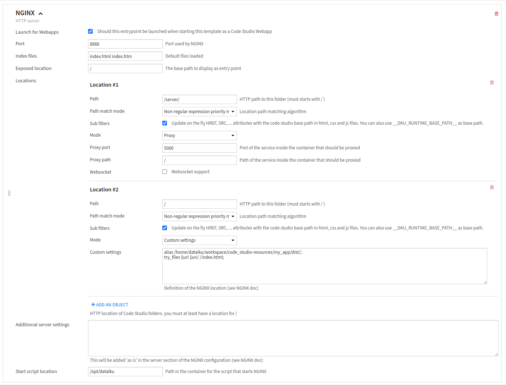
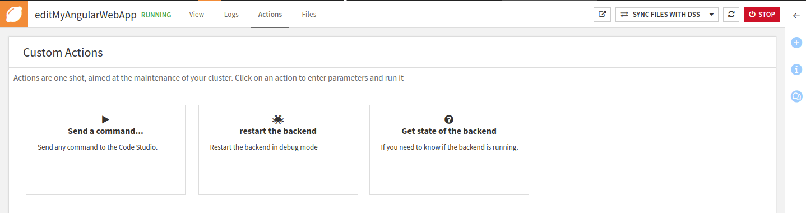

Advanced setup: Code Studio template creation
**********************************************

This tutorial guides users on creating and configuring a Code Studio template to utilize a preferred web framework.
It covers the necessary steps to set up a development environment,
install required packages, and start the backend server.
The template can be applied during both development and production phases.

.. warning::
   If you are using Dataiku Cloud, you won't be able to follow this tutorial,
   as the NGinx block for Code Studio is not available for Cloud.

Prerequisites
#############
For building the code studio template:

* Admin permission
* Container images based on Almalinux
* A code env with Flask (or another Python web server)

Context
#######

This tutorial will teach you how to create and configure a Code Studio template to use your preferred web framework.
It uses the Angular web framework as an example, but could be adapted to any other web framework.
Most modern web frameworks are based on the same principle: they rely on separating the frontend and the backend.

The backend is where processing is done and serves the requested data through routes (API).
Dataiku encourages using Python to interact, so a frequent choice is to implement the backend using Flask.
FastAPI is supported too, but the following examples will focus on a Flask implementation.

The front part has two ways of working,
depending on whether you are developing your application or if it is ready for production.
Usually, when developing an application, it uses "dynamic" files, while a built application serves "static" files.

The Code Studio template in this tutorial can be used during the development and production phases.
If you need, you can split the template into two different templates based on your process.

Building the Code Studio template
#################################

Go to the **Code Studios** tab in the **Administration** menu,
click the **"+Create code studio template"** button, choose an appropriate name for the template,
and click on the **Definition** tab.

Adding an editor to the template
^^^^^^^^^^^^^^^^^^^^^^^^^^^^^^^^

Click the **"+Add a block"** button and choose the **"Visual Studio Code"** block type.
This block allows you to edit the code in Visual Studio Code.
The :doc:`documentation<refdoc:code-studios/code-studio-ides/vs-code>` provides more information.
As shown in :ref:`Figure 1<webapps-code-studio-configuring-code-studio-vs-code>`,
there is no specific need to configure this block. You don't need to tick the **"Launch for webapps"** box.
Ticking this box indicates to Dataiku that this block should be run when you publish our webapps.
When a webapp is published, you don't need a running Visual Studio Code.
The Code Studio will run Visual Code Studio only when you run it in edition.
This block won't start when deploying the web application
(see :ref:`webapps-code-studio-web-application-creation-publishing`).

.. _webapps-code-studio-configuring-code-studio-vs-code:

    Figure 1: Configuring Visual Studio Code.

Installing the web framework
^^^^^^^^^^^^^^^^^^^^^^^^^^^^

Click the **"+Add a block"** button and choose the **"Append to Dockerfile"** block type.
This block allows you to add specific programs to Code Studio; more information is in
:ref:`the documentation<block_append_to_dockerfile>`.

As Angular uses *NodeJS*, you have to install it, and then you need to install *Angular*.
So, in the **"Dockerfile"** block, you have to enter the following:

.. code-block:: bash
    :name:  webapps-code-studio-configuring-code-studio-dockerfile-block
    :caption: Code 1: Dockerfile block

    USER root
    RUN yum -y update && \
        yum -y install curl && \
        yum -y module install nodejs:20

    RUN yum install -y npm && \
        mkdir -p /usr/local/lib/node_modules && \
        chown dataiku:dataiku -R /usr/local/lib/node_modules && \
        npm install npm@10 -g && \
        npm install pnpm -g && \
        npm install yarn -g && \
        npm install @angular/cli -g

    RUN cd /opt/dataiku/code-server/lib/vscode/extensions && \
        npm init -y && \
        npm i typescript

.. _webapps-code-studio-configuring-code-studio-append-to-dockerfile:

    Figure 2: Append to Dockerfile block.

:ref:`Figure 2<webapps-code-studio-configuring-code-studio-append-to-dockerfile>`
shows the **"Append to Dockerfile"** block correctly configured.
This template uses ``npm`` in version 10;
if you want to use another version or framework (such as React, for example),
you must adapt this template to reflect the correct installation of your framework.

.. _webapps-code-studio-configuring-code-studio-installing-the-backend:

Installing and using the backend
^^^^^^^^^^^^^^^^^^^^^^^^^^^^^^^^

Selecting a code environment
============================

Click the **"+Add a block"** button and choose the **"Add Code Environment"** block type.
This block allows you to add a specific code environment that is usable in the Code Studio.
For the **"Code environment"** block, choose the code-env with Flask,
as shown in :ref:`Figure 3<webapps-code-studio-configuring-code-studio-add-code-env>`.
You can find more information on this block in
:ref:`the documentation<block_code_studio_code_env>`.

.. _webapps-code-studio-configuring-code-studio-add-code-env:

    Figure 3: Add Code Environment for the backend.

Creating a helper function
==========================

You will rely on a helper function to start the backend.
In the resources tab, click **+ Add**, select **Create file...**, and choose a relevant filename,
such as ``run_the_backend.sh`` (for example).

The command can take various forms depending on the Python package you choose for your server.
Suppose you use Flask (as the tutorial does), and your backend is stored in the ``project-lib-versioned/my-app`` directory.
You could also store your backend in another location, like ``code_studio-versioned``, for example.
Then the command to enter could be the following (if you choose to use Flask):

.. code-block:: bash

    #!/bin/sh

    source /opt/dataiku/python-code-envs/flask/bin/activate
    cd /home/dataiku/workspace/project-lib-versioned/my-app/
    flask run

This script contains three parts:

* The first line of this command activates the code-env you previously defined.
  You must reuse the exact name you used for the backend code environment.
* The second line positions the shell in the directory where your backend is.
* The third line runs Flask to provide the backend.

:ref:`Figure 4<webapps-code-studio-configuring-code-studio-helper-function>` represents this stage.

.. _webapps-code-studio-configuring-code-studio-helper-function:

    Figure 4: Helper function for starting the backend.

Creating an entry point to run the backend
==========================================

Back to the **Definition** tab, click the **"+Add a block"** button, and choose the **"Add an Entrypoint"** block type.
The purpose of this block is to serve the backend,
meaning start a flask server and expose the port of the Flask server to allow communication with the frontend.

#. Tick **"Launch for Webapps"** and **"Expose port."**

   * The backend is required when the web app is either in development or production, so you must tick the **"Launch for Webapps"** box.
   * **"Expose port"** exposes the port specified in **"Exposed port"** to Dataiku.

#. It would help if you also chose a meaningful name (``backend``, for example) for the **"Expose port label"** field.
#. The **"Expose HTML service"** box remains unchecked.
   If you check this box, a new tab named ``backend`` (if you previously chose this name) will appear in the running Code Studio.
   As the purpose of this block is to serve backend stuff, there is no need to have an HTML tab in the Code Studio.
#. Then, choose an appropriate **"Exposed port"** and **"Proxied subpath,"** which will be used afterward.

Finally, you have to use the previously defined helper function by copying it into the code studio block ("Scripts" part)
and activating it ("Entrypoint" part).

Figure 5 shows a recap of all those steps.

.. _webapps-code-studio-configuring-code-studio-backend-block:

    Figure 5: Configured entrypoint block for  the backend.

.. _webapps-code-studio-configuring-code-studio-creating-the-front:

Creating and using the frontend
^^^^^^^^^^^^^^^^^^^^^^^^^^^^^^^

Click the **"+Add a block"** button and choose the **"Add an Entrypoint"** block type.
The purpose of this block is to run the frontend in development mode.

#. So you need to see the result of your development --> tick the **"Expose HTML service."**
#. You need to have a tab in the running Code Studio --> tick the **"Expose port**" and
   choose a valid name for the **"Exposed port label."**
#. You need to know which port the web framework will be launched on.
   In the case of Angular, the default port is 4200 --> enter ``4200`` in the **"Exposed port."**
#. You need to use a proxied subpath; for development, your code will run in the Code Studio,
   and your file will be served inside this container --> Enter ``/$request_uri`` in **"Proxied subpath."**

.. _webapps-code-studio-configuring-code-studio-frontend-entrypoint:

    Figure 6: Configured Entrypoint block for the frontend.

.. _webapps-code-studio-configuring-code-studio-preparing-code-studio:

Preparing the Code Studio template to be published as a standalone web application
^^^^^^^^^^^^^^^^^^^^^^^^^^^^^^^^^^^^^^^^^^^^^^^^^^^^^^^^^^^^^^^^^^^^^^^^^^^^^^^^^^

Most web frameworks allow users to build their applications after the development phase is finished.
In Angular, the command ``ng build`` creates a ``dist`` directory containing the compiled version of the frontend.
Running the compiled frontend code is nothing more than serving this directory.
You have to decide where your web application will be stored.
This tutorial assumes the frontend will be stored in the ``code_studio-resources`` directory.
You will also need a particular path to serve the backend.
This tutorial assumes that this path is ``server``,
which will be used in :ref:`webapps-code-studio-web-application-creation-backend-call-from-front`, in the following tutorial.

Click the **"+Add a block"** button and choose the **"NGINX"** block type to create a web server that serves the ``dist`` directory.
If you need assistance configuring an NGINX server, please refer to `the nginx documentation. <https://nginx.org/en/docs/>`_
As the web application consists of two parts (the backend and the frontend),
we need to configure two locations, one for each part.
The first location will serve the backend,
and the second location will serve the ``dist`` directory, but only the ``index.html`` file
(Angular will handle the routes correctly;
see `the angular documentation <https://v17.angular.io/guide/deployment#basic-deployment-to-a-remote-server>`_).
The first location is just a proxy to redirect each request to the `server` to the backend.
The second location uses the **"Custom settings"** mode in the configuration with the following settings:

.. code-block:: bash

    alias /home/dataiku/workspace/code_studio-resources/my_app/dist/;
    try_files $uri $uri/ /index.html;

In this code block, ``my_app`` refers to the Angular application,
which will be created in the following tutorial (:ref:`webapps-code-studio-web-application-creation-creating-your-angular-application`).

:ref:`Figure 7<webapps-code-studio-configuring-code-studio-nginx-block>` reflects how an NGINX block should be configured to serve a ``dist`` directory.

.. _webapps-code-studio-configuring-code-studio-nginx-block:

    Figure 7: Configured NGINX block.

Wrapping up
###########

Congratulations! You have configured a code studio template to use your framework.
A quick summary of the choices you've made:

* In the step :ref:`webapps-code-studio-configuring-code-studio-installing-the-backend`,
  you have chosen to use a code environment named ``flask``.
  You also store your backend code in the ``backend`` subdirectory in the ``project-lib-versioned`` directory.
  The name of the code environment is used when you want to run the backend to activate the Python environment.
  The location of your backend code is used when you need to run the backend.
  Finally, you use port 5000 to serve the backend API.
* In the step :ref:`webapps-code-studio-configuring-code-studio-creating-the-front`,
  you choose the port used by the frontend (4200 in this tutorial).
* In the step :ref:`webapps-code-studio-configuring-code-studio-preparing-code-studio`,
  you have stored your built front in the ``code_studio-resources`` directory.

Now that everything is correctly configured, you will create your web application using the
:doc:`following tutorial<../web-application-creation/index>`.
Keep in mind all the choices you have made.

You can also add two action blocks to help you while developing your web application:

* One for knowing if the backend is running
* One is for restarting the backend (in debug mode) if you made some changes in the backend that have yet to be considered.

Click the **"+ Add a block"** button and choose the **"Add Custom Action"** block type.
This block allows running dedicated commands. Fill out the form:

* **"Name"** field: "restart the backend"
* **"Icon"** field: "fas fa-pastafarianism"
* **"Description"** field: "Restart the backend in debug mode"
* **"Behavior"**: "Run and don't wait"
* **"Command line to execute"**:

.. code-block:: bash

    source /opt/dataiku/python-code-envs/flask/bin/activate && pkill flask &&  cd /home/dataiku/workspace/project-lib-versioned/my-app/ &&  flask --debug  run"

Once this block is created, it will appear in the Action tab of the Code Studio,
allowing the user to restart the backend in debug mode.
Using the same principle, you can create an action to see if the backend is running by using the command line:

.. code-block:: bash

	pgrep flask >/dev/null && echo "Flask backend is running" || echo "Flask backend is not running"

:ref:`Figure 8<webapps-code-studio-configuring-code-studio-custom-actions>` shows the integration of those two blocks.

.. _webapps-code-studio-configuring-code-studio-custom-actions:

    Figure 8: Custom actions.