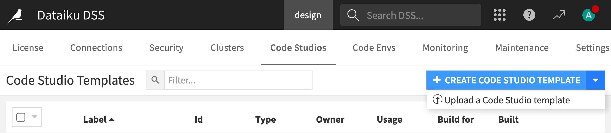
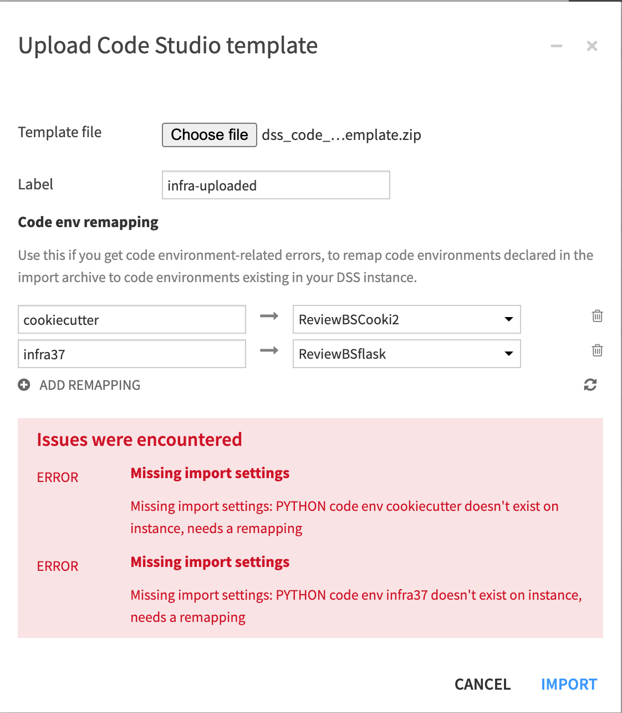
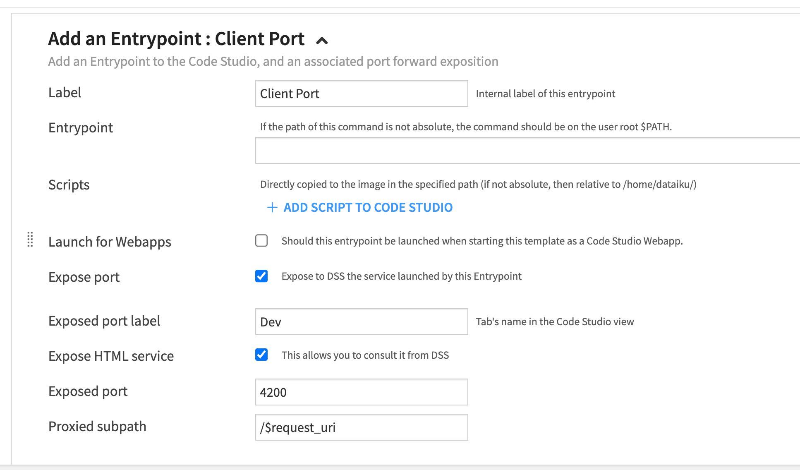
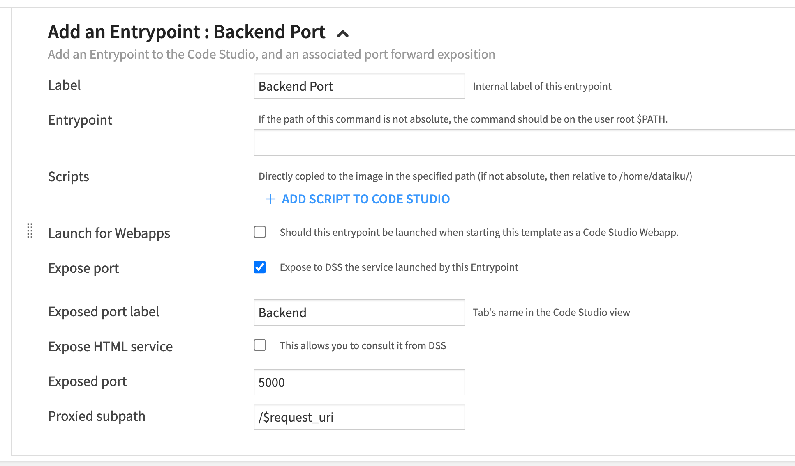
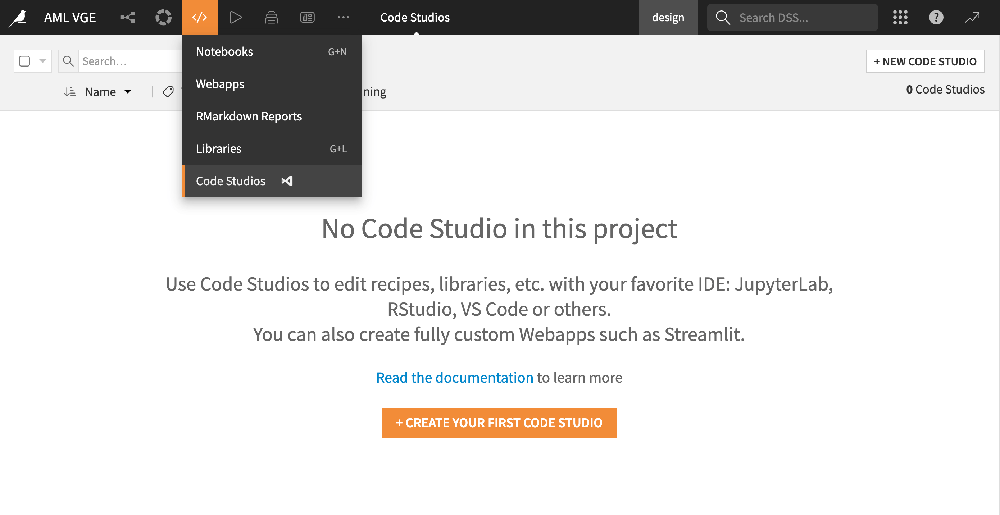

# Basic setup: Code studio template

This section walks you through the setup process of a Code Studio template specifically designed for web application development using leading frontend frameworks. Currently, we support [Vue](https://vuejs.org/) and [Angular](https://angular.io/).

:::{topic} Note
_Set up the configuration only once. Once established, the template is available for all Dataiku projects requiring web application development._
:::

In the next sections, you'll find two methods to set up your Code Studio template. You can choose the one that suits your needs best:

- If you prefer a quick and straightforward setup, follow the [Importing the template into Dataiku](tutorials_webapps_code_studio_template_importing_template) steps below.


- For a more detailed and manual configuration, you can opt for the [Manual setup](tutorials_webapps_code_studio_template_manual_setup) instructions provided afterward.

## Prerequisites

Before you begin, ensure you meet the following requirements:

- Container based image: Almalinux
- Knowledge of [Dataiku Code Studios](https://doc.dataiku.com/dss/latest/code-studios/index.html).
- Admin permissions to configure Code Studio templates.
- Python 3.9+ with [Cookiecutter 2.3.1+](https://pypi.org/project/cookiecutter/) installed.
- For Flask backend, Python 3.9+ and the following packages:
  ```bash
  Flask>=0.9
  git+https://github.com/dataiku/solutions-contrib.git@main#egg=webaiku&subdirectory=bs-infra
  python-dotenv>=0.19.0
  dataiku-api-client
  ```

(tutorials_webapps_code_studio_template_importing_template)=
## Importing the template into Dataiku

Follow these steps to import the template:

- Download the [Code Studio template](https://github.com/dataiku/solutions-contrib/raw/main/code-studio/dss_code_studio_template_infra.zip).

- In the **Application** menu, under **Administration**, navigate to the **Code Studios** panel and select the **Upload a Code Studio Template** option.
- Import the template you've just downloaded.

{.image-popup}

- If you encounter code environment related errors, you can remap `cookiecutter` and `infra37` to code environments existing in your Dataiku instance.

{.image-popup}

- After importing the template, click on **Build** to prepare an image ready to be deployed for the Code Studio.

With these steps, your Code Studio template is ready for use. This enables you to swiftly initiate web application development in Dataiku projects, leveraging frameworks like Vue and Angular.

(tutorials_webapps_code_studio_template_manual_setup)=
## Manual setup

This section explains how to create and configure a Code Studio template manually. You'll learn how to add and modify the essential building blocks within a template.

### Template creation

To create a template:

- Go to the **Application** menu.
- Click **Administration**.
- Select the **Code Studio** panel.
- Click on the **+ Create Code Studio Template** button.
- Give a name to your new template.
- Click on the **Create** button.
- Finally, go to the **Definition** panel.

### Managing block definitions

- **[File synchronization](https://doc.dataiku.com/dss/latest/code-studios/code-studio-templates.html#file-synchronization)**:
  This block synchronizes the file system between Code Studio and Dataiku.
  In this block, you can define some directories or files you want to exclude from synchronization.
  In the **Excluded files** section, enter the patterns: `node_modules/`, `.angular/`, `pycache`.

- **[Kubernetes Parameters](https://doc.dataiku.com/dss/latest/code-studios/code-studio-templates.html#kubernetes-parameters)**: Configure Kubernetes settings, if applicable.

- **[Visual Studio Code](https://doc.dataiku.com/dss/latest/code-studios/code-studio-templates.html#visual-studio-code)**: Add a Visual Studio Code block. Typically, no settings need to be changed here.

- **[Append to Dockerfile](https://doc.dataiku.com/dss/latest/code-studios/code-studio-templates.html#append-to-dockerfile)**: Insert this block and include the following Dockerfile content:

  ```
  USER root
  RUN yum -y module install nodejs:18

  RUN node -v

  RUN yum install -y npm && \
  mkdir -p /usr/local/lib/node_modules && \
  chown dataiku:dataiku -R /usr/local/lib/node_modules && \
  npm install npm -g && \
  npm install pnpm -g && \
  npm install yarn -g && \
  npm install @angular/cli -g

  RUN yum -y remove git && \
  yum -y remove git-\* && \
  yum -y install https://packages.endpointdev.com/rhel/8/main/x86_64/endpoint-repo.noarch.rpm && \
  yum -y install git

  RUN cd /opt/dataiku/code-server/lib/vscode/extensions && \
  npm init -y && \
  npm i typescript
  ```

:::{topic} Note
This Dockerfile block does the following:

- Install `npm`, `yarn`, `pnpm`, and the _Angular CLI_ globally.
- Update `git` to the latest version.
- Installs TypeScript for enhanced linting and IntelliSense in VS Code.
  :::

- **[Add an Entrypoint](https://doc.dataiku.com/dss/latest/code-studios/code-studio-templates.html#add-an-entry-point)**: Expose the HTML service to make the frontend accessible from the Code Studio UI when launching your web application client server. Use `/$request_uri` for the proxied subpath.

{.image-popup}

- **[Add an Entrypoint](https://doc.dataiku.com/dss/latest/code-studios/code-studio-templates.html#add-an-entry-point)** Add another entry point for your Flask backend. Use `/$request_uri` for the proxied subpath here as well.

:::{topic} Note
_You don't need to expose the HTML service for this entry point._
:::

{.image-popup}

- **[Add Code environments](https://doc.dataiku.com/dss/latest/code-studios/code-studio-templates.html#add-a-code-environment)**: Finally, include the previously configured code environments for Cookiecutter.

- **[Add Code environments](https://doc.dataiku.com/dss/latest/code-studios/code-studio-templates.html#add-a-code-environment)**: Finally, include the previously configured code environments for Flask.

- **Build** the template to prepare an image that is ready to be deployed for the Code Studio.

## Using the Configured Template

Once the template is set up, using it is straightforward:

- Navigate to **</> -> Code Studios** in the top navigation bar.
- Click on **+ New Code Studio** in the upper right and choose your configured template.
- Start the code studio.

{.image-popup}

