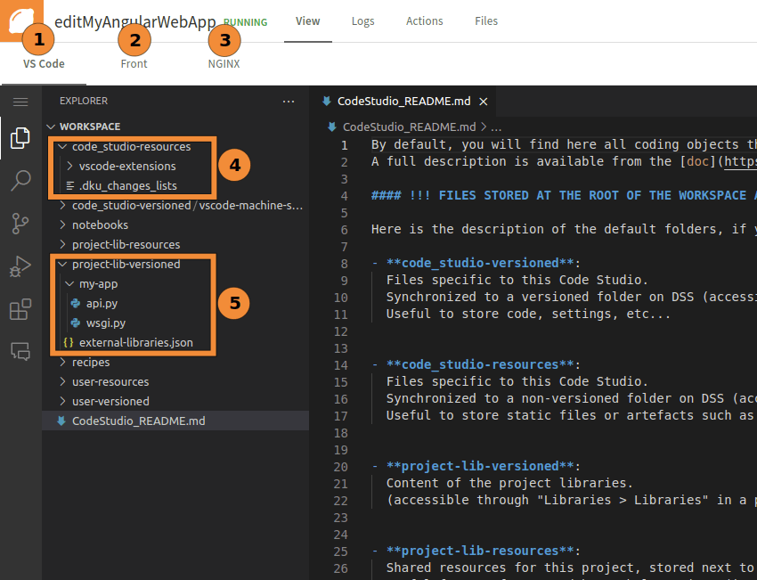
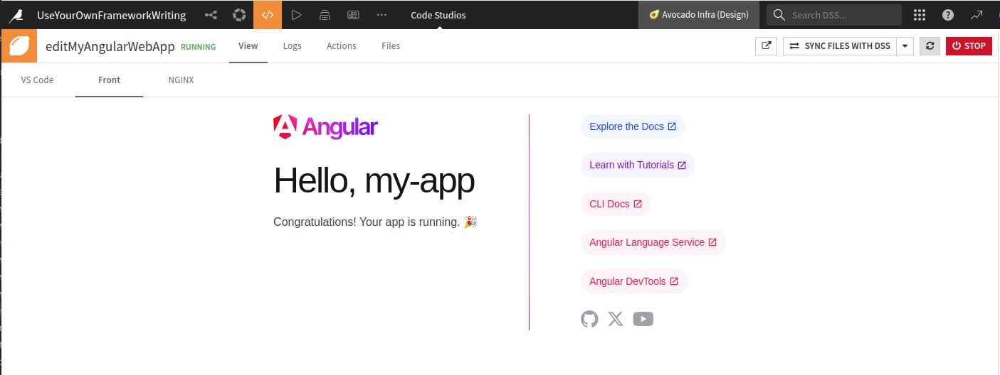
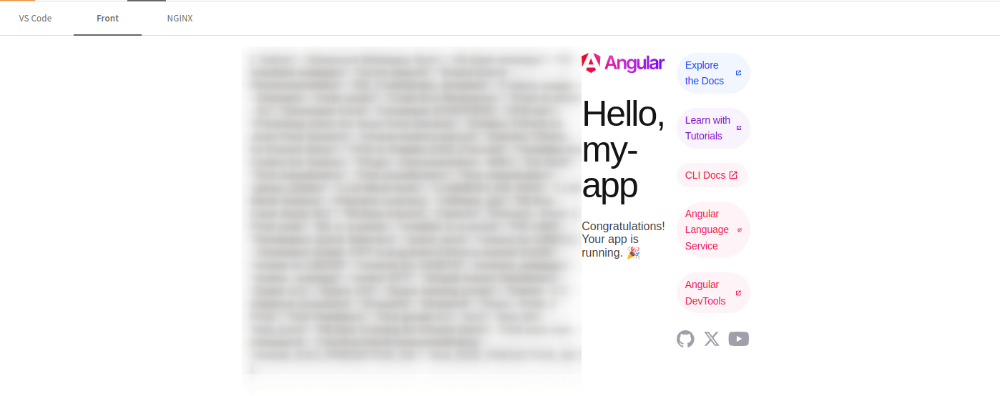
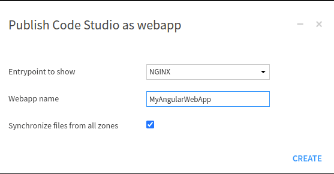
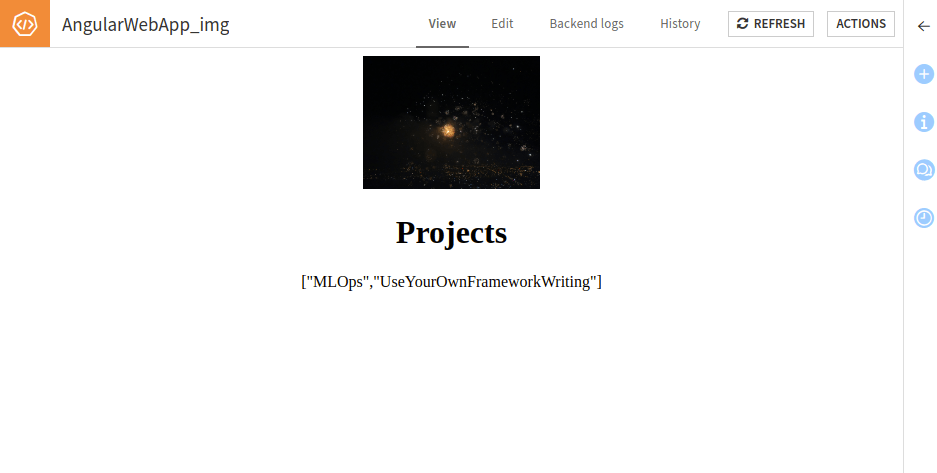

Advanced setup: Web application creation and publication
********************************************************

This tutorial outlines the process of creating and publishing a web application using Code Studio.
It specifically focuses on setting up a backend using Flask or FastAPI and creating an Angular frontend.
It covers the necessary prerequisites,
such as coding the backend and configuring the Angular application to work seamlessly with the backend.
Additionally, it provides guidance on managing project files and running the application locally.

.. warning::
   If you are using Dataiku Cloud, you won't be able to follow this tutorial,
   as the NGinx block for Code Studio is not available for Cloud.

Prerequisites
#############
You need a Code Studio template, as defined in :doc:`the previous tutorial<../configuring-code-studio/index>`.

Creating your backend
#####################
If you choose to code your backend in a location other than the project libraries,
you will have to do so in the Code Studio. You may also have to run your backend manually.
Coding the backend in the project libraries allows you to share its development with different users.
The following shows how to create the backend in the project library,
which you may want to adapt for your specific needs.
If you don't, Code Studio won't be able to start the backend correctly.

Go to the project libraries (**</> > Libraries**), and in the library editor under the ``lib`` folder,
create a folder named "my-app "(if you choose ``my-app`` as a name for your backend server in
:ref:`this section<webapps-code-studio-configuring-code-studio-installing-the-backend>`).

In this folder, create a file named ``api.py``.
This file is responsible for defining the API that your backend will use.
:ref:`Code 1<webapps-code-studio-web-application-creation-backend-api-example>`
shows a basic example of an interaction between the backend and Dataiku.
The highlighted line defines a Flask blueprint (for more information,
see the `Flask documentation <https://flask.palletsprojects.com/en/3.0.x/blueprints/>`_).
You can define as many files as you need.
These files will be attached to a specific route when creating the backend.
You can use the FastAPI framework instead of Flask if you prefer.

.. code-block:: python
    :caption: Code 1: Basic example of interaction between Flask backend and Dataiku.
    :name: webapps-code-studio-web-application-creation-backend-api-example
    :emphasize-lines: 4

    from flask import Blueprint, jsonify
    import dataiku

    api = Blueprint("api", __name__)

    @api.route("/")
    def get_projects_name_from_instance():
        client = dataiku.api_client()
        projects = client.list_projects()

        return [p.get('name') for p in projects]

Still in the folder named ``my-app``, create a file named ``wsgi.py``.
This file is responsible for creating and configuring the Flask backend server.
In this file, you will link all the files previously defined.
:ref:`Code 2<webapps-code-studio-web-application-creation-backend-example>` shows an example
of a correctly defined backend using the file ``api.py`` previously created.

.. code-block:: python
    :name: webapps-code-studio-web-application-creation-backend-example
    :caption: Code 2: Creation of the backend server

    from flask import Flask
    from api import api

    app = Flask(__name__)

    app.register_blueprint(api)

    if __name__ == "__main__":
        app.run(host="127.0.0.1", port=5000)

You don't need a fully functional server to start your Code Studio.
However, if you need to add new files, restart the Code Studio for those files to be considered.
Or, if you choose to add **"Custom actions"** in the template, you can click on the action button to restart the backend.

Once the backend is ready, you can create the Angular application.

.. _webapps-code-studio-web-application-creation-creating-your-angular-application:

Creating your Angular application
#################################

Creating the Code Studio
^^^^^^^^^^^^^^^^^^^^^^^^
Go to **</> -> Code studios**, click the **+ New code studio**, choose the template created in this tutorial,
select a name for your web application edition, and click the **Create** button.
Once the Code Studio is created, click the **Start code studio** button.
After a little wait, the Code Studio should be started,
as shown in :ref:`Figure 1<webapps-code-studio-web-application-creation-first-start>`.
In this figure, you will find five different zones:

#. This is the place where you will code your application.
#. This is where you will visualize your application under development (``ng serve``).
   You will see only the frontend part, as the back end is not exposed to users but only to the front.
#. This tab is for visualizing the compiled version of your application(``ng build``).
#. This folder is where your application will live.
#. This folder contains the code of your backend.

.. _webapps-code-studio-web-application-creation-first-start:

    Figure 1: Starting Code Studio for the first time.

Currently, neither the "Front" tab nor the "NGINX" tab shows meaningful content.
In Visual Code, open a new terminal and enter the following commands:

.. code-block:: bash

    cd code_studio-resources
    ng new --skip-git my_app

These commands will create a new Angular application in the folder ``code_studio-resources/my_app``.
The previous tutorial uses this name in the ":ref:`webapps-code-studio-configuring-code-studio-preparing-code-studio`" section.

If you don't want to skip the git part, you should first configure your *git id* (``user.name`` and ``user.email``).
You should not enable the server-side rendering.

Once your Angular application is created,
go to your application directory and save the permissions of the ``node_modules`` directory:

.. code-block:: bash

    cd my_app
    getfacl -R node_modules > saved_permissions

Each restart of the Code Studio will modify those permissions.
To restore the initial permissions, enter the following command:

.. code-block:: bash

    setfacl --restore=saved_permissions

Still in the terminal, note the result of:

.. code-block:: bash

	echo $DKU_CODE_STUDIO_BROWSER_PATH_4200

If you choose another port for your frontend, you should change 4200 to the one you previously selected.
Edit the ``code_studio-resources/my-app/angular.json`` file and change the ``projects/my-app/architect/build/options/outputPath`` field with the following content:

.. code-block:: javascript

    "outputPath": {
          "base": "dist",
          "browser": ""
    },
    "baseHref": "<RESULT_OF_THE_PREVIOUS_COMMAND_YOU_SHOULD_REPLACE_THIS>/",
    "deployUrl": "",

``baseHref`` and ``deployUrl`` should also be added/updated. Now, you are ready to go.
Pay attention to the trailing slash for the ``baseHref`` field.
To view the result of this Angular application in the terminal, enter the command:

.. code-block:: bash

	ng serve --host 127.0.0.1

If everything goes well, you should have something similar to Figure 2.

.. _webapps-code-studio-web-application-creation-angular-started:

    Figure 2: Starting the Angular application for the first time.

Accessing the backend
^^^^^^^^^^^^^^^^^^^^^

Now that you have a running application, you may need to connect it to the backend.
To do this, you need to use an ``HttpClient``.

For example, to populate your welcome page with a list of all existing (and accessible) projects,
you will first create the backend function to retrieve those names (shown in
:ref:`Code 1<webapps-code-studio-web-application-creation-backend-api-example>`).

In ``app.config.ts``, located in ``my_app/src/app``, add the ``HttpClientModule`` as a provider:

.. code-block:: typescript
    :emphasize-lines: 1,5,10

    import { ApplicationConfig, importProvidersFrom } from '@angular/core';
    import { provideRouter } from '@angular/router';

    import { routes } from './app.routes';
    import { HttpClientModule } from '@angular/common/http';

    export const appConfig: ApplicationConfig = {
      providers: [
        provideRouter(routes),
        importProvidersFrom(HttpClientModule)
      ]
    };

Then, connect this provider with your root component (in ``code-studio-resources/my_app/src/app.component.ts``),
as shown in :ref:`Code 3<webapps-code-studio-web-application-creation-backend-call-from-front>`.

This code snippet creates a new property (``projects``) that you may use in the associated template.
For example, you can put ``{{ projects }}`` just after the line containing ``
``,
in the file ``my_app/src/app/app.component.html``.
By doing so, you will obtain something similar to :ref:`Figure 3<webapps-code-studio-web-application-creation-backend-call-from-front>`.

.. code-block:: typescript
    :caption: Code 3: Calling the backend from the frontend.
    :name: webapps-code-studio-web-application-creation-backend-call-from-front
    :emphasize-lines: 1,3,13-25

    import { Component, OnInit, isDevMode } from '@angular/core';
    import { RouterOutlet } from '@angular/router';
    import { HttpClient } from '@angular/common/http';

    @Component({
      selector: 'app-root',
      standalone: true,
      imports: [RouterOutlet],
      templateUrl: './app.component.html',
      styleUrl: './app.component.css'
    })
    export class AppComponent implements OnInit {
      title: String = "my-app";
      projects: String = "";
      backendUrl: string ='';

      constructor (private http:HttpClient){}

      ngOnInit() {
        this.backendUrl = isDevMode() ? '../5000/' : 'server/';

        this.http.get<String>(this.backendUrl+'projects', { responseType: 'text' as 'json'})
        .subscribe((resp:any) => {
          this.projects = resp
        });
      }
    }

.. _webapps-code-studio-web-application-creation-list-projects:

    Figure 3: Angular application with backend running.

.. _webapps-code-studio-web-application-creation-publishing:

Publishing your angular application
###################################

Once you are happy with your application, you can publish it.
As the **NGINX** block serves the ``dist`` folder when you start the web application, you need to build it.
So that the  ``dist`` directory contains an up-to-date version of your application.
To build the Angular application, in the terminal, enter the following command:

.. code-block:: bash

	ng build --base-href __DKU_RUNTIME_BASE_PATH__/

Once the build is completed, go to the action panel and click the **Publish** button.
Then, fill out the form, selecting the ``NGINX`` **Entrypoint to show**, as shown in
:ref:`Figure 4<webapps-code-studio-web-application-creation-publication>`. Your web application is live!
If the publication is the last step of your journey, you should remove (and update from the template)
the ``--debug`` parameter used in :ref:`webapps-code-studio-configuring-code-studio-installing-the-backend`.
You should not publicly publish a web application with a backend in debug mode.

.. _webapps-code-studio-web-application-creation-publication:

    Figure 4: Publishing an Angular application.

Wrapping up
###########

Congratulations! You have created and published an Angular application.
You can add an image to the ``assets`` of your Angular application and use it in the HTML template.
Replacing the content of the ``app.component.html`` with
:ref:`Code 4<webapps-code-studio-web-application-creation-backend-simple-template>` will produce something equivalent to
:ref:`Figure 5<webapps-code-studio-web-application-creation-simple-template-result>`.

.. code-block:: html
    :caption: Code 4: Simple template with an image.
    :name: webapps-code-studio-web-application-creation-backend-simple-template

    
    <main class="main">
      

        

          
        

        <h1>Projects</h1>
        
{{ projects }}

      

    </main>

    <router-outlet />

.. _webapps-code-studio-web-application-creation-simple-template-result:

    Figure 5: Simple template with an image.

You can now add new routes to your backend or develop new components for your Angular application.
The development process for the Angular application follows the same rules as that for classical Angular application development.

