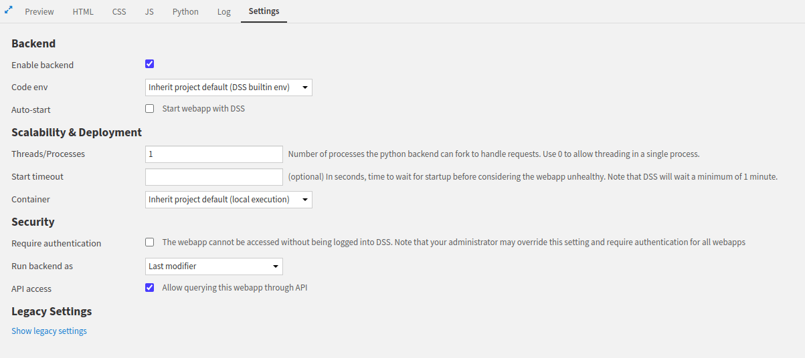

Querying the LLM from an headless API
*************************************

In this tutorial, you will learn how to build an API from a web application's backend (called headless API)
and how to use it from code.
You will use the LLM Mesh to query an LLM and serving the response.

You can use a headless web application to create an API endpoint for a particular purpose
that doesn’t fit well in the API Node.
For example, you may encounter this need if you want to use an SQLExecutor, access datasets, etc.
The API node is still the recommended deployment for real-time inference
and all use cases for which API-Node had been designed
(see :doc:`this documentation <refdoc:apinode/concepts>` for more information about API-Node)

Prerequisites
#############

.. tabs::

    .. group-tab:: Standard - Flask

        * Dataiku >= 13.1

    .. group-tab:: Standard - FastAPI

        * Dataiku >= 14.1

    .. group-tab:: Dash

        * Dataiku >= 13.1
        * A code environment with ``dash``.

Building the server
###################

The first step is to define the routes you want your API to handle.
A single route is responsible for a (simple) process.
Dataiku provides an easy way to describe those routes.
Relying on a Flask or FastAPI server helps you return the desired resource types.
Check the **API access** in the web apps' settings to use this functionality,
as shown in :ref:`Figure 1<tutorial-webapps-common-api-llm-api-access>`.

.. _tutorial-webapps-common-api-llm-api-access:

    Figure 1: Enabling API access.

This tutorial relies on a single route (``query``) to query an LLM.
As the message sent to the LLM could be very long, you can not consider passing the message in the URL.
So, you will have to send the message in the body of the request.
For this, ``GET`` method is not the recommended way, as it is not suppose to have a body.
You will use the ``POST`` method to send the message in a JSON body associated to the request.
Once the query comes to the server, the server will extract the message, send it to the LLM and return the response to the user.

Before accessing to the body, you have to check if the ``Content-type`` is well defined.
Then, you must extract the message from the body.
Send the message to the LLM, and if querying the LLM is successful return the response to the user.
Highlighted lines in :ref:`Code1<tutorial-webapps-common-api-llm-code-1>` show how to do.
The remaining lines show how to set up the whole application.

.. _tutorial-webapps-common-api-llm-code-1:

.. tabs::

    .. group-tab:: Standard - Flask

        .. literalinclude:: ./assets/flask.py
            :language: python
            :emphasize-lines: 10-17,26-28
            :caption: Code 1: LLM Headless API

    .. group-tab:: Standard - FastAPI

        .. literalinclude:: ./assets/fastapi.py
            :language: python
            :emphasize-lines: 11-20,26
            :caption: Code 1: LLM Headless API

    .. group-tab:: Dash

        .. literalinclude:: ./assets/code.py
            :language: python
            :emphasize-lines: 12-19,28-30
            :caption: Code 1: LLM Headless API

Querying the API
################

To access the headless API, you must be logged on to the instance or have an API key that identifies you.
If you need help setting up an API key, please read :doc:`this tutorial<refdoc:apinode/security>`.
Then, there are several different ways to interact with a headless API.

.. _tutorial-webapps-common-api-llm-curl-section:

.. tabs::

    .. group-tab:: cUrl

        Using cUrl requires an API key to access the headless API or an equivalent way of authenticating,
        depending on the authentication method set on the Dataiku instance.
        Once you have this API key, you can access the API endpoint with the following command.
        The ``WEBAPP_ID`` is the first eight characters (before the underscore) in the webapp URL.
        For example, if the webapp URL in Dataiku is ``/projects/HEADLESS/webapps/kUDF1mQ_api/view``, the ``WEBAPP_ID`` is
        ``kUDF1mQ`` and the ``PROJECT_KEY`` is ``HEADLESS``.

        .. code-block:: bash
            :caption: Code 2: ``cUrl`` command to fetch data
            :name: tutorial-webapps-common-api-llm-curl

            curl -X POST --header 'Authorization: Bearer <USE_YOUR_API_KEY>' \
             'http://<DATAIKU_ADDRESS>:<DATAIKU_PORT>/web-apps-backends/<PROJECT_KEY>/<WEBAPP_ID>/query' \
             --header 'Content-Type: application/json' \
             --data '{
                 "message": "Write an haiku on boardgames"
             }'

    .. group-tab:: Python

        You can access the headless API using the Python API.
        Use the ``dataikuapi`` or the ``dataiku`` package, to create a :class:`dataikuapi.DSSClient`, as shown in :ref:`Code 3<tutorial-webapps-common-api-python>`.

        .. literalinclude:: ./assets/python.py
            :language: python
            :caption: Code 3: Fetching data from the Python client
            :name: tutorial-webapps-common-api-llm-python

Wrapping up
###########

If you need to give access to unauthenticated users, you can turn your web application into a public one,
as :doc:`this documentation <refdoc:webapps/public>` suggests.
Now that you understand how to turn a web application into a headless one, you can create an agent-headless API.

