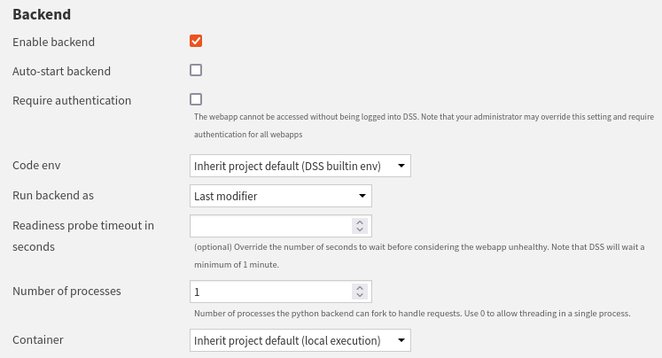

Impersonation with webapps
**************************

Concepts
########

Webapps can be accessed by any user with the necessary permissions,
such as "Read dashboards" or "Read project content" after successfully logging in.
You can refer to the :doc:`Public webapps<refdoc:webapps/public>` page if you require further information.

Each time a user uses a webapp, the code is executed on behalf of a user,
defined by the "Run backend as" parameter configured in the webapp settings,
as illustrated in :ref:`Figure 1<webapps_common_backend_configuration>`.
Therefore, the actions performed by the user are attributed to the user mentioned in the "Run backend as" parameter.

.. _webapps_common_backend_configuration:

    Figure 1: Backend configuration.

For example, if user U1 runs a webapp with the "Run backend as" parameter set to A1,
the actions taken by U1 will be identified as actions taken by the user A1.
If you need the actions being identified as actions taken by user U1, you must make an impersonation call.

It is essential to consider the security and permission aspects of impersonation while using webapps.
You can refer to :doc:`this documentation<refdoc:webapps/security>` to learn more about these aspects.

Impersonation usage
###################

Impersonation calls work on any web framework so that you can use your preferred web framework.
Creating a simple webapp allows you to test, evaluate, and understand how impersonation works.
When a job starts, Dataiku logs it.
Then, you can observe impersonation by examining a Dataiku project's interface and jobs section.

To test impersonation, you will create a web application that builds a dataset (i.e., starts a job).
You can observe impersonation by examining a Dataiku project's interface or the jobs section.
To carry out this task, you will use the Dataiku TShirts project. To do so:

1. On the top left corner, click **+ New project > Sample project > Dataiku TShirts**.
2. On the top navigation bar, navigate to the **</> > Webapp** section. 
3. Click on **+ New Webapp** and select **Code Webapp**.
4. Select the library with which you want to build your webapp. For standard webapps, you can choose either Flask or FastAPI as backend framework. Examples are provided for both.

The webapp aims to build a dataset present in the project; for example,
you will build the ``web_history_prepared`` dataset.

Implementation
##############

Codes presented show two ways of getting user information, but there is only one way to do impersonation.
You can also get user information by using the impersonation mode.

.. tabs::

    .. group-tab:: Standard - Flask

        .. literalinclude:: ./assets/standard.html
            :language: HTML
            :linenos:
            :caption: HTML Code

        .. literalinclude:: ./assets/standard.js
            :language: javascript
            :linenos:
            :caption: Javascript code

        .. literalinclude:: ./assets/flask.py
            :language: python
            :linenos:
            :caption: Backend code

    .. group-tab:: Standard - FastAPI

        .. literalinclude:: ./assets/standard.html
            :language: HTML
            :linenos:
            :caption: HTML Code

        .. literalinclude:: ./assets/standard.js
            :language: javascript
            :linenos:
            :caption: Javascript code

        .. literalinclude:: ./assets/fastapi.py
            :language: python
            :linenos:
            :caption: Backend code

    .. group-tab:: Dash

        .. literalinclude:: ./assets/dash.py
            :language: python
            :linenos:
            :caption: Dash code

    .. group-tab:: Bokeh

        .. literalinclude:: ./assets/bokeh.py
            :language: python
            :linenos:
            :caption: Bokeh code

    .. group-tab:: Streamlit

        .. literalinclude:: ./assets/streamlit.py
            :language: python
            :linenos:
            :caption: Streamlit code

Wrapping Up
###########

Congratulations! You know how to use and implement impersonation for web applications.
Permissions and impersonation are critical points for web application security.