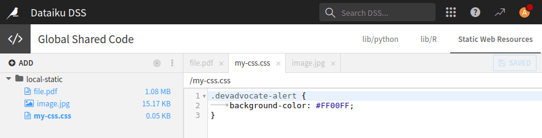

Accessible resources from webapps
*********************************

Web applications need access to various resources to function correctly.
These resources can be internal (stored in Dataiku) or external (stored outside of Dataiku).

To access these resources, there are several strategies that developers can use depending on the specific use case.
For example, the developer can use a JavaScript function to fetch the necessary data
or assets if the resource is required during an event, such as when a button is clicked.
Alternatively, the developer can use server-side code to retrieve the necessary information
if the resource is needed when the web app is being built, for example.
This tutorial will outline some of the most essential best practices for accessing resources in web apps.

At the end of the tutorial the complete code is provided for each framework.
Each code highlights all different use cases for one dedicated framework.
The Standard webapp framework examples use Flask for the backend, you can also use FastAPI instead if you prefer. You will have to adapt the routes yourself in that case.

External resources
##################

When creating a web application in Dataiku that requires accessing external resources,
the process is similar to traditional web application development.
In other words, you can use the standard HTML tags to access a resource on a specific URL.
For instance, :ref:`Code 1<tutorials_webapps_common_resources_external_url>` below illustrates
how to display an image using an external URL.

.. _tutorials_webapps_common_resources_external_url:

.. tabs::
    .. group-tab:: Standard

        .. literalinclude:: ./assets/standard.html
            :language: HTML
            :lines: 28
            :caption: Code 1: How to use external resources
            :dedent: 20

        Or you can use Javascript to retrieve data.

        .. literalinclude:: ./assets/standard.js
            :language: Javascript
            :lines: 33-38
            :caption: Code 1.1: How to use external resources in Javasript

    .. group-tab:: Dash

        .. literalinclude:: ./assets/dash.py
            :language: python
            :lines: 89-91
            :caption: Code 1: How to use external resources
            :dedent: 28

    .. group-tab:: Streamlit

        .. literalinclude:: ./assets/streamlit.py
            :language: python
            :lines: 44-46
            :caption: Code 1: How to use external resources

Internal resources
##################

Web applications in Dataiku can use resources stored in Dataiku.
There are various places where resources can be stored. 

* The section :ref:`tutorial_webapps_common_resources_managed_folder` explains
  how to use resources stored in a managed folder.
  Storing data in a managed folder is outside the scope of this tutorial,
  as there is nothing more than creating a managed folder and putting your data in it.
  These resources are tied to a project when storing resources in a managed folder.
  If you need to store resources for multiple project, consider storing them in the **Global shared code**
  or sharing the managed folder across projects.
* The section :ref:`tutorial_webapps_common_resources_project_lib` explains how to use resources stored in the resources project library.
  These resources are tied to a project library.
  So you should consider this option, if your data are local to a project, do not want those data to appear in the flow,
  and you need the user to have a minimal set of permissions (defined by the project) to access or edit those data.
* The section :ref:`tutorial_webapps_common_resources_global_shared_code` explains
  how to store user resources stored in the **Static web resources**,
  defined in the **Global shared code** in the application menu.
  Suppose your resources are not dedicated to a project and are not sensitive data,
  or your web application is intended to be a public web app.
  In that case you should store these resources in the **Static web resources**.
* The section :ref:`tutorial_webapps_common_resources_code_studio` focuses on Code Studios
  and its usage when storing resources inside.
  You should store your resources in Code Studio.
  If you want your resources been between multiple projects within Code Studio templates,
  use the "Append to Dockerfile" block; see :doc:`refdoc:code-studios/code-studio-templates`.

The tutorial explains how to handle three different file types in each section.
Depending on the framework, file usage can change depending on the file type.
We have highlighted the most frequent usage of images, files, and CSS.
Even though those resources are handled in the same way, the purpose of their usage changes.

.. _tutorial_webapps_common_resources_managed_folder:

Internal resources stored in a managed folder
^^^^^^^^^^^^^^^^^^^^^^^^^^^^^^^^^^^^^^^^^^^^^

.. _tutorial_webapps_common_resources_managed_folder_image:

Displaying an image
+++++++++++++++++++

.. tabs::

    .. group-tab:: Standard

        There are three steps to follow to load and use an image in a Dataiku web application:
        
        * Use the ``img`` tag in your HTML with the ``src`` attribute set to ``""`` (:ref:`Code 2.1<tutorial_webapps_common_resources_managed_folder_image_standard_html>`).
        * In the Python backend, create a route to retrieve and serve the image file
          (:ref:`Code 2.2<tutorial_webapps_common_resources_managed_folder_image_standard_python>`).
        * In the JavaScript tab, dynamically set the image source to the route created in 
          :ref:`Code 2.2<tutorial_webapps_common_resources_managed_folder_image_standard_python>` 
          (:ref:`Code 2.3<tutorial_webapps_common_resources_managed_folder_image_standard_javascript>`)

        .. literalinclude:: ./assets/standard.html
            :language: html
            :caption: Code 2.1: Use the ``img`` tag
            :name: tutorial_webapps_common_resources_managed_folder_image_standard_html
            :lines: 68
            :dedent: 20

        .. literalinclude:: ./assets/standard.py
            :language: python
            :caption: Code 2.2: Backend route for serving an image
            :name: tutorial_webapps_common_resources_managed_folder_image_standard_python
            :lines: 1-31
            :emphasize-lines: 29-31

        .. literalinclude:: ./assets/standard.js
            :language: javascript
            :caption: Code 2.3: Javascript for dynamically load the image
            :name: tutorial_webapps_common_resources_managed_folder_image_standard_javascript
            :lines: 2,7,7,17

    .. group-tab:: Dash

        .. literalinclude:: ./assets/dash.py
            :language: python
            :caption: Code 2.1: Defining an helper function
            :name: tutorial_webapps_common_resources_managed_folder_image_dash_helper_function
            :lines: 1-17, 50-60
            
        .. literalinclude:: ./assets/dash.py
            :language: python
            :caption: Code 2.2: Use the ``html.Img`` element
            :name: tutorial_webapps_common_resources_managed_folder_image_dash_img
            :lines: 97-102
            :dedent: 28
            

    .. group-tab:: Streamlit

        .. literalinclude:: ./assets/streamlit.py
            :language: python
            :lines: 1-27
            :caption: Code 2.1: defining an helper function
            :name: tutorial_webapps_common_resources_managed_folder_image_streamlit_helper_function

        .. literalinclude:: ./assets/streamlit.py
            :language: python
            :lines: 49-51
            :caption: Code 2.2: Use the `st.image` element
            :name: tutorial_webapps_common_resources_managed_folder_image_streamlit_image

.. _tutorial_webapps_common_resources_managed_folder_serving_file:

Serving a file
++++++++++++++

Serving a file for an end-user relies on the same principle. Except you don't display it.

.. tabs::

    .. group-tab:: Standard

        .. literalinclude:: ./assets/standard.html
            :language: html
            :caption: Code 3.1: Serving a file (HTML part)
            :name: tutorial_webapps_common_resources_managed_folder_serving_file_html
            :lines: 103-106
            :dedent: 20

        .. literalinclude:: ./assets/standard.js
            :language: javascript
            :caption: Code 3.2: Serving a file (Javascript part)
            :name: tutorial_webapps_common_resources_managed_folder_serving_file_javascript
            :lines: 4,5,7,7,19,29-31

        .. literalinclude:: ./assets/standard.py
            :language: python
            :caption: Code 3.3: Serving a file (Backend)
            :name: tutorial_webapps_common_resources_managed_folder_serving_file_python
            :lines: 14-27,32,32-35
            :emphasize-lines: 17-19

    .. group-tab:: Dash

        .. literalinclude:: ./assets/dash.py
            :language: python
            :caption: Code 3.1: Serving a file -- Helper function
            :name: tutorial_webapps_common_resources_managed_folder_serving_file_python_dash_part_a
            :lines: 1-18,63-81

        .. literalinclude:: ./assets/dash.py
            :language: python
            :caption: Code 3.2: Serving a file
            :name: tutorial_webapps_common_resources_managed_folder_serving_file_python_dash_part_b
            :lines: 104-108
            :dedent: 28

    .. group-tab:: Streamlit

        .. literalinclude:: ./assets/streamlit.py
            :language: python
            :caption: Code 3.1: Serving a file -- Helper function
            :lines: 1-27
            :name: tutorial_webapps_common_resources_managed_folder_serving_file_python_streamlit_part_a

        .. literalinclude:: ./assets/streamlit.py
            :language: python
            :caption: Code 3.2: Serving a file
            :lines:  53-55

.. _tutorial_webapps_common_resources_managed_folder_serving_css:

Using your own CSS
++++++++++++++++++

If you need to use your own CSS, apply the same principle as in
:ref:`tutorial_webapps_common_resources_managed_folder_serving_file`.

.. tabs::

    .. group-tab:: Standard

        .. literalinclude:: ./assets/standard.html
            :language: html
            :caption: Code 4.1 (part a): Declare your intention to use a personal CSS (HTML part)
            :name: tutorial_webapps_common_resources_managed_folder_serving_css_html
            :lines: 6
            
        .. literalinclude:: ./assets/standard.html
            :language: html
            :caption: Code 4.1 (part b): Use your personal CSS (HTML part)
            :lines: 122
            :dedent: 20

        .. literalinclude:: ./assets/standard.js
            :language: javascript
            :caption: Code 4.2: Using your own CSS (Javascript part)
            :name: tutorial_webapps_common_resources_managed_folder_serving_css_javascript
            :lines: 6,7,7,15

        .. literalinclude:: ./assets/standard.py
            :language: python
            :caption: Code 4.3: Using your own CSS (Backend)
            :name: tutorial_webapps_common_resources_managed_folder_serving_css_python
            :lines: 14-27,32,37-39

    .. group-tab:: Dash

        You can't use a defined CSS in a managed folder in a Dash web application.
        If you want to use your own CSS, configure the ``app.config.external_stylesheets``.

    .. group-tab:: Streamlit

        You can't use a defined CSS in a managed folder in a Streamlit web application.
        If you want to use your own CSS, use ``st.markdown``.
        For now, streamlit offers very few options for using a custom CSS.

.. _tutorial_webapps_common_resources_project_lib:

Using resources stored in resources in project library
^^^^^^^^^^^^^^^^^^^^^^^^^^^^^^^^^^^^^^^^^^^^^^^^^^^^^^

If you want to store resources specific to a project, need the user to be authenticated
and do not want to create a managed folder, you can rely on resources stored in the project library.
Go to **</> > Libraries** and click on the **Resources** tab. Then create a ``static`` directory.
Once the directory has been created, upload your files in this folder.
All files in this folder will be accessible, by authenticated user,
via the URL:  ``http[s]://host:port/local/projects/PROJECT_KEY/resources/``.

Alternatively, if you want to store project-related resources that are meant to be accessible to any unauthenticated user,
you can create a ``local-static`` directory and upload your files in it.
The files in this folder will be publicly accessible 
via the URL: ``http[s]://host:port/local/projects/PROJECT_KEY/public-resources/``

.. _tutorial_webapps_common_resources_project_lib_image:

Displaying an image
+++++++++++++++++++

.. tabs::

    .. group-tab:: Standard

        .. literalinclude:: ./assets/standard.html
            :language: html
            :caption: Code 4.1: Use the ``img`` tag
            :name: tutorial_webapps_common_resources_project_lib_image_standard_html
            :lines: 143
            :dedent: 20

        .. literalinclude:: ./assets/standard.js
            :language: javascript
            :caption: Code 4.2: Javascript for dynamically load the image
            :name: tutorial_webapps_common_resources_project_lib_image_standard_javascript
            :lines: 8,7,7,21

    .. group-tab:: Dash

        .. literalinclude:: ./assets/dash.py
            :language: python
            :caption: Code 4.1: Use the ``html.Img`` element
            :name: tutorial_webapps_common_resources_project_lib_image_dash_img
            :lines: 117-122
            :dedent: 28

    .. group-tab:: Streamlit

        .. literalinclude:: ./assets/streamlit.py
            :language: python
            :lines: 93-99
            :caption: Code 4.1: Use the `st.image` element
            :name: tutorial_webapps_common_resources_project_lib_image_streamlit_image

.. _tutorial_webapps_common_resources_project_lib_serving_file:

Serving a file
++++++++++++++

Serving a file for an end-user relies on the same principle. Except you don't display it.

.. tabs::

    .. group-tab:: Standard

        .. literalinclude:: ./assets/standard.html
            :language: html
            :caption: Code 5.1: Serving a file (HTML part)
            :name: tutorial_webapps_common_resources_project_lib_serving_file_html
            :lines: 178-181
            :dedent: 20

        .. literalinclude:: ./assets/standard.js
            :language: javascript
            :caption: Code 5.2: Serving a file (Javascript part)
            :name: tutorial_webapps_common_resources_project_lib_serving_file_javascript
            :lines: 11,7,7,24

    .. group-tab:: Dash

        .. literalinclude:: ./assets/dash.py
            :language: python
            :caption: Code 5.1: Serving a file
            :name: tutorial_webapps_common_resources_project_lib_serving_file_python_dash
            :lines: 125-130
            :dedent: 28

    .. group-tab:: Streamlit

        .. literalinclude:: ./assets/streamlit.py
            :language: python
            :caption: Code 5.1: Serving a file
            :lines: 102-105
            :name: tutorial_webapps_common_resources_project_lib_serving_file_python_streamlit

.. _tutorial_webapps_common_resources_project_lib_serving_css:

Using your own CSS
++++++++++++++++++

If you need to use your own CSS, apply the same principle as in
:ref:`tutorial_webapps_common_resources_managed_folder_serving_file`.

.. tabs::

    .. group-tab:: Standard

        .. literalinclude:: ./assets/standard.html
            :language: html
            :caption: Code 6.1 (part a): Declare your intention to use a personal CSS (HTML part)
            :name: tutorial_webapps_common_resources_project_lib_serving_css_html
            :lines: 7

        .. literalinclude:: ./assets/standard.html
            :language: html
            :caption: Code 6.1 (part b): Use your personal CSS (HTML part)
            :lines: 122
            :dedent: 20

        .. literalinclude:: ./assets/standard.js
            :language: javascript
            :caption: Code 6.2: Using your own CSS (Javascript part)
            :name: tutorial_webapps_common_resources_project_lib_serving_css_javascript
            :lines: 12,7,7,25

    .. group-tab:: Dash

        You simply need to adapt the ``app.config.external_stylesheets`` to your needs.

        .. literalinclude:: ./assets/dash.py
            :language: python
            :caption: Code 6.1: Using you own CSS
            :name: tutorial_webapps_common_resources_project_lib_dash_css
            :lines: 20-23

    .. group-tab:: Streamlit

        You can't use a defined CSS in a managed folder in a Streamlit web application.
        If you want to use your own CSS, use ``st.markdown``.
        For now, streamlit offers very few options for using a custom CSS.

.. _tutorial_webapps_common_resources_global_shared_code:

Internal resources stored in the global shared code
^^^^^^^^^^^^^^^^^^^^^^^^^^^^^^^^^^^^^^^^^^^^^^^^^^^

If you want to store resources instance-wide and use them in a web app,
consider storing them in the Global shared code.
To store files in the Global shared code, 
click on **Application menu > Global shared code > Static web resources**.
Save your files in the ``local-static`` folder, as shown in
:ref:`Figure 1<tutorial_webapps_common_resources_global_shared_code_static_web_resources_figure>`.
Once your files are uploaded to this folder, they will be accessible using the URL:
``{HOSTNAME}:{PORT}/local/static/...``.
So, all the codes using these resources are straightforward.

.. important::

    The primary purpose of **Static web resources** is to serve files for public web applications,
    but they can also be used to store files for authenticated web applications.
    However, all files stored in this storage will be accessible without authentication.

.. _tutorial_webapps_common_resources_global_shared_code_static_web_resources_figure:

    Figure 1: Adding files to the Static Web Resources

.. _tutorial_webapps_common_resources_global_shared_code_image:

Displaying an image
+++++++++++++++++++

.. tabs::

    .. group-tab:: Standard

        .. literalinclude:: ./assets/standard.html
            :language: html
            :caption: Code 7.1: Use the ``img`` tag
            :name: tutorial_webapps_common_resources_global_shared_code_image_standard_html
            :lines: 217
            :dedent: 20

    .. group-tab:: Dash

        .. literalinclude:: ./assets/dash.py
            :language: python
            :name: tutorial_webapps_common_resources_global_shared_code_image_standard_html_dash
            :caption: Code 7.1: Use the ``html.Img`` element
            :lines: 141-145
            :dedent: 28

    .. group-tab:: Streamlit

        .. literalinclude:: ./assets/streamlit.py
            :language: python
            :lines: 30-39
            :caption: Code 7.1: Access to the static web resources -- Helper function
            :name: tutorial_webapps_common_resources_global_shared_code_image_standard_html_streamlit_part_a

        .. literalinclude:: ./assets/streamlit.py
            :language: python
            :lines: 63-65
            :caption: Code 7.2: Access to the static web resources
            :name: tutorial_webapps_common_resources_global_shared_code_image_standard_html_streamlit_part_b

.. _tutorial_webapps_common_resources_global_shared_code_serving_file:

Serving a file
++++++++++++++

If you need the user to be able to download the image, 
you can rely on the ``download`` attribute of the ``a`` tag.

.. tabs::

    .. group-tab:: Standard

        .. literalinclude:: ./assets/standard.html
            :language: html
            :caption: Code 8.1: Serving a file
            :name: tutorial_webapps_common_resources_global_shared_code_serving_file_html
            :lines: 233-235
            :dedent: 20

    .. group-tab:: Dash

        .. literalinclude:: ./assets/dash.py
            :language: python
            :caption: Code 8.1 : Serving a file
            :name: tutorial_webapps_common_resources_global_shared_code_serving_file_html_dash
            :lines: 147-151
            :dedent: 28

    .. group-tab:: Streamlit

        .. literalinclude:: ./assets/streamlit.py
            :language: python
            :lines: 30-39
            :caption: Code 8.1: Serving a file -- Helper function
            :name: tutorial_webapps_common_resources_global_shared_code_file_streamlit_part_a

        .. literalinclude:: ./assets/streamlit.py
            :language: python
            :lines: 67-69
            :caption: Code 8.2: Serving a file
            :name: tutorial_webapps_common_resources_global_shared_code_file_streamlit_part_b

.. _tutorial_webapps_common_resources_global_shared_code_serving_css:

Using your own CSS
++++++++++++++++++

If you need to use your own CSS, apply the same principle as in
:ref:`tutorial_webapps_common_resources_global_shared_code_serving_file`.

.. tabs::

    .. group-tab:: Standard

        .. literalinclude:: ./assets/standard.html
            :language: html
            :caption: Code 9.1: Using your own CSS
            :name: tutorial_webapps_common_resources_global_shared_code_serving_css_html
            :lines: 270-271
            :dedent: 20

    .. group-tab:: Dash

        You simply need to adapt the ``app.config.external_stylesheets`` to your needs.

        .. literalinclude:: ./assets/dash.py
            :language: python
            :caption: Code 9.1: Using you own CSS
            :name: tutorial_webapps_common_resources_global_shared_code_serving_css_html_dash
            :lines: 20-23

    .. group-tab:: Streamlit

        You can't use a defined CSS in a managed folder in a Streamlit web application.

.. _tutorial_webapps_common_resources_code_studio:

Using resources stored in the Code Studios
^^^^^^^^^^^^^^^^^^^^^^^^^^^^^^^^^^^^^^^^^^

Code Studios does not allow editing Standard, Dash, and Bokeh web applications.
Code Studios resources are stored inside the container, so to access a file in the resources,
you need to fall back to classical file system operation.
Depending on where the user stores its files, they will appear in different directories in Code Studio.
Accessing to those files will remain the same regardless of the directory.

.. _tutorial_webapps_common_resources_code_studio_resources_code_image:

Displaying an image
+++++++++++++++++++

.. tabs::

    .. group-tab:: Standard

        Not available

    .. group-tab:: Dash

        Not available

    .. group-tab:: Streamlit

        .. literalinclude:: ./assets/streamlit.py
            :language: python
            :lines: 77-80
            :caption: Code 10: Using an image
            :name: tutorial_webapps_common_resources_code_studio_streamlit_image

.. _tutorial_webapps_common_resources_code_studio_resources_code_serving_file:

Serving a file
++++++++++++++

Serving a file for an end-user relies on the same principle. Except you don't display it.

.. tabs::

    .. group-tab:: Standard

        Not available

    .. group-tab:: Dash

        Not available

    .. group-tab:: Streamlit

        .. literalinclude:: ./assets/streamlit.py
            :language: python
            :lines: 82-85
            :caption: Code 11: Serving a file
            :name: tutorial_webapps_common_resources_code_studio_streamlit_file

.. _tutorial_webapps_common_resources_code_studio_resources_code_serving_css:

Using your own CSS
++++++++++++++++++

If you need to use your own CSS, apply the same principle as in
:ref:`tutorial_webapps_common_resources_code_studio_resources_code_serving_file`.

.. tabs::

    .. group-tab:: Standard

        Not available

    .. group-tab:: Dash

        Not available

    .. group-tab:: Streamlit

        Not available

Complete code and conclusion
############################

Code 12 shows the complete code for using resources when developing web applications.
This tutorial presents best practices for data storage according to your use case.

.. tabs::

    .. _tutorial_webapps_common_resources_complete_code:

    .. group-tab:: Standard

        You will find the complete code for standard web application

        .. literalinclude:: ./assets/standard.html
            :language: html
            :caption: Code 12: Code for standard web application (HTML part)
            :name: tutorial_webapps_common_resources_complete_code_standard_html

        .. literalinclude:: ./assets/standard.js
            :language: javascript
            :caption: Code 12.1: Code for standard web application (Javascript part)

        .. literalinclude:: ./assets/standard.py
            :language: python
            :caption: Code 12.2: Code for standard web application (Python part)

    .. group-tab:: Dash

        .. literalinclude:: ./assets/dash.py
            :language: python
            :caption: Code 12: Code for Dash web application
            :name: tutorial_webapps_common_resources_complete_code_dash

    .. group-tab:: Streamlit

        .. literalinclude:: ./assets/streamlit.py
            :language: python
            :caption: Code 12: Code for Streamlit web application
