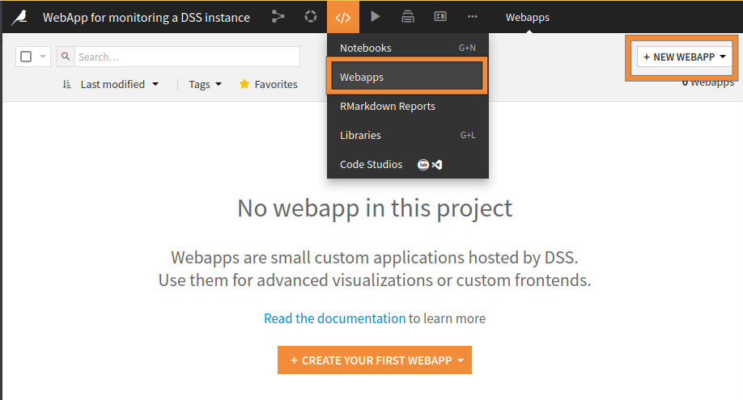
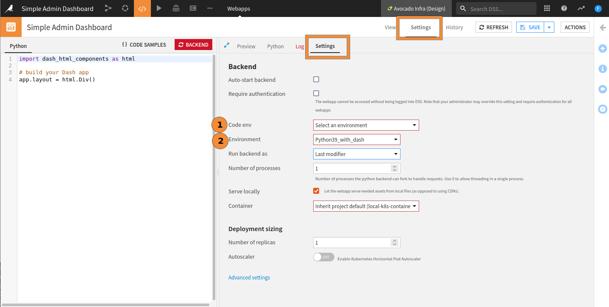
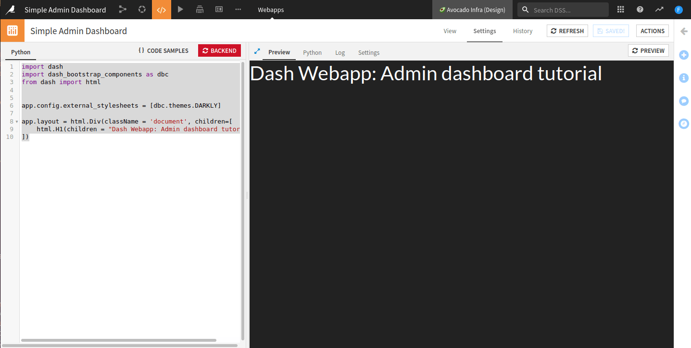
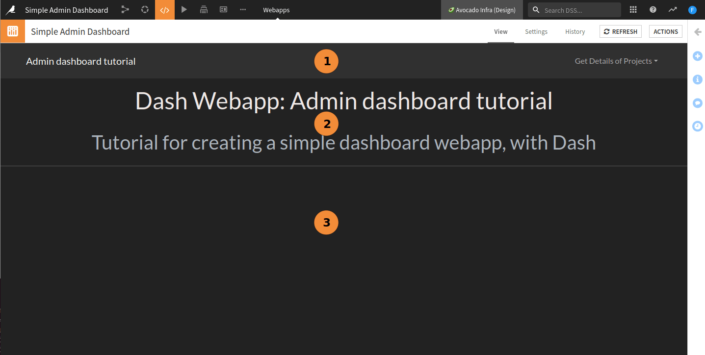
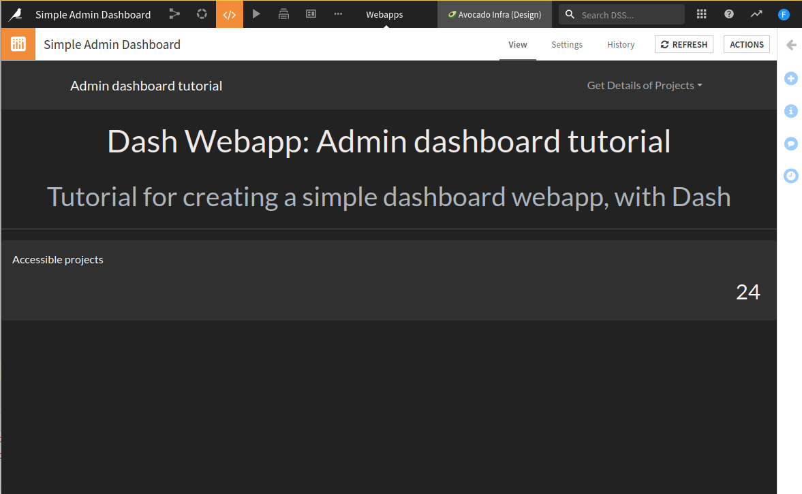
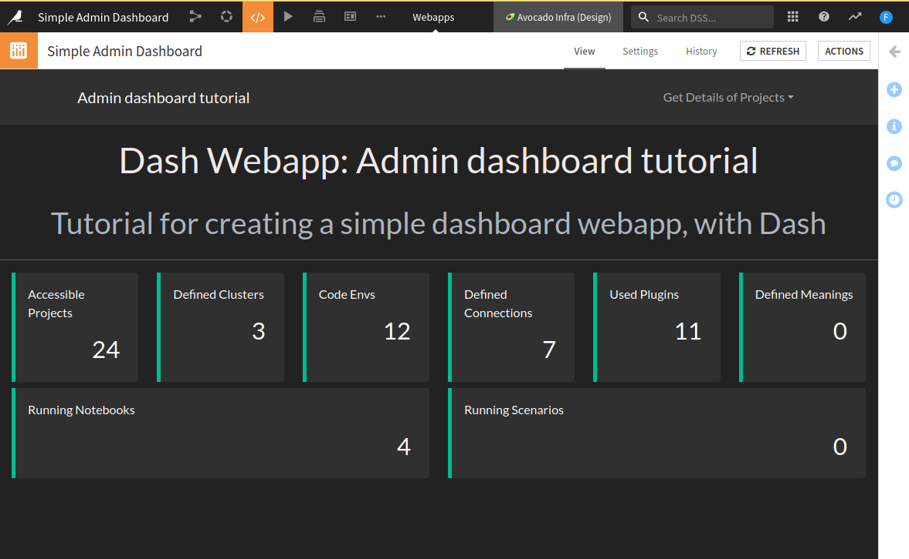
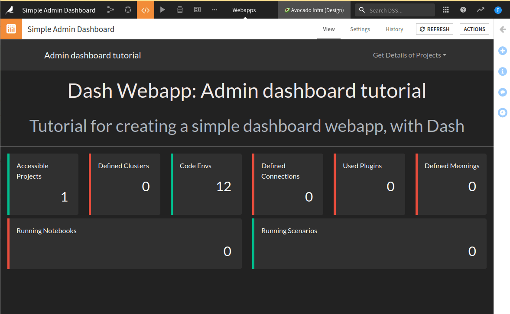

Create a simple admin project dashboard using Dash.
***************************************************

Prerequisites
#############

* Some familiarity with HTML, CSS, and Dash for the front-end
* Some familiarity with Python for the backend
* An existing Dataiku Project in which you have the "Project admin" permissions
* A Python code environment with ``dash`` and ``dash-bootstrap-components`` packages installed (see the
  :doc:`documentation<refdoc:code-envs/operations-python>` for more details)

.. note::
    This tutorial has been written using ``python==3.9``, ``dash==2.7.0`` and ``dash-bootstrap-components==1.2.1``
    but other versions could work.

Introduction
############

In this tutorial, you will create a Dataiku webapp using Dash to showcase an administration dashboard of
your Dataiku instance. The webapp backend will collect the data using the Dataiku public API.

Before digging into the details, be sure that you meet the prerequisites.

Create the Webapp
^^^^^^^^^^^^^^^^^

From the project home page:

* In the top navigation bar, go to **</> > Webapps**.
* Click on **+ New Webapp** on the top right, then select **Code Webapp > Dash**.
* Select the **An empty Dash app** template and give a name to your newly created Webapp.

.. _tutorial_plugin_webapp_admin_dashboard_new_webapp:

    Fig. 1: Creation of a new Dash webapp.

.. _tutorial_webapp_admin_dashboard_new_dash_webapp:

.. figure:: ./assets/webapp-admin-dashboard-new-dash-webapp.png
    :align: center
    :class: with-shadow image-popup
    :alt: Fig. 2: Creation of a new empty Dash Webapp.
    
    Fig. 2: New empty Dash Webapp.

After a while, the Webapp should start. Whether your project environment contains Dash packages or not, you may
either have a fail or success status message. If it fails, the project environment does not include the dash packages,
so we must specify the Code Env the Webapp should use. Go to **Settings**, then **Settings**, change the value of
"Code Env" (1) to "Select an environment," and change the value of the "Environment" to the Code Env (2) with the
prerequisite packages,  shown in
:ref:`Fig. 3<tutorial_webapp_admin_dashboard_settings_settings>`. Then click the **Save** button, and the Webapp
should start. If it fails, you may have to change the settings in the **Container** field.

.. _tutorial_webapp_admin_dashboard_settings_settings:

    Fig. 3: Setting the default Code Env.

Start with an empty template.
#############################

In the "Python" tab, replace the existing code with :ref:`Code 1<tutorial_webapp_admin_dashboard_code_first_template>`.
After clicking the **Save** button, you should have something similar to
:ref:`Fig. 4<tutorial_webapp_admin_dashboard_first_template>`.

.. code-block:: python
    :caption: Code 1: First code
    :name: tutorial_webapp_admin_dashboard_code_first_template

    import dash
    import dash_bootstrap_components as dbc
    from dash import html

    app.config.external_stylesheets = [dbc.themes.DARKLY]

    app.layout = html.Div(className = 'document', children=[
        html.H1(children = "Dash Webapp: Admin dashboard tutorial")
    ])

.. _tutorial_webapp_admin_dashboard_first_template:

    Fig. 4: First template rendering.

Setting the dashboard layout
###################################

In this part, we will set up the global layout of our dashboard to look like
:ref:`Fig. 5<tutorial_webapp_admin_dashboard_first_layout>`.

.. _tutorial_webapp_admin_dashboard_first_layout:

    Fig. 5: First layout of the dashboard.

We will start by focusing on the design, then load data.

We will split the layout into several zones:

* Zone 1 (:ref:`Code 2<tutorial_webapp_admin_dashboard_code_navbar_layout>`) contains the navigation bar, with the title of our dashboard and a dropdown menu that we will populate later.
* Zone 2 (:ref:`Code 3<tutorial_webapp_admin_dashboard_code_description_layout>`) contains the description of our project.
* Zone 3 will be the placeholder for the various visualizations we will add.

These three zones make the global layout as described in (:ref:`Code 4<tutorial_webapp_admin_dashboard_code_global_layout>`).

.. code-block:: python
    :caption: Code 2: Navigation bar layout
    :name: tutorial_webapp_admin_dashboard_code_navbar_layout

    navbar = dbc.NavbarSimple(
        children=[
            dbc.DropdownMenu(
                children=[
                          ],
                nav=True,
                in_navbar=True,
                label="Get Details of Projects",
            ),
        ],
        brand="Admin dashboard tutorial",
        brand_href="#",
        color="dark",
        dark=True,
    )

.. code-block:: python
    :caption: Code 3: Description layout
    :name: tutorial_webapp_admin_dashboard_code_description_layout

    # For the description layout, we will use classical HTML tags
    description = html.Div([
        html.H1(children="Dash Webapp: Admin dashboard tutorial", className="text-center p-3", style={'color': '#EFE9E7'}),
        html.H2(children="Tutorial for creating a simple dashboard webapp, with Dash",
                className="text-center p-2 text-light "),
        html.Hr(),
    ])

.. code-block:: python
    :caption: Code 4: Application global layout
    :name: tutorial_webapp_admin_dashboard_code_global_layout

    app.layout = html.Div(className = 'document',
                      children=[
                          navbar,
                          description,
                      ])
    # content is not present for now

Getting the data
###################
In this section we will gather the necessary data to be displayed inside the Webapp.

List of projects
^^^^^^^^^^^^^^^^

We want to start by collecting data on the projects living in the instance. To do so, we need to import the ``dataiku``
package, retrieve a client and get the list of projects. Once we have the projects
list, we can display the information (just to be sure that the list is not empty), and populate the navigation bar's dropdown list.
The code underneath retrieves the list of (accessible) projects. We will come back later on this to add interactivity.

.. code-block:: python

    import dataiku

    client = dataiku.api_client()
    projects = client.list_projects()

To populate the dropdown list, we should replace the following line:

.. code-block:: python

    children=[],

in the navigation bar layout template with:

.. code-block:: python

    children=[dbc.DropdownMenuItem(p['name'], href=p['projectKey']) for p in projects],

Once we have the project list, we can display their number on a card. As
displaying this information is common, we will create a function for
(:ref:`Code 5<tutorial_webapp_admin_dashboard_code_create_card_v1>`). Once this function has been created, we can
add the card to our layout. We will create a content layout
(:ref:`Code 6<tutorial_webapp_admin_dashboard_code_content_layout_v1>`), which will be useful in the next steps.

.. code-block:: python
    :caption: Code 5: Card creation for displaying information (V1)
    :name: tutorial_webapp_admin_dashboard_code_create_card_v1

    def create_card(result, title):
        card = dbc.Card(
            dbc.CardBody([
                html.P(title),
                html.H3(len(result), style={'text-align':'right','margin-right':'8px'})
            ],),
            style={'border-width':'0px', 'height':'100%'}
        )

        return card

.. code-block:: python
    :caption: Code 6: Content layout (V1)
    :name: tutorial_webapp_admin_dashboard_code_content_layout_v1

    content = html.Div([
        create_card(projects, "Accessible projects")
    ])

Add the ``content`` to the ``app.layout`` after the ``description``. The Webapp looks like the screenshot in
:ref:`Fig. 6<tutorial_webapp_admin_dashboard_first_data>`, and the value should change if you change the Webapp
settings to run the backend as another user in the "Settings" tab.

.. _tutorial_webapp_admin_dashboard_first_data:

    Fig. 6: Display the number of accessible projects.

Global statistics of the instance
^^^^^^^^^^^^^^^^^^^^^^^^^^^^^^^^^

We can count more items on the instance, such as scenarios, used plugins, code environments, or connections. Not all
these items are accessible without elevated privileges, so we must consider situations where the user doesn't have
sufficient permissions to access a particular resource. To do so, we create the function
``get_value_if_no_execption`` (See :ref:`Code 7<tutorial_webapp_admin_dashboard_code_if_no_exception>`).

.. code-block:: python
    :caption: Code 7: Generic function to catch an exception if it occurs
    :name: tutorial_webapp_admin_dashboard_code_if_no_exception

    def get_value_if_no_exception(fun: object) -> object:
        """
        Try to run a function. If the function raises an exception, catch it and return an empty array.

        :param fun: the function to execute.

        :return: Return ("success", result of the function) or ("danger", []) if the function fails.

        Usage example:
            .. code-block:: python

            projects = get_value_if_no_exception(client.list_projects)

        """
        try:
            return "success", fun()
        except Exception as _:
            return "danger", []

Now we can correctly handle "errors" if they occur, as shown in
:ref:`Code 8<tutorial_webapp_admin_dashboard_code_grab_data>`.

.. code-block:: python
    :caption: Code 8: Collect data from the instance
    :name: tutorial_webapp_admin_dashboard_code_grab_data

    projects = get_value_if_no_exception(client.list_projects)
    clusters = get_value_if_no_exception(client.list_clusters)
    code_envs = get_value_if_no_exception(client.list_code_envs)
    connections = get_value_if_no_exception(client.list_connections)
    # Personal meanings definitions
    meanings = get_value_if_no_exception(client.list_meanings)
    plugins = get_value_if_no_exception(client.list_plugins)
    running_notebooks = get_value_if_no_exception(client.list_running_notebooks)
    running_scenarios = get_value_if_no_exception(client.list_running_scenarios)

As we changed the value of the variable ``projects``, we should update the ``DropdownMenu`` accordingly.
So we should replace the following line:

.. code-block:: python

    children=[dbc.DropdownMenuItem(p['name'], href=p['projectKey']) for p in projects],

in the navigation bar layout template with:

.. code-block:: python

    children=[dbc.DropdownMenuItem(p['name'], href=p['projectKey']) for p in projects[1]],

Getting fancy: adding color borders
^^^^^^^^^^^^^^^^^^^^^^^^^^^^^^^^^^^^

We need to slightly tweak the card generation by changing the ``create_card`` function to use these data.
:ref:`Code 9<tutorial_webapp_admin_dashboard_code_slight_modification>` shows the modifications. As the
function ``get_value_if_no_exception`` return also the state of the execution, we will use it to drop a color border
to the card, as shown in :ref:`Fig. 7<tutorial_webapp_admin_dashboard_all_cards_created>`.

.. code-block:: python
    :caption: Code 9: Using the function ``get_value_if_no_exception``
    :name: tutorial_webapp_admin_dashboard_code_slight_modification

    def create_card(result, title):
        card = dbc.Card(
            dbc.CardBody([
                html.P(title),
                html.H3(len(result[1]), style={'text-align':'right','margin-right':'8px'})
            ],
            className="border-start border-{} border-5".format(result[0])),
            style={'border-width':'0px', 'height':'100%'}
        )

        return card

    .../...

    content = html.Div([
        dbc.Row([
            dbc.Col(
                create_card(projects, "Accessible Projects"), width=2
            ),
            dbc.Col(
                create_card(clusters, "Defined Clusters"), width=2
            ),
            dbc.Col(
                create_card(code_envs, "Code Envs"), width=2
            ),
            dbc.Col(
                create_card(connections, "Defined Connections"), width=2
            ),
            dbc.Col(
                create_card(plugins, "Used Plugins"), width=2
            ),
            dbc.Col(
                create_card(meanings, "Defined Meanings"), width=2
            ),
        ]),
        dbc.Row([
            dbc.Col(
                create_card(running_notebooks, "Running Notebooks"), width=6
            ),
            dbc.Col(
                create_card(running_scenarios, "Running Scenarios"), width=6
            ),
        ],
        style={'padding-top':'1ex'})
    ], style={'padding-right': '1em', 'padding-left':'1em'})
    .../...

.. _tutorial_webapp_admin_dashboard_all_cards_created:

    Fig. 7: All cards are created from collected data on the instance (admin view).

    Fig. 8: All cards are created from collected data on the instance (user view).

"Making cards interactive."
^^^^^^^^^^^^^^^^^^^^^^^^^^^^^
For now, the dashboard looks nice, but it lacks interactivity. We will add a button to each card
and bind the click to a function. Before digging into the code, let's analyze our needs. To create a card,
we need a title and data. This data comes from the ``get_value_if_no_exception`` function, which returns a tuple. It
is made of the status of the request and the result of it. We need an id to react to the click event because we want
to include a button in the card and add interactivity. We will also have an icon to make the button nicer.

The click event will pop up a window, showing some information. This leads to 
:ref:`Code 10<tutorial_webapp_admin_dashboard_code_add_interactivity>`. Of course, we have to adapt this code
to our specific needs. To run this, you will need to import the following missing dependencies:

.. code-block:: python

    import dash
    import dash_bootstrap_components as dbc
    from dash.dependencies import Input, Output, State
    from dash import html
    import dataiku

    app.config.external_stylesheets = [dbc.themes.DARKLY, dbc.icons.FONT_AWESOME]

.. code-block:: python
    :caption: Code 10: Adding interactivity to the cards
    :name: tutorial_webapp_admin_dashboard_code_add_interactivity

    def create_card(result, title, icon="", id="", key=""): 
        content = ""
        if key:
            content = [html.P(r[key]) for r in result[1]]
        else:
            content = str(result[1])

        card = dbc.Card([
            dbc.CardBody([
                dbc.Button([
                    html.I(className="fa-solid {} me-2".format(icon)),title], 
                    className="card-title",
                    id=id if id else "",
                    n_clicks=0
                ),
                html.H3(len(result[1]), style={'text-align':'right','margin-right':'8px'})
            ],
            className="border-start border-{} border-5".format(result[0])),
            dbc.Modal(
                [
                    dbc.ModalHeader(dbc.ModalTitle(title)),
                    dbc.ModalBody(
                        content
                    ),
                    dbc.ModalFooter(
                        dbc.Button(
                            "Close", id="close-{}".format(id), className="ms-auto", n_clicks=0
                        )
                    ),
                ],
                id="modal-{}".format(id),
                is_open=False,
            )
        ],style={'border-width':'0px', 'height':'100%'})

        if id:
            @app.callback(
                Output("modal-{}".format(id), "is_open"),
                [Input(id, "n_clicks"), Input("close-{}".format(id), "n_clicks")],
                [State("modal-{}".format(id), "is_open")],)
            def toggle_modal(n1, n2, is_open):
                if n1 or n2:
                    return not is_open
                return is_open
            

        return card

We also have to replace the card creation with
:ref:`Code 11<tutorial_webapp_admin_dashboard_code_new_card_creation>`.

.. code-block:: python
    :caption: Code 11: Updated version of the card creation.
    :name: tutorial_webapp_admin_dashboard_code_new_card_creation

    content = html.Div([
        dbc.Row([
            dbc.Col(
                create_card(projects, "Accessible Projects", "fa-diagram-project", "id-project", "name"), width=2
            ),
            dbc.Col(
                create_card(clusters, "Defined Clusters", "fa-circle-nodes", "id-cluster", "name"), width=2
            ),
            dbc.Col(
                create_card(code_envs, "Code Envs", "fa-toolbox", "id-code-env", "envName"), width=2
            ),
            dbc.Col(
                create_card(connections, "Defined Connections", "fa-ethernet", "id-connection"), width=2
            ),
            dbc.Col(
                create_card(plugins, "Used Plugins", "fa-plug", "id-plugin", "id"), width=2
            ),
            dbc.Col(
                create_card(meanings, "Defined Meanings", "fa-comment", "id-meaning"), width=2
            ),
        ]),
        dbc.Row([
            dbc.Col(
                create_card(running_notebooks, "Running Notebooks", "fa-book", "id-notebook"), width=6
            ),
            dbc.Col(
                create_card(running_scenarios, "Running Scenarios", "fa-list-ol", "id-scenario"), width=6
            ),
        ],
        style={'padding-top':'1ex'})
    ], style={'padding-right': '1em', 'padding-left':'1em'})

Final code review
#################
Here is the complete code file present on this page.

.. code-block:: python

    import dash
    import dash_bootstrap_components as dbc
    from dash.dependencies import Input, Output, State
    from dash import html
    import dataiku

    client = dataiku.api_client()
    projects = client.list_projects()

    def get_value_if_no_exception(fun: object) -> object:
        """
        Try to run a function. If the function raises an exception, catch it and return an empty array.

        :param fun: the function to execute.

        :return: Return ("success", result of the function) or ("danger", []) if the function fails.

        Usage example:
            .. code-block:: python

            projects = get_value_if_no_exception(client.list_projects)

        """
        try:
            return "success", fun()
        except Exception as _:
            return "danger", []

    def create_card(result, title, icon="", id="", key=""):
        content = ""
        if key:
            content = [html.P(r[key]) for r in result[1]]
        else:
            content = str(result[1])

        card = dbc.Card([
            dbc.CardBody([
                dbc.Button([
                    html.I(className="fa-solid {} me-2".format(icon)),title],
                    className="card-title",
                    id=id if id else "",
                    n_clicks=0
                ),
                html.H3(len(result[1]), style={'text-align':'right','margin-right':'8px'})
            ],
            className="border-start border-{} border-5".format(result[0])),
            dbc.Modal(
                [
                    dbc.ModalHeader(dbc.ModalTitle(title)),
                    dbc.ModalBody(
                        content
                    ),
                    dbc.ModalFooter(
                        dbc.Button(
                            "Close", id="close-{}".format(id), className="ms-auto", n_clicks=0
                        )
                    ),
                ],
                id="modal-{}".format(id),
                is_open=False,
            )
        ],style={'border-width':'0px', 'height':'100%'})

        if id:
            @app.callback(
                Output("modal-{}".format(id), "is_open"),
                [Input(id, "n_clicks"), Input("close-{}".format(id), "n_clicks")],
                [State("modal-{}".format(id), "is_open")],)
            def toggle_modal(n1, n2, is_open):
                if n1 or n2:
                    return not is_open
                return is_open

        return card

    app.config.external_stylesheets = [dbc.themes.DARKLY, dbc.icons.FONT_AWESOME]

    projects = get_value_if_no_exception(client.list_projects)
    clusters = get_value_if_no_exception(client.list_clusters)
    code_envs = get_value_if_no_exception(client.list_code_envs)
    connections = get_value_if_no_exception(client.list_connections)
    # Personnal meanings definitions
    meanings = get_value_if_no_exception(client.list_meanings)
    plugins = get_value_if_no_exception(client.list_plugins)
    running_notebooks = get_value_if_no_exception(client.list_running_notebooks)
    running_scenarios = get_value_if_no_exception(client.list_running_scenarios)

    navbar = dbc.NavbarSimple(
        children=[
            dbc.DropdownMenu(
                children=[dbc.DropdownMenuItem(p['name'], href=p['projectKey']) for p in projects[1]
                          ],
                nav=True,
                in_navbar=True,
                label="Get Details of Projects",
            ),
        ],
        brand="Admin dashboard tutorial",
        brand_href="#",
        color="dark",
        dark=True,
    )

    description = html.Div([
        html.H1(children="Dash Webapp: Admin dashboard tutorial", className="text-center p-3", style={'color': '#EFE9E7'}),
        html.H2(children="Tutorial for creating a simple dashboard webapp, with Dash",
                className="text-center p-2 text-light "),
        html.Hr(),
    ])

    content = html.Div([
        dbc.Row([
            dbc.Col(
                create_card(projects, "Accessible Projects", "fa-diagram-project", "id-project", "name"), width=2
            ),
            dbc.Col(
                create_card(clusters, "Defined Clusters", "fa-circle-nodes", "id-cluster", "name"), width=2
            ),
            dbc.Col(
                create_card(code_envs, "Code Envs", "fa-toolbox", "id-code-env", "envName"), width=2
            ),
            dbc.Col(
                create_card(connections, "Defined Connections", "fa-ethernet", "id-connection"), width=2
            ),
            dbc.Col(
                create_card(plugins, "Used Plugins", "fa-plug", "id-plugin", "id"), width=2
            ),
            dbc.Col(
                create_card(meanings, "Defined Meanings", "fa-comment", "id-meaning"), width=2
            ),
        ]),
        dbc.Row([
            dbc.Col(
                create_card(running_notebooks, "Running Notebooks", "fa-book", "id-notebook"), width=6
            ),
            dbc.Col(
                create_card(running_scenarios, "Running Scenarios", "fa-list-ol", "id-scenario"), width=6
            ),
        ],
        style={'padding-top':'1ex'})
    ], style={'padding-right': '1em', 'padding-left':'1em'})

    app.layout = html.Div(className = 'document',
                          children=[
                              navbar,
                              description,
                              content,
                          ])

Conclusion
##########

In this tutorial, we have built a simple administration dashboard using Dash. We have collected some data from the
``dataiku`` package. We could also have retrieved some data from datasets using the same package. We should also have
added some interactivity to the dropdown menu item. The easiest way is to create a function that produces a
dropdown menu item for a given ``projectKey`` and pops up a modal with the data we want to display, as we did for the
card button. Many other improvements could have been done, but this wouldn't have been relevant for this tutorial.

As the web application code grows, putting the whole code into a single file will be inconvenient. We can split the
code into several parts using the library and importing it into the webapp. If your code needs to access
the app to add interactivity, remember to pass the ``app`` as a parameter of your function.
