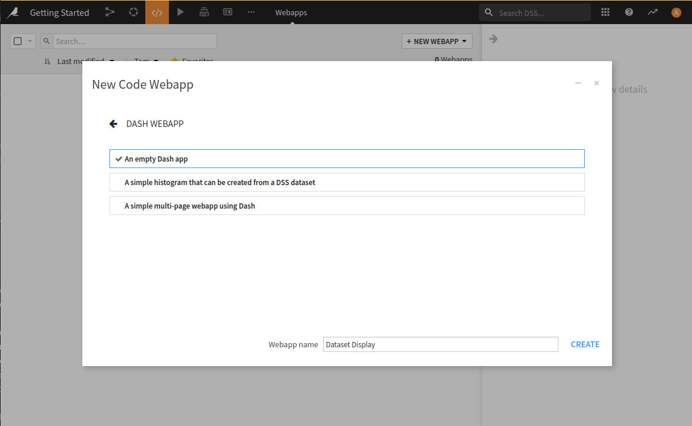
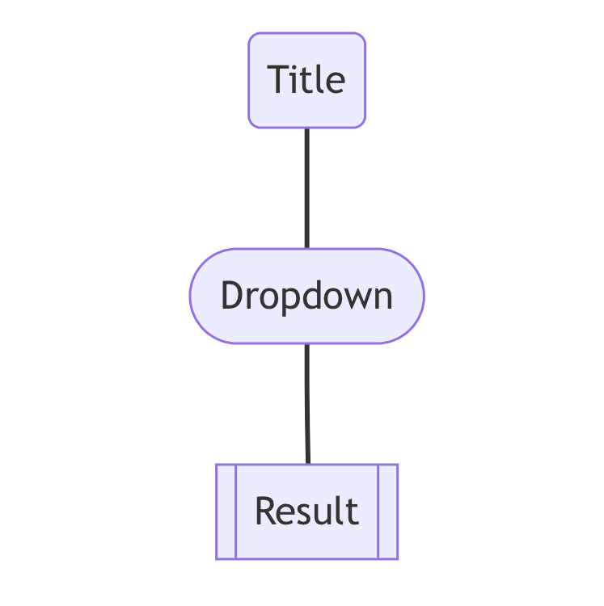
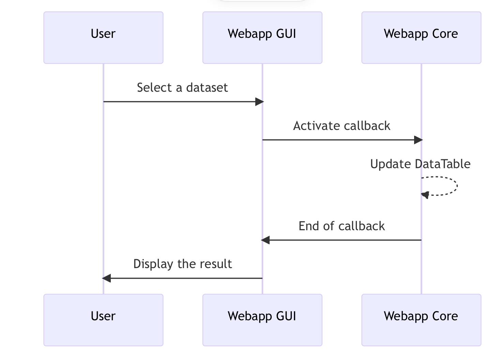

Dash: your first webapp
***********************

The aim of this guide is to help you understand how Dash works by setting up a simple web application. You will create
a web application that allows the user to select a dataset from the project's context and display it.

Dash is an open-source library that enables you to create reactive web-based applications. The code for Dash apps is
declarative and reactive. To build complex applications, you need to have a clear understanding of the underlying
concepts.

Declarative programming is a way of expressing the logic of a process without describing the control flow. This means
that you focus on what the program should do rather than how it should be done. To achieve this, you should try to
minimize side effects.

Declarative programming is often opposed to imperative programming. Imperative programming focuses on how to do the
process, as shown in :ref:`Code 1<dash_basics_imperative_style>`.
Declarative programming focuses on the result, and the underlying process is not expressed, as shown in
:ref:`Code 2<dash_basics_declarative_style>`.

.. code-block:: python
    :name: dash_basics_imperative_style
    :caption: Code 1: Display the sum of a list (imperative style)

    # Calculate the sum of a list
    sum = 0
    myList = [1,2,3,4,5]

    # Create a for loop to add numbers in the list to the sum
    for x in myList:
        total += x
    print(total)

.. code-block:: python
    :name: dash_basics_declarative_style
    :caption: Code 2: Display the sum of a list (declarative style)

    myList = [1,2,3,4,5]

    # display the sum of numbers in mylist
    print(sum(myList))

Side effects occur when a program or function modifies something outside of its scope, which can disrupt the smooth
operation of a multi-user application. Such modifications can make it difficult to predict the global state of the
application, making it unreliable. In web applications, this can lead to unexpected behavior. To mitigate such issues,
one can use reactive programming, a declarative programming paradigm where changes are automatically propagated.

These concepts will become clearer as you progress through this guide.

Creating the WebApp
###################

First, you need to create a Dash webapp. You will use the Dash empty template and create a Dash webapp named:
`Dataset Display`, as shown in :ref:`Fig. 1<dash_basics_create_webapp>`
and :ref:`Fig. 2<dash_basics_create_webapp_step2>`. You will replace the whole
provided code later.

.. _dash_basics_create_webapp:

.. figure:: ./assets/dash-create-webapp.png
    :align: center
    :class: with-shadow image-popup
    :alt: Fig. 1: Creating an empty Dash webapp.

    Fig. 1: Creating an empty Dash webapp.

.. _dash_basics_create_webapp_step2:

    Fig. 2: Naming the newly created webapp.

.. important::
    Once this is done, you have to be sure that the used code environment contains ``dash``. In the settings tabs, you
    can select a specific code environment to be used by default when the webapp is run. For more information on creating a code environment, refer to :doc:`refdoc:code-envs/index`.

Sketching the webapp
####################
The webapp will consist of a dropdown menu to be able to select a Dataset and an area where the dataset will be displayed.
The application will also contain a title, so the global design of the webapp will be:

    Sketch of the webapp.

..
    .. mermaid::
        :align: center
        :alt: Sketch of the webapp.
        :caption: Sketch of the webapp.

        flowchart TB
            id1(Title) --- id2

            id2([Dropdown]) --- id3

            id3[[Result]]

First, you will focus on the design of the webapp (the declarative part). You will create the title and the dropdown
menu using the ``H1`` and the ``Dropdown`` components. You will also use the ``DataTable`` component to display the
selected dataset. Finally, all these Dash components should be nested inside a ``Div`` component to tie them together.
The resulting code is shown in :ref:`Code 3<dash_basics_code_init>`.

.. code-block:: python
    :caption: Code 3: Initial implementation.
    :name: dash_basics_code_init

    from dash import Dash, dcc, html, dash_table

    # build your Dash app
    app.layout = html.Div([
        html.H1("How to display a dataset"),
        dcc.Dropdown(placeholder="Choose a dataset to display."),
        dash_table.DataTable()
    ])

Populating the dropdown
#######################

Getting dataset names from the project
^^^^^^^^^^^^^^^^^^^^^^^^^^^^^^^^^^^^^^

To populate the dropdown, you need to retrieve the name of all existing datasets in the project. To achieve this, you
can import the ``dataiku`` package to get a handle on your local project. You can then use this handle to generate a
list of metadata for all datasets in your project. See :ref:`Code 4<dash_basics_code_get_datasets>`.

.. code-block:: python
    :name: dash_basics_code_get_datasets
    :caption: Code 4: How to get the existing datasets.

    import dataiku

    project = dataiku.api_client().get_default_project()
    datasets = project.list_datasets()

Note that the ``datasets`` variable points neither to a list of datasets nor to a list of dataset names. It contains a
list of dicts which, among other things, include each dataset name. To check what the ``datasets`` variable looks like,
you can log it.

Logging
^^^^^^^
Sometimes, it's necessary to track the execution process or to log information for either debugging or for providing
post-execution data. The logs of the Dash webapp can be accessed in the `Log` tab. The ``Log`` button will display the
full log. To access to the logger, :ref:`Code 5<dash_basics_code_get_logger>` shows the easiest way to do it.

.. code-block:: python
    :name: dash_basics_code_get_logger
    :caption: Code 5: Accessing the WebApp default logger.

    import logging

    logger = logging.getLogger(__name__)

    # .../...
    logger.info(datasets)

All together
^^^^^^^^^^^^
The list of datasets, visible in the log, contains more than just the names. To populate the dropdown menu, you must
extract each dataset name (``datasets_name``) as shown in :ref:`Code 6<dash_basics_code_populate_dropdown>`. When
designing the webapp, you have only declared the elements it should include. Nevertheless, here you have introduced
some variable that could be a potential problem (if you were to do some multi-tasking, for example) and a departure
from the declarative paradigm. This problem can be resolved by using some advanced techniques that go beyond the scope
of this "basic" tutorial.

.. code-block:: python
    :name: dash_basics_code_populate_dropdown
    :caption: Code 6: Dropdown filled with the datasets name

    from dash import Dash, dcc, html, dash_table, Input, Output
    import logging
    import dataiku

    logger = logging.getLogger(__name__)

    project = dataiku.api_client().get_default_project()
    datasets_name = list(map((lambda x: x.get("name","")), project.list_datasets()))

    # build your Dash app
    app.layout = html.Div([
        html.H1("How to display a dataset"),
        dcc.Dropdown(datasets_name, placeholder="Choose a dataset to display.", id='dropdown'),
        dash_table.DataTable(id='table')
    ])

Displaying the dataset
######################

To be able to display the dataset, you need to pass to the ``DataTable`` the data.

You cannot pre-compute those data as you don't know the user's choice. As such, you need a way to dynamically populate
the ``DataTable`` depending on the user choice. Once the user selects a dataset in the dropdown, the webapp should
react to this change, and update the corresponding ``DataTable``.

To be able to react to a change:

- You need to provide an id for the objects involved in the change (the ``Dropdown``
  for the input, and the ``DataTable`` for the output).
- You need to define a function (called callback) that will be called when the user changes the input (``Dropdown``
  have a new value).

    Concept of callback

.. 
    mermaid::
    :caption: Concept of callback

    sequenceDiagram
        participant User
        participant Webapp GUI
        participant Webapp Core
        User->>Webapp GUI: Select a dataset
        Webapp GUI->>Webapp Core: Activate callback
        Webapp Core-->>Webapp Core: Update DataTable
        Webapp Core->>Webapp GUI: End of callback
        Webapp GUI->>User: Display the result

The callback is pretty simple as it retrieves the name of the Dataset, and then updates the ``DataTable`` with the
updated values, like shown in
:ref:`Code 7<dash_basics_code_react_on_change>`. To update the
``DataTable`` you need to update two fields (``data`` and ``columns``), so the callback should have two outputs.

You need to update both fields as the selected dataset could not have the same column as the previously selected
dataset. You also need to check if there is a value coming from the input as this value could be ``None`` (particularly
when the webapp starts).

When developing a Dash webapp, it is good practice to put all the callbacks in the same part of the application.
So :ref:`Code 7<dash_basics_code_react_on_change>` should be put at
the end of your application.

.. code-block:: python
    :name: dash_basics_code_react_on_change
    :caption: Code 7: How to react on the user change.

    @app.callback(
        Output('table', 'data'),
        Output('table', 'columns'),
        Input('dropdown', 'value')
    )
    def update(value):
        # If there is no value, do nothing (this is the case when the webapp is launched)
        if value is None:
            raise PreventUpdate
        # Take only the 100 first rows
        dataset = dataiku.Dataset(value).get_dataframe(limit=100)
        return dataset.to_dict('records'), [{"name": i, "id": i} for i in dataset.columns]

Going further
#############
At this point, you have created a functional webapp that allows users to select and display datasets using the Dash library and framework in the context of Dataiku. You have learned how to construct interfaces declaratively that respond to user actions, as well as the purpose and implementation of callbacks in Dash.

Although functional, this webapp is not completely satisfactory. For example, when trying to load a huge dataset, the
webapp may seem to be freezing. This can be caused by the time it takes for the ``DataTable`` component to render, or by heavy data computation. In a reactive context, it is best to avoid these issues or at least inform the user that their action has been received and that processing is running. Dash
offers a specific mechanism for "long" callbacks, but in any case, providing feedback to the user is important. For that purpose, you can use the Dash ``Loading`` component. A message can also be displayed when no dataset is selected. This can be done either by returning a specific value in the callback or by adding a new callback (and a new component) that displays/hides the corresponding component, depending on the dropdown's value.

Here are the complete versions of the code presented in this tutorial:

.. dropdown::  Python Code

    .. literalinclude:: ./assets/code.py
        :language: python
