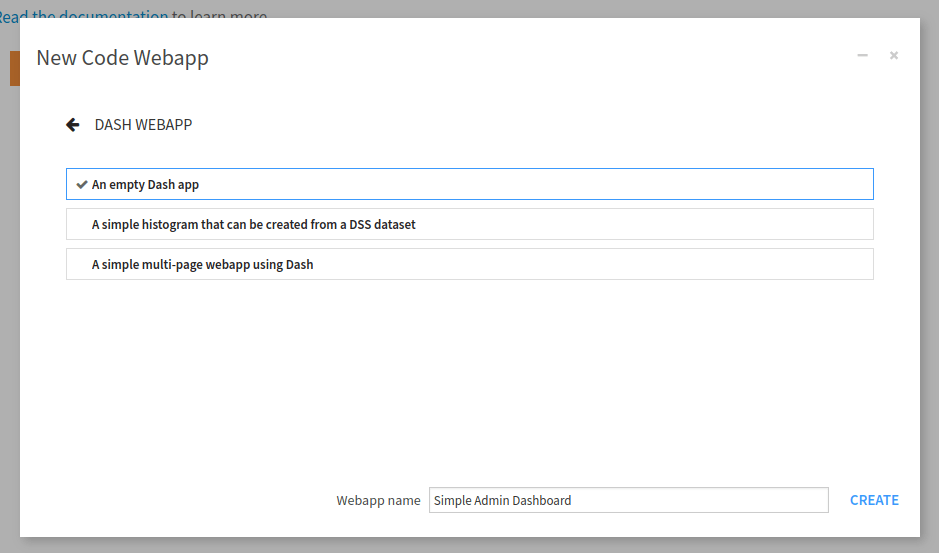

Create an empty dash webapp
^^^^^^^^^^^^^^^^^^^^^^^^^^^

From the project home page:

* In the top navigation bar, go to **</> > Webapps**.
* Click on **+ New webapp** on the top right, then select **Code webapp > Dash**.
* Select the **An empty Dash app** template and give a name to your newly created webapp.

.. _tutorial_plugin_webapp_common_parts_new_webapp:

.. figure:: ./assets/webapp-common-parts-new-webapp.png
    :align: center
    :class: with-shadow image-popup
    :alt: Fig. 1: Creation of a new dash webapp.

    Fig. 1: Creation of a new Dash webapp.

.. _tutorial_webapp_common_parts_new_dash_webapp:

    Fig. 2: New empty Dash webapp.

After a while, the webapp should start. Whether your project environment contains Dash packages, you may
have a fail or success status message. If it fails, the project environment does not include the dash packages,
so we must specify the code env the webapp should use. Go to **Settings**, then **Settings**, change the value of
"Code env" (1) to "Select an environment," and change the value of the "Environment" to the code env (2) with the
prerequisite packages,  shown in
:ref:`Fig. 3<tutorial_webapp_common_parts_settings_settings>`. Then click the **Save** button, and the webapp
should start. If it fails, you may have to change the settings in the **Container** field.

.. _tutorial_webapp_common_parts_settings_settings:

.. figure:: ./assets/webapp-common-parts-settings-settings.png
    :align: center
    :class: with-shadow image-popup
    :alt: Fig. 3: Setting the default code env.

    Fig. 3: Setting the default code env.
