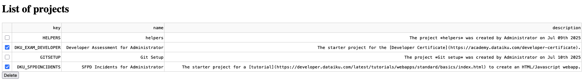

Listing and deleting a selection of projects
********************************************

.. meta::
  :description:  This tutorial shows how to use a Data Table from Dash to handle a list of selectable projects that you can delete.

Prerequisites
=============

- Dataiku >= 13.4
- A Python code environment with `dash` package installed (see the
  :doc:`documentation<refdoc:code-envs/operations-python>` for more details)

.. note::
    The code in this tutorial has been tested with two configurations:

    * ``python==3.9`` with ``dash==2.7.0``
    * ``python==3.11`` with ``dash==3.1.1``

    but other versions could work.

Introduction
============

Occasionally, you should clean up and remove unused projects on a development instance.
This tutorial will show you how to build a Dash application that lists all the projects in a Data Table.
This list will be selectable, and we will add a button to delete the selected projects.

Building the webapp
===================

Creating the webapp
-------------------

Please start with an empty Dash web app.
For instructions on creating an empty Dash web app, refer to this :doc:`tutorial<../common-parts/create-the-webapp-empty-template>`.

Creating the Data Table
-----------------------

Let's start with the following :ref:`Code 1<tutorials-dash-cleanup-datatable>`

.. literalinclude:: ./assets/create_table.py
    :language: python
    :caption: Code 1: Create the Data Table
    :name: tutorials-dash-cleanup-datatable

We start retrieving the project list using the :meth:`~dataikuapi.DSSClient.list_projects` method from the :class:`dataikuapi.DSSClient` class.
That's the purpose of the :meth:`~dataikuapi.DSSClient.get_project` function.

The creation of the `DataTable from Dash <https://dash.plotly.com/datatable/reference>`_ uses two important parameters.

* ``row_selectable='multi'`` will add a checkbox on each row to enable the multi-selection of projects.
* ``editable=True`` will allow the update of the project list after each delete action.

Adding a delete mechanism
-------------------------

At that point, we need a button to trigger the delete action of the selected projects.
To be sure the user is aware of the action, we will encapsulate the button in a Dash component called `ConfirmDialogProvider <https://dash.plotly.com/dash-core-components/confirmdialogprovider>`_

.. code-block:: python

    app.layout = html.Div([
        html.H1("List of projects"),
        projects_table,
        dcc.ConfirmDialogProvider(
            children=html.Button('Delete', id='delete-button', n_clicks=0),
            id='warning-delete',
            message='Are you sure you want to delete the selected project(s)?'
        )
    ])

.. note::
    In this section, you will need new import instructions. If you need help on this topic, have a look at the :ref:`complete code<tutorials-dash-cleanup-fullcode>`.

The user's confirmation will then trigger a Dash Callback that will handle the selection deletion and the update of the DataTable.

.. code-block:: python

    @callback(
        Output('projects_table', 'data'),
        Output('projects_table', 'selected_rows'),
        Input('warning-delete', 'submit_n_clicks'),
        State('projects_table', 'selected_rows'),
        prevent_initial_call=True
    )
    def delete_projects(submit_n_clicks, selected_rows):
        """
        Callback triggered when the user click on the delete button
        This will delete all the selected projects.
        Returns the updated list of projects and reset the selection
        """
        projects = get_projects()
        for key in projects.iloc[selected_rows]['key'].to_list():
            project = client.get_project(key)
            project.delete(clear_managed_datasets=True, clear_output_managed_folders=True, clear_job_and_scenario_logs=True)
            logger.info(f"project {key} deleted")
        updated_projects = projects.loc[~projects.index.isin(selected_rows)].to_dict('records')

        return updated_projects, []

The callback is triggered when the user clicks on the delete button.
The Input parameter defines the element change that will trigger the callback.
Note the use of Dash `State <https://dash.plotly.com/reference#dash.state>`_.
This State parameter will allow access to the list of selected rows without triggering the callback, as it would have been with an Input parameter.
The callback will return the updated list of projects, defined by the first Output parameter, and reset the selection as defined by the second Output parameter.

Wrapping up
===========

Congratulations! You now have a web application that will help you to clean an instance by removing a selection of projects.
You can improve it with a refresh button that will update the list of projects.

Here is the complete code of the web application:

.. dropdown:: `Cleanup webapp complete code`

    .. literalinclude:: ./assets/cleanup.py
        :language: python
        :name: tutorials-dash-cleanup-fullcode

Reference documentation
=======================

Classes
-------
.. autosummary::
    dataikuapi.DSSClient
    dataikuapi.dss.project.DSSProject

Functions
---------
.. autosummary::
    ~dataikuapi.dss.project.DSSProject.delete
    ~dataikuapi.DSSClient.get_project
    ~dataikuapi.DSSClient.list_projects
