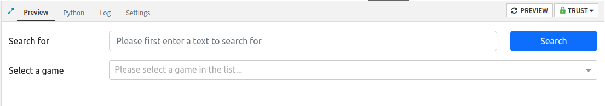

How to create a form for data input?
************************************

Prerequisites
#############

* Dataiku >= 11.0
* Some familiarity with HTML, CSS, and Dash for the front-end
* Some familiarity with Python for the backend
* An existing Dataiku Project in which you have the "Project Admin" permissions
* A Python code environment with ``dash``, ``dash-bootstrap-components`` and ``beautifulsoup4`` packages installed
  (see the :doc:`documentation<refdoc:code-envs/operations-python>` for more details)

This tutorial was written with Python 3.9 and uses the following package versions:

* ``dash==2.7.0``
* ``dash-bootstrap-components==1.2.1``
* ``beautifulsoup4==4.12.2``

Introduction
############
In this tutorial, we will use Dash to develop a web application that enables users to view, edit, and save data.
The data will be fetched from an external API, and a subset will be displayed. By following this tutorial,
you will gain an understanding of the fundamental concepts of Dash, which will enable you to create complex
applications. This tutorial builds upon the same concepts and objectives as
:doc:`another tutorial<../../standard/form-to-submit-values/index>` that covers standard web applications.

The web application allows users to enter a search term, which will be used to find a list of board games that match
the criteria. The list will be displayed in a dropdown menu, allowing users to select a board game and view/edit
its characteristics. Once the data has been validated, it can be saved into an existing dataset. To create an empty
Dash webapp, please refer to this :doc:`mini-tutorial<../common-parts/create-the-webapp-empty-template>`.

Simple form creation
####################

Form template
^^^^^^^^^^^^^
Let's create a basic form to search for board games in a Dash web application.   This form will require an
input field for submitting text, a search button, and a dropdown menu for displaying search results
(and later for selecting a board game for editing). The necessary code for implementing the form is highlighted in
:ref:`Code 1<tutorial_webapp_dash_form_layout_first>`, and :ref:`Fig. 1<dash-webapps-form-first-part>`  provides a
visual representation of this form.

.. code-block:: python
    :name: tutorial_webapp_dash_form_layout_first
    :caption: Code 1: Design of the first part of the form.
    :emphasize-lines: 17-27

    import dash
    from dash import html
    from dash import dcc
    import dash_bootstrap_components as dbc
    from dash.dependencies import Input
    from dash.dependencies import Output
    from dash.dependencies import State
    from dash.exceptions import PreventUpdate

    import requests
    import xml.etree.ElementTree as ET

    # use the style of examples on the Plotly documentation
    app.config.external_stylesheets = [dbc.themes.BOOTSTRAP]

    search_text_layout = html.Div([
        dbc.Row([
            dbc.Label("Search for", html_for="search_input", width=2),
            dbc.Col(dbc.Input(id="search_input", placeholder="Please first enter a text to search for"), width=8),
            dbc.Col(dbc.Button("Search", id="search_button", color="primary", n_clicks=0), width=2, className="d-grid col-2 gap-2"),
        ], className="mb-3",),
        dbc.Row([
            dbc.Label("Select a game", html_for="selected_game_dropdown", width=2),
            dbc.Col(dcc.Dropdown(id="selected_game_dropdown", options=[], placeholder="Please select a game in the list..."), width=10)
        ], className="mb-3"),
    ])

    # build your Dash app
    app.layout = html.Div([
        search_text_layout
    ], className="container-fluid mt-3")

.. _dash-webapps-form-first-part:

    Figure 1: Basic form to search for board games

Implement search functionality
^^^^^^^^^^^^^^^^^^^^^^^^^^^^^^

When the user clicks on the "Search" button, we must look for the entered text in the list of board games and
subsequently fill the dropdown with the returned list. :ref:`Code 2<tutorial_webapp_dash_form_callback_first>`
depicts the corresponding callback, which takes the following parameters:

* output: the dropdown options
* input: the button click event
* state: the input value

.. code-block:: python
    :name: tutorial_webapp_dash_form_callback_first
    :caption: Code 2: Callback for the search functionality
    :emphasize-lines: 10-12

    @app.callback(
        Output("selected_game_dropdown", "options"),
        Input("search_button", "n_clicks"),
        State("search_input", "value"),
        prevent_initial_call = True
    )
    def on_search_button_click(n, text):
        if n and text:
            try:
                url= f"https://boardgamegeek.com/xmlapi/search?search={text}&type=boardgame"
                resp = requests.get(url)
                root = ET.fromstring(resp.text)
                return [{'label' : boardgame.find("name").text, 'value': boardgame.get("objectid")} for boardgame in root.findall('boardgame')]
            except Exception as e:
                # We should log this error
                return []
        else:
            raise PreventUpdate

Highlighted lines in :ref:`Code 2<tutorial_webapp_dash_form_callback_first>` send a request to an external API
responsible for the search in a board games list.

Editing the data
################

Form template for a board game
^^^^^^^^^^^^^^^^^^^^^^^^^^^^^^
When a user select a game in the dropdown list we need to display the corresponding data.
Among the data provided, we choose to display only a subset. :ref:`Code 3<tutorial_webapp_dash_form_form_game>`
presents a form to display and edit those data. We also must add this layout to the ``app_layout``.

.. code-block:: python
    :name: tutorial_webapp_dash_form_form_game
    :caption: Code 3: A form to display and edit data

    game_data_layout = html.Div([
        dbc.Row([html.H2("Current Game")], className="mb-3"),
        dbc.Row([
            dbc.Label("Game title", html_for="game_title_input", width=2),
            dbc.Col(dbc.Input(id="game_title_input", placeholder="Game title"), width=10)
        ], className="mb-3"),
        dbc.Row([
            dbc.Label("Year", html_for="year_input", width=2),
            dbc.Col(dbc.Input(id="year_input", placeholder="Year published"), width=10)
        ], className="mb-3"),
        dbc.Row([
            dbc.Label("Min player", html_for="year_input", width=2),
            dbc.Col(dbc.Input(id="min_player_input", placeholder="Min player"), width=4),
            dbc.Label("Max player", html_for="year_input", width=2),
            dbc.Col(dbc.Input(id="max_player_input", placeholder="Max player"), width=4)
        ], className="mb-3"),
        dbc.Row([
            dbc.Label("Complexity", html_for="complexity_input", width=2),
            dbc.Col(dcc.Slider(id="complexity_input", min=0, max=5, value=0, step=0.001,
                               marks={str(mark): str(mark) for mark in range(6)},
                               tooltip={"placement": "bottom", "always_visible": True}), width=10)
        ], className="mb-3"),
        dbc.Row([
            dbc.Label("Ratings", html_for="ratings_input", width=2),
            dbc.Col(dcc.Slider(id="ratings_input", min=0, max=10, value=0, step=0.001,
                               marks={str(mark): str(mark) for mark in range(11)},
                               tooltip={"placement": "bottom", "always_visible": True}), width=10)
        ], className="mb-3"),
        dbc.Row([dbc.Col(dbc.Textarea(id="text_input", style={"height": "200px"}), width=12)], className="mb-3"),
        dbc.Row([dbc.Col(dbc.Button("Save data", id="save_button", color="primary", outline=True, disabled=True),
                         width=12, className=" d-grid col-12 gap-12")], className="mb-3"),
    ])

Parsing XML to fill the form
^^^^^^^^^^^^^^^^^^^^^^^^^^^^

As this form contains many fields, we must create a callback that uses all these fields as an output and the dropdown
value as an input. The external API in charge of providing the data returns XML, so we must deal with
XML parsing to extract the data. The highlighted lines in :ref:`Code 4<tutorial_webapp_dash_form_callback_game_data>`
extract data from XML.

.. code-block:: python
    :name: tutorial_webapp_dash_form_callback_game_data
    :caption: Code 4: Extracting data and displaying them.
    :emphasize-lines: 22-32

    @app.callback(
        [
            Output("game_title_input", "value"),
            Output("year_input", "value"),
            Output("min_player_input", "value"),
            Output("max_player_input", "value"),
            Output("complexity_input", "value"),
            Output("ratings_input", "value"),
            Output("text_input", "value"),
            Output("save_button", "disabled"),
            Output("save_button", "outline")
        ],
        Input("selected_game_dropdown", "value"),
        State("selected_game_dropdown", "options"),
        prevent_initial_call = True
    )
    def on_selected_game_dropdown_change(id, options):
        if id and options:
            try:
                url= f"https://boardgamegeek.com/xmlapi/boardgame/{id}?stats=1"
                resp = requests.get(url)
                root = ET.fromstring(resp.text)
                boardgame = root.find("boardgame")
                yearpublished = boardgame.find("yearpublished").text
                minplayers = boardgame.find("minplayers").text
                maxplayers = boardgame.find("maxplayers").text
                ratings = boardgame.find("statistics").find("ratings")
                rating = ratings.find("average").text
                xml_str = ET.tostring(ratings, encoding='unicode')
                complexity = ratings.find("averageweight").text
                soup = BeautifulSoup(boardgame.find("description").text, features="html.parser")
                description = soup.get_text('\n')
                return [
                    [x['label'] for x in options if x['value'] == id][0],
                    yearpublished, minplayers, maxplayers, complexity, rating, description,
                    False, False
                ]
            except Exception as e:
                 # We should log this error
                raise PreventUpdate
        else:
            raise PreventUpdate

.. note::
    Remember to import ``from bs4 import BeautifulSoup`` at the beginning of the code. We use BeautifulSoup, as
    the external API returns an HTML description for the board game description. We want to provide a nicer renderer
    than displaying code with HTML tags.

This callback also activates the "Save data" button, which is disabled by default.

Saving data
###########

After editing the data, the user can click the "Save data" button to save the data into an existing dataset using
the dataiku API. Before coding this function, we need to import the ``dataiku`` package and ``pandas``. When the
user clicks the button to save data, there is no output except adding to the database. We should inform the user that
the addition works (or fails), but we won’t do it in the first approach. So the callback has no ``Output``,
which is not feasible in Dash. We will use a little trick here, setting an ``Output``, but we won't update this
``Output``. :ref:`Code 5<tutorial_webapp_dash_form_callback_save_game>` shows how to write such a callback.

.. code-block:: python
    :name: tutorial_webapp_dash_form_callback_save_game
    :caption: Code 5: Saving data into an existing dataset.

    @app.callback(
        Output("save_button", "n_clicks"),
        Input("save_button", "n_clicks"),
        [
            State("game_title_input", "value"),
            State("year_input", "value"),
            State("min_player_input", "value"),
            State("max_player_input", "value"),
            State("complexity_input", "value"),
            State("text_input", "value"),
        ],
        prevent_initial_call=True
    )
    def on_save_button_click(n, game_title, year_published, min_player, max_player, complexity, description):
        try:
            dataset_name = "BGG"
            dataset = dataiku.Dataset(dataset_name)
            df = dataset.get_dataframe()
            game = {
                'name': game_title,
                'year_published': year_published,
                'min_player': min_player,
                'max_player': max_player,
                'complexity': complexity,
                'description': description
            }
            df = df.append(game, ignore_index=True)
            dataset.write_dataframe(df)
        finally:
            raise PreventUpdate

Complete code and conclusion
############################

:ref:`Code 6<tutorial_webapp_dash_form_complete_code>` show the complete code for searching and editing a board game.
Our functional form allows us to request an external API to fetch, edit and save data into an existing dataset.

.. code-block:: python
    :name: tutorial_webapp_dash_form_complete_code
    :caption: Code 6: complete code of the tutorial

    # Import necessary libraries
    import dash
    from dash import html
    from dash import dcc
    import dash_bootstrap_components as dbc
    from dash.dependencies import Input
    from dash.dependencies import Output
    from dash.dependencies import State
    from dash.exceptions import PreventUpdate

    import logging
    import requests
    import xml.etree.ElementTree as ET
    from bs4 import BeautifulSoup

    import dataiku

    logger = logging.getLogger(__name__)

    # use the style of examples on the Plotly documentation
    app.config.external_stylesheets = [dbc.themes.BOOTSTRAP]

    home_layout = html.Div([
        dbc.Row([
            dbc.Label("Search for", html_for="search_input", width=2),
            dbc.Col(dbc.Input(id="search_input", placeholder="Please first enter a text to search for"), width=8),
            dbc.Col(dbc.Button("Search", id="search_button", color="primary", n_clicks=0), width=2,
                    className="d-grid col-2 gap-2"),
        ], className="mb-3", ),
        dbc.Row([
            dbc.Label("Select a game", html_for="selected_game_dropdown", width=2),
            dbc.Col(
                dcc.Dropdown(id="selected_game_dropdown", options=[], placeholder="Please select a game in the list..."),
                width=10)
        ], className="mb-3"),
        dbc.Row([html.H2("Current Game")], className="mb-3"),
        dbc.Row([
            dbc.Label("Game title", html_for="game_title_input", width=1),
            dbc.Col(dbc.Input(id="game_title_input", placeholder="Game title"), width=11)
        ], className="mb-3"),
        dbc.Row([
            dbc.Label("Year", html_for="year_input", width=1),
            dbc.Col(dbc.Input(id="year_input", placeholder="Year published"), width=11)
        ], className="mb-3"),
        dbc.Row([
            dbc.Label("Min player", html_for="year_input", width=1),
            dbc.Col(dbc.Input(id="min_player_input", placeholder="Min player"), width=5),
            dbc.Label("Max player", html_for="year_input", width=1),
            dbc.Col(dbc.Input(id="max_player_input", placeholder="Max player"), width=5)
        ], className="mb-3"),
        dbc.Row([
            dbc.Label("Complexity", html_for="complexity_input", width=1),
            dbc.Col(dcc.Slider(id="complexity_input", min=0, max=5, value=0, step=0.001,
                               marks={str(mark): str(mark) for mark in range(6)},
                               tooltip={"placement": "bottom", "always_visible": True}), width=11)
        ], className="mb-3"),
        dbc.Row([
            dbc.Label("Ratings", html_for="ratings_input", width=1),
            dbc.Col(dcc.Slider(id="ratings_input", min=0, max=10, value=0, step=0.001,
                               marks={str(mark): str(mark) for mark in range(11)},
                               tooltip={"placement": "bottom", "always_visible": True}), width=11)
        ], className="mb-3"),

        dbc.Row([dbc.Textarea(id="text_input", style={"width": "100%", "height": "200px"})], className="mb-3",
                style={"height": "100%"}),
        dbc.Row([dbc.Button("Save the data", id="save_button", color="primary", outline=True, disabled=True)],
                className="mb-3"),
        dbc.Toast(
            [html.P("This is the content of the toast", className="mb-0")],
            id="auto-toast",
            header="This is the header",
            icon="primary",
            duration=4000,
            is_open=False,
        ),
    ], className="container-fluid mt-3")

    # build your Dash app
    app.layout = home_layout

    @app.callback(
        [
            Output("selected_game_dropdown", "options"),
        ],
        Input("search_button", "n_clicks"),
        State("search_input", "value"),
        prevent_initial_call=True
    )
    def on_search_button_click(n, text):
        """
        Search functionality
        Args:
            n: click event
            text: text to search for

        Returns:
            an updated dropdown list of board games that match the criteria.
        """
        if n and text:
            try:
                url = f"https://boardgamegeek.com/xmlapi/search?search={text}&type=boardgame"
                resp = requests.get(url)
                root = ET.fromstring(resp.text)
                return [[{'label': boardgame.find("name").text, 'value': boardgame.get("objectid")} for boardgame in
                         root.findall('boardgame')]]
            except Exception as e:
                logger.info(str(e))
                return []
        else:
            raise PreventUpdate

    @app.callback(
        [
            Output("game_title_input", "value"),
            Output("year_input", "value"),
            Output("min_player_input", "value"),
            Output("max_player_input", "value"),
            Output("complexity_input", "value"),
            Output("ratings_input", "value"),
            Output("text_input", "value"),
            Output("save_button", "disabled"),
            Output("save_button", "outline")
        ],
        Input("selected_game_dropdown", "value"),
        State("selected_game_dropdown", "options"),
        prevent_initial_call=True
    )
    def on_selected_game_dropdown_change(id, options):
        """
        Filling the form for board games edition
        Args:
            id: id of the board game
            options: name of the board game.

        Returns:
            Fill the form responsible for the board game edition
        """
        if id and options:
            try:
                url = f"https://boardgamegeek.com/xmlapi/boardgame/{id}?stats=1"
                resp = requests.get(url)
                root = ET.fromstring(resp.text)
                boardgame = root.find("boardgame")
                yearpublished = boardgame.find("yearpublished").text
                minplayers = boardgame.find("minplayers").text
                maxplayers = boardgame.find("maxplayers").text
                ratings = boardgame.find("statistics").find("ratings")
                rating = ratings.find("average").text
                xml_str = ET.tostring(ratings, encoding='unicode')
                complexity = ratings.find("averageweight").text
                soup = BeautifulSoup(boardgame.find("description").text, features="html.parser")
                description = soup.get_text('\n')
                return [
                    [x['label'] for x in options if x['value'] == id][0],
                    yearpublished, minplayers, maxplayers, complexity, rating, description,
                    False, False
                ]
            except Exception as e:
                logger.info(f"Error : {str(e)}")
                raise PreventUpdate
        else:
            raise PreventUpdate

    @app.callback(
        Output("save_button", "n_clicks"),
        Input("save_button", "n_clicks"),
        [
            State("game_title_input", "value"),
            State("year_input", "value"),
            State("min_player_input", "value"),
            State("max_player_input", "value"),
            State("complexity_input", "value"),
            State("text_input", "value"),
        ],
        prevent_initial_call=True
    )
    def on_save_button_click(n, game_title, year_published, min_player, max_player, complexity, description):
        """
        Save the board game into the associated dataset
        Args:
            n: board game id
            game_title: title
            year_published: year published
            min_player: minimum player
            max_player: maximum player
            complexity: complexity of the board game
            description: board game description.
        """
        dataset_name = "BGG"
        client = dataiku.api_client()
        project = client.get_default_project()
        ds = project.get_dataset(dataset_name)
        if ds.exists():
            dataset = dataiku.Dataset(dataset_name)
            df = dataset.get_dataframe()
            logger.info(df.head())
            game = {
                'name': game_title,
                'year_published': year_published,
                'min_player': min_player,
                'max_player': max_player,
                'complexity': complexity,
                'description': description
            }
            logger.info(game)
            df = df.append(game, ignore_index=True)
            dataset.write_dataframe(df)
        raise PreventUpdate

We could have been deeper by adding feedback to the user when he acts, by the addition of a
``dbc.Toast`` component.  Usually, when an error is thrown/detected, we should log it using the logger capability.
We could also have cleared the data when the user searches for a new text, as shown in
:ref:`Code 7<tutorial_webapp_dash_form_callback_clear_game_data>`.

.. code-block:: python
    :name: tutorial_webapp_dash_form_callback_clear_game_data
    :caption: Code 7: Clearing the data.

    @app.callback(
        [
            Output("game_title_input", "value", allow_duplicate=True),
            Output("year_input", "value", allow_duplicate=True),
            Output("min_player_input", "value", allow_duplicate=True),
            Output("max_player_input", "value", allow_duplicate=True),
            Output("complexity_input", "value", allow_duplicate=True),
            Output("ratings_input", "value", allow_duplicate=True),
            Output("text_input", "value", allow_duplicate=True),
            Output("save_button", "disabled", allow_duplicate=True),
            Output("save_button", "outline", allow_duplicate=True)
        ],
        Input("selected_game_dropdown", "options"),
        prevent_initial_call = True
    )
    def on_dropdown_change(options):
        return ["", "", "", "", "", "", "", True, True]

