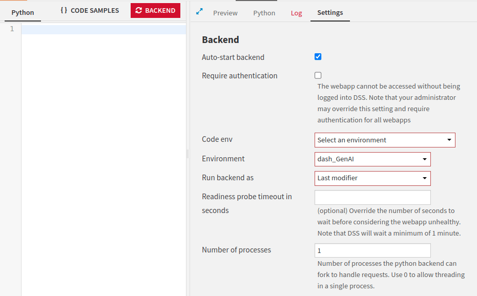
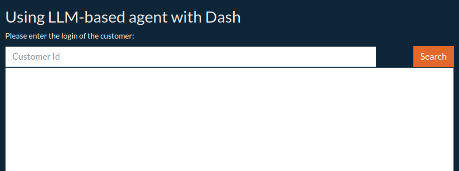

Creating a Dash application using an LLM-based agent
****************************************************

In this tutorial, you will learn how to build an LLM-based agent application using Dash.
You will build an application to retrieve customer and company information based on a login.
This tutorial relies on two tools.
One tool retrieves a user's name, position, and company based on a login.
This information is stored in a Dataset.
A second tool searches the Internet to find company information.

This tutorial is based on the :doc:`/tutorials/genai/agents-and-tools/agent/index` tutorial.
It uses the same tools and agents in a similar context.
If you have followed this tutorial, you can jump to the :ref:`webapp-dash-llm-based-agent-creating-the-dash-application` section.

Prerequisites
#############

* Administrator permission to build the template
* An LLM connection configured
* A Dataiku version > 12.6.2
* A code environment (named ``dash_GenAI``) with the following packages:

  .. code-block:: python

    dash
    dash-bootstrap-components
    langchain==0.2.0
    duckduckgo_search==6.1.0

Creating the Agent application
##############################

Preparing the data
^^^^^^^^^^^^^^^^^^
You need to create the associated dataset,
as you will use a dataset that stores a user's ID, name, position, and company based on that ID.

.. _webapp-dash-agent-table1:
.. csv-table:: Table 1: customer ID
   :file: ./assets/pro_customers.csv
   :header-rows: 1

:ref:`Table 1<webapp-dash-agent-table1>`, which can be downloaded :download:`here<./assets/pro_customers.csv>`,
represents such Data.
Create an SQL Database named ``pro_customers_sql`` by uploading the CSV file
and using a **Sync recipe** to store the data in an SQL connection.

LLM initialization and library import
^^^^^^^^^^^^^^^^^^^^^^^^^^^^^^^^^^^^^

Be sure to have a valid ``LLM ID`` before creating your Gradio application.
The :ref:`documentation<ce/llm-mesh/get-llm-id>` provides instructions on obtaining an ``LLM ID``.

* Create a new webapp by clicking on **</> > Webapps**.
* Click the **+New webapp**, choose the **Code webapp**, then click on the **Dash** button,
  choose the **An empty Dash app** option, and choose a meaningful name.
* Go to the **Settings** tabs, select the ``dash_GenAI`` code environment for the **Code env** option, and
  remove the code from the **Python** tab, as shown in :ref:`Figure 1<tutorial-webapps-dash-llm-based-agent-settings>`.

.. _tutorial-webapps-dash-llm-based-agent-settings:

    Figure 1: Dash settings.

To begin with, you need to set up a development environment by importing some necessary libraries
and initializing the chat LLM you want to use to create the agent.
The tutorial relies on the LLM Mesh for this and the Langchain package to orchestrate the process.
The ``DKUChatModel`` class allows you to call a model previously registered in the LLM Mesh
and make it recognizable as a Langchain chat model for further use.
:ref:`Code 1<webapp-dash-llm-based-agent-code-import>` shows how to do and import the needed libraries.

.. literalinclude:: ./assets/app.py
    :language: python
    :caption: Code 1: LLM initialization and library import
    :name: webapp-dash-llm-based-agent-code-import
    :lines: 1-31
    :emphasize-lines: 27,28,31

Tools definition
^^^^^^^^^^^^^^^^

Then, you have to define the different tools the application needs.
There are various ways of defining a tool.
The most precise one is based on defining classes that encapsulate the tool.
Alternatively, you can use the ``@tool`` annotation or the ``StructuredTool.from_function`` function,
but it may require more work when using those tools in a chain.

To define a tool using classes, there are two steps to follow:

* Define the interface: which parameter is used by your tool.
* Define the code: how the code is executed.

:ref:`Code 2<webapp-dash-llm-based-agent-code-get-customer-info>` shows how to describe a tool using classes.
The highlighted lines define the tool's interface.
This simple tool takes a customer ID as an input parameter and runs a query on the SQL Dataset.

.. literalinclude:: ./assets/app.py
    :language: python
    :caption: Code 2: Get customer's information
    :name: webapp-dash-llm-based-agent-code-get-customer-info
    :lines: 34-60
    :emphasize-lines: 1-3

.. attention::
    The SQL query might be written differently depending on your SQL Engine.

Similarly, :ref:`Code 3<webapp-dash-llm-based-agent-code-get-company-info>`
shows how to create a tool that searches the Internet for information on a company.

.. literalinclude:: ./assets/app.py
    :language: python
    :caption: Code 3: Get company's information
    :name: webapp-dash-llm-based-agent-code-get-company-info
    :lines: 62-88
    :emphasize-lines: 1-3

:ref:`Code 4<webapp-dash-llm-based-agent-code-how-to-use-tools>` shows how to declare and use these tools.

.. literalinclude:: ./assets/app.py
    :language: python
    :caption: Code 4: How to use tools
    :name: webapp-dash-llm-based-agent-code-how-to-use-tools
    :lines: 90-91

Once all the tools are defined, you are ready to create your agent.
An agent is based on a prompt and uses some tools and an LLM.
:ref:`Code 5<webapp-dash-llm-based-agent-code-declaring-agent>` creates an *agent* and the associated *agent executor*.

.. literalinclude:: ./assets/app.py
    :language: python
    :caption: Code 5: Declaring an agent
    :name: webapp-dash-llm-based-agent-code-declaring-agent
    :lines: 93-113

.. _webapp-dash-llm-based-agent-creating-the-dash-application:

Creating the Dash application
#############################

You now have a working agent; let's build the Dash application.
:ref:`Code 6<webapp-dash-llm-based-agent-code-dash-layout>` creates the Dash layout,
which constructs an application like :ref:`Figure 2<webapp-dash-llm-based-agent-dash-layout>`,
consisting of an input Textbox for entering a customer ID and an output Textarea.

.. literalinclude:: ./assets/app.py
    :language: python
    :caption: Code 6: Dash layout
    :name: webapp-dash-llm-based-agent-code-dash-layout
    :lines: 114-135

.. _webapp-dash-llm-based-agent-dash-layout:

    Figure 2: Dash layout.

Now, the only thing to do is connect the button to a function invoking the agent.
:ref:`Code 7<webapp-dash-llm-based-agent-code-dash-connection-v1>` shows how to do it.

.. literalinclude:: ./assets/app.py
    :language: python
    :caption: Code 7: connecting the agent and Dash
    :name: webapp-dash-llm-based-agent-code-dash-connection-v1
    :lines: 138-152,202-210,212

You could also use another way to display the result of the agent,
as shown in :ref:`Code 8<webapp-dash-llm-based-agent-code-dash-connection-v2>`.

.. literalinclude:: ./assets/app.py
    :language: python
    :caption: Code 7: connecting the agent and Dash
    :name: webapp-dash-llm-based-agent-code-dash-connection-v2
    :lines: 154-169,202-210,214-222

Going further
#############

You can test different versions of an LLM, let the user decide to use another prompt, or define new tools.
In the application's complete code, you will find another version that incrementally displays an agent's result.

Here are the complete versions of the code presented in this tutorial:

.. dropdown:: :download:`app.py<./assets/app.py>`

    .. literalinclude:: ./assets/app.py
        :language: python