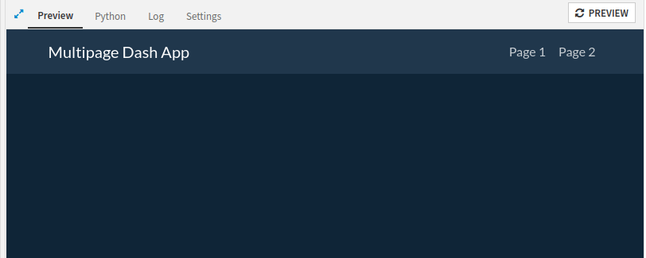

Create a simple multi-page webapp
*********************************

Prerequisites
#############

* Some familiarity with HTML, CSS, and Dash for the front-end
* Some familiarity with Python for the backend
* An existing Dataiku Project in which you have the "write project content" permissions
* A Python code environment with ``dash`` and ``dash-bootstrap-components`` packages installed (see the
  :doc:`documentation<refdoc:code-envs/operations-python>` for more details)

.. note::
    This tutorial used ``python==3.9``, ``dash==3.0.4``, and ``dash-bootstrap-components==2.0.2``,
    but other versions could work.

Introduction
############
In this tutorial, we'll create a simple multi-page web application to understand the underlying principles.
Multi-page webapps are beneficial when we can visually separate content into distinct areas, allowing for a more
focused and logically organized layout. This approach creates an application that spans multiple screens, with
shared facilities between them.

To create an empty Dash webapp, please refer to this
:doc:`mini-tutorial<../common-parts/create-the-webapp-empty-template>`.

Start with an empty template
#############################

In the "Python" tab, we will replace the existing code with :ref:`Code 1<tutorial_webapp_dash_multipages_first_code>`.
Line 6 specifies the theme used for the webapp. After clicking the **Save** button, we should land on a
page similar to :ref:`Fig. 1<dash-webapp-multipages-first-render>`.

.. code-block:: python
    :caption: Code 1: Check if the webapp is working
    :name: tutorial_webapp_dash_multipages_first_code
    :linenos:

    # Import necessary libraries
    from dash import html, dcc
    import dash_bootstrap_components as dbc

    # use the style of examples on the Plotly documentation
    app.config.external_stylesheets = [dbc.themes.SUPERHERO]

    nav_layout = html.Div([
        dbc.NavbarSimple(
            children=[
                dbc.NavItem(dbc.NavLink("Page 1", href="page1")),
                dbc.NavItem(dbc.NavLink("Page 2", href="page2")),
            ] ,
            brand="Multi-page Dash App",
            brand_href="home",
            fluid=True,
            color="dark",
            dark=True,
        ),
    ])

    # Define the index page layout
    app.layout = nav_layout

.. _dash-webapp-multipages-first-render:

    Figure 1: The very first rendering

Next, we will define and add two empty templates to the webapp.  After line 20, we will add two templates, as
shown in :ref:`Code 2<tutorial_webapp_dash_multipages_empty_templates>`.

.. code-block:: python
    :caption: Code 2: Defining two new empty templates
    :name: tutorial_webapp_dash_multipages_empty_templates

    page1_layout = html.Div([
        html.H2("Page 1")
    ])

    page2_layout = html.Div([
        html.H2("Page 2")
    ])

Once we have these two templates, we can build the multi-page webapp. For this, we need to create
an application layout. Some components will be shared by the whole application, the navigation bar, for example, or
a footer. And some content is displayed only when navigating from one page to another.
:ref:`Code 3<tutorial_webapp_dash_multipages_app_layout>` shows how to write the application layout. The highlighted
line will be used to display the specific content.

.. code-block:: python
    :caption: Code 3: Application layout
    :name: tutorial_webapp_dash_multipages_app_layout
    :linenos:
    :emphasize-lines: 4

    home_layout = html.Div([
        nav_layout,
        html.H1("Global shared components"),
        html.Div(id='page-content'),
        html.Footer("We can even have a footer")
    ])

    app.layout = home_layout

Build the navigation
####################

Simple navigation workflow
^^^^^^^^^^^^^^^^^^^^^^^^^^

We need to understand the navigation concept to build the navigation process. Navigation is usually built
upon two different schemas: using hashtags or using different URLs. These schemas do not change the way to handle
changes. Dash provides a component (``Location``) that represents the page's location. We can access the
properties by using the appropriate fields. When the URL changes, the ``Location`` component is updated. So when we
click on a link, like the navLink, the URL is (internally) updated, and so is the ``Location``.

In Dash, to react to a user interface event (like a click), we must connect a callback from the user interface to
processing. In this case, we could have bound the click on the link to mimic the location's change. But
we prefer connecting the URL's change (hold by ``Location``) to react to any event that may change the URL.
We must include the ``Location`` component in the webapp to connect the callback for
loading the content. The callback will take the ``Location`` pathname as an ``Input`` and changes
the ``Div`` content referenced with the ``id``: ``page-content``.
See :ref:`Code 4<tutorial_webapp_dash_multipages_navigation>`.

.. code-block:: python
    :caption: Code 4: Connecting the navigation system
    :name: tutorial_webapp_dash_multipages_navigation

    # Default template for the home page
    index_layout = html.Div([])

    # Global layout for the webapp
    home_layout = html.Div([
        dcc.Location(id='url', refresh=False),
        nav_layout,
        html.H1("Global shared components."),
        html.Div(id='page-content'),
        html.Footer("We can even have a footer")
    ])

    app.layout = home_layout

    # When the URL changes, update the content
    @app.callback(Output('page-content', 'children'),
              [Input('url', 'pathname')])
    def display_page(pathname):
        if pathname.endswith('page1'):
            return page1_layout
        elif pathname.endswith('page2'):
            return page2_layout
        else:
            return index_layout

Advanced navigation workflow
^^^^^^^^^^^^^^^^^^^^^^^^^^^^
Since we don't know where the webapp will be deployed, we need to get the URL used. It could end
with ``page2``. If this is the case, we won't be able to display the home page. So simple navigation workflow does
not cover the needs. To circumvent this problem, we must register the URL where to webapp is deployed when the user
runs it. Then we can compare the ``Location`` with the saved URL to determine which content is displayed.

For storing the ``Root-url``, we will use the ``Store`` Dash component. As we want to save the ``root-url`` only
at the loading time, we must also store if the ``root-url`` has been modified. For this, we replace
the ``home_layout`` with :ref:`Code 5<tutorial_webapp_dash_multipages_home>`.
:ref:`Code 6<tutorial_webapp_dash_multipages_callbacks>` shows how to use these new components. This code needs to
adjust the ``import`` section ``from dash.dependencies import Input, Output, State``,
and ``from dash.exceptions import PreventUpdate``.

.. code-block:: python
    :caption: Code 5: Modification of the ``home_layout``
    :name: tutorial_webapp_dash_multipages_home

    home_layout = html.Div([
        dcc.Store(id='root-url', storage_type = 'local', clear_data=True),
        dcc.Store(id='loaded', storage_type = 'local', clear_data=True, data=False),
        dcc.Location(id='url', refresh=False),
        nav_layout,
        html.H1("Global shared components"),
        html.Div(id='page-content'),
        html.Footer("We can even have a footer")
    ])

.. code-block:: python
    :caption: Code 6: Update the corresponding callbacks
    :name: tutorial_webapp_dash_multipages_callbacks

    # The following callback is used to dynamically instantiate the root-url when the webapp is launched
    @app.callback([
        Output('root-url', 'data'),
        Output('loaded', 'data')],
        Input('url', 'pathname'),
        State('loaded', 'data')
    )
    def update_root_url(url, loaded):
        if not loaded:
            return url, True
        else:
            raise PreventUpdate

    #  When the URL changes, update the content
    @app.callback(Output('page-content', 'children'),
              [Input('url', 'pathname')],
              [State('root-url', 'data'),
               State('loaded', 'data')],
             prevent_initial_call=True)
    def display_page(pathname, root_url, is_loaded):
        if is_loaded:
            if pathname == root_url + 'page1':
                return page1_layout
            elif pathname == root_url + 'page2':
                return page2_layout
            elif pathname == root_url + 'home':
                return index_layout
            else:
                return index_layout
        else:
            return index_layout

Complete code and conclusion
############################

:ref:`Code 7<tutorial_webapp_dash_multipages_full_code>` shows the complete code of this multi-page webapp.
This tutorial demonstrates how to create a multi-page webapp. It is easily extendable for many more pages.
Depending on the use case, we can use the most straightforward  way or provide a more robust way to navigate
from one page to another.

.. code-block:: python
    :caption: Code 7: Full code of a simple multi-page webapp
    :name: tutorial_webapp_dash_multipages_full_code

    # Import necessary libraries
    from dash import html
    from dash import dcc
    from dash import dash_table
    import dash_bootstrap_components as dbc
    from dash.dependencies import Input
    from dash.dependencies import Output
    from dash.dependencies import State
    from dash.exceptions import PreventUpdate
    import logging

    logger = logging.getLogger(__name__)

    # use the style of examples on the Plotly documentation
    app.config.external_stylesheets = [dbc.themes.SUPERHERO]

    nav_layout = html.Div([
        dbc.NavbarSimple(
            children=[
                dbc.NavItem(dbc.NavLink("Page 1", href="page1")),
                dbc.NavItem(dbc.NavLink("Page 2", href="page2")),
            ] ,
            brand="Multi-page Dash App",
            brand_href="home",
            fluid=True,
            color="dark",
            dark=True,
        ),
    ])

    page1_layout = html.Div([
        html.H2("Page 1"),
    ])

    page2_layout = html.Div([
        html.H2("Page 2"),
    ])

    index_layout = html.Div([
        html.H2("Index"),
    ])

    home_layout = html.Div([
        dcc.Store(id='root-url', storage_type = 'local', clear_data=True),
        dcc.Store(id='loaded', storage_type = 'local', clear_data=True, data=False),
        dcc.Location(id='url', refresh=False),
        nav_layout,
        html.H1("Global shared components"),
        html.Div(id='page-content'),
        html.Footer("We can even have a footer")
    ])

    # Define the index page layout
    app.layout = home_layout

    # The following callback is used to dynamically instantiate the root-url when the webapp is launched
    @app.callback([
        Output('root-url', 'data'),
        Output('loaded', 'data')],
        Input('url', 'pathname'),
        State('loaded', 'data')
    )
    def update_root_url(url, loaded):
        if not loaded:
            return url, True
        else:
            raise PreventUpdate

    #  When the URL changes, update the content
    @app.callback(Output('page-content', 'children'),
                  [Input('url', 'pathname')],
                  [State('root-url', 'data'),
                   State('loaded', 'data')],
                 prevent_initial_call=True)
    def display_page(pathname, root_url, is_loaded):
        logger.info(f"Root URL: {pathname}")
        if is_loaded:
            if pathname == root_url + 'page1':
                logger.info("## Page1")
                return page1_layout
            elif pathname == root_url + 'page2':
                logger.info("## Page 2")
                return page2_layout
            elif pathname == root_url + 'home':
                logger.info("## Index")
                return index_layout
            else:
                return index_layout
        else:
            return index_layout

