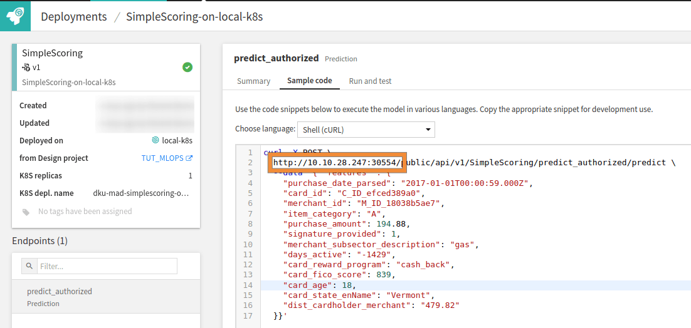

Simple scoring application
**************************

Prerequisites
#############

* Dataiku >= 12.1
* "Use" permission on a code environment using Python >= 3.9 with the following packages:
    * ``dash`` (tested with version ``2.11.1``)
    * ``dash-bootstrap-components`` (tested with version ``1.4.2``)
* Access to an existing project with the following permissions:
    * "Read project content"
    * "Write project content"
* Access to a model deployed as an API endpoint for scoring

Introduction
############
In this tutorial, you will learn how to request an API endpoint.
This endpoint can be a deployed model or anything else connected to an API endpoint.
This tutorial uses the model from the `MLOps training <https://knowledge.dataiku.com/latest/mlops-o16n/real-time-apis/basics/tutorial-index.html>`_ (from Learning projects > Real-time APIs)
and a deployed API endpoint named ``predict_fraud``.
It provides an API endpoint to predict the authorized flag from the provided data (transaction from credit card).

To follow the tutorial, you must know the URL where the endpoint is deployed.
You can find this URL in the **Local Deployer > API services**
and select the tab **Sample code** from your deployment, and note the URL as shown in
:ref:`Fig. 1<tutorial_webapp_dash_simple_scoring_ip_address>`

.. _tutorial_webapp_dash_simple_scoring_ip_address:

    Figure 1: Where to find the URL of an API endpoint.

Once the URL is known, you are ready to start the tutorial.
Please start with an empty Dash webapp.
To create an empty Dash webapp, please refer to this
:doc:`mini-tutorial<../common-parts/create-the-webapp-empty-template>`.

Building the webapp
#####################

You will rely on the method :meth:`dataikuapi.APINodeClient.predict_record`
from the ``dataikuapi`` package to use the API endpoint.
This method requires having an identifier of the endpoint to query and a Python dictionary of features.
Before using this method, you need to obtain a :class:`dataiku.APINodeClient`. This process is shown in
:ref:`Code 1<tutorial_webapp_dash_simple_scoring_get_prediction>`.

.. _tutorial_webapp_dash_simple_scoring_get_prediction:
.. literalinclude:: ./assets/webapp.py
    :caption: Code 1: Get a prediction from a :class:`dataiku.APINodeClient`
    :lines: 63-66
    :language: python

You need the endpoint’s URL and the deployed endpoint’s name to instantiate the client.
So you will create a form for the user to enter this data.
And, as features must be supplied to use the :meth:`dataikuapi.APINodeClient.predict_record` method,
you will include this data entry in the form.
:ref:`Code 2<tutorial_webapp_dash_simple_scoring_html_form>` shows a possible implementation of such a form.

.. _tutorial_webapp_dash_simple_scoring_html_form:
.. literalinclude:: ./assets/webapp.py
    :caption: Code 2: Form implementation
    :lines: 10-49
    :language: python

:ref:`Code 3<tutorial_webapp_dash_simple_scoring_callback>` is responsible for using the input data
and predicting the result.
A few error handlings are done in this callback to give some feedback to the user when something goes wrong.

.. _tutorial_webapp_dash_simple_scoring_callback:
.. literalinclude:: ./assets/webapp.py
    :caption: Code 3: Callback to get the prediction
    :lines: 52-75
    :language: python

Testing the webapp
##################
:ref:`Code 4<tutorial_webapp_dash_simple_scoring_complete_code>` is the complete code of the webapp.
You can now test the webapp by entering the URL previously noted and the name.
If you have deployed your API based on the referenced project, you can enter the following:

.. code-block:: python

    {
        "purchase_date_parsed": "2017-01-01T00:00:59.000Z",
        "card_id": "C_ID_efced389a0",
        "merchant_id": "M_ID_18038b5ae7",
        "item_category": "A",
        "purchase_amount": 194.88,
        "signature_provided": 1,
        "merchant_subsector_description": "gas",
        "days_active": "-1429",
        "card_reward_program": "cash_back",
        "card_fico_score": 839,
        "card_age": 18,
        "card_state_enName": "Vermont",
        "dist_cardholder_merchant": "479.82"
    }

The webapp should display ``1`` as a result or an error message
if you did not enter the correct address/name for the API endpoint.

Complete code and conclusion
############################
Congratulations! You now have a functional webapp that helps you to use an API endpoint.
You can go further by doing a specific form for your data.
If you want to do so, the tutorial ":doc:`../form-to-submit-values/index`" could be helpful.
You can display the probabilities of the prediction.
You may also send the result to another endpoint using the ``requests`` API.

.. _tutorial_webapp_dash_simple_scoring_complete_code:
.. dropdown:: Code 4: Complete code of the webapp

    .. literalinclude:: ./assets/webapp.py
        :language: python