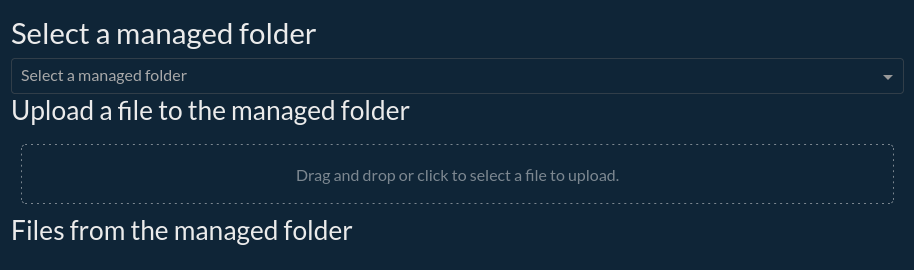
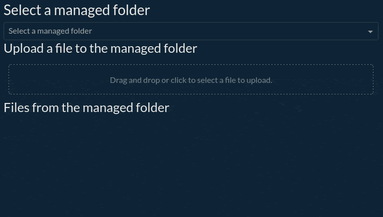

Uploading or downloading files with Managed Folders in Dash
***********************************************************

Prerequisites
#############

* Dataiku >= 11.0
* Some familiarity with HTML, CSS, and Dash for the front-end
* Some familiarity with Python for the backend
* An existing Dataiku Project in which you have the "write project content" permissions
* A Python code environment with ``dash`` and ``dash-bootstrap-components`` packages installed (see the
  :doc:`documentation<refdoc:code-envs/operations-python>` for more details)

This tutorial was written with Python 3.9 and the following package versions:

* ``dash==2.9.1``
* ``dash-bootstrap-components==1.4.1``

Introduction
############

In this tutorial, we want to focus on file upload and download functionality using a web application.
There are several ways to implement this. The best approach depends on the specific needs of the project.
We will build an application that allows the user to select an existing managed folder in the project.
With this selected managed folder, we will let the user upload one or more files into the managed folder.
We will also display the file list, so the user can easily download them.

Start with an empty template
############################

We will start with an empty Dash web application. If you don't know how to create one please refer to this
:doc:`mini-tutorial<../common-parts/create-the-webapp-empty-template>`.

In the **Python** tab, we will replace the existing code with :ref:`Code 1<tutorial_webapp_dash_upload_first_template>`.

.. code-block:: python
    :caption: Code 1: First template
    :name: tutorial_webapp_dash_upload_first_template
    :emphasize-lines: 12-13

    # Import necessary libraries
    import dash
    from dash import html
    from dash import dcc
    import dash_bootstrap_components as dbc
    from dash.dependencies import Input
    from dash.dependencies import Output
    from dash.dependencies import State
    from dash.exceptions import PreventUpdate
    from dash import ALL, MATCH

    #from webapps.utils import get_managed_folder_list
    #from webapps.utils import get_files_in_folder

    import logging
    import dataiku
    import io
    import base64

    logger = logging.getLogger(__name__)

    dbc_css = "https://cdn.jsdelivr.net/gh/AnnMarieW/dash-bootstrap-templates/dbc.min.css"
    # use the style of examples on the Plotly documentation
    app.config.external_stylesheets = [dbc.themes.SUPERHERO, dbc_css]

    home_layout = html.Div([
        dcc.Store(id='sequential_call'),
        dbc.Row([html.H2("Select a managed folder"), ]),
        dbc.Row([dcc.Dropdown(id='select_managed', options=[], placeholder="Select a managed folder", className="dbc"), ]),
        dbc.Row([html.H3("Upload a file to the managed folder"), ]),
        dbc.Row(
            dcc.Upload(
                id='upload_data',
                children=html.Div(id='output-data-upload', children=
                ["Drag and drop or click to select a file to upload."]
                                  ),
                style={
                    "height": "60px",
                    "lineHeight": "60px",
                    "borderWidth": "1px",
                    "borderStyle": "dashed",
                    "borderRadius": "5px",
                    "textAlign": "center",
                    "margin": "10px",
                },
                multiple=True,
                disabled=True
            ),
        ),
        dbc.Row([html.H3("Files from the managed folder"), ]),
        dbc.Row([html.Ul(id='file_list')], className="dbc container-fluid mt-3"),
    ], className="container-fluid mt-3")

    # build your Dash app
    app.layout = home_layout

This template code has two highlighted lines. Those lines will be uncommented later in the tutorial.
We also use a ``dcc.Store`` component. For more detail about this component,
please refer to `this documentation <https://dash.plotly.com/dash-core-components/store>`_.
After clicking the **Save** button, we should land on a page similar to
:ref:`Fig. 1<dash_webapp_upload_first_template>`.

.. _dash_webapp_upload_first_template:

    Figure 1: First template rendering.

Utility functions
#################

Before using this template, we will create some utility functions in the project library. Go to **</>** > **Library**,
under the ``python`` folder, and create a sub-folder named ``webapps``. Create a file named ``utils.py`` in this
folder with the content shown in :ref:`Code 2<tutorial_webapp_dash_upload_utils_functions>`. There are only
two functions:

* ``get_managed_folder_list``: to retrieve the managed folder list of the current project
* ``get_files_in_folder``: to retrieve a list of files contained in a managed folder

.. code-block:: python
    :name: tutorial_webapp_dash_upload_utils_functions
    :caption: Code 2: Helper functions in the project library

    import dataiku

    def get_managed_folder_list():
        """
        Get the list of managed folders in the current project

        :return: A list of (id, name)
        """
        project = dataiku.api_client().get_default_project()
        managed_folders = project.list_managed_folders()
        ids_and_names = [(mf.get('id', ''), mf.get('name', ''))
                         for mf in managed_folders]
        return ids_and_names

    def get_files_in_folder(folder_id):
        """
        Get the list of files in a managed folder

        :param id: Id of the managed folder

        :return: A list of files in the managed folder
        """
        mf = dataiku.Folder(folder_id)
        files = mf.list_paths_in_partition()
        return files

Uploading a file
################

With the help of the utility functions, we can populate the dropdown with the list of managed folders in the project.
Before using these utility functions, uncomment the highlighted lines of :ref:`Code 1<tutorial_webapp_dash_upload_first_template>`.
As we have deactivated the upload component by default, we should enable it once the user selects a managed folder.
We will also display the list of files contained in the managed folder.

:ref:`Code 3<tutorial_webapp_dash_upload_populate_dropdown>` shows how to do this.

.. code-block:: python
    :name: tutorial_webapp_dash_upload_populate_dropdown
    :caption: Code 3: Filling the dropdown with the list of managed folders

    @app.callback(
        Output('select_managed', 'options'),
        Input('select_managed', 'id')
    )
    def load_select(id):
        ids_and_names = get_managed_folder_list()
        return [{'value': ian[0], 'label': ian[1]} for ian in ids_and_names]

    @app.callback(
        [Output('file_list', 'children'),
         Output('upload_data', 'disabled')],
        Input('select_managed', 'value'),
        prevent_initial_call = True
    )
    def update_list(folder_id):
        files = get_files_in_folder(folder_id)
        if len(files) == 0:
            return [[html.Li("No file in the selected folder")], False]
        else:
            return [[html.Li(html.A(filename, href="")) for filename in files], False]

With the help of these callbacks, we can now display the list of files in the managed folder, as shown in
:ref:`Fig. 2<dash_webapps_upload_showing_files>`

.. _dash_webapps_upload_showing_files:

    Figure 2: Showing files in a managed folder.

Now, we need to connect the upload to a callback, allowing the user to upload data in the selected managed folder.
:ref:`Code 4<tutorial_webapp_dash_upload_file>` shows how to do it. We need to consider the usual parameter of an
Upload widget for the input parameters. The output of this callback is the ``folder-id`` to update the list
of files. Returning the ``folder_id`` will trigger the callback to update the list of files in the managed
folder once the upload is completed.

.. code-block:: python
    :name: tutorial_webapp_dash_upload_file
    :caption: Code 4: Callback for uploading a file in a selected managed folder.

    # Upload file in a managed folder
    @app.callback(
        Output('select_managed', 'value', allow_duplicate=True),
        [Input('upload_data', 'filename'),
         Input('upload_data', 'contents')],
        State('select_managed', 'value'),
        prevent_initial_call=True
    )
    def update_output(uploaded_filenames, uploaded_file_contents, folder_id):
        """Save uploaded files and regenerate the file list."""
        if (folder_id is not None):
            mf = dataiku.Folder(folder_id)
            if uploaded_filenames is not None and uploaded_file_contents is not None:
                for name, data in zip(uploaded_filenames, uploaded_file_contents):
                    content_type, content_string = data.split(',')
                    stream_d = base64.b64decode(content_string)
                    stream = io.BytesIO(stream_d)
                    mf.upload_stream(name, stream)

            return folder_id
        else:
            return dash.no_update

Downloading files
#################

As explained in the Dash documentation, we will use the ``Download component`` from the Dash core components library
to download a file and associate a button to this component.So for each file, we need to create a button
(with a unique id) and a download component. We will wrap this creation into an HTML ``LI`` tag, so we can easily
display a list of files by using the HTML ``UL``  tags. The button ``id`` will be the index of the file in the list
of files in the managed folder, but any other way of defining an ``id`` is a valid approach.
The emphasized lines in :ref:`Code 5<tutorial_webapp_dash_upload_download_button>` show how to create this
component. The other lines show how to use it.

.. code-block:: python
    :name: tutorial_webapp_dash_upload_download_button
    :caption: Code 5: Display a list of download buttons
    :emphasize-lines: 1-8

    def make_download_button(filename, index):
        btn_id = "btn_{}".format(index)
        dld_id = "dld_{}".format(index)
        id = index;
        download_area = dcc.Download(id=dld_id);
        button = html.Button(filename, id=btn_id);
        layout = html.Li(html.Div(children=[button, download_area]));
        return layout

    @app.callback(
        [Output('file_list', 'children'),
         Output('upload_data', 'disabled')],
        Input('select_managed', 'value'),
        prevent_initial_call = True
    )
    def update_list(folder_id):
        if (folder_id):
            files = get_files_in_folder(folder_id)
            if len(files) == 0:
                return [[html.Li("No file in the selected folder")], False]
            else:
                return [[make_download_button(filename,x) for x,filename in enumerate(files)], False]
        else:
            return dash.no_update, True

We do not plug the callback for the button to work. But this code would not work correctly, even if we plug a callback.
If the user changes several times the managed folder, the webapp will create many buttons with the same
id, preventing the webapp from working properly. To solve this problem, we first need a callback that cleans the
existing buttons (and downloads items) and then populates the new list with new objects. As both callbacks (the one
for cleaning and for generating the list of files) will work on the same object, we need to be sure that the callback
for cleaning the objects will be called before the other one. The clean callback will modify the list
based on the selected manage folder. It will also update the store. The callback for generating the list of files is
executed when the webapp modifies the store. :ref:`Code 6<tutorial_webapp_dash_upload_callback_synchronization>`
implements this synchronization between two callbacks.

In summary, the sequence of events is controlled by the ``sequential_call`` data store. The ``clear_list`` callback
changes the data in the store, which triggers the ``update_list`` callback. This ensures that every time a new folder
is selected, the list of files is cleared and updated with the files in the new folder.

.. code-block:: python
    :name: tutorial_webapp_dash_upload_callback_synchronization
    :caption: Code 6: Callback synchronization

    # List files in selected managed folder
    @app.callback(
        [
            Output('upload_data', 'disabled', allow_duplicate=True),
            Output('sequential_call', 'data', allow_duplicate=True),
            Output('file_list', 'children', allow_duplicate=True),
        ],
        Input('select_managed', 'value'),
        State('sequential_call', 'data'),
        prevent_initial_call = True
    )
    def clear_list(n, data):
        value = data or {'update_list': 0}
        value['update_list'] = value['update_list'] + 1
        return [False, value, []]

    # Update list of file
    @app.callback(
        [
            Output('file_list', 'children', allow_duplicate = True),
            Output('upload_data', 'disabled', allow_duplicate = True),
        ],
        Input('sequential_call', 'data'),
        State('select_managed', 'value'),
        prevent_initial_call = True
    )
    def update_list(data, folder_id):
        if (folder_id):
            files = get_files_in_folder(folder_id)
            if len(files) == 0:
                return [[html.Li("No file in the selected folder")], False]
            else:
                return [[make_download_button(filename,x) for x,filename in enumerate(files)], False]
        else:
            return dash.no_update, True

Now we need to connect the download buttons to a callback for downloading a file. We will use the
pattern-matching callback mechanism. For more information, please refer to the
`Dash documentation <https://dash.plotly.com/pattern-matching-callbacks>`_. To use pattern-matching callback, we must
replace the ``make_download_button`` with the function shown in
:ref:`Code 7<tutorial_webapp_dash_upload_download_button_final>` (highlighted lines). With this button, the associated
callback is straightforward.

.. code-block:: python
    :name: tutorial_webapp_dash_upload_download_button_final
    :caption: Code 7: Generating a download button compatible with pattern-matching callbacks
    :emphasize-lines: 1-5

    def make_download_button(filename, index):
        download_area = dcc.Download(id={'index': index, 'type': 'dld'}, data={'base64':True})
        button = html.Button(filename, id={'index': index, 'type': 'btn', 'filename': filename})
        layout = html.Li(html.Div(children=[button, download_area]))
        return layout

    # Download file from Managed Folder
    @app.callback(
        Output({'type': 'dld', 'index': MATCH}, 'data'),
        Input({'type':'btn', 'index': MATCH, 'filename': ALL}, 'n_clicks'),
        State({'type':'btn', 'index': MATCH, 'filename': ALL}, 'id'),
        State('select_managed', 'value'),
        prevent_initial_call = True
    )
    def download_file(n, id, managed):
        if (id):
            mf = dataiku.Folder(managed)

            def write_file(bytes_io):
                stream = mf.get_download_stream(id[0].get('filename',''))
                bytes_io.write(stream.read())

            return dcc.send_bytes(write_file, (id[0].get('filename','_file'))[1:])
        else:
            return dash.no_update

Complete code and conclusion
############################

:ref:`Code 8<tutorial_webapp_dash_upload_complete_code>` shows the complete code for uploading/downloading files from
a managed folder. This tutorial shows how to read files from a managed folder and write files to a managed
folder. The complexity of this tutorial comes from the need for a dedicated component (a file explorer-like) in Dash.

.. code-block:: python
    :name: tutorial_webapp_dash_upload_complete_code
    :caption: Code 8: Complete code of the tutorial

    # Import necessary libraries
    import dash
    from dash import html
    from dash import dcc
    import dash_bootstrap_components as dbc
    from dash.dependencies import Input
    from dash.dependencies import Output
    from dash.dependencies import State
    from dash.exceptions import PreventUpdate
    from dash import ALL, MATCH

    from webapps.utils import get_managed_folder_list
    from webapps.utils import get_files_in_folder

    import logging
    import dataiku
    import io
    import base64

    logger = logging.getLogger(__name__)

    dbc_css = "https://cdn.jsdelivr.net/gh/AnnMarieW/dash-bootstrap-templates/dbc.min.css"
    # use the style of examples on the Plotly documentation
    app.config.external_stylesheets = [dbc.themes.SUPERHERO, dbc_css]

    home_layout = html.Div([
        dcc.Store(id='sequential_call'),
        dbc.Row([html.H2("Select a managed folder"), ]),
        dbc.Row([dcc.Dropdown(id='select_managed', options=[], placeholder="Select a managed folder", className="dbc"), ]),
        dbc.Row([html.H3("Upload a file to the managed folder"), ]),
        dbc.Row(
            dcc.Upload(
                id='upload_data',
                children=html.Div(id='output-data-upload', children=
                ["Drag and drop or click to select a file to upload."]
                                  ),
                style={
                    "height": "60px",
                    "lineHeight": "60px",
                    "borderWidth": "1px",
                    "borderStyle": "dashed",
                    "borderRadius": "5px",
                    "textAlign": "center",
                    "margin": "10px",
                },
                multiple=True,
                disabled=True
            ),
        ),
        dbc.Row([html.H3("Files from the managed folder"), ]),
        dbc.Row([html.Ul(id='file_list')], className="dbc container-fluid mt-3"),
    ], className="container-fluid mt-3")

    # build your Dash app
    app.layout = home_layout

    def make_download_button(filename, index):
        """
        Create a button associated with a dcc.Download component
        Args:
            filename: filename associated with the download component
            index: index of the button.

        Returns:
            a button associated with a dcc.Download component
        """
        download_area = dcc.Download(id={'index': index, 'type': 'dld'}, data={'base64': True})
        button = html.Button(filename, id={'index': index, 'type': 'btn', 'filename': filename})
        layout = html.Li(html.Div(children=[button, download_area]))
        return layout

    @app.callback(
        Output('select_managed', 'options'),
        Input('select_managed', 'id')
    )
    def load_select(_):
        """
        Populate the dropdown with the list of the managed folders

        Returns:
            list of the managed folders with their id
        """
        ids_and_names = get_managed_folder_list()
        return [{'value': ian[0], 'label': ian[1]} for ian in ids_and_names]

    # List files in selected managed folder
    @app.callback(
        [
            Output('upload_data', 'disabled', allow_duplicate=True),
            Output('sequential_call', 'data', allow_duplicate=True),
            Output('file_list', 'children', allow_duplicate=True),
        ],
        Input('select_managed', 'value'),
        State('sequential_call', 'data'),
        prevent_initial_call=True
    )
    def clear_list(_, data):
        """
        Clear the list of Button and Download components
        Args:
            _: not used (only for calling the callback)
            data: for callback synchronization

        Returns:
            False (to enable the Upload component),
            value (for calling the next callback (update list))
            [] (to remove existing component)
        """
        value = data or {'update_list': 0}
        value['update_list'] = value['update_list'] + 1
        return [False, value, []]

    # Update list of file
    @app.callback(
        [
            Output('file_list', 'children', allow_duplicate=True),
            Output('upload_data', 'disabled', allow_duplicate=True),
        ],
        Input('sequential_call', 'data'),
        State('select_managed', 'value'),
        prevent_initial_call=True
    )
    def update_list(_, folder_id):
        """
        Update the file list
        Args:
            _: not use, callback synchronization
            folder_id: the id of the managed folder

        Returns:
            the file list
        """
        if folder_id:
            files = get_files_in_folder(folder_id)
            if len(files) == 0:
                return [[html.Li("No file in the selected folder")], False]
            else:
                return [[make_download_button(filename, x) for x, filename in enumerate(files)], False]
        else:
            return dash.no_update, True

    # Upload file in managed folder
    @app.callback(
        Output('select_managed', 'value', allow_duplicate=True),
        [Input('upload_data', 'filename'),
         Input('upload_data', 'contents')],
        State('select_managed', 'value'),
        prevent_initial_call=True
    )
    def update_output(uploaded_filenames, uploaded_file_contents, folder_id):
        """
        Save uploaded files and regenerate the file list.
        Args:
            uploaded_filenames: filenames
            uploaded_file_contents: file contents
            folder_id: where to upload the files.

        Returns:
            folder_id for file list refresh
        """
        if folder_id is not None:
            mf = dataiku.Folder(folder_id)
            if uploaded_filenames is not None and uploaded_file_contents is not None:
                for name, data in zip(uploaded_filenames, uploaded_file_contents):
                    content_type, content_string = data.split(',')
                    stream_d = base64.b64decode(content_string)
                    stream = io.BytesIO(stream_d)
                    mf.upload_stream(name, stream)

            return folder_id
        else:
            return dash.no_update

    # Download file from Managed Folder
    @app.callback(
        Output({'type': 'dld', 'index': MATCH}, 'data'),
        Input({'type': 'btn', 'index': MATCH, 'filename': ALL}, 'n_clicks'),
        State({'type': 'btn', 'index': MATCH, 'filename': ALL}, 'id'),
        State('select_managed', 'value'),
        prevent_initial_call=True
    )
    def download_file(_, id, managed):
        """
        Callback for downloading a file
        Args:
            _: not used (only for triggering the callback)
            id: id of the associated button
            managed: value of the selected managed folder
        Returns:
            nothing, just the ability of downloading a file.
        """
        if id:
            mf = dataiku.Folder(managed)

            def write_file(bytes_io):
                stream = mf.get_download_stream(id[0].get('filename', ''))
                bytes_io.write(stream.read())

            return dcc.send_bytes(write_file, (id[0].get('filename', '_file'))[1:])
        else:
            return dash.no_update
