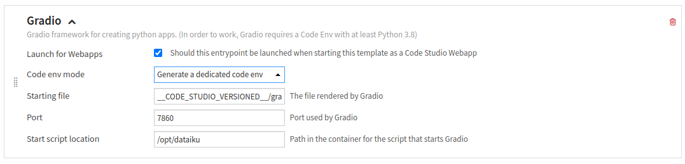
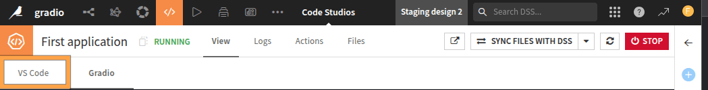
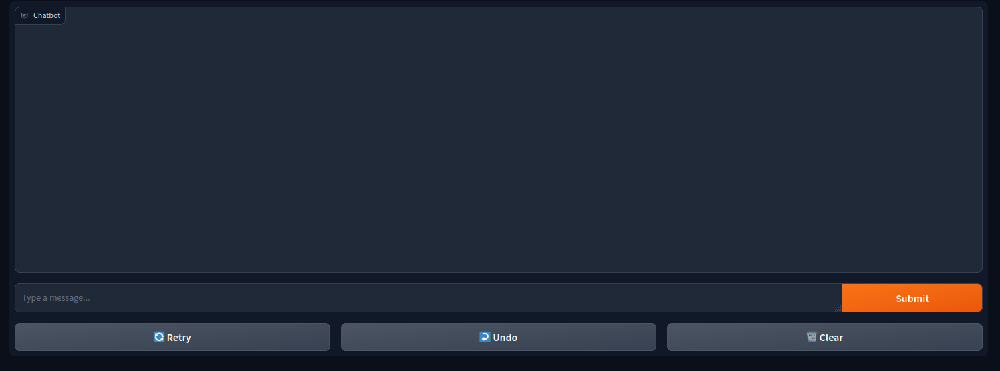

Gradio: your first web application
**********************************

In this tutorial, you will learn how to build your first Gradio web application.
To be able to create a Gradio application,
you will first need to configure a Code Studio template and then code your application using this application.
Once the application is designed, you can publish it as a web application.

Prerequisites
#############

* Administrator permission to build the template
* An LLM connection configured

Building the Code Studio template
#################################

* Go to the **Code Studios** tab in the **Administration** menu,
  click the **+Create Code Studio template** button, and choose a meaningful label (``gradio_template``, for example).
* Click on the **Definition** tab.
* Add a new **Visual Studio Code** block.
  This block will allow you to edit your Gradio application in a dedicated Code Studio.
* Add a new **Gradio** block, and choose **Generate a dedicated code env** for the **Code env mode**,
  as shown in :ref:`Figure 1<webapp-gradio-first-webapp-code-studio-gradio-block>`.
* Click the **Save** button.
* Click the **Build** button to build the template.

.. _webapp-gradio-first-webapp-code-studio-gradio-block:

    Figure 1: Code Studio -- Gradio block.

Your Code Studio template is ready to be used in a project.
If you need a specific configuration for a block, please refer to
:doc:`the documentation<refdoc:code-studios/index>`.
If you want to generate your code environment to include other packages than Gradio,
you should pin the Gradio version to `3.48.0`.

Creating a new Gradio application
#################################

Before creating your Gradio application, be sure to have a valid LLM ID.
You can refer to :ref:`the documentation<ce/llm-mesh/get-llm-id>` to retrieve an LLM ID.

* Create a new project, click on **</> > Code Studios**.
* Click the **+New Code Studio**, choose the previously created template, choose a meaningful name,
  click the **Create** button, and then click the **Start Code Studio** button.
* To edit the code of your Gradio application, click the highlighted tabs (**VS Code**) as shown in
  :ref:`Figure 2<webapps_gradio_first_webapps_code_studio>`.
* Select the ``gradio`` subdirectory in the ``code_studio-versioned`` directory.
  Dataiku provides a sample application in the file ``app.py``.
* Replace the provided code with the code shown in
  :ref:`Code 1<tutorial_webapp_gradio_first_webapp_code>`.
  Replace the LLM_ID with your LLM_ID in the highlighted line.
* If everything goes well, you should have a running Gradio application like the one shown in
  :ref:`Figure 3<webapps_gradio_first_webapps_gradio_application>`.

.. _webapps_gradio_first_webapps_code_studio:

    
    Figure 2: Code Studio.

.. _webapps_gradio_first_webapps_gradio_application:

    Figure 3: First Gradio application using a LLM.

Wrapping up
###########

You now have a running Gradio application.
You can customize it a little to fit your needs.
When you are happy with the result, you can click on the Publish button in the right panel.
Then, your Gradio application is available for all users who can use it without running the Code Studio.

.. dropdown:: :download:`app.py<./assets/app.py>`
    :open:

    .. literalinclude:: ./assets/app.py
        :language: python
        :caption: Code 1: First Gradio application
        :name: tutorial_webapp_gradio_first_webapp_code
        :emphasize-lines: 6
