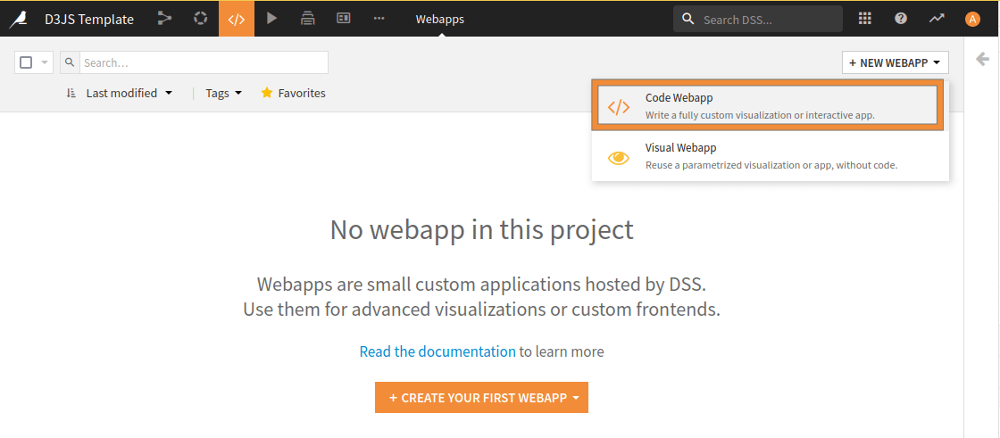
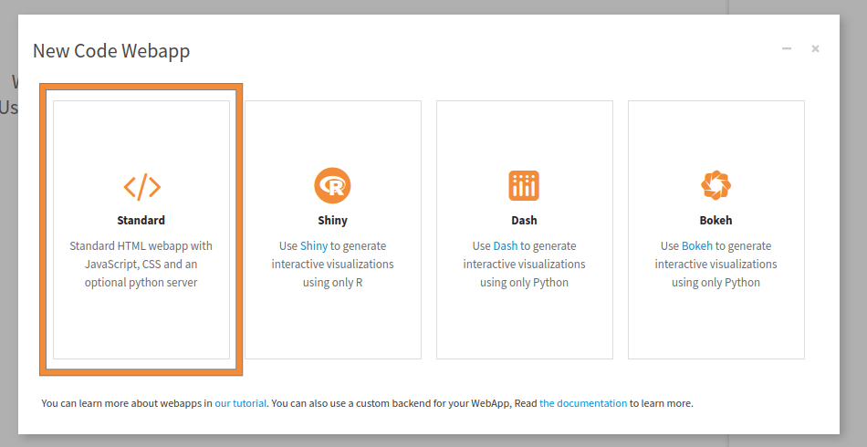
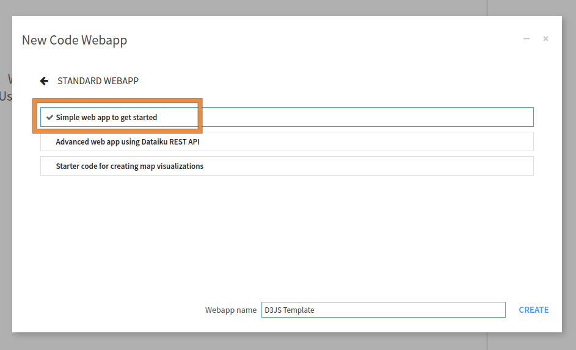
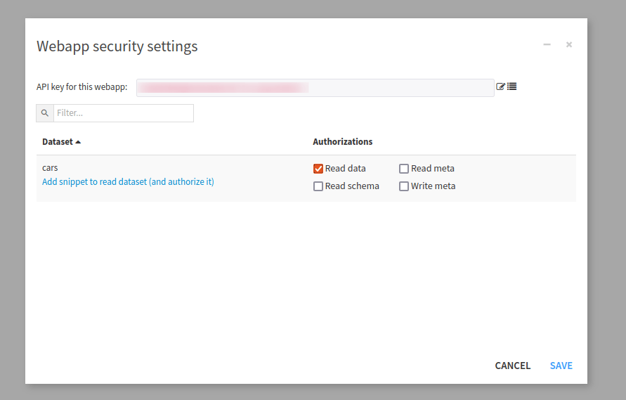

Adapt a D3.js Template in a Webapp
**********************************

D3.js is a state-of-the-art library for data visualization. Check out the
`D3.js gallery <https://github.com/d3/d3/wiki/Gallery>`_ for stunning examples.
Happily, many of these visualizations include their source code, so that you can easily duplicate them.

For example, `the parallel coordinates chart <https://bl.ocks.org/mbostock/7586334>`_, shown in 
:ref:`Fig. 1<tutorials_webapps_adapt_d3js_template_d3_parallel_coordinates>`,
created by Mike Bostock, is given with the generating D3 code and data!
This is a cool and useful data viz that allows you to quickly visualize a multi-dimensional (but relatively small) dataset.
You can immediately spot correlations across dimensions and uncover clusters.
In this interactive visualization, you can explore the data in depth by filtering values on each dimension with a brush tool.

This brief tutorial replicates the parallel coordinates chart in a Dataiku webapp. In this tutorial, we will also
cover how to use a specific version of D3.

.. _tutorials_webapps_adapt_d3js_template_d3_parallel_coordinates:

.. figure:: ./assets/d3-parallel-coordinates.png
    :align: center
    :class: with-shadow image-popup
    :alt: Fig. 1: Example of a D3js parallel coordinates chart.

    Fig. 1: Example of a D3js parallel coordinates chart.

Prerequisites
#############

The tutorial on the basics of :ref:`standard Webapps<draw-an-interactive-map-using-the-sfpd-crime-data>` is
suggested, but not required.

Upload the data and create a new webapp
#######################################

The parallel coordinates chart is illustrated on a dataset of car specifications.

* In a new blank project, create the cars dataset by uploading this `CSV file <https://cdn.downloads.dataiku.com/public/website-additional-assets/data/cars.csv>`_.
* From the Code menu, create a new code webapp, of the “standard” variety.
* Choose a simple webapp to get started, and delete all of the sample code (in both HTML, CSS, and Javascript panels).

.. _tutorials_webapps_adapt_d3js_template_new_webapp:

    
    Fig. 2: New Webapp creation.
    
.. _tutorials_webapps_adapt_d3js_template:

    
    Fig. 3: Creation of a new standard Web Application.

.. _tutorials_webapps_adapt_d3js_template_new_starter_webapp:

    
    Fig. 4: Creation of a new simple Webapp.
    

    

We first need access to the data and the needed libraries.

* In the Settings tab, click on “Configure” in the Security section.
* In the dataset list, find the cars dataset and allow the webapp to read it.
* As we will use another version of D3 than the one proposed by default, we don't have to check the "D3.js" javascript library, in the settings tabs.

.. _tutorials_webapps_adapt_d3js_template_give_read_access:

    
    Fig. 5: How to give read access permission to a dataset.
    

Understand the overall code structure
#####################################

Many D3 code samples, given in the `D3 gallery <https://d3-graph-gallery.com/>`_ or
`bl.ocks.org <https://bl.ocks.org/>`_, have the same overall structure.

.. code-block:: HTML
    :caption: Code 1: Classical D3 code architecture.

    <!DOCTYPE html>
    <meta charset="utf-8"/>
    
    <body>
        <!-- HTML code -->  <!-- This goes in the HTML Panel-->
        
        
    </body>

To replicate the D3 visualizations in the webapp, we can copy the whole code inside the HTML panel, but most of the time,
we dispatch the code into the three panels (HTML, CSS, and Javascript).

Copying the HTML code
#####################

For the parallel coordinates chart example, we will use two HTML tags; one for importing the D3 library, and one
for having a dedicated place where the chart will be displayed. So the content of the HTML panel is the code shown in
:ref:`Code 2<tutorials_webapps_adapt_d3js_template_code_html>`.

.. code-block:: HTML
    :caption: Code 2: Content of the HTML panel for the parallel coordinates chart.
    :name: tutorials_webapps_adapt_d3js_template_code_html

    <!-- Load d3.js -->
    

    <!-- Create a div where the graph will take place -->
    

Copying the CSS code
####################

When there is the CSS code, defined within the ``<style>`` tags, you should copy it into the CSS panel of your editor.
In this tutorial, we don't have specific CSS tweaks, to insert or use. So the CSS Panel remains empty.

Adapting the JS code
####################

The trickiest part in adapting a D3 template is always to shape the data in the format required by the data viz.
First, we will set up different parameters for the visualization. We will copy 
:ref:`Code 3<tutorials_webapps_adapt_d3js_template_code_javascript_parameter>` into the javascript panel.

.. code-block:: javascript
    :caption: Code 3: Parameters for the visualization
    :name: tutorials_webapps_adapt_d3js_template_code_javascript_parameter

    const margin = ({ top: 30, right: 50, bottom: 30, left: 50 })
    const width = document.querySelector('#my_dataviz').offsetWidth - margin.left - margin.right;
    const height = window.innerHeight - margin.top - margin.bottom;

    const svg = d3.select("#my_dataviz")
        .append("svg")
        .attr("width", width + margin.left + margin.right)
        .attr("height", height + margin.top + margin.bottom)
        .append("g")
        .attr("transform",
            `translate(${margin.left},${margin.top})`);

    const brushHeight = 50;
    const label = d => d.name
    const colors = d3.interpolateCool
    const deselectedColor = "#ddd"

In the parallel coordinates charts, the data in the D3 code is represented as the *cars* JSON array.
Generally, however, your source data is not in JSON format. In many D3 templates, the data is given as a CSV file,
which is converted to JSON.

In the original D3 code, the data is thus read from the ``cars.csv`` file:

.. code-block:: javascript

    // D3 code
    d3.csv("cars.csv", function(error, cars) {
        // D3 code
    });
    // D3 code

Then the D3 code defined inside the ``d3.csv()`` function is applied to the cars JSON array.

In our webapp, you will have to connect to your dataset (which can be stored in a great variety of formats and
database systems) through the Dataiku JavaScript API.

To do this, we need to modify the JS code in two ways:

* Without touching the body of the function, replace the original d3.csv() function name and parameters with the code below:

.. code-block:: javascript
    :caption: Code 4: Code for the data visualization.
    :name: tutorials_webapps_adapt_d3js_template_code_javascript_data_visualization

    function parallelCoordinatesChart(data) {
        const keys = Object.keys(data.slice(1, 2)[0])
        keys.pop() // Drop the last column which is the name
        const keyz = keys[1]

        const x = new Map(Array.from(keys, key => [key, d3.scaleLinear(d3.extent(data, d => d[key]), [margin.left, width - margin.right])]))
        const y = d3.scalePoint(keys, [margin.top, height - margin.bottom])
        const z = d3.scaleSequential(x.get(keyz).domain().reverse(), colors)

        const line = d3.line()
            .defined(([, value]) => value != null)
            .x(([key, value]) => x.get(key)(value))
            .y(([key]) => y(key))

        const brush = d3.brushX()
            .extent([
                [margin.left, -(brushHeight / 2)],
                [width - margin.right, brushHeight / 2]
            ])
            .on("start brush end", brushed);

        const path = svg.append("g")
            .attr("fill", "none")
            .attr("stroke-width", 1.5)
            .attr("stroke-opacity", 0.4)
            .selectAll("path")
            .data(data.slice().sort((a, b) => d3.ascending(a[keyz], b[keyz])))
            .join("path")
            .attr("stroke", d => z(d[keyz]))
            .attr("d", d => line(d3.cross(keys, [d], (key, d) => [key, d[key]])));

        path.append("title")
            .text(label);

        svg.append("g")
            .selectAll("g")
            .data(keys)
            .join("g")
            .attr("transform", d => `translate(0,${y(d)})`)
            .each(function (d) { d3.select(this).call(d3.axisBottom(x.get(d))); })
            .call(g => g.append("text")
                .attr("x", margin.left)
                .attr("y", -6)
                .attr("text-anchor", "start")
                .attr("fill", "currentColor")
                .text(d => d))
            .call(g => g.selectAll("text")
                .clone(true).lower()
                .attr("fill", "none")
                .attr("stroke-width", 5)
                .attr("stroke-linejoin", "round")
                .attr("stroke", "white"))
            .call(brush);

        const selections = new Map();

        function brushed({ selection }, key) {
            if (selection === null) selections.delete(key);
            else selections.set(key, selection.map(x.get(key).invert));
            const selected = [];
            path.each(function (d) {
                const active = Array.from(selections).every(([key, [min, max]]) => d[key] >= min && d[key] <= max);
                d3.select(this).style("stroke", active ? z(d[keyz]) : deselectedColor);
                if (active) {
                    d3.select(this).raise();
                    selected.push(d);
                }
            });
            svg.property("value", selected).dispatch("input");
        }

        return svg.property("value", data).node();
    }

In other words, keep the entire D3 code unchanged, except for the call to the ``d3.csv()`` function, which is
replaced by defining the ``parallelCoordinatesChart()`` function, which takes the *cars* JSON array as input.

Now, we only need to connect to the *cars* dataset through the Dataiku JS API, to create the corresponding
cars JSON array. Recall that, when you gave permission for your webapp to read the cars dataset, an option to add a
snippet calling to the ``dataiku.fetch()`` function could have been added.

* Copy and paste the code below into the JS tab. This code creates the cars JSON array and calls the ``parallelCoordinatesChart()`` function to create the chart.

.. code-block:: javascript
    :caption: Code 5: Reading a dataset from the flow.
    :name: tutorials_webapps_adapt_d3js_template_code_javascript_read_dataset

    dataiku.fetch('cars', function(dataFrame) {
        var columnNames = dataFrame.getColumnNames();
        function formatData(row) {
            var out = {};
            columnNames.forEach(function (col) {
                out[col]= col==='name' ? row[col] : +row[col];
            });
            return out;
        }
      var cars = dataFrame.mapRecords(formatData);
      parallelCoordinatesChart(cars);
    });

That’s it, you have a running D3 data viz in your webapp! 

.. _tutorials_webapps_adapt_d3js_template_final_steps:

.. figure:: ./assets/webapp-d3jstemplate-d3-parallel-coordinates.png
    :align: center
    :class: with-shadow image-popup
    :alt: Fig. 6: The final result of the parallel coordinates chart.
    
    Fig. 6: The final result of the parallel coordinates chart.
    

Troubleshooting
###############

If you’re having trouble, be sure you have carefully followed all the steps.
The best way to debug is to use the JS console in your browser with the webapp editor open.

Here are the complete versions of the code presented in this tutorial:

.. dropdown:: HTML Code

    .. literalinclude:: ./assets/code.html
        :language: html

.. dropdown:: JS Code

    .. literalinclude:: ./assets/code.js
        :language: javascript
