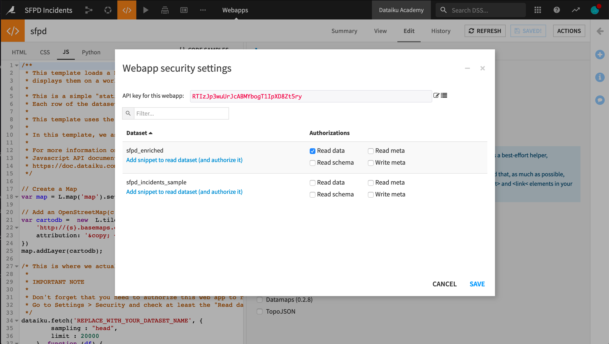
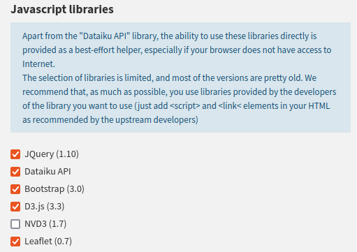
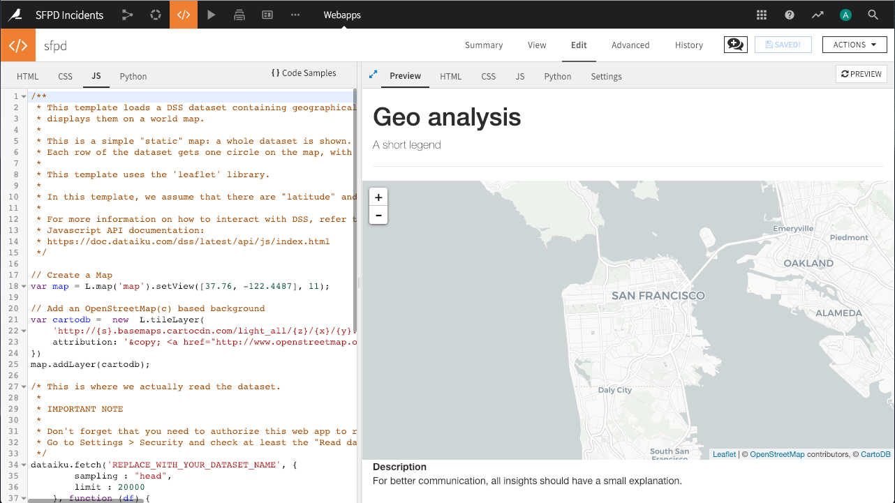
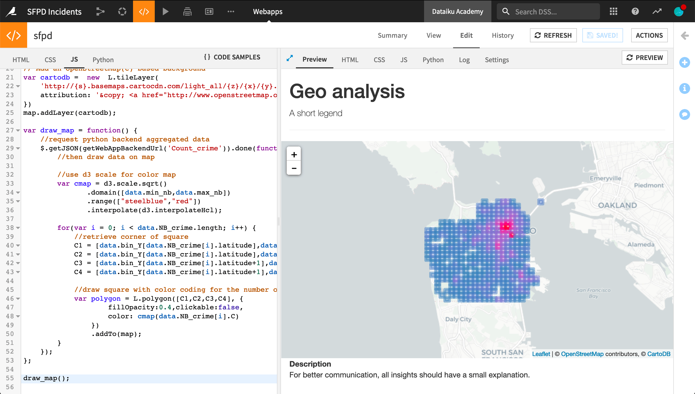
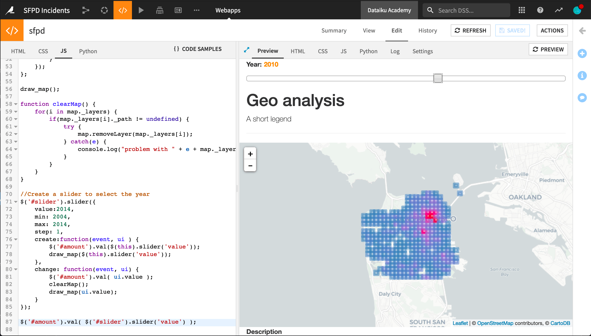

(draw-an-interactive-map-using-the-sfpd-crime-data)=

# HTML/CSS/JS: your first webapp

In this tutorial, you will create a Dataiku Webapp using HTML, JavaScript,
and a Flask-powered Python backend to draw a map of San Francisco reflecting the number of crimes by year and location.
A few preliminary steps are done using visual features, but the Webapp part relies entirely on code. 

## Prerequisites

* Some familiarity with HTML and JavaScript for the front-end
* Some familiarity with Python for the backend


## Supporting data

We will work with the [San Francisco Police Department Crime Incidents](https://data.sfgov.org/Public-Safety/SFPD-Incidents-from-1-January-2003/tmnf-yvry) data used under the [Open Data Commons PDDL](https://opendatacommons.org/licenses/pddl/) license.

## Prepare the Project and the Dataset

From the Dataiku homepage, go to *New Project -> Learning projects -> Developer -> SFPD Incidents*. 

If you want to start from a blank Project, you can download and import the data from the [San Francisco Open Data Portal](https://data.sfgov.org/Public-Safety/SFPD-Incidents-from-1-January-2003/tmnf-yvry).

Your map will display the data with year-based filters: To do that efficiently, you will need to create a new enriched Dataset with a "year" column: 

* Select the Dataset and **create a new Prepare recipe** with an output Dataset called `sfpd_enriched`.
* In the Prepare recipe's script, parse the "Date" column.
* From the parsed date, add a new **Extract date components** step to the script and only extract the year to a new column named "year". Leave the other column name fields empty.
* Rename columns "X" to `longitude` and "Y" to `latitude`.
* Run the Prepare recipe.

## Create the Webapp

* In the top navigation bar, go to *&lt;/&gt; -> Webapps*.
* Click on *+ New Webapp* on the top right, then select *Code Webapp > Standard*.
* Select the *Starter code for creating map visualizations* template and give a name to your newly-created Webapp.

{.image-popup}

## Configure the Webapp settings

Since we will be reading a Dataset, we must first authorize its access. From the Webapp interface:

* Go to *Settings -> Show legacy settings -> Configure*.
* Look up the `sfpd_enriched` Dataset, and under "Authorizations," select "Read data."
* Save the settings.

{.image-popup}

:::{topic} Note
The *"Add snippet to read dataset (and authorize it)"*
link comes in handy
when you want to add a piece of JavaScript code automatically formatted to give you access to your Dataset's data.
You won't have to use it here because the template already contains the relevant code.
:::

Since we will be rendering the dataset using the D3 library, we must add it. From the Webapp interface:

* Go to *Settings -> Show legacy settings -> Javascript libraries*.
* Enable the `D3.js` library.
* Save the settings.

{.image-popup}

## Initialize the map

The starter code renders a default map with no data centered on France. To center it on San Francisco, change the way the `map` variable is created in the JavaScript code: 

```javascript
// Create a Map centered on San Francisco


// Leaflet's `setView` method sets the geographical center and zoom level of the map.
var map = L.map('map').setView([37.76, -122.4487], 11); // (1)
```

Click on *Save* to update the preview output. Your map is now ready! You can start adding some data to it.

{.image-popup}


## Create the backend processing function

While your Webapp can retrieve the contents of a Dataset using JavaScript,
given the size of the Dataset, it may not be optimal to load it all in the browser.
Instead, you will use a Python backend to load the Dataset into a Pandas DataFrame,
filter it by year, and aggregate it by area. 

* In the "JS" tab, remove all the code associated with the `dataiku.fetch()` method. Only the `map` and `cartodb` variables should remain, as well as the `map.addLayer(cartodb);` statement.
* In the "Python" tab, click "Enable" to launch the backend.
* Replace the generated boilerplate Python code with the following : 

```python
import dataiku
import pandas as pd
import json

sfpd = dataiku.Dataset("sfpd_enriched").get_dataframe()
# Only keep valid locations and criminial incidents
sfpd = sfpd[(sfpd.longitude!=0) & (sfpd.latitude!=0) & (sfpd.Category!="NON-CRIMINAL")]

# The Python backend is implemented with Flask. It reuses the concept of routes to map the data exchanges with the frontend.

@app.route('/Count_crime')
def count_crime():
    year = 2014
    # Filter data for the chosen year
    tab = sfpd[["longitude", "latitude"]][(sfpd.year == year)]

    # Group incident locations into bins
    x_bin = pd.cut(tab.longitude, 25, retbins=True, labels=False)
    y_bin = pd.cut(tab.latitude, 25, retbins=True, labels=False)
    tab["longitude"] = x_bin[0]
    tab["latitude"] = y_bin[0]
    tab["C"] = 1

    # Group incidents by binned locations and count them
    gp = tab.groupby(["longitude", "latitude"])
    df = gp["C"].count().reset_index()
    max_cr = max(df.C)
    min_cr = min(df.C)
    gp_js = df.to_json(orient="records")

    # Return a JSON-formatted string containing incident counts by location and location limits
    return json.dumps({
        "bin_x": list(x_bin[1]),
        "bin_y": list(y_bin[1]),
        "nb_crimes": eval(gp_js),
        "min_nb": min_cr,
        "max_nb": max_cr
        })
```


## Make the frontend query data from the backend

Add the following code to the "JS" tab to query the backend and draw the resulting data on the map: 

```javascript
// This function calls the `Count_crime` endpoint of the backend to retrieve the lattice into the `data` variable.
// It then goes through each lattice square to draw it on the map with a proper color (the more red, the more crimes).

var draw_map = function () { // (1)
    // Request aggregated data from the backend
    $.getJSON(getWebAppBackendUrl('Count_crime')).done(function (data) {
        // Draw data on the map using d3.js
        var cmap = d3.scale.sqrt()
            .domain([data.min_nb, data.max_nb])
            .range(["steelblue", "red"])
            .interpolate(d3.interpolateHcl);

        for (var i = 0; i < data.nb_crimes.length; i++) {
            // Retrieve square corner
            c_1 = [data.bin_y[data.nb_crimes[i].latitude], data.bin_x[data.nb_crimes[i].longitude]];
            c_2 = [data.bin_y[data.nb_crimes[i].latitude], data.bin_x[data.nb_crimes[i].longitude + 1]];
            c_3 = [data.bin_y[data.nb_crimes[i].latitude + 1], data.bin_x[data.nb_crimes[i].longitude + 1]];
            c_4 = [data.bin_y[data.nb_crimes[i].latitude + 1], data.bin_x[data.nb_crimes[i].longitude]];

            // Draw square coloured by the number of crimes
            var polygon = L.polygon([c_1, c_2, c_3, c_4], {
                fillOpacity: 0.4,
                clickable: false,
                color: cmap(data.nb_crimes[i].C)
            })
                .addTo(map);
        }
    });
};
draw_map();

```


Excellent!
You now have the map of San Francisco with a transparent lattice representing the number of crimes by area for 2014.  

{.image-popup}

:::{admonition} What if it doesn't work?
:class: warning

If the lattice doesn't appear, you can check for errors in two places: 

* Backend errors will appear in the "Log" tab. Don't forget to refresh the logs to get the most recent events.
* Frontend (JS) errors will appear in the JavaScript console of your browser's developer tools interface.
    * Chrome: *View -> Developer -> JavaScript console*
    * Firefox: *Tools -> Browser Tools -> Web Developer Tools*, then look for the "Console" tab

::: 

## Add interactivity to your map

Besides the zoom level adjustment, your Webapp isn't very interactive yet.
In this final section,
you will add a slider allowing the user to select the year for which data should be displayed.
Every time the user moves the slider, the backend will be called to process the relevant data accordingly. 

First, you need to edit the code in the "HTML" tab to source the jQuery add-ons: 

```html
<link rel="stylesheet" href="//code.jquery.com/ui/1.11.4/themes/smoothness/jquery-ui.css"></link>
<script src="//code.jquery.com/ui/1.11.4/jquery-ui.js"></script>
```

Still, in the "HTML" tab, add an anchor for the slider and an input to display the selected year.
The exact placement is up to you!
In the following code, it is placed directly above the `<h1>` heading:  

```html
<p>
    <label for="amount"> Year: </label>
    <input type="text" id="amount" readonly style="border:0; color:#f6931f; font-weight:bold;"></input>
</p>
<div id="slider"></div>
```

In the "JS" tab, change the `draw_map()` function to pass the selected year to the backend. As shown below, two changes are required: 

* Passing the `year` argument to the function.
* Add the `{year: year}` JSON in the request sent to the backend.

```javascript
var draw_map = function(year) {
    // Request aggregated data from the backend
    $.getJSON(getWebAppBackendUrl('Count_crime'), {year: year})
        .done(
            function(data) {
                // ...
            });
        }
```

In the "Python" tab, you will now add some code to dynamically retrieve the values related to a given year. To do so, you first need to add an import statement: 

```python
from flask import request
```

Now you can edit the `count_crime()` function to dynamically retrieve data depending on the year:

```python
@app.route('/Count_crime')
def count_crime():
    year = int(request.args.get("year"))
    # ...
```

Finally, add a slider to move within a given year range on your page. At every value change, it should also clear the map. To do so, add the following code to the "JS" tab:

```javascript
function clearMap() {
    for (i in map._layers) {
        if (map._layers[i]._path != undefined) {
            try {
                map.removeLayer(map._layers[i]);
            } catch(e) {
                console.log("Problem with " + e + map._layers[i]);
            }
        }
    }
}

$('#slider').slider({
    value: 2014,
    min: 2004,
    max: 2014,
    step: 1,
    create: function(event, ui) {
        $('#amount').val($(this).slider('value'));
        draw_map($(this).slider('value'));
    },
    change: function(event, ui) {
        $('#amount').val(ui.value);
        clearMap();
        draw_map(ui.value);
    }
});

$('#amount').val($('#slider').slider('value'));
```

You now have a dynamic, interactive map, congratulations!

{.image-popup}

## Next steps

Now that your webapp is finished,
you can publish it on a [Dashboard](https://doc.dataiku.com/dss/latest/dashboards/index.html).
If you want to improve it further, there are several possibilities, for example: 

* Factoring in more contextual data, for example, by overlaying [business areas](https://data.sfgov.org/Economy-and-Community/Registered-Business-Locations-San-Francisco/g8m3-pdis) or more exotic data, like [street trees](https://data.sfgov.org/City-Infrastructure/Street-Tree-List/tkzw-k3nq).
* Try out one of the other Webapp frameworks, like [Dash](https://doc.dataiku.com/dss/latest/webapps/dash.html).

For more details on Webapps in Dataiku, don't forget to read the [Reference Documentation](https://doc.dataiku.com/dss/latest/webapps/index.html).

Here are the complete versions of the code presented in this tutorial:

```{dropdown} [HTML Code](./assets/code.html)

:::{literalinclude} assets/code.html
:language: html
:::

```

```{dropdown} [CSS Code](./assets/code.css)

:::{literalinclude} assets/code.css
:language: css
:::

```

```{dropdown} [JS Code](./assets/code.js)

:::{literalinclude} assets/code.js
:language: javascript
:::
```

```{dropdown} [Python Code](./assets/code.py)

:::{literalinclude} assets/code.py
:language: python
:::
```
