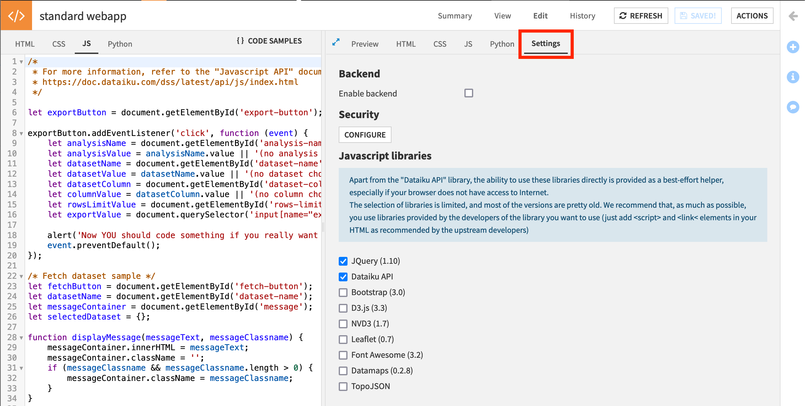
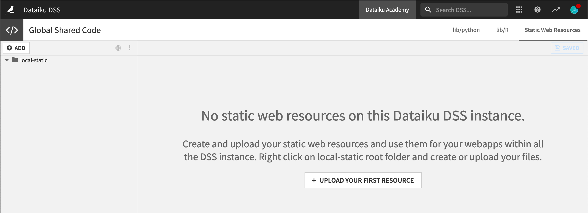

Use Custom Static Files (Javascript, CSS) in a Webapp
***********************************************************

.. meta::
  :description: Learn how to use custom Javascript and CSS libraries in a Dataiku webapp

In addition to the JavaScript or CSS you type in a `standard webapp <https://doc.dataiku.com/dss/latest/webapps/standard.html>`_, you may want to use certain code libraries.

Dataiku comes with some embedded standard JS libraries (jQuery, boostrap, etc). Just go to the "Settings" tab of the webapp editor to activate them.

If the library you are looking for is not available in Dataiku, a quick way to load it, if your library is already hosted, is to simply link from your HTML:

.. code-block:: html

  

Dataiku also has a "static" folder where you can place static content (JavaScript, CSS, images) that will be served by Dataiku and available to your webapps.

There are two ways to move files to that folder: 

- using the web interface or 
- using the command line.

Import Libraries using the Graphical Interface
================================================

If you have admin rights on your Dataiku instance, you can click on the Application menu near the top-right corner. Select **Global Shared Code** and navigate to the "Static Web Resources" tab on the right.

You can either create and edit files within Dataiku, or upload your files.

.. image:: assets/editor.png
  :alt: Dataiku screenshot of a sample file added to the Static Web Resources tab of the Global Shared Code page.
  :class: image-popup

Import Libraries using the Command Line
=========================================

If you have many files to import, you may want to use the command line. Here is how:

- Navigate to the `Dataiku Data Directory <https://doc.dataiku.com/dss/latest/operations/datadir.html>`_.
- Check for the presence of a ``local/static`` directory. Create it if needed. Inside a terminal, enter:

.. code-block::
  
  mkdir -p local/static

- Copy your static files into this directory. For instance, you might copy your team's CSS and JavaScript common files.

Using Static Files in your Webapp
======================================

Once they are in, you can use the static files from the HTML code of your webapp as in the following example. (Note that there is a '/' before "local").

.. code-block:: html

  <script type="text/javascript" src="/local/static/my-team.js" />
  <link rel="stylesheet" href="/local/static/my-team.css" />
  

That's it! You can now use your favorite Javascript or CSS libs in Dataiku!

.. tip::
  A word of further explanation: This works thanks to ``DATA_DIR/nginx/conf/nginx.conf``, which maps ``/local/static/`` to ``dss-data-dir/local/static/``.
