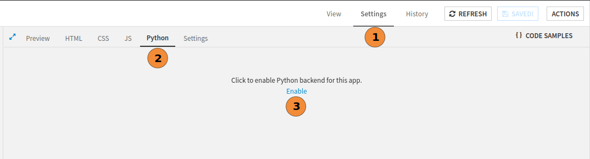
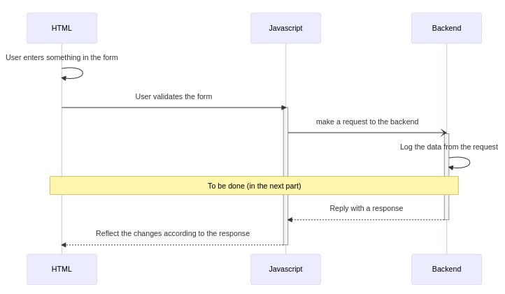

How to create a form for data input?
************************************

Context
#######

In this tutorial, we want to explain all the concepts used when we write a webapp for interacting with
Dataiku objects. This tutorial presents some fundamental concepts for writing
a webapp. Many of these concepts are not Dataiku concepts but are widely used concepts. Our "top -> bottom -> top"
approach lets you understand why you must do or modify the code. The provided code only covers some options for
writing a webapp. You will learn how to send a request from the frontend to the backend. You will also learn how to
deal with the backend's response.

Webapp creation
###############
* In the top navigation bar, go to **</> --> Webapps**.
* Click on **+ New webapp** on the top right, then select **Code webapp > Standard**, as shown in
  :ref:`Fig. 1<standard_form_to_submit_create_webapp>`.
* Select any template you want and give a name to your newly-created Webapp (for example, ``Simple form webapp``).

.. _standard_form_to_submit_create_webapp:

.. figure:: ../basics/assets/01-new-webapp.png
    :align: center
    :class: with-shadow image-popup
    :alt: Fig. 1: Creation of a standard web app.

    Fig. 1: Creation of a standard web app.

Once the webapp is open, click on the **Settings** tab, **Python**, and click on **Enable** as shown in Fig. 2, to
enable Python backend, we will use it later. Then, go to the **HTML** tab, and remove everything; we will construct the
form from the beginning. Do the same for the **CSS** and **JS** tabs. Go to the **Settings** tab and verify that the
``DataikuAPI`` and ``JQuery`` libraries are checked.

.. _standard_form_enable_python:

    Fig. 2: How to enable python backend.

First form creation
###################

HTML
^^^^

Now that we have an empty webapp, we can focus on the form creation. In HTML, a ``form`` is part of a document
containing interactive controls for submitting information. A form can have many inputs but only one output (the data).
In this tutorial, we will first focus on the processing, that is:

* create the form;
* retrieve the data from the javascript part;
* send the data to the backend;
* process the data on the backend.

Once the processing is finished, we will make the form more attractive by adding CSS.

To create a form, go to the HTML Tab, and copy :ref:`Code 1<standard_form_html_form>`.

.. code-block:: html
    :name: standard_form_html_form
    :caption: Code 1: First form
    :linenos:

    <form action="" method="" onsubmit="send_data(event)">
        <label for="name">Enter your name: </label>
        <input type="text" name="name" id="name" required />
        <input type="submit" value="Validate" />
    </form>

It is an elementary form, but we have many things to learn. On line 1, the ``form`` has three parameters:

* ``action``: represents the default URL that processes the form submission. A ``formaction``  attribute, for
  ``button`` or ``input``,  can override it. As Dataiku runs the webapp, we do not know in advance the
  running context (particularly the URL of the webapp), so we let it empty.
* ``method``: is the HTTP verb for sending the request to the URL defined in ``action``. This attribute can be omitted.
* ``onsubmit``: is a call to a javascript function (which will be defined after) for validating the form. We will use
  this function to process the form.

The ``for`` attribute of the ``label`` tag refers to the ``id`` attribute of another HTML tag; here, it is the text
input. It helps the user to select the input. If the user clicks on the input or the associated label text, the focus
will be on the input.

Javascript
^^^^^^^^^^
Now, go to the JS tab, and copy :ref:`Code 2<standard_form_js_send_data>`. This code defines the function ``send_data``
responsible for sending data to the python backend (line 1) and adds it to the HTML "scope." This function prevents the
default behavior of an HTML form submission (call to ``action``) in line 2. Lines 3--4 prepare the data needed for the
python backend call, and line 5 makes the request.

.. code-block:: javascript
    :name: standard_form_js_send_data
    :caption: Code 2: Javascript function to send data to the python backend
    :linenos:

    window.send_data = function (event) {
      event.preventDefault()
      param = makeRequestParam()
      let url = getWebAppBackendUrl('/first_form')
      fetch(url, param)
    }

    function getName () {
      return $('#name').val()
    }

    function makeRequestParam() {
      let data = {
        "name": getName()
      }
      return {
        "method": 'POST',
        "headers": {
          'Content-Type': 'application/json',
        },
        "body": JSON.stringify(data)
      }
    }

The function ``getName`` is a simple `JQuery <https://jquery.com/>`__ call to retrieve the value entered in the input
with the id: ``name``.

An HTTP request is composed of the following:

* A verb: one among the verbs: GET, POST, PUT, DELETE, PATCH, OPTIONS, CONNECT, TRACE, HEAD. For more about
  verb-defined semantics, please refer to
  `HTTP Request methods <https://developer.mozilla.org/en-US/docs/Web/HTTP/Methods>`__.
* A URL that identifies the resource we want to query.
* A content.

The function ``makeRequestParam`` retrieves the data and make a JSON Object with those data (line 13 -- 15). Then
it builds the complete parameter of the request sent to the python backend.

As we want to pass data to the python backend, we have to provide content with those data. We will use a JSON Object for
this purpose, so the content type should be ``application/json`` (line 19). The body of the request is the JSON object,
line 21.

The ``fetch`` function, line 5, is a native javascript function that easily handles HTTP requests over the network.

Backend (Python)
^^^^^^^^^^^^^^^^
Go to the **Python** tabs, and copy :ref:`Code 3<standard_form_python_backend>`.

.. code-block:: python
    :name: standard_form_python_backend
    :caption: Code 3: The very first version of the python backend
    :emphasize-lines: 11

    from flask import request
    import logging

    # Example:
    # As the Python webapp backend is a Flask app, refer to the Flask
    # documentation for more information about how to adapt this
    # example to your needs.
    # From JavaScript, you can access the defined endpoints using
    # getWebAppBackendUrl('first_api_call')

    @app.route('/first_form', methods=['POST', 'PUT'])
    def first_form():
        logging.info(request.get_json())
        return "ok"

The backend will run the associated function when it receives a request on the route ``/first-form`` with the verb
``PUT`` (or ``POST``). As the backend is a Flask application, it requires returning something. Usually,
we have to produce a response. For now, we return a string, which is not used, but this is enough for the
webapp to be able to work. We can now run the webapp and see that when a user enters something in the input and
validates it, the backend logs the input. To see the logs, go to the **Log** and click on the
"Refresh log" button. :ref:`Fig. 3<standard_form_webapp_workflow>` represents the webapp workflow, where solid
lines are the actual state of the form. And the dotted ones are the next steps for having a fully working form.

.. _standard_form_webapp_workflow:

    Fig. 3: Webapp workflow.

..
    .. mermaid::
        :align: center
        :alt: Webapp workflow.
        :caption: Fig. 3: Webapp workflow.

        sequenceDiagram
            HTML ->> HTML: User enters something in the form
            HTML ->> Javascript: User validates the form
            activate Javascript
            Javascript -) Backend: make a request to the backend
            activate Backend
            Backend ->> Backend: Log the data from the request
            note over HTML, Backend: To be done (in the next part)
            Backend -->> Javascript: Reply with a response
            deactivate Backend
            Javascript -->> HTML: Reflect the changes according to the response
            deactivate Javascript

Send back the response to the user interface
#############################################
Sometimes, we need to inform the user that the processing has ended. We could also give feedback to the
caller. That is why we should return a Response in the python backend once the process is finished.  An HTTP response
(and so the flask response) is composed of:

* A status code: for more about the status code, please refer to
  `HTTP Status code <https://developer.mozilla.org/en-US/docs/Web/HTTP/Status>`__ documentation.
* Possibly a body
* Some other standard parameters of HTTP.

In an ideal world, choosing the correct HTTP status code is as crucial as selecting the proper verb for the request.
There are two ways to complete a request: success or failure. The request should always succeed in our case,
as we are only logging data. So the response should indicate a success so we will choose the 200 status code.
:ref:`Code 4<standard_form_python_backend_v2>` is the new version of the python backend for sending a response
to the javascript part.

.. code-block:: python
    :name: standard_form_python_backend_v2
    :caption: Code 4: Python backend responding to a request.

    from flask import Response, request
    import logging
    import json

    @app.route('/first_form', methods=['POST', 'PUT'])
    def first_form():
        """
        Process the request sent from the frontend.

        :return: a response containing the data coming from the request.
        """
        request_body = request.get_json()
        logging.info(request_body)

        response = Response(response=json.dumps(request_body),
                            status=200,
                            mimetype='application/json')
        response.headers["Content-Type"] = "text/json; charset=utf-8"
        return response

Processing the response
#######################
The backend responds to the caller (the javascript code). As a consequence, we can provide some
feedback to the user. But before coding the javascript part, we need to understand the asynchronicity concept.
Asynchronous communication is like sending a mail to a teammate. The writer
sends a message. Then the recipient reads and responds to the message when available. Afterward, the requester
(the writer) can read the response when available. This is asynchronous communication. As nobody waits for
the other, they can go about their business. For HTTP requests/responses, it is the same. We have already seen how
to implement the recipient part (python backend) and how the writer sends a message (javascript part).

The function responsible for sending a request to the backend is the ``fetch`` function in the javascript code (line 5,
:ref:`Code 2<standard_form_js_send_data>`). This function implements a mechanism called
`promise <https://developer.mozilla.org/en-US/docs/Web/JavaScript/Reference/Global_Objects/Promise>`__, and promise
can be chained with the ``then (callbackSuccess, callbackFailure)`` method, which can also be chained with ``then``.
You can omit the ``callbackFailure``, either if you don't plan to handle the failure (which might not be a good
idea) or if you plan to address the overall miss with a ``catch(callbackFailure)``. We can write the callbacks with
`Arrow functions <https://developer.mozilla.org/en-US/docs/Web/JavaScript/Reference/Functions/Arrow_functions>`__,
which leads to elegant code to handle promises.

.. code-block:: javascript
    :name: standard_form_js_then_catch
    :caption: Code 5: How to handle promise in javascript.

    const promise = fetch(url, param)

    function displayResponseCode(response) {
        console.log(`Response Code: ${response.status}`)
    }

    // Handle both Success and Failure with then
    promise.then(displayResponseCode, displayResponseCode)

    // Alternatively
    promise
        .then(displayResponseCode)
        .catch(displayResponseCode)

As our backend returns JSON data, we need to retrieve them from the response using the
`json() <https://developer.mozilla.org/en-US/docs/Web/API/Response/json>`__ method, which produces a promise. So this
leads to :ref:`Code 6 <standard_form_js_response_handling_fn>`, more likely, to
:ref:`Code 7 <standard_form_js_response_handling>`.

.. code-block:: javascript
    :name: standard_form_js_response_handling_fn
    :caption: Code 6: Handling the response.

     window.send_data = function (e) {
      e.preventDefault()
      param = makeRequestParam()
      let url = getWebAppBackendUrl('/first_form')
      fetch(url, param)
        .then(extractJSON)
        .then(displayResponse)
        .catch((error) => console.log(error))
      return false
    }

    function extractJSON(response) {
      return response.json()
    }

    function displayResponse(response) {
      console.log(`JSON Response: ${JSON.stringify(response)}`)
    }

    // ...

.. code-block:: javascript
    :name: standard_form_js_response_handling
    :caption: Code 7: Handling the response (with explicit parameters).

     window.send_data = function (e) {
      e.preventDefault()
      param = makeRequestParam()
      let url = getWebAppBackendUrl('/first_form')
      fetch(url, param)
        .then((response) => extractJSON(response))
        .then((json) => displayResponse(json))
        .catch((error) => console.log(error))

      return false
    }

    function extractJSON(response) {
      return response.json()
    }

    function displayResponse(response) {
      console.log(`JSON Response: ${JSON.stringify(response)}`)
    }

    // ...

Giving feedback to the user
###########################

Finally, we can display feedback to the user.  Giving feedback to the user is done in two steps:

* Changing the initial HTML file to add a dedicated zone for feedback.
* Modifying the HTML from the javascript to reflect changes.

We will rely on the show()/hide() Jquery mechanism to give feedback to the user.
:ref:`Code 8<standard_form_html_with_feedback>` shows the slight modifications we make to enable feedback. The
``style="display: none;"`` prevents the ``p`` from being displayed. But the ``p`` element exists, so we can show it
as needed in the Javascript, :ref:`Code 9<standard_form_js_feedback>`, by modifying the ``displayResponse`` function.

.. code-block:: HTML
    :name: standard_form_html_with_feedback
    :caption: Code 8: HTML form with an element for feedback.

    <form action="" method="" onsubmit="send_data(event)">
        <label for="name">Enter your name: </label>
        <input type="text" name="name" id="name" required />
        <input type="submit" value="Validate"/>
    </form>

    

        User feedback
    

.. code-block:: Javascript
    :name: standard_form_js_feedback
    :caption: Code 9: Giving feedback to the user.

    function displayResponse(response) {
        let message = `The server respond ${JSON.stringify(response)}`
        $("#feedback").text(message).show()
    }

Make it more attractive
#######################

We will rely on the `Bootstrap library <https://getbootstrap.com/>`__ to make the form more attractive. A library
helps speed development and provides some friendly components without writing too many CSS lines. Add the bootstrap
library into your HTML, and then use it. :ref:`Code 10<standard_form_html_with_bootstrap>` is one possible use of
this library.

.. code-block:: HTML
    :name: standard_form_html_with_bootstrap
    :caption: Code 10: A form using bootstrap

    <link href="https://cdn.jsdelivr.net/npm/bootstrap@5.3.0-alpha1/dist/css/bootstrap.min.css" rel="stylesheet" integrity="sha384-GLhlTQ8iRABdZLl6O3oVMWSktQOp6b7In1Zl3/Jr59b6EGGoI1aFkw7cmDA6j6gD" crossorigin="anonymous">
    

    

        <form action="" method="" onsubmit="send_data(event)">
            

                <label for="name" class="form-label">Enter your name: </label>
                <input type="text" class="form-control" name="name" id="name" required />
            

            <button type="submit" class="btn btn-primary">Validate</button>
        </form>

        

          

            

              <strong class="me-auto">Dataiku webapp -- Simple form</strong>
              <button type="button" class="btn-close" data-bs-dismiss="toast" aria-label="Close"></button>
            

            

              Hello, world! This is a toast message.
            

          

        

    

.. code-block:: javascript
    :name: standard_form_js_with_bootstrap
    :caption: Code 11: Changing the javascript to use "Toast"

    ...
    const toastLiveExample = document.getElementById('liveToast')

    function displayResponse(response) {
        let message = `The server respond ${JSON.stringify(response)}`
        const toast = new bootstrap.Toast(toastLiveExample)
        $("#feedback").text(message)
        toast.show()
    }
    ...

Do something interesting with the backend
#########################################

We will use the form to append data to an existing dataset. The backend is responsible for the processing. So we
need to modify the backend to add the data sent by the frontend. Read the **existing** dataset, add a row to this
dataset, and write the result. There are many ways to do that; :ref:`Code 12<standard_form_python_add_data>` is an
example of how to process to add data to an existing dataset.

.. code-block:: python
    :name: standard_form_python_add_data
    :caption: Code 12: Adding data to a dataset

    import dataiku
    import pandas as pd
    from flask import Response, request
    import logging
    import json

    @app.route('/first_form', methods=['POST', 'PUT'])
    def first_form():
        """
        Process the request sent from the frontend.

        :return: a response containing the data coming from the request.
        """
        request_body = request.get_json()
        resp = add_json_to_dataset(request_body)

        response = Response(response=json.dumps(resp),
                            status=resp['status'],
                            mimetype='application/json')
        response.headers["Content-Type"] = "text/json; charset=utf-8"
        return response

    def add_content_to_dataset(name, json):
        """
        Add a new row in JSON format to an existing data.
        :param name: Name of the dataset.
        :param json: Value to append.
        """
        dataset = dataiku.Dataset(name)
        df = dataset.get_dataframe()
        df = df.append(json, ignore_index=True)
        logging.info(df.head())
        dataset.write_dataframe(df)

    def add_json_to_dataset(json):
        """
        Add a row to a dataset, only if the dataset exists.
        :param json: Value to add.
        :return: a dict representing the result of the addition.
        """

        # This could be a part of data sent by the frontend.
        dataset_name = "mydataset"
        client = dataiku.api_client()
        project = client.get_default_project()
        dataset = project.get_dataset(dataset_name)
        if dataset.exists():
            add_content_to_dataset(dataset_name, json)
            return {'status': 200, 'name': json.get('name', '')}
        else:
            return {'status': 400, 'reason': "Dataset {} does not exist".format(dataset_name)}

Conclusion
##########
We have a complete webapp that creates a form and sends data to the backend. The backend can handle the
request and appends data to an existing dataset. We also introduce the usage of an external library for the layout.
Although the application is functional, many things are left to the reader, like:

* Better error handling (both in the frontend part and the backend);
* Entire form;
* Smarter processing.

However, we have covered and explained all the required parts to create a web application for interacting
with Dataiku objects.

Here are the complete versions of the code presented in this tutorial:

.. dropdown:: HTML Code

    .. literalinclude:: ./assets/code.html
        :language: html

.. dropdown::  JS Code

    .. literalinclude:: ./assets/code.js
        :language: javascript

.. dropdown::  Python Code

    .. literalinclude:: ./assets/code.py
        :language: python
