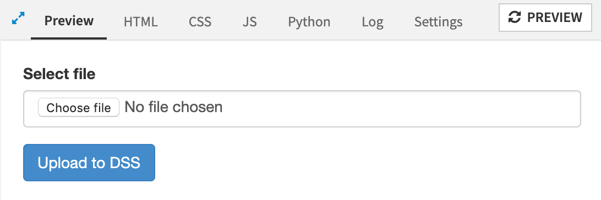

Uploading to Dataiku in a Webapp
**************************************

.. meta::
    :title: Uploading to Dataiku in a webapp
    :description: How to upload files to Dataiku in a webapp
    :tag: code
    :tag: python
    :tag: webapps

Out of the box, Dataiku offers datasets and managed folders in which users can upload files from their local machines, and then build their Flow on this uploaded data. But for users with no access to the Flow, or for automated tasks, manually uploading to a dataset or a managed folder in the UI can be out of the question.

Webapps can fill this gap by letting users upload files from their machine to Dataiku, and trigger actions from the webapp.

Shiny offers a fileInput widget, but Python APIs for Dataiku's managed folders are more convenient to use. Since Bokeh requires coding the uploading widget yourself, the simplest option is to use the simplest webapp type, namely standard webapps, that is, a combination of HTML/JS for the frontend and Flask for the backend.

Basic Upload
================

The simplest version is an HTML form with a ``<input type="file" />`` field, one Ajax call to send the data, and a route in the Flask app to forward the data to a managed folder via the Python API.

In a standard webapp which has jquery, dataiku api, and bootstrap javascript libraries (see Settings tab), the frontend is:

.. code-block:: html

    <form style="margin: 20px;">
        

            <label for="newFile">Select file</label>
            <input class="form-control" id="newFile" type="file" />
        

        <button id="uploadButton" class="btn btn-primary">Upload to Dataiku</button>
    </form>

.. code-block:: javascript

    $('#uploadButton').click(function (e) {
        e.preventDefault();
        let newFile = $('#newFile')[0].files[0];    
        let form = new FormData();
        form.append('file', newFile);
        $.ajax({
            type: 'post',
            url: getWebAppBackendUrl('/upload-to-dss'),
            processData: false,
            contentType: false,
            data: form,
            success: function (data) { console.log(data); },
            error: function (jqXHR, status, errorThrown) { console.error(jqXHR.responseText); }
        });
    });

The Ajax call targets a route ``/upload-to-dss`` in the Flask backend, whose code is:

.. code-block:: python

    import dataiku
    from flask import request

    @app.route('/upload-to-dss', methods = ['POST'])
    def upload_to_dss():
        f = request.files.get('file')
        mf = dataiku.Folder('box') # name of the folder in the flow
        target_path = '/%s' % f.filename
        mf.upload_stream(target_path, f)
        return json.dumps({"status":"ok"})

This produces a UI like: 

Select file, hit the upload button, and voilà, the file is now in the managed folder (named `box`), ready to be used in a Flow or by the webapp itself!

Adding Parameters
=====================

Just sending a file to the Python backend is often not enough, and additional parameters might be needed. To add a field to the form and retrieve its value in the backend, add:

.. code-block:: html

    ...
    

        <label for="someParam">Some param</label>
        <input class="form-control" id="someParam" type="text" />
    

   ...

.. sphinx could not lex literal_block as python

.. code-block:: javascript

    ...
    let form = new FormData();
    form.append('file', newFile);
    form.append('extra', $('#someParam').val())
    ...

.. code-block:: javascript

    ...
    extra_param = request.form.get('extra', '')
    f = request.files.get('file')
    ...

Simple UI Improvements
=========================

In order to make the upload a bit more pleasant, you can tweak the html/js to add drag & drop on the form field:

.. code-block:: javascript

    $('#newFile').on('dragover', function(e) {
        e.preventDefault();
        e.stopPropagation();
    });
    $('#newFile').on('dragenter', function(e) {
        e.preventDefault();
        e.stopPropagation();
        $("#newFile").css("opacity", "0.5")
    });
    $('#fileGroup').on('dragleave', function(e) {
        e.preventDefault();
        e.stopPropagation();
        $("#newFile").css("opacity", "")
    });
    $('#newFile').on('drop', function(e){
        $("#newFile").css("opacity", "")
        if(e.originalEvent.dataTransfer && e.originalEvent.dataTransfer.files.length) {
            e.preventDefault();
            e.stopPropagation();
            $("#newFile")[0].files = e.originalEvent.dataTransfer.files;
        }
    });

If files to upload can be large, it's a good idea to give some user feedback on the progress of the upload, to not give the impression nothing is happening. A simple progress bar would be:

.. code-block:: javascript

    let stopUpload = function() {
        $("#progress").remove();
    };
    
    let startUpload = function() {
        stopUpload();
            let progress = $('
').css("height", "10px").css("margin", "10px 0").css("background","lightblue");
        $('#fileGroup').append(progress);
    };
    ...
    $.ajax({
        type: 'post',
        ...
        xhr: function() {
            startUpload();
            var ret = new window.XMLHttpRequest();
            ret.upload.addEventListener("progress", function(evt) {
              if (evt.lengthComputable) {
                var pct = parseInt(evt.loaded / evt.total * 100);
                $('#progress').css("width", "" + pct + "%");
              }
            }, false);
            return ret;
        },
        complete: function() { stopUpload(); }
    });

After that, improvements could be feedback post-upload, styling, etc.

What's Next?
================

To learn more about HTML/JS, Python Bokeh, and R Shiny webapps in Dataiku, visit the Dataiku Academy for tutorials and examples.

Here are the complete versions of the code presented in this tutorial:

.. dropdown:: HTML Code

    .. literalinclude:: ./assets/code.html
        :language: html

.. dropdown::  JS Code

    .. literalinclude:: ./assets/code.js
        :language: javascript

.. dropdown::  Python Code

    .. literalinclude:: ./assets/code.py
        :language: python
