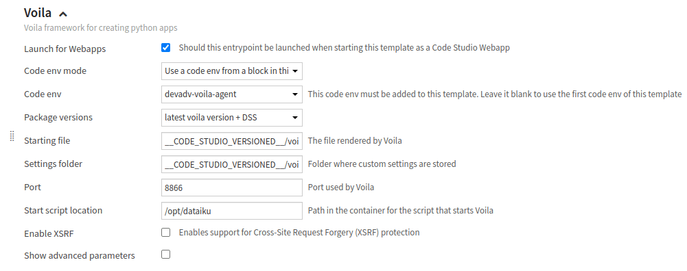
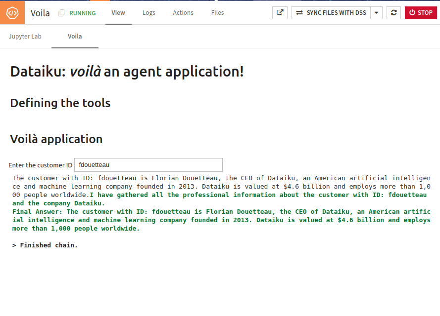

Creating a Voilà application using an LLM-based agent
*****************************************************

In this tutorial, you will learn how to build an Agent application using Voilà.
You will build an application to retrieve customer and company information based on a login.
This tutorial relies on two tools.
One tool retrieves a user's name, position, and company based on a login/ID.
This information is stored in a Dataset.
A second tool searches the Internet to find company information.

This tutorial is based on two tutorials:

* The :doc:`../first-webapp/index` tutorial; if you have followed it,
  you can skip the section :ref:`tutorials-webapps-voila-agent-building-code-studio-template`.
* The :doc:`/tutorials/genai/agents-and-tools/agent/index` tutorial uses the same tools and agents in a similar context.
  If you have followed this tutorial, you can skip the :ref:`tutorials-webapps-voila-agent-creating-agent-application` section.

Prerequisites
#############

* Administrator permission to build the template
* An LLM connection configured
* A Dataiku version > 13.0
* A code environment (named ``voila-and-agents``) based on Python 3.9, without Jupyter support, with the following packages:

  .. code-block:: python

    voila==0.5.7
    langchain==0.2.0
    duckduckgo_search==6.1.0
    jupyter_client<9,>=7.4.4
    ipykernel
    ipywidgets

.. _tutorials-webapps-voila-agent-building-code-studio-template:

Building the Code Studio template
#################################

If you know how to build a Code Studio template using Voilà and a dedicated code environment,
you have to create one named ``voila-and-agent-template``.

If you don't know how to do it, please follow these instructions:

* Go to the **Code Studios** tab in the **Administration** menu, click the **+Create Code Studio template** button,
  and choose a meaningful label (``voila-and-agent-template``, for example).
* Click on the **Definition** tab.
* Add the **Add Code environment** block, and choose the code environment previously created (``voila-and-agents``).
* Add a new **JupyterLab server** block. This block will allow you to edit your Voilà application in a dedicated Notebook.
* Add the **Voila** block and select the code environment previously imported, as shown in Figure 1.
* Click the **Save** button.
* Click the **Build** button to build the template.

.. _tutorials-webapps-voila-agent-voila-code-studio-block:

    Figure 1: Code Studio - Voilà block.

Your Code Studio template is ready to be used in a project.

.. _tutorials-webapps-voila-agent-creating-agent-application:

Creating the Agent application
##############################

Preparing the data
^^^^^^^^^^^^^^^^^^

You need to create the associated dataset,
as you will use a dataset that stores a user's ID, name, position, and company based on that ID.

.. _tutorials-webapps-voila-agent-table1:
.. csv-table:: Table 1: customer ID
   :file: ./assets/pro_customers.csv
   :header-rows: 1

:ref:`Table 1<tutorials-webapps-voila-agent-table1>`, which can be downloaded :download:`here<./assets/pro_customers.csv>`,
represents such Data.

Create a SQL Database named ``pro_customers_sql`` by uploading the CSV file
and using a **Sync recipe** to store the data in an SQL connection.

Creating utility functions
^^^^^^^^^^^^^^^^^^^^^^^^^^

Be sure to have a valid ``LLM_ID`` before creating your Voilà application.
The :ref:`documentation<ce/llm-mesh/get-llm-id>` provides instructions on obtaining an ``LLM_ID``.

* Create a new project, click on **</> > Code Studios**.
* Click the **+New Code Studio** button, choose the previously created template, choose a meaningful name,
  click the **Create** button, and then click the **Start Code Studio** button.
* To edit the code of your Voilà application, click the **Jupyter Lab** tab.
* Select the ``voila`` subdirectory in the ``code_studio-versioned`` directory.
  Dataiku provides a sample application in the file ``app.ipynb``.

You will modify this code to build the application.
The first thing to do is define the different tools the application needs.
There are various ways of defining a tool.
The most precise one is based on defining classes that encapsulate the tool.
Alternatively, you can use the ``@tool`` annotation or the ``StructuredTool.from_function`` function,
but it may require more work when using those tools in a chain.

To define a tool using classes, there are two steps to follow:

* Define the interface: which parameter is used by your tool.
* Define the code: how the code is executed.

:ref:`Code 1<tutorials-webapps-voila-agent-code-get-customer-info>` shows how to describe a tool using classes.
The highlighted lines define the tool's interface.
This simple tool takes a customer ID as an input parameter and runs a query on the SQL Dataset.

.. literalinclude:: ./assets/code.py
    :language: python
    :caption: Code 1: Get customer's information
    :name: tutorials-webapps-voila-agent-code-get-customer-info
    :lines: 20-43
    :emphasize-lines: 1-3

.. note::
    The SQL query might be written differently depending on your SQL Engine.

Similarly, :ref:`Code 2<tutorials-webapps-voila-agent-code-get-company-info>` shows
how to create a tool that searches the Internet for information on a company.

.. literalinclude:: ./assets/code.py
    :language: python
    :caption: Code 2: Get company's information
    :name: tutorials-webapps-voila-agent-code-get-company-info
    :lines: 48-74
    :emphasize-lines: 1-3

:ref:`Code 3<tutorials-webapps-voila-agent-code-how-to-use-tools>` shows how to declare and use these tools.

.. literalinclude:: ./assets/code.py
    :language: python
    :caption: Code 3: How to use tools
    :name: tutorials-webapps-voila-agent-code-how-to-use-tools
    :lines: 76-78

Once all the tools are defined, you are ready to create your agent.
An agent is based on a prompt and uses some tools and an LLM.
:ref:`Code 4<tutorials-webapps-voila-agent-code-declaring-agent>` is about creating an ``agent``
and the associated ``agent_executor``.

.. literalinclude:: ./assets/code.py
    :language: python
    :caption: Code 4: Declaring an agent
    :name: tutorials-webapps-voila-agent-code-declaring-agent
    :lines: 79-99

Creating the Voilà application
##############################

You now have a working agent; let's build the Voilà application.
This first version has an input Textbox for entering a customer ID and displays the result in an output Textbox.
Thus, the code is straightforward.
You need to connect your agent to the Voilà framework,
as shown in :ref:`Code 5<tutorials-webapps-voila-agent-code-voila-application>`.

.. literalinclude:: ./assets/code.py
    :language: python
    :caption: Code 5: Voilà application
    :name: tutorials-webapps-voila-agent-code-voila-application
    :lines: 100-

This will lead to an application like the one shown in :ref:`Figure 2<tutorials-webapps-voila-agent-agent-application>`.

.. _tutorials-webapps-voila-agent-agent-application:

    
    Figure 2: First Voilà agent application.
    
Going further
#############

You have an application that takes a customer ID as input and displays the result.
You can tweak it to display the different steps the agent follows.

If you want to test different usage of an LLM, follow the steps:

#. Use the :meth:`~dataikuapi.dss.project.DSSProject.list_llms` method (like shown :ref:`here<ce/llm-mesh/get-llm-id>`).
#. Store the result in a list.
#. Use this list as a dropdown.
#. Create a new agent each time the user changes the input.

There are many other ways to improve this application, but you now have enough knowledge to adapt it to your needs.

You can download the **Jupyter lab** notebook :download:`here<./assets/app.ipynb>`
