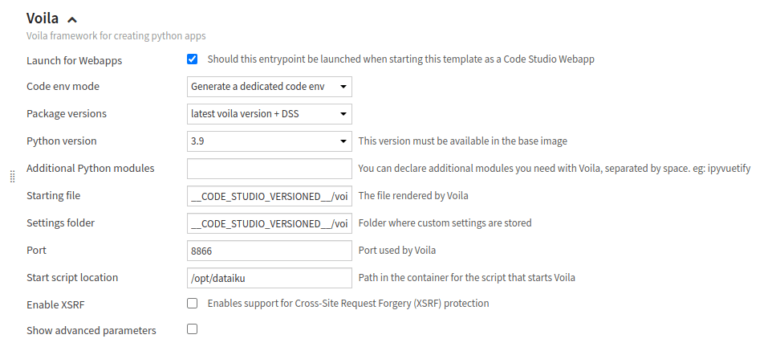
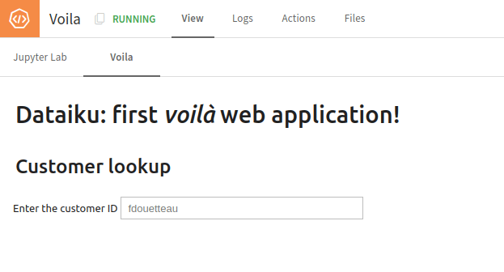

Voilà: your first web application
**********************************

In this tutorial, you will learn how to build your first Voilà web application.
To be able to create a Voilà application,
you will first need to configure a Code Studio template and then code your application using this application.
Once the application is designed, you can publish it as a web application.

Prerequisites
#############

* Dataiku >= 13.0
* Administrator permission to build the template

Building the Code Studio template
#################################

* Go to the **Code Studios** tab in the **Administration** menu,
  click the **+Create Code Studio template** button, and choose a meaningful label (``voila_template``, for example).
* Click on the **Definition** tab.
* Add a new **JupyterLab server** block.
  This block will allow you to edit your Voilà application in a dedicated Code Studio.
* Add a new **Voila** block, and
    * Choose **Generate a dedicated code env** for the **Code env mode**
    * Choose **latest voila version + DSS** for the **Package versions**
    * Choose **3.9** for the **Python versions**

  as shown in :ref:`Figure 1<webapp-voila-first-webapp-code-studio-voila-block>`.
* Click the **Save** button.
* Click the **Build** button to build the template.

.. _webapp-voila-first-webapp-code-studio-voila-block:

    Figure 1: Code Studio -- Voila block.

Your Code Studio template is ready to be used in a project.
If you need a specific configuration for a block, please refer to
:doc:`the documentation<refdoc:code-studios/index>`.

Creating a new Voilà application
#################################

Before creating your Voilà application, you must download :download:`this CSV file<assets/pro_customers.csv>`,
upload it to your instance, and use a **Sync recipe** to create an **SQL** Dataset named ``pro_customers_sql``.

* Create a new project, click on **</> > Code Studios**.
* Click the **+New Code Studio**, choose the previously created template, choose a meaningful name,
  click the **Create** button, and then click the **Start Code Studio** button.
* To edit the code of your Voilà application, click the **Jupyter Lab** tabs.
* Select the ``voila`` subdirectory in the ``code_studio-versioned`` directory.
  Dataiku provides a sample application in the file ``app.ipynb``.
* Select the ``DSS Codeenv - pyenv-voila`` kernel. This step is not mandatory,
  as the voilà application will use the kernel defined in the code studio template.
  It just helps you to debug your application. To select the correct kernel,
  click on the Kernel menu (in the **Jupyter Lab** tab), choose **Change Kernel...**, and select the kernel.
* Replace the provided code with the code shown in
  :ref:`Code 1<webapps_voila_first_webapp_code>`.
* If everything goes well, you should have a running Voilà application like the one shown in
  :ref:`Figure 2<webapps_voila_first_webapp_voila_application>`

.. literalinclude:: ./assets/app.py
    :language: python
    :caption: Code 1: First Voilà application
    :name: webapps_voila_first_webapp_code

.. _webapps_voila_first_webapp_voila_application:

    Figure 3: First Voilà application.

Wrapping up
###########

You now have a running Voilà application.
You can customize it a little to fit your needs.
When happy with the result, click the **Publish** button in the **right panel**.
Then, your Voilà application is available for all users who can use it without running the Code Studio.

You can download the **Jupyter lab** notebook :download:`here<./assets/app.ipynb>`

