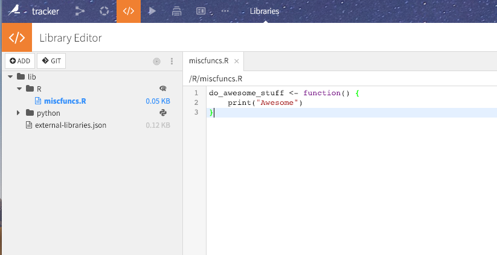

Reusing R code
################

.. contents::
	:local:

When you write a lot of R code in a project, or across projects, you will often want to make reusable parts of code.

DSS provides several mechanisms for reusing R code:

* Packaging your code as functions or modules, and making them available in a specific project
* Importing code that has been made available from one project to another
* Packaging your code as functions or modules, and making them available in all projects
* Packaging your code as a reusable plugin, and making it available for coder and non-coder users alike

Sharing R code within a project
=====================================

In each project, you can write R files in the **Library editor**. The project's library editor is available by going into the "Code" universe (orange), and selecting the "Libraries" tab.

You can then write code under a "R source" folder, i.e. a folder that has the "R" icon associated to it.

Each time you want to use the functions defined in these R files, you need to use the ``dkuSourceLibR`` function, which uses the ``source`` feature of R to import the functions in the global namespace.

For example if you wrote a file "miscfuncs.R" that contains a ``do_awesome_stuff()`` function, you can use:

.. code-block:: R

	library(dataiku)

	dkuSourceLibR("miscfuncs.R")

	do_awesome_stuff()

Working with multiple source folders
--------------------------------------

By default, the Library editor contains two top-level folders, "python" and "R", which are respectively the root folder for Python and R code.

You can create other folders that will also act as R source folders, i.e. that will be available using ``dkuSourceLibR`` to all R processes running in the project.

Working with multiple source folders is mainly useful when :doc:`importing code from external Git repositories </collaboration/import-code-from-git>`.

To manually edit the list and order of the R source folders, open the ``external-libraries.json`` file in the library editor and edit the ``rsrcPath`` list. All paths must be relative to the root of the library editor.

Importing libraries from other projects
=========================================

If you have created libraries in a project A, you can import them in project B. The libraries of project A will be added to the source path of all code running in project B.

* Go to the library editor of project B
* Open the ``external-libraries.json`` file
* Edit the ``importLibrariesFromProjects`` list and add the project key (which appears in the URL, i.e. not the project display name) to it
* Save the ``external-libraries.json`` file

You need to have "Read project content" permission on A and "write project content" on B.

Sharing R code globally
========================

You can write custom R code files in the global **R library editor**.
The global R library editor is available from the **Application menu > Global Shared Code**.

.. image:: /python/img/global-shared-code.png

The click on the "lib/R" tab

Files that are written here can be used by all R code in all projects.

Each time you want to use the functions defined in these R files, you need to use the ``dkuSourceLibR`` function, which uses the ``source`` feature of R to import the functions in the global namespace.

For example if you wrote a file "miscfuncs.R" that contains a ``do_awesome_stuff()`` function, you can use:

.. code-block:: R

	library(dataiku)

	dkuSourceLibR("miscfuncs.R")

	do_awesome_stuff()

Permissions
------------

You need the "Edit lib folders" global (group-level) permission to use the global R library editor.

Manual editing of the R code library folder
================================================

Although not recommended, if you have shell access to the DSS machine, you can modify the library folder directly in ``DATA_DIR/lib/R``

Packaging code as plugins
==========================

See :doc:`/plugins/index`

Packaging your R code as a package
===================================

The source mechanism is practical but does not enforce namespacing. To get namespacing, you need to build a complete R package, compile it, and install it (possibly in the code environment) using ``install.packages``. This generally requires shell access on the machine running DSS.
