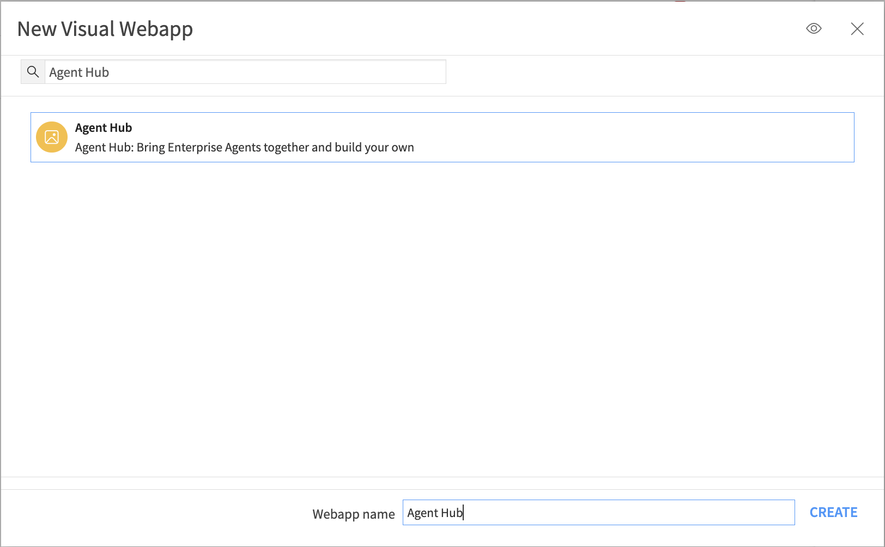
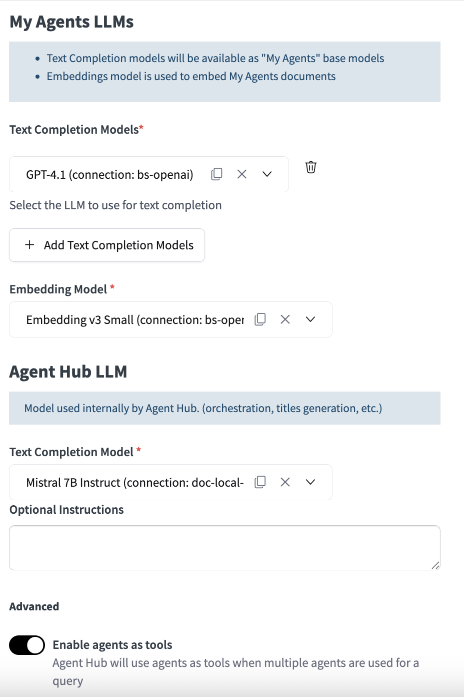
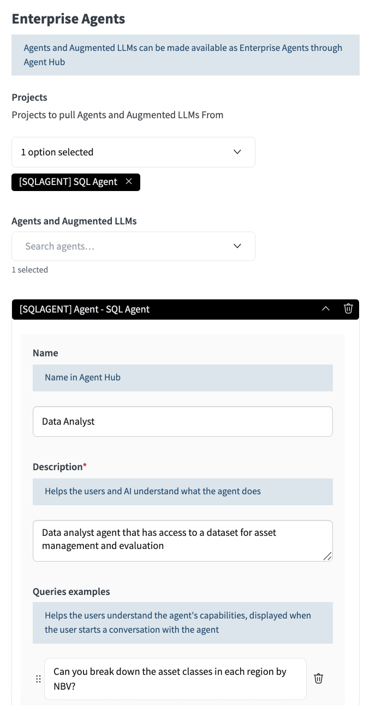
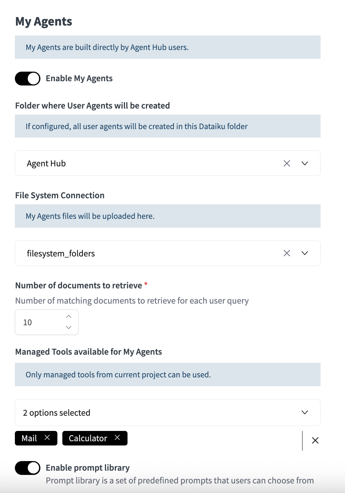
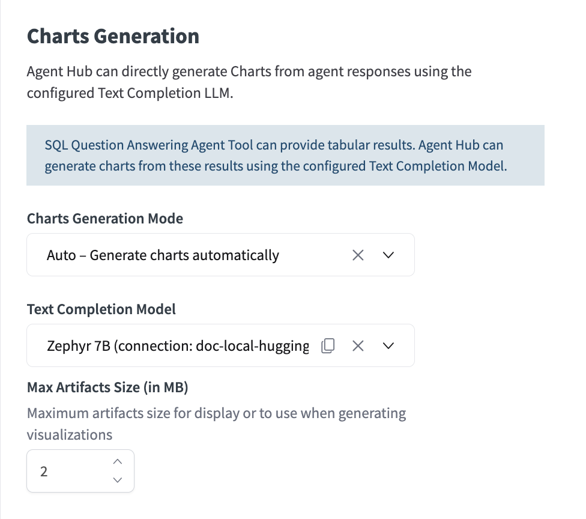
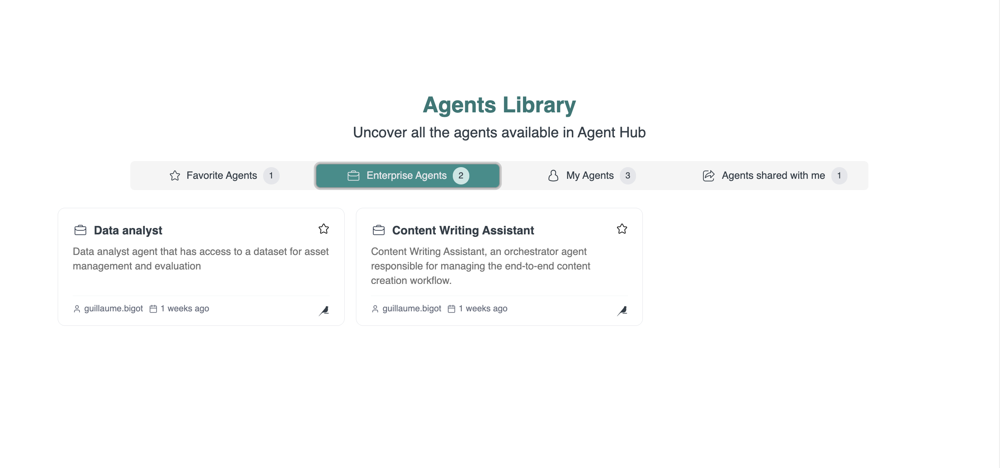
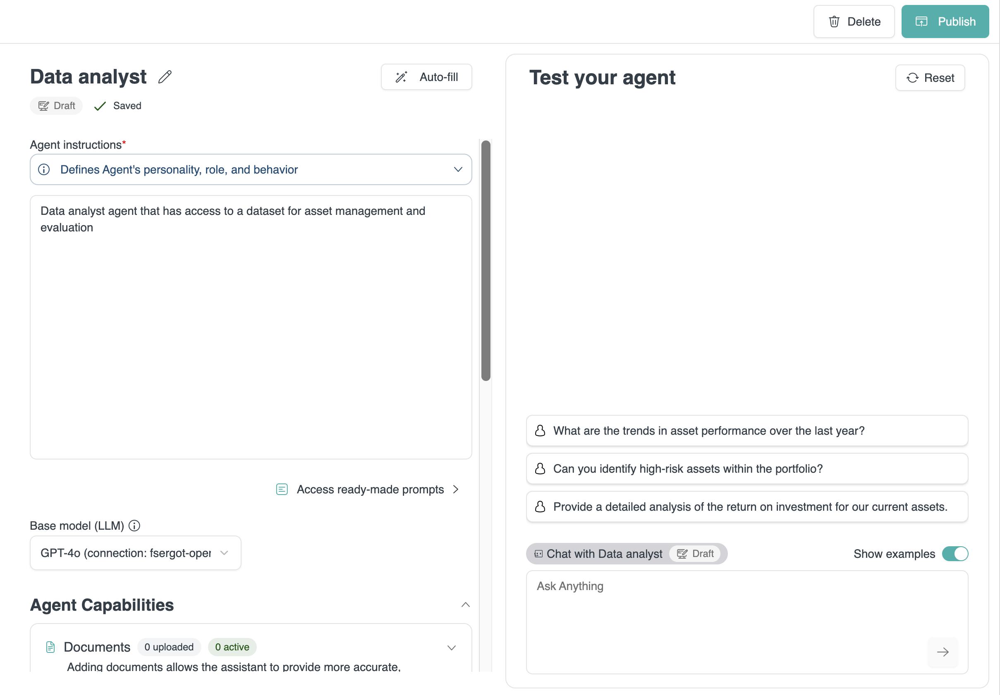
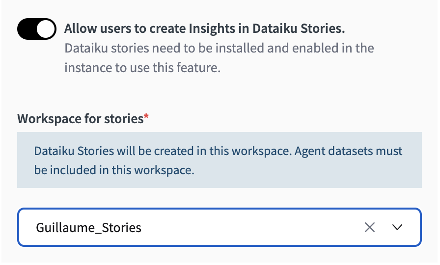

Agent Hub
##############

.. contents::
   :local:
   :depth: 2

Overview
--------

**Agent Hub** is the central portal for organizations to distribute enterprise-level agents, manage access, and empower users to build their own custom agents.

Agent Hub is a Dataiku webapp.

It allows users to access a library of AI agents and leverage a single agent or orchestrate multiple agents simultaneously through a unified chat interface.

**Key Features**

-  | **Centralized Agent Library**: Access from your browser a curated list of purpose-built agents built and selected by your AI experts and SMEs
-  | **Multi-Agent Orchestration**: Chat with multiple agents in a single conversation. The hub intelligently routes queries to the most relevant agent(s).
-  | **User-Built Agents**: Empower end-users to quickly create their own "My Agents" for personal productivity.
-  | **Governance and Control**: configure which enterprise agents, LLMs, and tools are available within a hub, ensuring control over usage.
-  | **Response Transparency**: View detailed sources, activities, and downloads for each agent response to understand how an answer was generated.

Getting Access
---------------

To use Agent Hub, a Dataiku instance administrator must first install the **Agent Hub plugin** from the plugin store. The administrator also needs to set up the associated code environment. Once installed, the Agent Hub template becomes available as a **Visual Webapp** that can be created within any Dataiku project.

|NewAgentHubWebapp|

Configuration
-------------

Requirements
~~~~~~~~~~~~
To successfully set up and use an Agent Hub, the following prerequisites are necessary:

* **Dataiku Version**: ``Dataiku 14.2`` or later. The Last Dataiku version is always the best choice to leverage the latest plugin capabilities fully.
* **User Profile**: You must have a ``Full Designer`` profile with rights to create projects and impersonate certain user groups to build and configure an Agent Hub with all functionalities. Users with ``AI Consumer`` or ``AI Access`` profiles can use a hub that has been shared with them.
* **LLM Connections**: A connection to at least one Generative AI model that supports **tool calling** and one that supports **embedding**. These are configured by an administrator in ``Administration > Connections``.

Initial Setup
~~~~~~~~~~~~~
Agent Hub is created as a visual webapp within a Dataiku project.

.. note::
   While you can build the hub in the same project as your agents, it is recommended to create the Agent Hub in a separate project. This simplifies access management and oversight.

1. From your project, navigate to the **Code** menu and select **Webapps**.
2. Click ``+ New Webapp`` and choose ``Visual webapp``.
3. Select the ``Agent Hub`` template from the list.

Webapp Settings
~~~~~~~~~~~~~~~
Once created, you can configure the hub from its ``Edit`` page. This page contains several sections to customize the hub's functionality and available resources.

LLMs - Mandatory
^^^^^^^^^^^^^^^^
The hub requires three LLM connections to function correctly. These are the only mandatory settings.

* **Text Completion Models**: Select at least one model that users can leverage when creating their own "My Agents".
* **Embedding Model**: Select at least one model for embedding documents uploaded by users for their "My Agents".
* **Agent Hub LLM**: Select a text completion model that the hub will use internally for orchestration tasks, such as deciding which agent to call in a multi-agent conversation. It is recommended to use a model that supports tool calling.
* **Optional Instructions**: You can optionally add a system prompt that will be used by the orchestrating LLM.

|AgentHubLLMConfig|

Enterprise Agents
^^^^^^^^^^^^^^^^^
This section allows you to add pre-built, governed agents to the hub.

1. Under ``Projects``, search for and select the Dataiku project(s) containing the agents you want to include.
2. From the ``Agents and Augmented LLMs`` dropdown, choose the specific agents to add.
3. For each agent, you can configure the following:
    * ``Name``: A user-friendly display name.
    * ``Description (Mandatory)``: A detailed description of the agent's capabilities and purpose. This will be used by the hub's orchestrating LLM to understand when to call this agent.
    * ``Queries examples``: Sample questions that demonstrate how to use the agent.

|AgentHubEnterpriseAgents|

My Agents
^^^^^^^^^
Configure the settings for user-created agents.

* ``Enable My Agents``: Toggle this option to allow users to create their own agents within the hub.
* ``Folder where User Agents will be created``: Optionally specify a managed folder for storing agent configurations.
* ``File System Connection``: Choose a connection where documents uploaded by users will be stored. This connection must allow the creation of managed folders.
* ``Managed Tools available for My Agents``: Select managed tools from current project that users can enable for their agents. 
* ``Enable prompt library``:  Set of predefined prompts that users can choose from when creating their agents.

|AgentHubMyAgents|

Charts Generation
^^^^^^^^^^^^^^^^^
Agent Hub can directly generate Charts from agent responses using the configured Text Completion LLM.

* ``Charts Generation Mode``: 
    * Select ``None - Disable charts generation`` if this functionality is not needed. Else, charts will be generated using SQL artefacts of agents. 
    * Select ``On Demand - Let end users generate charts``, lets users decide when to generate charts and what type.
    * Select ``Auto - Generate charts automatically``, automatically generates charts whenever the agent's response includes SQL artefacts. The text completion model automatically chooses the type of graph based on the user query.
* ``Text Completion Model``: Choose an LLM connection to power chart generation if it is enabled.

|AgentHubCharts|

Backend
^^^^^^^
Define the execution settings for the webapp.

* ``Auto-start backend``: Check this box to ensure the hub is running automatically.
* ``Container``: Select ``None - Use backend to execute``.

Setting up integrations with Stories and Traces Explorer
~~~~~~~~~~~~~~~~~~~~~~~~~~~~~~~~~~~~~~~~~~~~~~~~~~~~~~~~

Traces explorer
^^^^^^^^^^^^^^^

On top of in-app traces of tool/agent calls, comprehensive trace can be viewed using the integration with :doc:`Trace Explorer</agents/tracing>`. To use this integration, you must:

1. Ensure that the ``Traces Explorer`` plugin is installed on your Dataiku instance.
2. Create a Trace Explorer webapp in a project
3. In Administration > Settings > LLM Mesh, set the default Trace Explorer webapp to the one you just created.

The button to navigate to Trace Explorer will then appear in See details > Activities. 

Stories
^^^^^^^
When looking to generate quick visualizations from data, users can leverage in-chat chart generation. For more complex data storytelling, users can navigate to :doc:`Stories</stories/index>` for analyses in visual slides that support quality decision-making. To do enable this, you must:

1. Ensure that you have a workspace correctly set up with the datasets you want to use.
2. In Edit > Enterprise Agents, toggle ``Allow users to create Insights in Dataiku Stories`` and select the workspace where the stories will be created.

Navigating to Stories will automatically be available in the chat interface when the agent response includes SQL artefacts.

Using Agent Hub
---------------

Agents Library
~~~~~~~~~~~~~~
The Agent Hub interface organizes all available agents into four categories:

* **Enterprise Agents**: Governed agents distributed by designers for wide use.
* **My Agents**: Agents you have created for your own productivity tasks.
* **Agents Shared with Me**: "My Agents" that other users have shared with you.
* **Favorite Agents**: Any agent you have marked with a star for quick access.

|AgentHubLibrary|

Conversations with Agents
~~~~~~~~~~~~~~~~~~~~~~~~~

You can start a conversation from the homepage or by selecting an agent. The hub's orchestrator manages the conversation based on the agent(s) selected.

* **Single agent**: The query is passed directly to the selected agent.  
* **Multiple agents**:  The hub's orchestrating LLM evaluates which agent is best suited to answer the query and calls it. Users can manually add or remove agents during the conversation.
* **No agent selected**: The orchestrating LLM evaluates all available agents and selects the most relevant one(s) to answer the query.

All conversations are saved in the left panel, where you can rename, delete, or revisit them.

Building "My Agents"
~~~~~~~~~~~~~~~~~~~~

Users with the appropriate permissions can create their own agents directly within the hub.

1. Click ``Create new agent``.
2. Provide detailed ``Agent instructions`` in the prompt window or use a template from the ``Prompt library``.
3. Under ``Agent Capabilities``, upload ``Documents`` to provide the agent with specific knowledge. Dataiku automatically embeds these documents. Add ``Tools`` to let the agent perform actions or access external services.
4. Manually fill or use the ``Autofill`` button to generate an ``Agent Overview``, to provide an agent description and optionally some example queries.
5. **Test** your agent in the chat window and click ``Publish`` when you are satisfied with its performance.

|MyAgentCreation|

Understanding Responses
~~~~~~~~~~~~~~~~~~~~~~~

Agent Hub allows you to inspect how an agent generated its response.
Click the ``See details`` button below any response to open a panel with three tabs:

* **Sources**: References to the documents, datasets, or other knowledge sources used by the agent.
* **Activities**: A log of which agents and tools were called by the hub and what actions they performed.
* **Downloads**: Download any files generated by the agent.

Security and Permissions
------------------------

About DSS permissions
~~~~~~~~~~~~~~~~~~~~~

DSS :doc:`project permissions</security/permissions>` are handled as follows:

* DSS uses a groups-based model to allow users to perform actions through it.

* The basic principle is that users are added to groups, and groups have permissions on each project.

On top of that, it is possible to:

* Define per-user permissions on projects.

* Share webapps into :doc:`workspaces</workspaces/index>` that have their own set of user/group permissions.

Agent Hub permissions
~~~~~~~~~~~~~~~~~~~~~

To share an Agent Hub with end-users, you must first grant them the necessary project permissions.

1. Ensure the end-users or their user groups have at least ``Read project content`` permissions on the Dataiku project(s) that contain the enterprise agents. If a user does not have read access to the agent's source project, the agent will not appear in the agent library.
2. End-users must also have read access to the project hosting the Agent Hub application.

.. warning:: 
   While it is not mandatory to be an instance administrator to create and configure an Agent Hub application, for full functionality the webapp backends requires being run as a Full designer allowed to create projects and that can impersonate other groups.

User Access Profiles
~~~~~~~~~~~~~~~~~~~~

A user's access level and capabilities within Agent Hub are determined by their Dataiku profile.

* **AI Access**: Can use agents but cannot build them.
* **AI Consumers**: Can build and share "My Agents".
* **Full Designer**: All previous capabilities, plus can build, configure, and manage Agent Hubs. 

..
   Image Definitions

