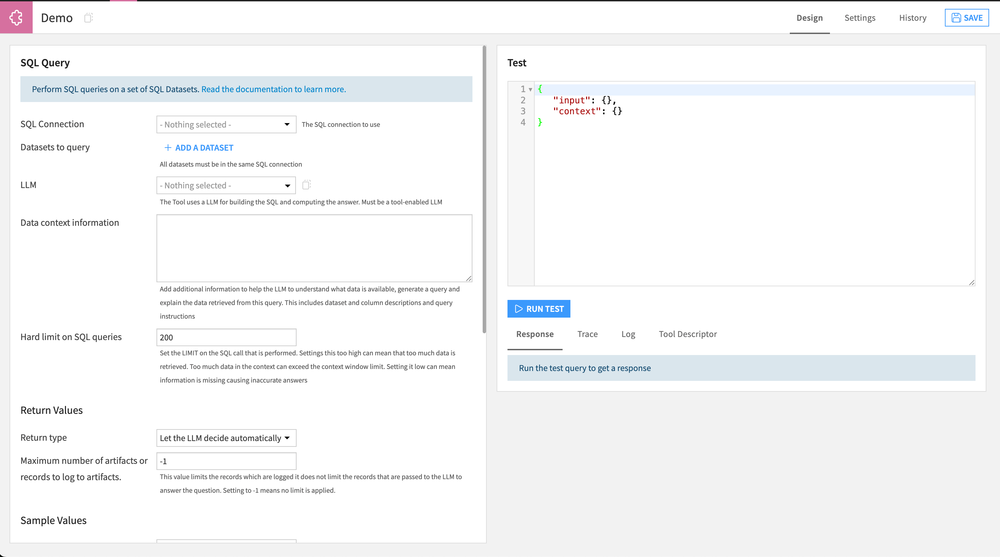
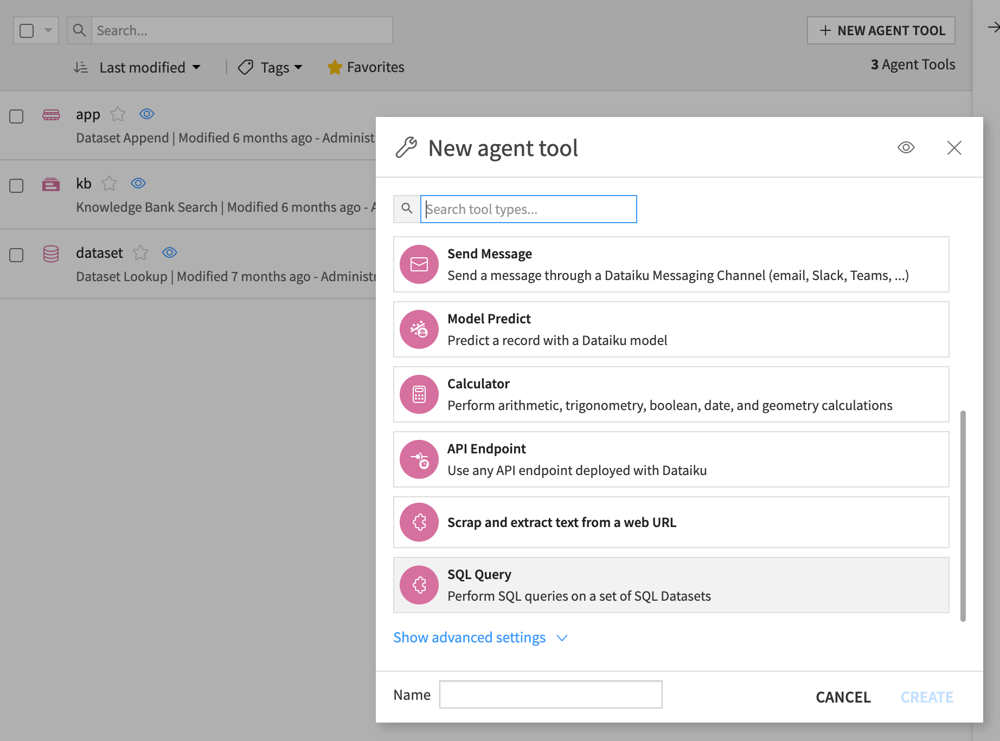
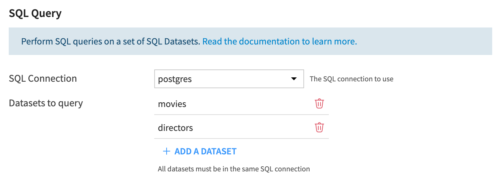
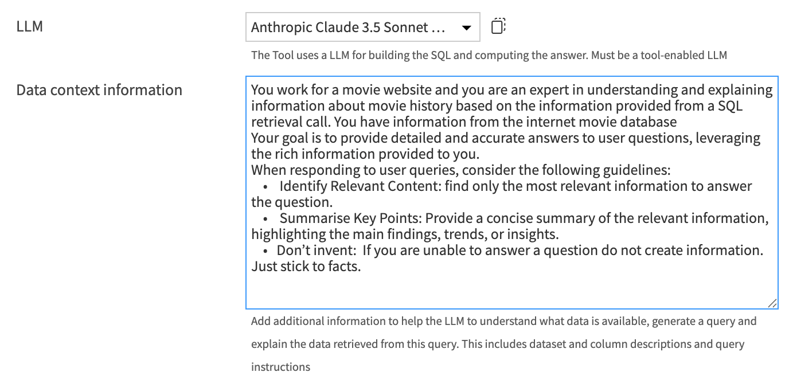
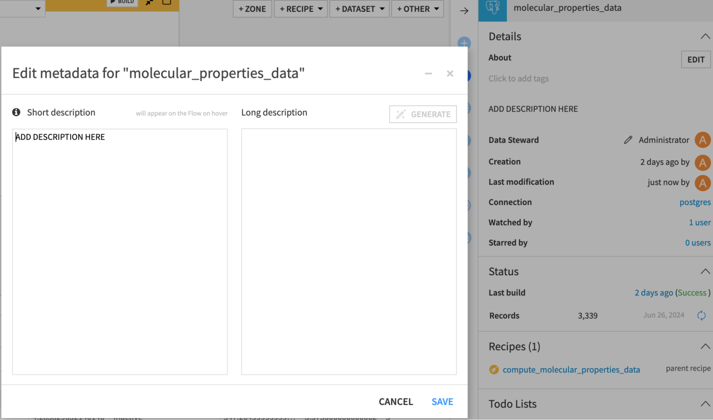
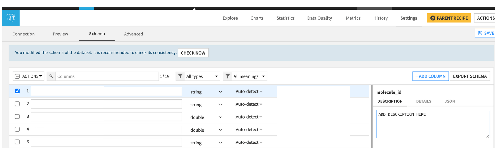
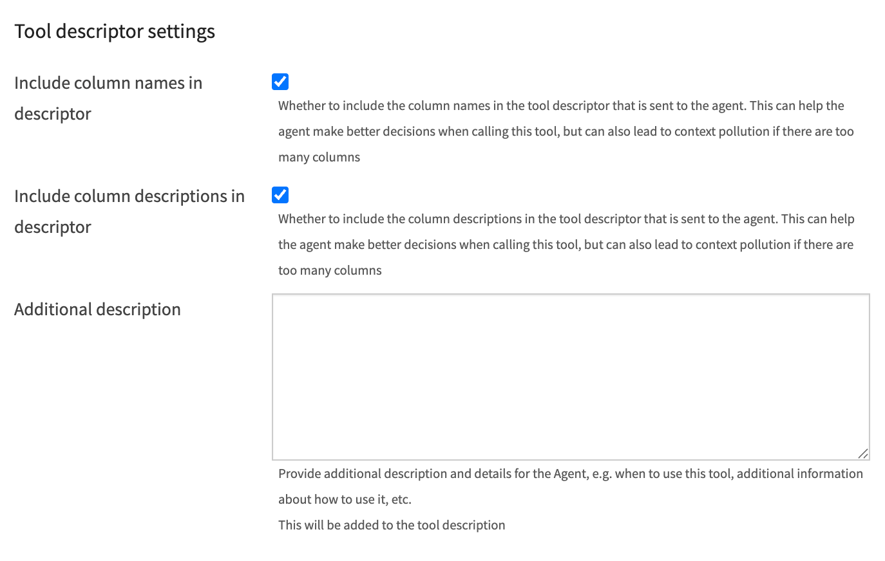
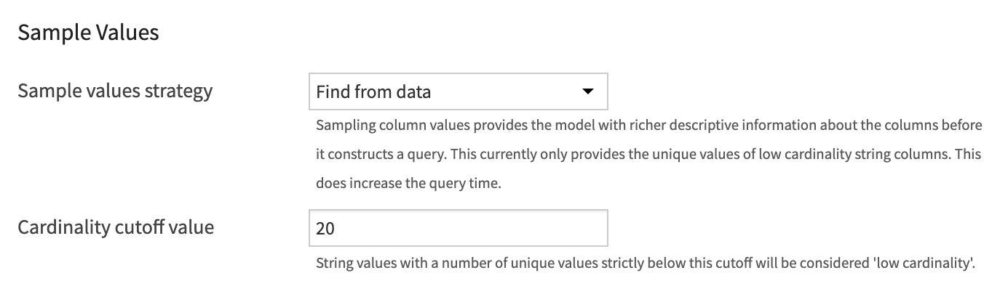

SQL Query Tool
############################

.. contents::
   :local:
   :depth: 2

Overview
--------

The Dataiku SQL Question Answering Agent Tool plugin is a plugin that allows users to create agent tool instances capable of taking natural language inputs and generating SQL SELECT queries. A selected LLM can then interpret the query results and provide a natural language explanation of the returned records. Unlike other tools that are simple "information retrieves", this is a "smart" tool that itself leverages AI. As such, it takes a LLM as configuration option. The tool performs strict validation of the generated SQL queries to ensure that the SQL query can only be a "SELECT"

|SqlToolInitial|

Getting Access
--------------

Dataiku SQL Question Answering Agent Tool plugin is available on demand through the Dataiku plugin store. After installing the plugin, tool instances can be created within a desired project in the `Agents Tools` section. These tool instances can then be utilized by various features of Dataiku such as Dataiku Agents or Dataiku Agent Connect.

|SqlToolCreation|

Configuration
-------------

Introduction
~~~~~~~~~~~~

This guide details the setup of a Dataiku SQL Question Answering Agent Tool. The following sections explain how to set up and configure tool instances to make best use of this plugin.

Requirements
~~~~~~~~~~~~

Infrastructure
^^^^^^^^^^^^^^^

**SQL Datasets:**
All datasets used by instances of Dataiku SQL Question Answering Agent Tool must be SQL datasets stored in one of the following compatible databases:

  - **PostgreSQL**
  - **Snowflake**
  - **MS SQL Server**
  - **BigQuery**

Tool Instance: Design
---------------------

Basic Settings
~~~~~~~~~~~~~~

|SqlToolDataset|

**SQL Connection:** Choose the SQL connection containing datasets you would like to use to enrich the LLM responses. You can choose from all the connections used in the current Dataiku Project but only one connection per agent tool instance.

**Datasets to query:** Select the datasets you would like the tool instance to access. You can choose among all the datasets from the connection you have selected previously. This means that all the datasets must be on the same connection.

|SqlToolLlm|

**LLM:**
Select the language model that will:

   - Decide which tables and columns to use.
   - Create a SQL query.
   - Take the returned records and interpret the information (optional).
   - In the case of error, fix the incorrect SQL query based on the SQL error.

.. caution::
   As the model will be responsible for very demanding tasks which require both structured and unstructured responses, it is strongly advised to use LLMs which are intended for code generation. LLMs whose primary focus is creative writing will perform poorly on this task.

.. caution::
   If you frequently experience JSONDecodeError errors it is very likely that the LLM (1) didn't format its JSON response properly or (2) ran out of tokens before it could finish the JSON response. For (1), this LLM is not suited to this task. LLMs which are specialized in code generation are preferred. For (2), choose an LLM with a higher number of output tokens.

Dataset Information & Descriptions
~~~~~~~~~~~~~~~~~~~~~~~~~~~~~~~~~~

The performance of the tool depends heavily on the description and information that is provided to the models in the chain. This is why it is important to keep in mind the steps in the chain and how to provide the most relevant information to the model at each step in order to craft the best response. The chain executes in the following order:

- **Graph Generation:** The model is asked whether the user query can be answered with the available data and if so which tables and columns should be used and why?
- **Query Generation:** Takes the selected columns and tables and justification from the Graph query and uses them to generate an object which is translated into dialect specific SQL query for the selected connection.
- **Answer Generation:** (Optional) Takes the records retrieved from the SQL query and interprets them based on the information provided.

The two most important places to provide information to the chain are with the `Data context information` and column and dataset descriptions.

The table below shows which information is provided at each stage of the chain.

.. list-table::
   :header-rows: 1
   :widths: 30 20 20 20

   * - 
     - Graph Generation
     - Query Generation
     - Answer Generation
   * - Table & column names
     - ✅
     - ✅
     - ✅
   * - Data context information
     - ❌
     - ✅
     - ✅
   * - Dataset & Column descriptions
     - ✅
     - ✅
     - ❌
   * - Records
     - ❌
     - ❌
     - ✅
   * - User question
     - ✅
     - ✅
     - ✅

.. warning::

   The LLM can only generate effective queries if it knows about the data it is querying. You should provide as much detail as possible to clarify what is available.

**Data context information:** Here you can provide additional information to enrich the LLM performing steps in the query chain. The information will be used in combination with dataset and column descriptions at different stages in the chain to provide the most relevant information to the model. This can also be combined with information automatically retrieved from the SQL table via sampling.
`The sample values section gives more information about this <#sample-values>`__.

**Dataset and column descriptions:**  Add a description to the dataset and the columns so the retrieval works effectively (added in each dataset outside of the tool). This can be done in the following way:

- For the dataset: Select the dataset, click the information icon in the right panel, and click edit. Add the description in either text box.

|SqlToolDatasetDescription|

- For the columns: Explore the dataset, then click settings and schema. Add a description for each column.

.. warning::
   
   The LLM will not be able to view the entire dataset before creating the query, so you must describe the contents of the column in detail. For example, if defining a categorical variable, then describe the possible values ("Pass," "Fail," "UNKNOWN") and any acronyms (e.g., "US" is used for the United States).

.. warning::

   Ensure that data types match the those of questions that you expect to ask the LLM. For example, a datetime column should not be stored as a string. Adding the column descriptions here means the descriptions are tied to the data. As a result, changes to the dataset could cause the LLM to provide inaccurate information.

|SqlToolColumnDescriptions|

**Providing Examples:** Giving example user questions and their expected SQL queries in the `Data context information` can be an effective way of improving the performance of tool instance. This is particularly useful if there is a specific way to query the dataset that the LLM should follow. This can include a common way of handling dates, a specific way of joining tables or typical CTE (common table expressions) for example.
However, it is important to use the Dataiku dataset name rather than the SQL table location in all examples. In the example below the data is located in SQL storage at ``MY_SCHEMA.SALES_product_sold`` but it should be referred to as ``product_sold`` as this is the dataset name exactly as it appears in Dataiku.

.. code-block:: sql

   -- Key: question: 'What is the rolling sum of products sold on Mondays?'
   -- Value: answer:
   WITH parsed_sales AS (
      SELECT 
         TO_DATE(sale_date, 'YYYYMMDD') AS sale_date_parsed,
         product_sold
      FROM sales
   ),
   mondays_sales AS (
      SELECT 
         sale_date_parsed, 
         product_sold
      FROM parsed_sales
      WHERE EXTRACT(DOW FROM sale_date_parsed) = 1  -- 1 = Monday
   )
   SELECT 
      sale_date_parsed,
      product_sold,
      SUM(product_sold) OVER (
         ORDER BY sale_date_parsed 
         ROWS BETWEEN 3 PRECEDING AND CURRENT ROW
      ) AS rolling_sum
   FROM mondays_sales
   ORDER BY sale_date_parsed;

**Hard Limit on SQL Queries:** By default, all queries are limited to 200 rows to avoid excessive data retrieval. However, it may be necessary to adapt this to the type of data being queried.

Return Values
~~~~~~~~~~~~~

In this section you can choose what is returned by the tool instance. Your choice can depend a lot on how you intend to use the tool instance.

|SqlToolReturnValues|

- **Let the LLM decide automatically (default):** Gives the LLM the choice to return records and/or a text-based interpretation response.
- **Return both:** Enforces the return of both the text based interpretation response and the records that are returned from the SQL query.
- **Return the answer to the question:** The returned value from the user query will only contain a text based interpretation.
- **Artifact with the raw data needed to answer:** The returned value from the user query will only contain the records returned from the SQL query. No further LLM query will be made to interpret the data.

Sample Values
~~~~~~~~~~~~~

The model does not have access to the whole dataset when crafting the query. For this reason it is vital that it is provided with the best possible descriptions. If you choose ``Find from data`` the model will be provided with all the unique values for the categorical columns in the data. Meaning, for example, if a user asks about the number of positive response to survey questions the model will know to create the condition ``WHERE "answer" = 'Y'`` instead of ``WHERE "answer" = 'Yes'``. You can set the value at which a column is considered categorical by adjusting the ``Cardinality cutoff value``.

|SqlToolSampleValues|

Tool Descriptor Settings
~~~~~~~~~~~~~~~~~~~~~~~~

The tool descriptor is used by agents to decide whether to use the tool instance. Providing more information can help in this decision process. However, if the tool instance uses a large number of tables with a large number of columns or these columns and datasets have long descriptions then the descriptor can stop being useful.

|SqlToolDescriptorSettings|

In this section you can limit the information that is included in the descriptor in order avoid an unnecessarily large amount of information being used. Instead, a more concise description can be provided that can aid the decision process.

.. |SqlToolReturnValues| image:: ../img/sql_tool_return_values.png

