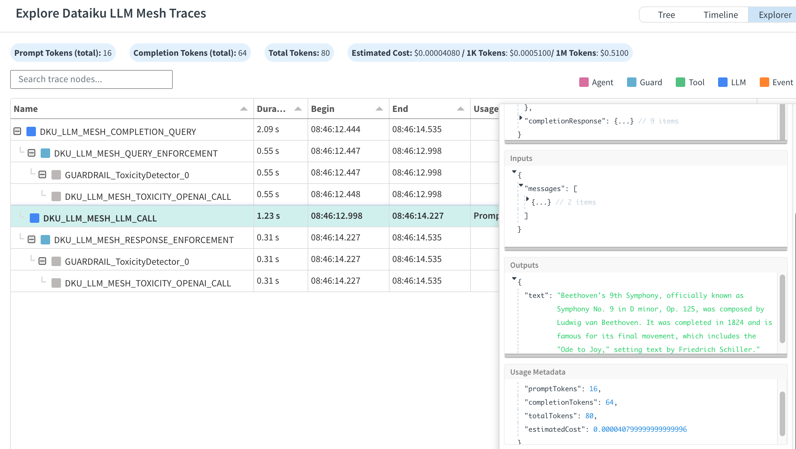
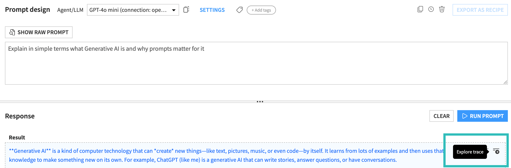
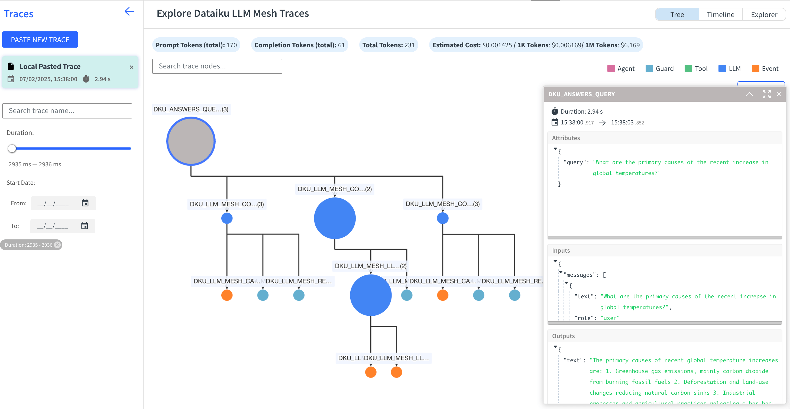
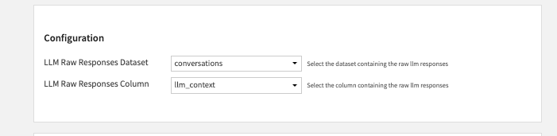

Tracing
#######

Agents are fairly complex pieces of software, leveraging multiple components, and often in a way that is not entirely predictible.

As soon as you start writing complex agents, you will often have issues following the flow of what happens.

Dataiku's Agents systems come with a complete Tracing system, allow you to record the entire trace of what your Agent does, even through multiple layers of calling LLMs. The Trace is available as a nested JSON object showing processing steps and events.

Dataiku provides the **Trace Explorer**, a web app that allows you to visually explore traces.

Dataiku Tracing is also two-way compatible with LangChain and LangSmith:

* Dataiku will automatically gather traces from LangChain invocations, even recursively (LangChain->LLM Mesh->LangChain->LLM Mesh, etc...)
* A Dataiku Trace can be pushed to LangSmith

Anatomy of a trace
==================

A trace is primarily composed of nested observations: "spans" and "events".

* Each observation contains a "name", optional "inputs" and "outputs", as well as "attributes" (metadata).

* Spans have start and end time, and children spans.

* Events are "points in time" and contain a timestamp.

The nesting of spans represents the lifeline of the query, as it goes through various systems. See below for a simple example.

Traces built into the LLM Mesh
==============================

Every call to the LLM Mesh returns a complete nested trace.

Traces can be seen:

* In the output of Prompt Recipes (if tracing is enabled in the Advanced settings of the recipe)

* In the API responses:

.. code-block:: python

   llm = project.get_llm("openai:myconnection:gpt-4o")
   response = llm.new_completion().with_message("I am asking a question").execute()

   print(response.trace)

It records:

* The overall query
* The Guardrails on the query ("DKU_LLM_MESH_QUERY_ENFORCEMENT")
* The actual call to the LLM ("DKU_LLM_MESH_CALL")
* The Guardrails on the response ("DKU_LLM_MESH_RESPONSE_ENFORCEMENT")
* The usage metadata (tokens and costs)
* Inputs and outputs
* The LLM used

For example, here is the trace of a simple LLM Mesh query:

Note: usage metadata is reported only once, at the "DKU_LLM_MESH_CALL" level, i.e. where the cost is "truly incurred"

Adding your own trace items
===========================

When writing a Code Agent, you receive a trace object. You can append your own spans to it. This simple tool-calling agent sample code demonstrates this:

.. code-block:: python

   def process(self, query, settings, trace):
      
      with trace.subspan("Doing something") as subspan:
         do_something()

If you are calling another LLM in your code, you can append the entire span of this other call:

.. code-block:: python

      with trace.subspan("Calling another LLM") as subspan:
            
         llm = dataiku.api_client().get_default_project().get_llm("some_llm")
         resp = llm.new_completion().with_message("do something").execute()

         subspan.append_trace(r.trace)

Trace Explorer
==============

.. note::

    This capability is provided by the **Trace Explorer** plugin, which you need to install. Please see :doc:`/plugins/installing`.

    This plugin is :doc:`Not supported </troubleshooting/support-tiers>` by Dataiku Support.

**Trace Explorer** is a Dataiku Visual Web Application to visualize traces stored in a Dataiku dataset. It ingests structured LLM usage logs from a configurable dataset and column, and offers three distinct views (Tree, Timeline, Explorer) for analyzing and debugging usage details.

Creating a Trace Explorer Webapp
--------------------------------

#. **Add a New Webapp**:

   - In your Dataiku project, select **+ New Webapp**.
   - Choose **Visual Webapp**.
   - From the list of available visual web applications, select **Trace Explorer**.

#. **Configure**:

   - **Name of the dataset that stores LLM logs** : Pick the dataset containing your Generative AI logs.
   - **Name of the column that contains LLM responses**: Select the JSON column in that dataset that holds your LLM output traces.

#. **Save** your settings.

|SettingsPage|

.. note::

   If you don't have a dataset ready, you can leave the fields empty and still paste traces directly in the webapp.

---------------------------------------------------------------------
Use with **Prompt Recipe**, **Agent Connect** and **Dataiku Answers**
---------------------------------------------------------------------

You will need to set the following parameters during webapp setup:

+---------------------+----------------------------------------+-------------------------------------+
| Component           | LLM Raw Responses Dataset              | LLM Raw Responses Column            |
+=====================+========================================+=====================================+
| **Answers**         | `answers_conversations_dataset`        | `llm_context`                       |
+---------------------+----------------------------------------+-------------------------------------+
| **Agent Connect**   | `agent_connect_conversations_dataset`  | `llm_context`                       |
+---------------------+----------------------------------------+-------------------------------------+
| **Prompt Recipe**   | `prompt_recipe_dataset_generated`      | `llm_raw_responses`                 |
+---------------------+----------------------------------------+-------------------------------------+

.. note::

   Replace the **Dataset** with your own. **Column** should always be the one provided in the table above.

.. hint::

   For **Prompt Recipe**, please be sure to set **Raw response output mode** to **Raw** in the **Advanced** recipe settings in order to have `llm_raw_responses` column available in the output dataset.

Using the Trace Explorer
------------------------

|MainPage|

#. **Open the Webapp**:

   - From your project's **Webapps** list, locate and **Open** the newly created **Trace Explorer** webapp.

#. **Explore Dataset Traces**:

   - The application automatically loads and displays traces from the configured dataset/column.
   - Each valid JSON entry appears in a sidebar, including essential metadata (e.g., start time, duration).
   - Click on any trace to view its structure and details.

#. **Paste a JSON Trace**:

   - If you have a single JSON formatted trace not yet stored in the dataset, you can click **Paste new trace** in the sidebar.
   - Paste the JSON into the text area, then **Add trace** to explore it immediately within the app.

#. **Views**:

   - **Tree View**: A graph based structure letting you see the trace's nested events and relationships.
   - **Timeline View**: Displays events in chronological order. Hold the **Shift** key and use your mouse wheel to zoom in and out.
   - **Explorer View**: A tabular, hierarchical breakdown of each node, showing durations, usage metadata, and sub-node details.

#. **Trace Details**:

   - When you select a node in the Tree, Timeline, or Explorer, a side panel shows node details, including inputs, outputs, and usage metadata.

#. **Reload (Optional)**:

   - If your dataset changes, you can reload the traces (when provided in the UI) to refresh the view with the latest records.

Accessing via Explore Trace shortcut
------------------------------------

In addition to opening the webapp directly, a shortcut is available from Prompt Studio, Agents and Retrieval-Augmented LLMs.

.. note::

   For this shortcut to be functional, an administrator must first configure a default Project and Trace Explorer instance under **Administration > Settings > LLM Mesh > Configuration > Trace**.

.. hint::

   As a best practice, we recommend creating a dedicated project for this purpose that grants read-only rights to all relevant users or groups.

Troubleshooting & Notes
-----------------------

- Ensure your chosen column has valid JSON. Rows with invalid JSON are skipped.
- The "Paste a JSON Trace" feature is helpful for quickly previewing a single trace without requiring a dataset update.
- The timeline view's zooming behavior requires holding **Shift** while scrolling with the mouse wheel.

That's it. By following these steps, you can install, configure, and utilize the **Trace Explorer** webapp to understand your Generative AI usage in Dataiku.

