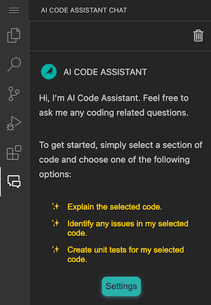

AI Code Assistant
#################

The AI Code Assistant is a powerful tool enhancing the coding experience in Jupyter Notebooks and Visual Studio Code (:doc:`in Code Studio </code-studios/code-studio-ides/vs-code>`).

Setup
========

In order to start using the AI Code Assistant, the feature needs to be enabled by an admin.
It also requires a connection to an LLM.

* Go to Administration > Settings > OTHER > AI Services
* Make sure **Enable AI Code Assistant** is checked
* Select which LLM connection to use as default
* Click **Save**

Usage in Jupyter notebooks
===============================================

There is only one step needed to enable AI Code Assistant in Jupyter notebooks:

* Copy the following code in a cell and execute it:

  .. code-block:: python

    %load_ext ai_code_assistant

Usage in Visual Studio Code
===============================================

.. warning::

	Using a self-signed certificate may prevent the feature from being fully functional on all browsers.

To use AI Code Assistant in Visual Studio Code, an admin must enable it in the :doc:`Code Studio Template </code-studios/code-studio-templates>`:

* Ensure the **Install AI Code Assistant** option is enabled in the Visual Code Studio block (it is enabled by default)
* Rebuild the template and restart the Code Studio to apply changes

You will find a new side panel in VSCode.

You will also have some new actions in the right-click menu when launched from inside a file (some are only available once you have made a selection in the file).

.. image:: img/code-assistant-context-menu.png
