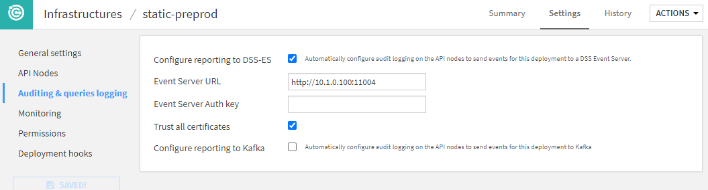
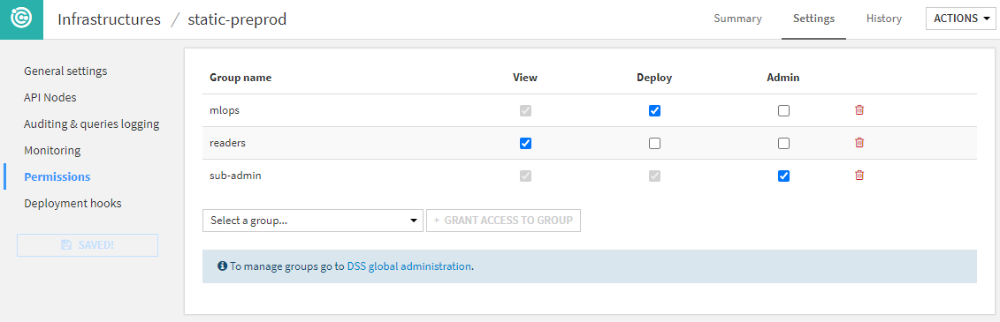

Setting up the API Deployer and deployment infrastructures
############################################################

The API Deployer is part of the Deployer. Follow the :doc:`Deployer installation steps</deployment/index>` to be able to use the API Deployer.

You will then need to create API infrastructures.

.. _apinode.installing-apideployer.apideployer-first-infrastructure:

Create your first infrastructure
=================================

The API Deployer manages several deployment infrastructures. You need to create at least one in order to be able to deploy API services.

Possible infrastructure types are:

* A *static* infrastructure: a set of pre-deployed API nodes that the API Deployer manages.
* A *kubernetes* infrastructure: the API Deployer dynamically creates containers in your Kubernetes cluster to run the API Node server.
* An *external platform*: The API Deployer can deploy to any of the supported third party platforms (AWS Sagemaker, Azure Machine Learning, Databricks, Google Vertex AI, or Snowflake Snowpark).

Static infrastructure
----------------------

* Install one or several API nodes as described in :doc:`installing-apinode`.
* For each API node, generate an admin key from the terminal: go to the API node's DATA_DIR and use ``./bin/apinode-admin admin-key-create``.
* Write down the key.

On the API Deployer node:

* From the home page, go to API Deployer > Infrastructures.
* Create a new infrastructure with "static" type.
* Go to the "API Nodes" settings page.
* For each API node, enter its base URL (including protocol and port number) and the API key.

Then, go to the "Permissions" tab and grant to some user groups the right to deploy models to this infrastructure.

Your infrastructure is ready to use, and you can create your first model: :doc:`first-service-apideployer`.

Kubernetes infrastructure
--------------------------

Please see :doc:`kubernetes/index`.

External infrastructure
--------------------------

In order to deploy to a third party platform, you first need to setup and store the credentials to be used by API Deployer. This operation is done through a connection of a specific type listed under the section Managed Model Deployment Infrastructures. 

Each of the supported types offers various ways to authenticate. You will probably need to be administrator of your external platform and have knowledge of how to setup authentication and permissions to finalize this task.

Once done and working, you can go back to API Deployer and create the infrastructure.

* Create a new infrastructure with one of the corresponding types: Azure Machine Learning, Amazon Sagemaker, Databricks, Google Vertex AI, or Snowflake Snowpark.
* Open the "Basic Parameters" section and fill-in the mandatory parameters, mostly on how to authenticate to the external infrastructure and the docker registry (if relevant).
* Check and activate other optional settings and capabilities, especially the "Auditing and queries logging" if you want to build a monitoring loop.
* Grant access to this infrastructure in the "Permissions" section.

Your infrastructure is now ready to use.

.. note::
  * Deploying to an external infrastructure (except Databricks) leverages docker images. To that extent, it requires Dataiku's "apideployer" docker base images to be built. See :ref:`rebuild.base-images` in a custom setup.
  * To deploy on Databricks' external infrastructure, you will need the "Databricks utils" internal code environment. Indeed, models are exported as MLflow models (see :ref:`MLflow export`) before being deployed. Internal code environments can be created in Administration > Code envs > Internal envs setup.

Once configured, you can deploy API services to this infrastructure as explained in :doc:`deploy-anywhere`.

Setting up stages
------------------

Each infrastructure belongs to a "lifecycle stage". This is used in order to show deployments per lifecycle stage. DSS comes pre-configured with the classic "Development", "Test" and "Production" stages, but you can freely modify these stages in Administration > Settings > Deployer > API deployment stages.

Configuring an API infrastructure
=================================

For details on how to configure a Kubernetes Cluster of API nodes, please refer to :doc:`kubernetes/index`.

Auditing and query logging
--------------------------

This section defines how and where the API infrastructure will log its activity.

If you are using Fleet Manager, you will not be able to do the detailed configuration of Event-Server or Kafka in this screen. This is done in Fleet Manager directly.

A key part of this section is the reporting options: they are used to configure how prediction logs are going to be reported for MLOps monitoring. The standard option provided by Dataiku is called the Event Server. With this solution in place, all predictions made by any deployment on this infrastructure will be sent back to the Event Server to store it on a file-based storage. This will be the main source for building your feedback loop.

You can find more on configuring an Event Server in :doc:`The Event Server </operations/audit-trail/eventserver>`.

To understand, configure and automate your monitoring loop, you can refer to `our dedicated Knowledge Base article <https://knowledge.dataiku.com/latest/mlops-o16n/model-monitoring/tutorial-api-endpoint-monitoring-basics.html>`_.

Permissions
-----------

You can define a group-based security scheme for each infrastructure to match your internal organization and processes.

Each user using Project Deployer has access to different set of actions depending on these permissions:

* If the user is **not granted any permission**, this infrastructure and all its deployments will not be visible or usable in any way.
* The **View** permission limits the user's ability to see deployments and their details in the dashboard.
* **Deploy** permission grants the user the right to create, update or delete deployments on this infrastructure.
* The **Admin** permission allows the user to see and edit all infrastructure settings.

.. note::
    The user security is not only defined by infrastructure but also by API service, as defined in the `Services` tab. This allows for advanced configuration, such as allowing all users to deploy any API service on a DEV infrastructure, but only certain users to deploy it on a PROD infrastructure. 
    
    You can also restrict the deployment of API services on a production instance to a technical account used by a CI/CD orchestrator through the Python API, while keeping users the view rights for monitoring. 
    
    You can learn more on this type of setup in our `Knowledge Base <https://knowledge.dataiku.com/latest/mlops-o16n/ci-cd/tutorial-getting-started-ci-cd.html>`_.

Deployment hooks
----------------

Hooks are custom actions performed before or after deployments. Please refer to the :ref:`Automation node <deployment-hooks>` for more details.
