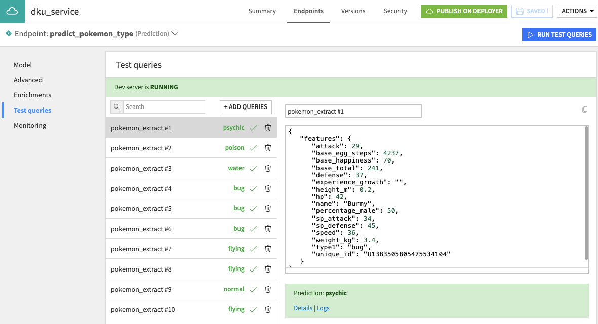
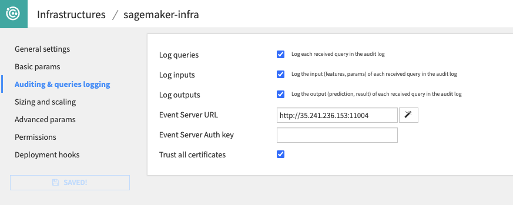
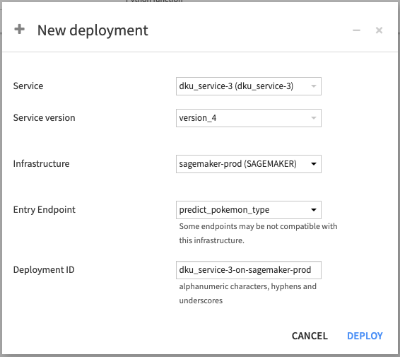
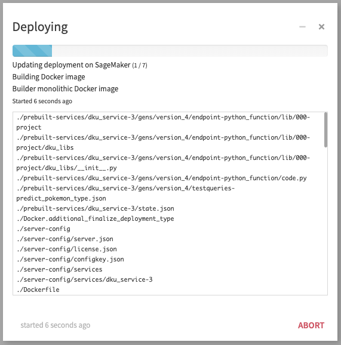
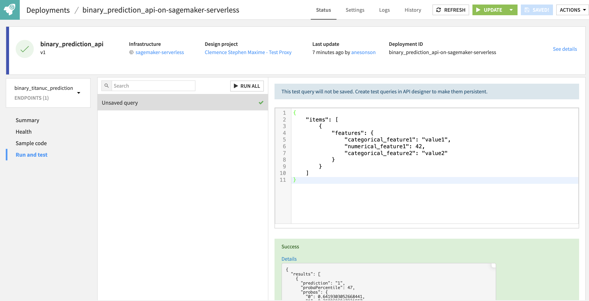

Deploying to an external platform
#################################

This page will present the process to deploy a Dataiku API Service to a non-Dataiku ML platform, which we called 'Deploy anywhere'.

.. contents::
    :local:

.. note::

  This section assumes that you already have installed and configured the DSS API Deployer, and already have an external infrastructure configured. Please see :doc:`api-deployment-infrastructures` if that's not yet the case.

  It also assumes that you are familiar with API Deployments. Please see :doc:`first-service-apideployer` if this is not the case.

Create the API Service
========================
From any project on your design node, you need to create an API Service containing at least one endpoint.
There are some limitations to the API Service in order to be compatible with External Deployments:

* Only one endpoint will be accessible once deployed. So either you have a single endpoint or you will be requested to select one at deployment time (you can perfectly use the Dispatcher approach in this context, see :doc:`Developer Guide <devguide:concepts-and-examples/api-designer/inter-calling>`)
* The following types of endpoints are supported: Standard Prediction, Clustering, Custom Prediction (Python) or Python Function
* HTTP request metadata is available when using Custom Prediction (Python) or Python Function endpoints. For more information, refer to this :doc:`Developer Guide <devguide:concepts-and-examples/api-designer/request-metadata>`

Once created, add some test queries so that you can validate your deployment once done.

Publish and Deploy
==================

Before proceeding with the actual deployment, ensure your infrastructure is properly configured for Model Monitoring. Although optional, this will make the Model Monitoring very easy at the end.
Model monitoring is based on the deployed endpoint sending its logs to a Dataiku Event Server. This configuration is done at the Infrastructure level, so you may need the assistance of an administrator. You also need to ensure the deployed endpoint will be allowed to access the event server which, in the case of External Deployments, might require specific network settings on the platform.

Once all is good, go back to your project and create a version of your API Service and publish it to API Deployer. On this version's page, click on Deploy. You will be asked for the Deployment required information. Among them, If you have multiple endpoints, you will need to select the one to expose.

Once the deployment is actually started, you can follow the progress until all is done on Dataiku's side and we are waiting for the External provider to finalize the activation of the endpoint (note that this operation may take some time, depending on the provider).

While the endpoint is under creation, it is showed in warning in API deployer, and it is not usable.

  .. image:: img/da-api-update-processing.png

You can click on Refresh until your endpoint is finally able to serve.

  .. image:: img/da-api-ready.png

As a final step, you can go to the 'Run and test' tab to validate it. And your endpoint is fully operational at this stage.

Monitor
=======

As a first step of Monitoring, all deployments are checked by Dataiku deployer for proper up status and whether the actual deployment is in sync with the expected setup in API Deployer.
If the endpoint is not up, it will be displayed as an error. If the configuration has discrepancies, it will be displayed as a warning - 'out-of-sync'.

.. note:
    As ensuring all settings are properly deployed can be long, API deployer only checks basic ones automatically. If you want to perform a full control, you can request it from a deployment, using the 'ACTIONS' dropdown and select 'Compute full check report'

A second step of monitoring is concerned with the model health. With the logging in place, all predictions made by the endpoint will be logged according to your Event Server configuration. You can then build a feedback loop based on this logs using the standard logic, as explained in `the Monitoring Tutorial on the knowledge base <https://knowledge.dataiku.com/latest/mlops-o16n/model-monitoring/tutorial-monitor-api.html>`_.
