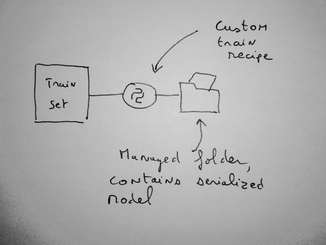

Exposing a R prediction model
###################################

.. contents::
	:local:

In addition to standard models trained using the DSS visual Machine Learning component, the API node can also expose custom models written in R by the user.

To write a "custom R prediction" endpoint in an API node service, you must write a R function that takes as input the features of the record to predict and that outputs the prediction.

The custom model can optionally use DSS managed folders. This managed folder is typically used to store the serialized version of the model. The code for the custom model is written in the "API service" part DSS.

Creating the R prediction endpoint
=======================================

To create a R Prediction endpoint, start by creating an API service from the API Designer.

* Go to the project homepage
* Go to the API Designer and create a new service
* Give an identifier to your API Service. This identifier will appear in the URL used to query the API
* At this point, the API Service is created but not yet have any endpoint, i.e. it does not yet expose any capability. See :doc:`concepts` for what endpoints are.
* Create a new endpoint of type "Custom Prediction (R)". Give an identifier to the endpoint. A service can contain multiple endpoints (to manage several models at once, or perform different functions)

You will need to indicate whether you want to create a Regression (predicting a continuous value) or a Classification (predicting a discrete value) model.

The URL to query the API will be like ``/public/api/v1/<service_id>/<endpoint_id>/predict``.

Validate, you are taken to the newly created API Service in the API Designer component.

DSS prefills the Code part with a sample depending on the selected model type.

Using a managed folder
-----------------------

A custom model can optionally (but most of the time) use a DSS managed folder. When you package your service, the contents of the folder is bundled with the package, and your custom code receives the path to the managed folder content.

A typical usage is when you have a custom train recipe that dumps the serialized model into a folder. Your custom prediction code then uses this managed folder.

Structure of the code
-----------------------

To create a custom model, you need to write a single R function. When you create your endpoint, DSS prefills the code with several sample functions that can all work as a R prediction model.

The function takes named arguments that are the features of the model. You may use default values if you expect some features not to be present.

In the "Settings" tab of your endpoint, you must select the name of the function that is your main predictor

In the R code, you can retrieve absolute paths to the resource folders using ``dkuAPINodeGetResourceFolders()`` (returns a vector of character)

Regression
%%%%%%%%%%

A regression prediction function can return:

* Either a single numerical representing the predicted class
* Or a list containing:

	* (mandatory) ``prediction``: a single numerical representing the predicted class
	* (optional) ``customKeys``: a list containing additional response keys that will be sent to the user

Classification
%%%%%%%%%%%%%%%%

A classification prediction function can return:

* Either a single character vector representing the predicted class

* Or a list containing:

	* (mandatory) ``prediction``: a single character vector representing the predicted class
	* (optional) ``probas``: a list of class -> probability
	* (optional) ``customKeys``: a list containing additional response keys that will be sent to the user

Enriching queries features
===========================

See :doc:`enrich-prediction-queries`.

Testing your code
====================

Developing a custom model implies testing often. To ease this process, a "Development server" is integrated in the DSS UI.

To test your code, click on the "Deploy to Dev Server" button. The dev server starts and loads your model. You are redirected to the Test tab where you can see whether your model loads.

You can then define *Test queries*, i.e. JSON objects akin to the ones that you would pass to the :doc:`api/user-api`. When you click on the "Play test queries" button, the test queries are sent to the dev server, and the result is printed.

R packages
============

We strongly recommend that you use code environments for deploying custom model packages if these packages use any external (not bundled with DSS) library

Using a code env (recommended)
-------------------------------

Each custom endpoint can run within a given DSS :doc:`code environment </code-envs/index>`.

The code environment associated to an endpoint can be configured in the "Settings" tab of the endpoint.

If your endpoint is associated to a code environment, when you package your service, DSS automatically includes the definition of the virtual environment in the package. When the API service is loaded in the API node, DSS automatically installs the code environment according to the required definition.

This allows you to use the libraries that you want for your custom model.

Using the builtin env (not recommended)
------------------------------------------

If you use external libraries by installing them in the DSS builtin env, they are *not* automatically installed in the API Node virtual env. Installing external packages in the API Node virtual env prior to deploying the package is the responsibility of the API node administrator.

Note that this means that:

* Two endpoints in the same service may not use incompatible third-party libraries or versions of third-party libraries
* If you need to have two services with incompatible libraries, you should deploy them on separate API node instances

Performance tuning
====================

Whether you are using directly the API Node or the API Deployer, there are a number of performance tuning settings that can be used to increase the maximum throughput of the API node.

For the R prediction endpoint, you can tune how many concurrent requests your API node can handle.
This depends mainly on your model (its speed and in-memory size) and the available resources on the server(s) running the API node.

One allocated pipeline means one R process running your code, preloaded with your initialization code,
and ready to serve a prediction request. If you have 2 allocated pipelines (meaning 2 R processes),
2 requests can be handled simultaneously, other requests will be queued until one of the pipelines is
freed (or the request times out). When the queue is full, additional requests
are rejected.

Each R process will only serve a single request at a time.

It is important to set the "Cruise parameter" (detailed below):

* At a high-enough value to serve your expected reasonable peak traffic. If you set cruise too low, DSS will kill excedental R processes, and will need to recreate a new one just afterwards.

* But also at a not-too-high value, because each pipeline implies a running R process consuming the memory required by the model.

.. include:: _endpoint-tuning-pool.rst