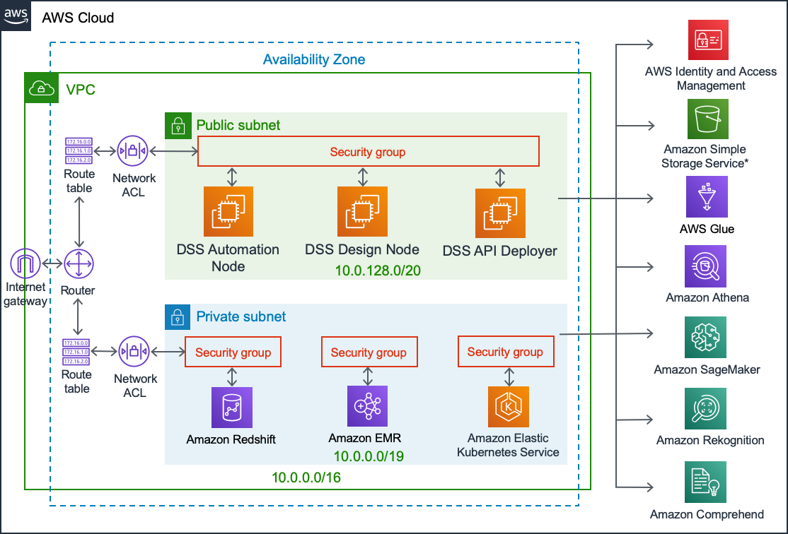

Reference architecture: managed compute on EKS with Glue and Athena
######################################################################

.. warning::

	Use this reference already if you are not using a Dataiku Cloud Stacks for AWS installation. When using a Dataiku Cloud Stacks for AWS installation, these steps are already taken care of.

Overview
=========

This architecture document explains how to deploy:

* DSS running on an EC2 machine
* Computation (Python and R recipes, Python and R notebooks, in-memory visual ML, visual Spark recipes, coding Spark recipes, Spark notebooks) running over dynamically-spawned EKS clusters
* Data assets produced by DSS synced to the Glue metastore catalog
* Ability to use Athena as engine for running visual recipes, SQL notebooks and charts
* Security handled by multiple sets of AWS connection credentials

For information on calculating costs of AWS services, please see the AWS pricing documentation here: `<https://aws.amazon.com/pricing/>`_.

Architecture diagram
=====================

 * DSS software deployed to EC2 instances inside customer subscription
 * DSS uses Glue as a metastore, and Athena for interactive SQL queries, against data stored in customers's own S3*
 * DSS uses EKS for containerized Python, R and Spark data processing and Machine Learning, as well as API service deployment
 * DSS uses EMR as a Data Lake for in-cluster Hive and Spark processing
 * DSS uses Redshift for in-database SQL processing
 * DSS integrates with SageMaker, Rekognition ad Comprehend ML & AI services

Security
=========

The ``dssuser`` needs to have an AWS keypair installed on the EC2 machine in order to manage EKS clusters. The AWS keypair needs all associated permissions to interact with EKS. 

This AWS keypair will not be accessible to DSS users.

End-users use dedicated AWS keypairs to access S3 data.

For information on IAM please see the AWS documentation at `<https://aws.amazon.com/iam/faqs/>`_

Main steps
===========

Prepare the instance
----------------------

* Setup an AlmaLinux 8 EC2 machine
* Make sure that the EC2 machine has the "default" security group assigned
* Install and configure Docker CE
* Install kubectl
* Install the ``aws`` command line client
* Setup a non-root user for the ``dssuser``

Setup connectivity to AWS
---------------------------

* As the ``dssuser``, run ``aws configure`` to setup AWS credentials private to the ``dssuser``.
  These AWS credentials require:

  * Authorization to push to ECR
  * Full control on EKS

Install DSS
------------

* Download DSS, together with the "generic-hadoop3" standalone Hadoop libraries and standalone Spark binaries
* Install DSS, see :doc:`/installation/custom/index`
* Build base container-exec and Spark images, see :doc:`/containers/setup-k8s`

Setup container configuration in DSS
--------------------------------------

* Create a new container config, of type K8S
* Set ``ACCOUNT.dkr.ecr.REGION.amazonaws.com`` as the Image URL
* Set the pre-push hook to "Enable ECR"
* Push base images

Setup Spark and Metastore in DSS
----------------------------------

* Enable "Managed Spark on K8S" in Spark configurations in DSS
* Set ``ACCOUNT.dkr.ecr.REGION.amazonaws.com`` as the Image URL
* Set the pre-push hook to "Enable ECR"
* Push base images
* Set metastore catalog to "Glue"

Setup S3 connections
---------------------

* Setup as many S3 connections as required, with credentials and appropriate permissions
* Make sure that "S3A" is selected as the HDFS interface
* Enable synchronization on the S3 connections, and select a Glue database

Setup Athena connections
-------------------------

* For each S3 connection, setup an Athena connection
* Setup the Athena connection to get credentials from the corresponding S3 connection
* Setup the S3 connection to be associated to the corresponding Athena connection

Install EKS plugin
-------------------

* Install the EKS plugin
* Create a new preset for "Connection", leaving all empty
* Create a new preset for "Networking settings"

  * Enter the identifiers of two subnets in the same VPC as DSS
  * Enter the same security group identifiers as DSS 

Create your first cluster
--------------------------

* Go to Admin > Clusters, Create cluster
* Select "Create EKS cluster", enter a name
* Select the predefined connection and networking settings
* Select the node pool size
* Create the cluster
* Cluster creation takes around 15-20 minutes

Use it
------

* Configure a project to use this cluster
* You can now perform all Spark operations over Kubernetes
* Datasets built will sync to the Glue metastore
* You can now create SQL notebooks on Athena
* You can create SQL recipes over the S3 datasets, this will use Athena

.. warning::

  * This configuration requires baseline knowledge of AWS.
  * These instructions refer to a customer managed deployment (i.e. not Saas or a managed service). It is the customer's responsibility to manage where and how data is stored (e.g. regarding sensitive data and encryption).
  * These steps are provided for information only. Dataiku does not guarantee the accuracy of these or the fact that they are still up to date.
  * Many AWS services allow instance size selection, and suitable choices should be made according to individual requirements.
  * This reference architecture assumes a deployment on a single Availability Zone. For information on what to do in the event of an AWS AZ fault, please see the AWS documentation here : `<https://docs.aws.amazon.com/AWSEC2/latest/UserGuide/using-regions-availability-zones.html>`_
  * Further information on logging in AWS can be found here: `<https://docs.aws.amazon.com/AmazonCloudWatch/latest/logs/WhatIsCloudWatchLogs.html>`_
  * Further information on creating and restoring backups on AWS can be found here: `<https://docs.aws.amazon.com/AWSEC2/latest/UserGuide/EBSSnapshots.html>`_
  * DSS-specific information on managing backups can be found here: `<https://doc.dataiku.com/dss/latest/operations/index.html>`_
  * Redeployment of AWS services, for example following a disaster, require sufficient service quotas.  Information on how to view and increase service quotas can be found here: `<https://docs.aws.amazon.com/general/latest/gr/aws_service_limits.html>`_
  * It is recommended for the customer to define the desired Recovery Time Objective and Recovery Point Objective as part of their disaster recovery strategy.
  * It is recommended for the customer to define a strategy for managing system credentials & cryptographic keys.

