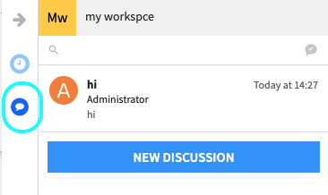
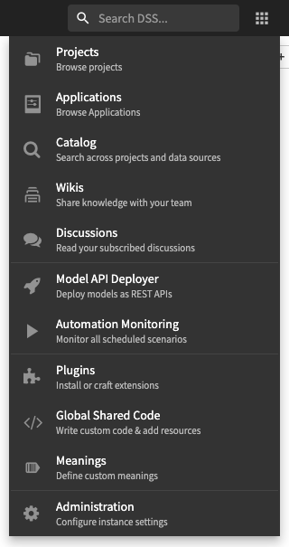

Discussions
#############

The discussions feature of DSS allow your team to discuss around every kind of object in DSS:

* Projects
* Datasets
* Recipes
* Notebooks
* Models
* Dashboards and insights
* Workspaces and workspace objects

Object discussions
===================

Discussions can be accessed:

* From each object's pages by clicking on the discussions button

* From the Flow or list of objects, by selecting the object, and in the right column, clicking the "Discussions tab"

* From the workspace and workspace objects by clicking the "Discussions tab"

Discussions inbox
===================

All of the discussions that you take part of, or that are about objects that you are watching can be found in your global discussions inbox.

From the applications menu, select Discussions to be taken to your global discussions inbox.

Email notifications
====================

In order to receive email notifications for discussions you take part of, or about objects that you are watching:

* Your administrator must have created a SMTP "messaging channel" from the administration settings, and have set this channel as the "Notification emails" channel

* Your account needs to have a valid email address registered (accessible from your Profile page)

* In your Profile page, in the "My Settings", enable the various notifications options