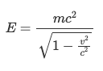
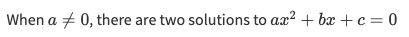

Markdown
#################

.. contents::
	:local:

DSS comes with editable text fields. It ensures to improve collaboration between users. They are:

* The short and long descriptions of any DSS object (in the Summary tab)
* Wiki articles of a project
* Discussions on any DSS object (by using the Discussions button on the navbar)

All of these text fields support Markdown.

Definition
=================

Markdown is an easy-to-use syntax that aims to prettify text by allowing to use pictures, to format text, to display advanced objects like tables, lists, etc.

For more information, please visit `Wikipedia <https://en.wikipedia.org/wiki/Markdown>`_ and this `Cheatsheet <https://github.com/adam-p/markdown-here/wiki/Markdown-Cheatsheet>`_

Syntax guide
=================

Here’s an overview of Markdown syntax.

Headlines
-----------------

.. code-block:: md

	# Title

	## Subtitle

Formatting
-----------------

.. code-block:: md

	You can have **bold text** and _italic text_

Lists
-----------------

.. code-block:: md

	 - element 1
	 - element 2

.. code-block:: md

	 1. element 1 in numbered list
	 2. element 2 in numbered list

Image
-----------------

.. code-block:: md

	 

If the image is stored as an attachment to a wiki article, you can display it with:

.. code-block:: md

	


Link
-----------------

.. code-block:: md

	 [link label](https://www.dataiku.com/)

Email link
-----------------

.. code-block:: md

	 <myname@company.com>

Blocks
-----------------

.. code-block:: md

	> quoted text
	> on two lines

.. code-block:: md

	```
	# This is a code snippet
	import os
	print(os.name)
	```

Table
-----------------

.. code-block:: md

	| Name       | Hobby             | Pet         |
	|------------|-------------------|-------------|
	| Astrid     | :fries:           | :rat:       |
	| Clément    | :computer:        | :cat2:      |
	| Sonia      | :champagne:       | :chicken:   |
	| Pierre     | :surfer:          | :palm_tree: |

Emoji
-----------------

DSS Markdown comes with a list of emojis (use autocompletion by typing the character ``:``):

.. code-block:: md

	:coffee: :soccer: :snowman:

Users
-----------------

You can mention an user with its username (use autocompletion by typing the character ``@``):

.. code-block:: md

	@admin

Link to DSS object
--------------------

You can create a link a specific DSS object:

.. code-block:: md

	[[PROJECT_KEY.Wiki Article 1]]
	(my dataset)[dataset:PROJECT_KEY.dataset_name]
	(my model)[saved_model:PROJECT_KEY.model_id]
	(my project)[project:PROJECT_KEY]

Link to article uploaded attachment
-------------------------------------

You can create a link to download an attachment to a wiki article:

.. code-block:: md

	[attachment label](PROJECT_KEY.attachment_id)

Formula (LaTeX)
-----------------

You can insert mathematical formulas using the LaTeX syntax as a block:

.. code-block:: md

	```math
	E = \frac{mc^2}{\sqrt{1-\frac{v^2}{c^2}}}
	```

The above formula is rendered as:



You can can also insert LaTeX-formatted formulas within paragraphs:

.. code-block:: md

	When $`a \ne 0`$, there are two solutions to $`ax^2 + bx + c = 0`$

The above paragraph is rendered as:



Advanced
-----------------

You can use `HTML <https://en.wikipedia.org/wiki/HTML>`_ and `CSS <https://en.wikipedia.org/wiki/Cascading_Style_Sheets>`_:

.. code-block:: md

	<i class="icon-dkubird" />
	<marquee direction="right">&lt;&gt;&lt;&nbsp;&hellip;</marquee>
