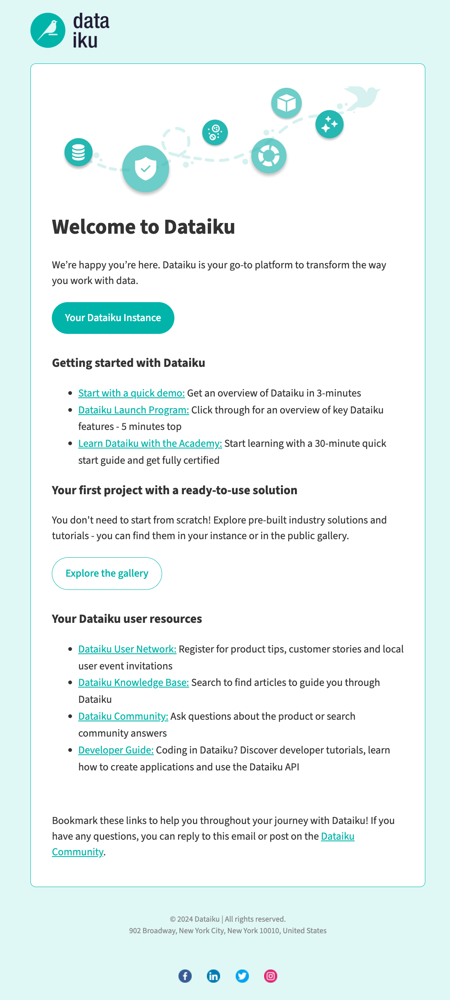

Welcome Email
#########################

A Welcome Email is sent when a user is added to Dataiku DSS.

Enable Welcome Email
---------------------
In order to enable the Welcome Email, you need to have an email messaging channel and a channel selected for notification emails.

Default Welcome Email
----------------------
The Welcome Email is enabled by default and is initially configured to use the provided standard template:

Customise Welcome Email
------------------------
The subject and content of the Welcome Email can be customised in the Admin Settings in the Notifications & Integrations section.

Emails can be sent as HTML or plain text format, with both supporting `Freemarker <https://freemarker.apache.org/docs/dgui_template_overallstructure.html>`_ for templating.

Additionally, DSS variables are supported both for the subject and the email content.
