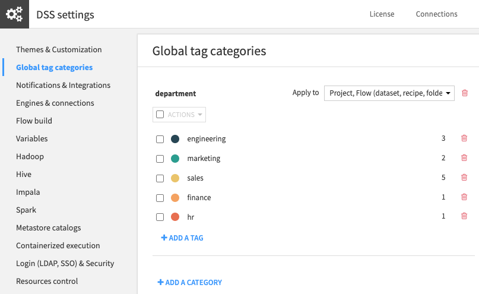
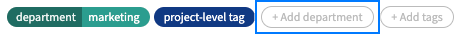

Tags
#####

Tags in DSS help you organize your work. You can apply tags to categorize a wide range of objects in DSS such as
projects, datasets, models, notebooks, wiki articles.

A tag can be either a freely entered text (project tags) or the value of a category (instance-wide tags).

Project tags
===================
These tags are the *classic* tags in DSS. They help you categorize DSS objects using a lightweight user interface and
are defined at the project level.

Users with "Write Project content" permission on the project can create tags on the fly everywhere tags are displayed.
They can also rename and delete tags or change their colors using the Manage tags pop-up menu that appears when they
click the *Add tags* button.

Alternatively, Project administrators can do the same from the Project > ... menu > Settings > Tags screen.

Global tag categories
======================

To avoid misspelled tags and enforce some consistency, DSS administrators can create tag categories.

A category is defined by its name and a collection of tags. Once a category is defined, DSS objects can be tagged using
one or more tags from this category, but only with tags defined in this category. Only administration of the DSS
instance can change the list of available tags for a given category.

To create and manage global tag categories, go to Administration > Settings > Global tag categories. From there you
can create new categories, delete categories and merge tags.

For example, to categorize projects and datasets by their corresponding company department, you would create a category
named "department" and one tag per department: marketing, sales, engineering.

When they are applied to DSS objects, global tags are rendered differently than project-level tags. They have an
easy-to-recognize pill shape, with the category first, followed by its selected tag.

For each tag category you can select on which DSS objects the tag from that category will be suggested on.
To do that, select the types of DSS objects in the "Apply to". For all DSS objects of these types,
users will be offered a button to add one or more tags from this category.

Project import/export
----------------------
When you export a project or a bundle, classic tags applied on DSS objects are exported.  If the global tag categories
and their tags exist on the instance importing the project, the global tags will also be applied.  However, if global
tag categories are not pre-existing, these tags will appear as project-level classic tags (for example:
"department:marketing"). If the corresponding global tag category is later created on the DSS instance, these tags will
be rendered as global tags.

Global tag categories can created manually or via the API.