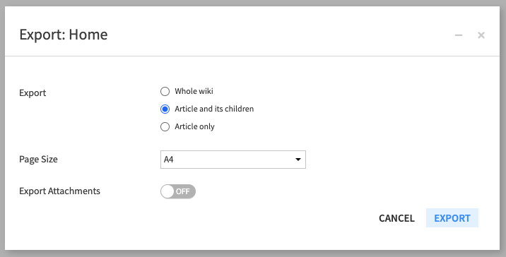
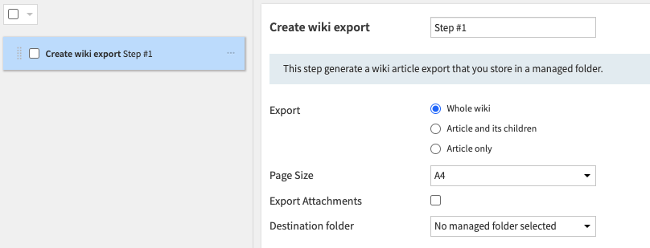
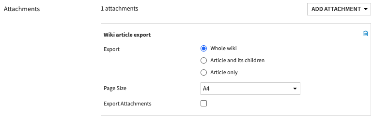

Wikis
######

.. contents::
	:local:

Each DSS project contains a Wiki.

You can use the Wiki of a project:

* To document the project's goals
* To document the project's inputs and outputs
* To document the inner workings of the project
* As a way to organize your work with your colleagues
* To keep track of planned future enhancements

The DSS wiki is based on the well-known :doc:`markdown` language.

In addition to writing Wiki pages, the DSS wiki features powerful capabilities.

Taxonomy
=========

All the pages of the Wiki are organized in a hierarchical taxonomy. Each article can have a "Parent" article (articles can also have no parent and be attached to the root of the hierarchy).

The taxonomy can be browsed in order to get a quick overview of your Wiki

Attachments and links
======================

Attaching files
----------------

You can attach multiple files to each Wiki article. Simply click the "Add attachment" button, and go to the "File" tab

Directly linking to a DSS object
---------------------------------

In your Wiki article, you can create clickable links to any DSS object (dataset, recipe, notebook, ....) in the project or in another project. See :doc:`the documentation about Markdown <markdown>` for details on the syntax to create links to DSS objects

Attaching DSS objects
-----------------------

In addition to links inline in the Wiki article, you can "attach" a DSS object to a Wiki article. This object will always appear in the list of attachments.

Referencing attachments
-------------------------

To add a reference to an attachment in the body of an article, click the attachment name while you are in "Edit" mode for the Article

Folder layout
--------------

Articles can be switched to a "Folder-oriented" layout where the article text appears at the top, followed by a detailed list of all attachments, including both files and DSS objects.

To switch between layouts, use the "Actions > Switch to folder layout" or "Actions > Switch to article layout" buttons in the Actions menu.

Promoted wikis
==============

The administrator of a DSS project can "promote" the Wiki of a project by going to Settings > Wiki.

Wikis that are promoted will appear in the DSS-wide "Wikis" (accessible from the main menu) for users who have access to the project

Help center articles
====================

Selected articles can be made available in the "Support Resources" section of the help center. It is recommended to use this feature to put on the help center a few articles related to your particular onboarding / getting started (for example: where is the data, who to ask for help, ...)

Help center articles are controlled by global DSS administrators, from the "Administration -> Settings -> Help and support" page

.. note::
  You can also give quick access to wiki articles in the home page, by setting them up as promoted content, from the *Administration -> Settings -> Homepage* page. See :ref:`Managing promoted content <managing-promoted-content>` for more details.

Publishing an article on the dashboard
=======================================

There is a :doc:`specific dashboard insight </dashboards/insights/wiki-article>` to show a Wiki article on the dashboard.

Wiki Export
===========

Wiki articles can be exported to PDF files in order to propagate information inside your organization more easily.

Wiki exports can be:

  * Created and downloaded interactively through the wiki user interface
  * Created automatically and sent by mail using the "mail reporters" mechanism in a scenario
  * Created automatically and stored in a managed folder using a dedicated scenario step

Setup
-----

The graphics export feature must be setup prior to being usable.

If you are running Custom Dataiku, follow :doc:`/installation/custom/graphics-export` to enable the export feature on your DSS instance. If you are running Dataiku Cloud Stacks, you do not need any setup.

Interactive usage
-----------------

Export an article directly from a wiki article.

.. image:: img/manual-wiki-export.png

Options
-------

The following options are available:

- Export :

  - Whole wiki : export the entire wiki of the project.
  - Article and its children : export the current article and the entire hierarchy beneath it.
  - Article only : export the current article.

- Page size : determines the dimensions of the page.

- Export attachments : generates a zip file containing the selected articles as a PDF, along with any attachments. Linked DSS items are not exported.

Automatic usage
---------------

In a scenario, there are two ways to create wiki exports, with the same options available as the interactive export:

- Create a "wiki export" step that allows you to store an export in a local managed folder.

- With a mail reporter and a valid mail channel, you can select a "wiki export" attachment. The wiki will be attached to the mail

Page break
----------

There will be a page break between each article in the exported document.

It is also possible to manually insert page breaks in specific places by using the thematic break markers ``---`` or ``
``.
