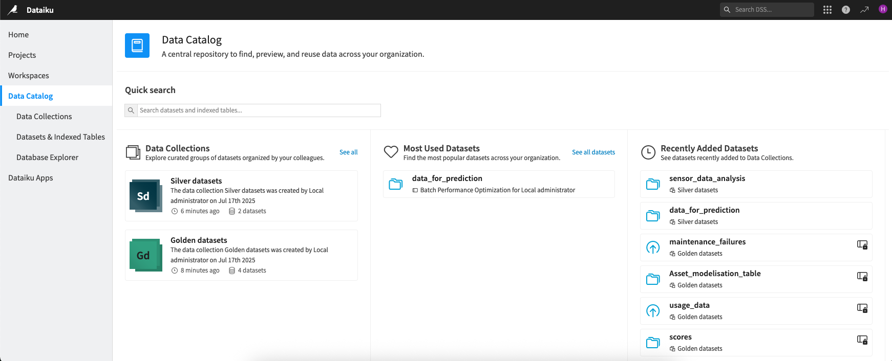

Data Catalog Page
~~~~~~~~~~~~~~~~~~~~~

The Data Catalog page gives you quick access to some of the :doc:`Data Catalog</data-catalog/index>` features:

- on the top, the quick search allows you to search in all :doc:`datasets and indexed tables</data-catalog/datasets-indexed-tables>`
- in the left panel, the list of the :doc:`Data Collections</data-catalog/data-collections/index>`
- in the center, the list of :doc:`Most used datasets</data-catalog/most-used-datasets>`
- in the right panel, the list of recently added datasets to a Data Collection.

