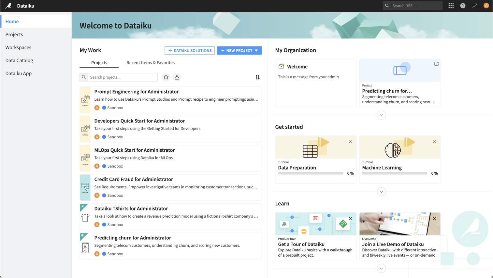

Homepage
**************************

.. meta::
  :title: The Dataiku DSS Homepage
  :description: "Navigate the Dataiku DSS homepage, find the items most relevant to you, and use it to promote content to other Dataiku users in your organization"

After logging in, you are taken to the Dataiku DSS homepage. The homepage is designed to prominently display the information most relevant to you.

For example, if you are a:

* Data scientist, you want quick access to the projects you're currently working on or the objects you recently explored;
* Data consumer without project access, you want quick access to :doc:`Workspaces</workspaces/index>` that have been designed to give you an easy access to shared assets.

Regardless of your role on the team, you'll want immediate access to documentation, or as the instance grows to some key resources (projects, workspaces...)

The personal homepage is broken into several sections:

.. toctree::
  :maxdepth: 1

  landing-page
  projects-page
  workspaces-page
  data-catalog-page
  applications-page

