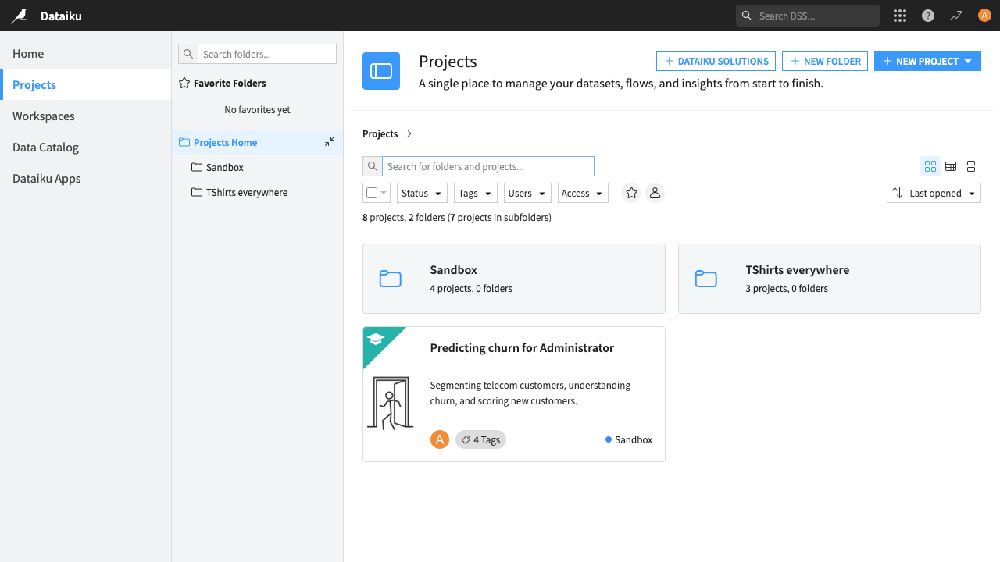
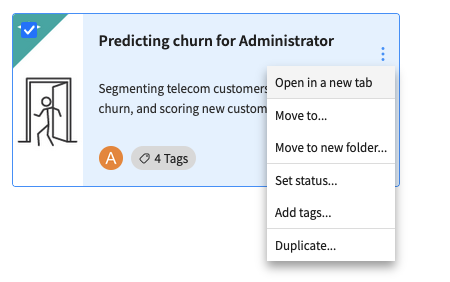

Projects Page
~~~~~~~~~~~~~~~~~

The Projects page allows you to create and manage projects and project folders.

Folders can be nested within other folders, and the folder hierarchy is common for all users across the DSS instance. When you create a project, you can choose its folder.

Managing Projects and Folders
=============================

By right-clicking in a project tile or clicking on the ellipsis button you can:

- manage tags
- change the project status
- duplicate the project

On a project folder, you can:

- rename it
- delete it
- manage permissions

Both projects and project folders can be:

- moved into an other project folder (using the menu, or drag-and-drop)
- marked as favorite by clicking on the star button

You can also select multiple projects and folders using the checkbox on the top-left corner of each tile, or by `ctrl + click` (`⌘ + click` on macos) on the tile.
You can also select all currently displayed project and folders using the mass select button.

.. note::

    Project management capabilities are only available on the projects page, not on the landing page.

    Some actions require specific permissions, and may not be available for all users.

    Some actions are only available when a single item is selected, or when multiple items of the same type are selected (e.g. add tags is only available when no project folder is selected).

Security
========

Folders have Read, Write, and Admin permissions, which can be granted to any groups defined on the instance, or `All Users`. To do so, open the context menu on the folder tile and click on **Permissions**.

When a folder is created within another folder, its default permissions are those of the parent folder; these can later be changed.

.. note::

    Any user with permissions on a project will always have implicit read access to the folder structure containing that project. For example

    * If a user has no explicit access to *folder-1* and no access to any project it contains, then they will not see *folder-1* in the Projects view.
    * However, if they have read access to *project-1*, and *project-1* is contained within *folder-1* (including if it's in a sub-folder), then they will see *folder-1* in the Projects view.

.. note::

    Suppose there is a :ref:`discoverable <project-access>` project contained in *folder-2* or any of its descendants. Any user will always have implicit read access to *folder-2*.

In order to control permissions in the root folder, a new :doc:`permission "Write in root project folder" </security/permissions>` has been added to each security group. This allows administrators to prevent folders and projects from being created in, or moved to, the root.
