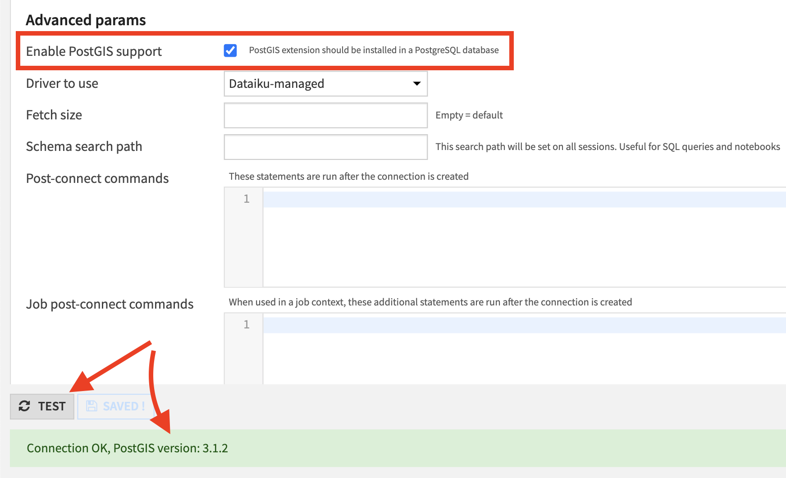

PostgreSQL
###########

.. note::

	You might want to start with our resources on `data connections <https://knowledge.dataiku.com/latest/data-sourcing/connections/index.html>`_ in the Knowledge Base.

DSS supports the full range of features on PostgreSQL:

* Reading and writing datasets
* Executing SQL recipes
* Performing visual recipes in-database
* Using live engine for charts

DSS supports PostgreSQL versions 9 and above. PostgreSQL 8 is not supported.

PostgreSQL on Google Cloud SQL is also supported.

.. note::

	Computing column statistics metrics on PostgreSQL datasets requires a version 9.4 or greater.

Installing the JDBC driver
============================

The PostgreSQL driver is pre-installed in DSS. You don't need any further installation.

Secure connections (SSL / TLS) support
=======================================

DSS can connect to a PostgreSQL server using secure connections.

Setup with certificate validation (recommended)
------------------------------------------------

Importing the server certificate
%%%%%%%%%%%%%%%%%%%%%%%%%%%%%%%%

You first need to obtain and convert the server certificate. Please follow the instructions laid out here:

https://jdbc.postgresql.org/documentation/ssl/

The server certificate should be added to the truststore of the JVM used by DSS, using one of the procedures described at
:ref:`java.ssl.truststore`.

Setting up the PostgreSQL connection
%%%%%%%%%%%%%%%%%%%%%%%%%%%%%%%%%%%%%%%%%%%%%%%%%%%%%%%%%%%%%%%%%%%%%%

In the settings of the connection, add an "Advanced property":

* Key: ``ssl``
* Value: ``true``

Setup without certificate validation (not recommended)
-------------------------------------------------------

Setting up SSL connection without certificate validation is much simpler, but by removing certificate validation, you loose the protection that SSL provides, since an internal attacker could still be able to impersonate the server

In the settings of the connection, add the following 2 "Advanced properties":

* Key: ``ssl``, Value: ``true``
* Key: ``sslfactory``, Value ``org.postgresql.ssl.NonValidatingFactory``

.. _postgis-integration:

PostGIS integration
-------------------

`PostGIS <https://postgis.net/>`_ is a widely used PostgreSQL database extension that allows to store and process geospatial data. DSS can leverage PostGIS functionalities to run geospatial queries directly in the database.

In order to verify that PostGIS is properly installed and can be used in DSS, there's a checkbox available on the PostgreSQL connections page:

.. note::

	DSS supports 2 geospatial types: ``geopoint`` and ``geometry``. By default they'll be translated to ``geography`` type of PostGIS. This behaviour can be changed by setting ``dku.datasets.postgresql.postgis.useGeography`` parameter to ``false`` in the ``config/dip.properties`` file.

