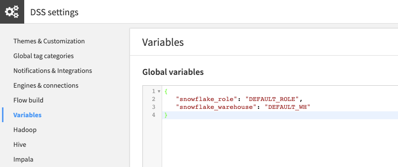
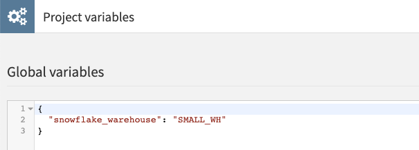
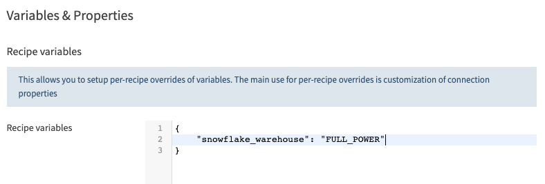
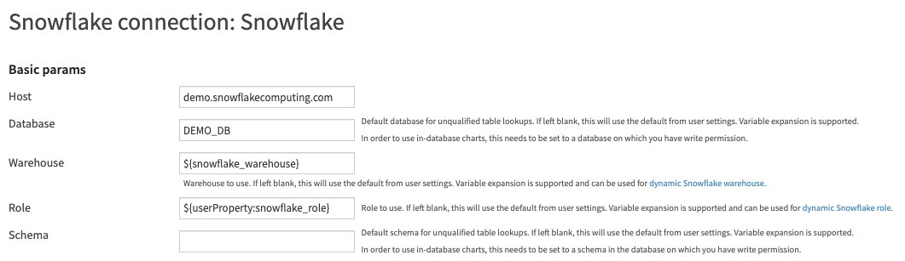
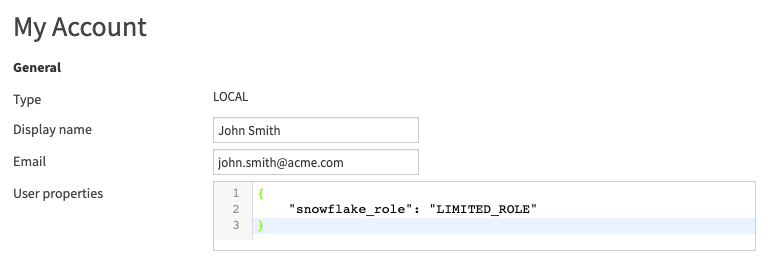

Snowflake
###########

.. contents::
	:local:

.. note::

	You might want to start with our resources on `data connections <https://knowledge.dataiku.com/latest/data-sourcing/connections/index.html>`__ in the Knowledge Base.

DSS supports the full range of features on Snowflake:

* Reading and writing datasets
* Executing SQL recipes
* Performing visual recipes in-database
* Using live engine for charts

In addition, Dataiku supports unique extended computation push-down capabilities, by leveraging unique Snowflake features (Java UDF). See :ref:`connecting-sql-snowflake-pushdown` for more details.

Connection setup (Dataiku Custom, Dataiku Cloud or Dataiku Cloud Stacks)
=========================================================================

The Snowflake JDBC driver is already preinstalled in DSS and does not need to be installed

* Fill in the settings of the connection using your Snowflake information.
* (Optional but recommended) Fill auto-fast-write settings - see :ref:`connecting-sql-snowflake-writing`
* (Optional but recommended) Enable advanced pushdown - see :ref:`connecting-sql-snowflake-pushdown`
* (Optional but recommended) Enable Spark integration - see :ref:`connecting-sql-snowflake-spark`

Authenticate using OAuth2
==========================

DSS can authenticate to Snowflake using OAuth2.

OAuth2 access is performed using per-user credentials, or global credentials (that is, using client credentials flow). With per-user credentials, each user must grant DSS permission to access Snowflake on their behalf. With global credentials, DSS authenticates on Snowflake with the identity of the OAuth client, which needs to be mapped to some user in Snowflake.
You can use your own OAuth2 authorization server so the exact configuration will depend on your environment, but you will need to first set up your OAuth2 authorization server and then a security integration in Snowflake to establish a trust.

Both "External OAuth" and "Snowflake OAuth" are supported

In your Snowflake security integration, the ``oauth_redirect_uri`` parameter should have the format ``DSS_BASE_URL/dip/api/oauth2-callback`` as described under :ref:`plugins.installed.oauth2_credentials`.

(*See the* `official documentation <https://docs.snowflake.com/en/user-guide/oauth.html>`__  *for more details*)

Once you have a trust between your OAuth2 authorization server and Snowflake, do in DSS the following:

* Create a new Snowflake connection
* Fill in the basic params (Host, Database, Warehouse, Role, Schema) as usual
* Select "OAuth" as the "Auth Type". Note that this will force you to use per-user credential.
* Fill the "Client id", "Client secret" (if there is one) with the information from your OAuth app
* Fill the "authorization endpoint" and "token endpoint" with your endpoint. Or leave them blank if you are using the default Snowflake OAuth2 server
* Fill the scope with the operations and roles permitted for the access token (This depends on your OAuth Server so check the official doc). Or if you do not want to manage Snowflake roles in your OAuth2 server, pass the static value of ``SESSION:ROLE-ANY`` in the scope.
* Depending on your OAuth2 server you may also need to ask for a refresh token in the scope. This is usually done by adding ``offline_access`` to the scope but that may vary depending on your OAuth2 provider.
* Create the connection (you can't test it yet)

If using global credentials, you can then test the connection. If using per-user credentials, for each user:

* Go to user profile > credentials
* Click the "Edit" button next to the new connection name
* Follow the instructions that appear
* You can now test the connection

Common errors
---------------

* Problem: OAuth2 token request did not return a refresh token.
* Solution: Be sure that you ask for an OAuth 2.0 refresh token in the scope. This is usually done by adding ``offline_access`` to the scope but it may vary depending on your OAuth2 provider.

Using Key-pair authentication
=============================

DSS can authenticate to Snowflake using Key-pair authentication.

Follow the `official documentation <https://docs.snowflake.com/en/user-guide/key-pair-auth>`__ for setting up your keys (DSS supports encrypted and non-encrypted keys)

Once done,

* Create a new Snowflake connection
* Fill in the basic params (Host, Database, Warehouse, Role, Schema) as usual
* Select "Key Pair" as the "Auth Type"
* Enter the user name
* Enter the path on your disk to the key in the "Private key file" field
* Or, copy-paste the key directly in the "Private key" field
* If necessary, enter the 'passphrase' used when generating the key in the "Private key password"
* Create the connection, and test it

Snowflake's Spark native integration may not support some encryption algorithms. See the `official documentation <https://docs.snowflake.com/en/user-guide/key-pair-auth#supported-snowflake-clients>`__ for restrictions.

.. _connecting-sql-snowflake-writing:

Writing data into Snowflake
============================

Loading data into a Snowflake database using the regular SQL ``INSERT`` or ``COPY`` statements is inefficient and should only be used for extremely small datasets.

The recommended way to load data into a Snowflake table is through a bulk COPY from files stored in Amazon S3, Azure Blob Storage or Google Cloud Storage (depending on the cloud your Snowflake is running on).

DSS can automatically use this fast load method. For that, you require a S3, Azure Blob or Google Cloud Storage connection. Then, in the settings of the Snowflake connection:

* Enable "Automatic fast-write"
* In "Auto fast write connection", enter the name of the cloud storage connection to use
* In "Path in connection", enter a relative path to the root of the cloud storage connection, such as "snowflake-tmp". This is a temporary path that will be used in order to put temporary upload files. This should not be a path containing datasets.

DSS will now automatically use the optimal cloud-to-Snowflake copy mechanism when executing a recipe that needs to load data "from the outside" into Snowflake, such as a code recipe.

Note that when running visual recipes directly in-database, this does not apply, as the data does not move outside of the database.

The cloud storage and Snowflake connections must be in the same cloud region.

Requirements on the cloud storage connection
----------------------------------------------

* For Amazon S3

	* The S3 connection must not be using "Environment" mode for credentials
	* You may `use a Snowflake storage integration and optionally an external stage <https://docs.snowflake.com/en/user-guide/data-load-s3-config-storage-integration>`__ (the "Environment" mode restriction does not apply in this case).

		* If using only a storage integration, save the storage integration name in the S3 connection settings in the "Storage integration" field.
		* If using an external stage, save the stage name in the S3 connection settings in the "External stage name" field, and the stage path in the "External stage path" field.

* For Azure Blob

	* You may `generate a SAS Token <https://docs.snowflake.net/manuals/user-guide/data-load-azure-config.html#generating-an-sas-token>`__, then save the token in the Azure Blob Storage connection settings in the "SAS Token" field.
	* Or, you may `use a Snowflake storage integration and optionally an external stage <https://docs.snowflake.com/en/user-guide/data-load-azure-config#option-1-configuring-a-snowflake-storage-integration>`__.

		* If using only a storage integration, save the storage integration name in the Azure Blob Storage connection settings in the "Snowflake storage integration" field.
		* If using an external stage, save the stage name in the Azure Blob Storage connection settings in the "Snowflake external stage name" field, and the stage path in the "Snowflake external stage path" field.

* For Google Cloud Storage

	* You must `create a Snowflake storage integration and optionally an external stage <https://docs.snowflake.com/en/user-guide/data-load-gcs-config.html#configuring-a-snowflake-storage-integration>`__.

		* If using only a storage integration, save the storage integration name in the GCS connection settings in the "Storage integration" field.
		* If using an external stage, save the stage name in the GCS connection settings in the "External stage name" field, and the stage path in the "External stage path" field.

If you choose to use an external stage:

* You may need to qualify the stage name with the database and schema where the stage was created. Use double quotes on the database, schema, or stage part or use a fully qualified stage name, with the same identifier quoting as Snowflake (double quotes).
* The stage path must match what you entered in when creating the external stage in Snowflake.
* You do not need to enter the storage integration name in the connection settings.

Explicit sync from cloud
------------------------

In addition to the automatic fast-write that happens transparently each time a recipe must write into Snowflake, the Sync recipe also has an explicit "Cloud to Snowflake" engine. This is faster than automatic fast-write because it does not copy to the temporary location in the cloud storage first.

It will be used automatically if the following constraints are met:

* The source dataset is stored on S3, Azure Blob Storage or Google Cloud Storage
* The destination dataset is stored on Snowflake
* The cloud storage side is stored with a CSV format, using the UTF-8 charset
* For the cloud storage side, the "Unix" CSV quoting style is not used
* For the cloud storage side, the "Escaping only" CSV quoting style is only supported if the quoting character is ``\``
* For the cloud storage side, the files must be all stored uncompressed, or all stored using the GZip compression format

In addition:

* The cloud storage and the Snowflake cluster must be in the same cloud region
* The "Requirements on the cloud storage connection" defined above must be met.
* Additionally, the schema of the input dataset must match the schema of the output dataset, and values stored in fields must be valid with respect to the declared Snowflake column type.

Unloading data from Snowflake to Cloud
=======================================

Unloading data from Snowflake directly to DSS using JDBC is reasonably fast. However, if you need to unload data from Snowflake to S3, Azure Blob Storage or Google Cloud Storage, the sync recipe has a "Snowflake to Cloud" engine that implements a faster path.

In order to use Snowflake to Cloud sync, the following conditions are required:

* The source dataset must be stored on Snowflake
* The destination dataset must be stored on Amazon S3, Azure Blob Storage or Google Cloud Storage
* The cloud storage and the Snowflake cluster must be in the same cloud region
* The "Requirements on the cloud storage connection" defined above must be met.
* The cloud storage side must be stored with a CSV format, using the UTF-8 charset
* For the cloud storage side, the "Unix" CSV quoting style is not supported
* For the cloud storage side, the "Escaping only" CSV quoting style is only supported if the quoting character is ``\``
* For the cloud storage side, the files must be all stored uncompressed, or all stored using the GZip compression format
* Additionally, the schema of the input dataset must match the schema of the output dataset, and values stored in fields must be valid with respect to the declared Snowflake column type.

.. _connecting-sql-snowflake-pushdown:

Extended push-down
====================

.. note::

	This feature is automatically enabled on Dataiku Cloud, no action is required.

Dataiku can leverage unique Snowflake capabilities (Java UDF) in order to extend push-down of both prepare recipes and scoring recipes, for much enhanced performance.

Extended push-down capabilities are documented in:

* :doc:`/preparation/engines`
* :doc:`/machine-learning/scoring-engines`

In order to enable extended push-down, you need to:

* In your Snowflake account, create a stage that is writable by the user(s) configured in the Snowflake connection
* Ensure that you have installed DSS using a Java JDK and not JRE
* In the Snowflake connection settings, enable "Use Java UDF"
* In "Stage for Java UDF", enter the name of the stage created above
* In "path in stage", enter a path within the stage. This can be anything, such as "dataiku-pushdown"

.. _connecting-sql-snowflake-spark:

Spark native integration
=========================

The native integration with Spark allows Spark recipes reading from and/or writing to Snowflake datasets to directly exchange data with a Snowflake database. This results in a large increase in performance compared to the default method where data read from or written to Snowflake must be streamed through DSS first. All Spark recipes which have a Snowflake dataset as an input or an output will automatically take advantage of the native integration with Snowflake if enabled on the connection.

For each Snowflake connection, you must enable "Use Spark native integration" in the Snowflake connection settings.

Snowpark integration
====================

Dataiku can leverage the Snowpark framework in order to read Dataiku datasets stored in Snowflake, build queries using Dataframes and then write the result back to a Snowflake dataset.

Snowpark integration can be used in Python code recipes and in Jupyter notebooks.

In order to use it, you will need:

* A Snowflake Account with Anaconda Integration enabled by ORGADMIN
* A Snowflake connection using user/password credentials (OAuth support to come soon), with Security option "Details readable by" set to Every analyst or Selected groups.
* A Dataiku Code Env based on Python 3.8, with the package "snowflake-snowpark-python" installed.

To get started with Snowpark, follow these steps:

* Ensure the above prerequisites are fulfilled
* Create a Snowflake dataset
* From this dataset, create a Python recipe with an output dataset stored on the Snowflake connection
* Switch to Advanced tab. In the Python environment section, select a Code Env with Snowpark installed
* Switch to Code tab. Delete all lines except the first two (keep the import dataiku)
* Click the "{} CODE SAMPLES" button and enter Snowpark in the search field.
* Select "Read and Write datasets with Snowpark"
* Click the "+ INSERT" button corresponding to "Load a dataset as a Snowpark dataframe and write into another dataset"
* Run the recipe. You're all set.

Switching Role and Warehouse
=============================

Snowflake allows users to execute SQL operations while assuming a specific user Role and using a specific Warehouse.

In Dataiku, users have the flexibility to assume a different Role and use a different Warehouse for each recipe of the flow through defining connection variables for:

* Role
* Warehouse

How to set it up
-----------------

**1. Parameterize the Snowflake connection**

In the definition of the Snowflake connection, substitute the desired parameters by variables. Here, our Roles and Warehouses in Snowflake are uppercase so we capitalize the parameters:

.. image:: img/snowflake-connection-with-variables.png

**2. Define instance-level variables**

.. note::

	On Dataiku Cloud, global variables are defined in the launchpad's settings tab.

Defining instance-level variables helps prevent cases where the user will not define a value for the parameters. Global variables will be used as default values.

**3. Override the variables where needed**

This can be recursively done, overriding parameters in the order shown here (where left overrides right): Recipe > Scenario > Project > User > Global

A typical use case involves overloading the Warehouse at the project level:

For some use cases it is also possible to overload the Warehouse at the recipe level:

Another use case involves overloading the Role at the user level. User properties are prefixed via ``userProperty:`` so you would
need to use the syntax ``${userProperty:snowflake_role}`` instead of ``${snowflake_role}`` when parameterizing the Snowflake connection, and
the global variable would be named ``userProperty:snowflake_role``. Then each user would be able to override the role by adding a property ``snowflake_role`` to their profile:

Limitations and known issues
=============================

Visual recipes
----------------

* Sample/Filter: "contains" operator is not supported
* Group: aggregating on booleans is not supported
* Window: cumulative average is not supported (Snowflake limitation)
* Prepare: in the formula processor, when providing a date parameter to a function, the displayed date might differ between the preview and a real SQL query. It is possible to set the format by setting Advanced JDBC properties in the connection, like `TIMESTAMP_OUTPUT_FORMAT` for timestamp. See https://docs.snowflake.com/en/user-guide/date-time-input-output.html#output-formats for more information.

Coding recipes
---------------

* Execution plans are not supported

Sampling
--------

* The random number of rows :doc:`sampling method </sampling/index>` will not be pushed-down to Snowflake if a random seed is used

Breaking changes
-----------------

8.0.2 -> 8.0.3:

* All columns of type `TIMESTAMP_NTZ` are now stored in DSS as String, unless users have checked the option `Read SQL timestamp without timezone as DSS dates`
* When the Snowflake session `TIMESTAMP_TYPE_MAPPING` consider `TIMESTAMP` to be `TIMESTAMP_NTZ`, all columns of type `TIMESTAMP` are now stored in DSS as String, unless users have checked the option `Read SQL timestamp without timezone as DSS dates`

Advanced install of the JDBC driver
====================================

.. note::

	This feature is not available on Dataiku Cloud.

The Snowflake JDBC driver is already preinstalled in DSS and does not usually need to be installed. If you need to customize the JDBC driver, follow the instructions below.

The Snowflake JDBC driver can be downloaded from Snowflake website (https://docs.snowflake.net/manuals/user-guide/jdbc.html).

The driver is made of a single JAR file ``snowflake-jdbc-VERSION.jar``.

To install:

* Copy this JAR file to the ``lib/jdbc/snowflake`` subdirectory of the DSS data directory (make it if necessary)
* Restart DSS
* In each Snowflake connection, switch the driver mode to "User provided" and enter "lib/jdbc/snowflake" as the Snowflake driver directory

Spark integration
-----------------

The Spark native integration is preinstalled and does not usually need to be installed. Only follow these steps for custom installations.

Two external JAR files are required to be installed in DSS:

* The same Snowflake JDBC driver mentioned above
* The Snowflake Connector for Spark (provided by Snowflake). It can be downloaded directly from Maven under the ``spark-snowflake_2.12`` artifact ID (https://central.sonatype.com/artifact/net.snowflake/spark-snowflake_2.12). Make sure to choose the correct version of the connector for the version of Spark installed (versions 3.0-3.4 are supported).

.. note::

	The version of the Snowflake Connector JAR must be compatible with the version of the Snowflake JDBC driver. For example, an older version of the JDBC driver combined with the latest version of the connector may cause errors with confusing exception messages when running jobs. We recommend using the latest version of each JAR.

* Copy both of these JAR files to the ``lib/java`` subdirectory of the DSS data directory (even if the JDBC driver has already been placed in ``lib/jdbc`` as described above)
* Restart DSS
* Check the "Use Spark native integration" box in the Snowflake connection settings. This checkbox can also be used to toggle the integration on and off without having to remove the JARs.
