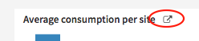

Dashboard concepts
####################

Dashboards, tiles and insights
===============================

| A DSS project can contain multiple dashboards and each dashboard can be made of multiple pages.
| Tiles can be added to pages, and the content of some can be refined directly from the dashboard using filters.

There are three kinds of tiles:

* Simple tiles:

  * Text tile: to add some text and titles to your dashboard.
  * Image tile: to add images to your dashboard.
  * Embedded page: to add a web page to your dashboard.
  * Group tile: to group tiles together. See :ref:`Group tile <group-tile>` for more information.

* Insight tiles. Each of these tiles displays a single insight. See :doc:`Insights <insights/index>` for more information.
* Filters panel: tile. See :doc:`Filters <filters>` for more information.

Navigation
----------

There are different ways to navigate between multiple pages of a dashboard :

* Using the preview on the left
* Clicking on navigation arrows (after enabling the option to display them in the dashboard settings)
* Using shortcuts (⌥ Option / Ctrl + → or ↓ for next and ⌥ Option / Ctrl + ← or ↑ for previous)

There is also a **circular navigation** option in the dashboard settings, allowing you to move from the last page back to the first one, and vice versa.

Tile positioning
----------------

Spacing
^^^^^^^

The spacing between tiles can be set in the dashboard settings.

Stack up tiles
^^^^^^^^^^^^^^

You can turn on **Stack up automatically** to enter a mode where tiles are automatically rearranged whenever you move or resize them, ensuring that no vertical gaps remain. This keeps the dashboard compact and neatly organized.

To enable or disable this behavior:

* Go to the dashboard settings and toggle **Stack up automatically**. When enabled, it will apply to all tiles across all pages of the dashboard.
* To set the default value for all new dashboards you create, change the option in your user settings.

If the option is disabled, you can still stack tiles manually at any time:

* Right-click on a dashboard page and select **Stack tiles up** from the contextual menu. This will remove all vertical gaps on the current page.
* You can also perform the same action inside a group tile to remove vertical gaps within that group.

.. _group-tile:

Group tile
----------

A *group tile* is a container used to organize multiple tiles together. It helps visually and functionally group related content, and offers customization options for layout and styling.

It allows you to:

* Frame several tiles inside a customizable container
* Personalize the group's background color and opacity
* Control the spacing between tiles within the group

Creation
^^^^^^^^

To create a group tile, switch your dashboard to **edit mode**, then use one of the following methods:

* From the **"+ NEW TILE"** modal: select `Group tile`
* By grouping existing tiles:

  1. Select multiple tiles: you can select multiple tiles using either method:

    * **Click selection**: Hold ``ctrl`` (Linux/Windows) or ``cmd`` (macOS) and click each tile you want to include
    * **Rectangle selection**: Hold the ``Shift`` key and click and drag with the left mouse button to draw a rectangle. Any tile touched by the rectangle will be selected.

    .. image:: img/rectangle-selection.png

  2. Click the **"Group tiles"** button displayed on the left panel or use the shortcut:

    * ``ctrl`` + ``alt`` + ``G``  on Linux and Windows
    * ``cmd`` + ``option`` + ``G`` on macOS

Any unselected tile that overlaps with the newly created group tile will be pushed to the bottom of the dashboard.

Editing
^^^^^^^

A group tile can be edited, rearranged and styled:

* **Rearrange tiles**: Select the group tile, then drag and resize the tiles inside the group as needed
* **Add tiles**: Drag and drop additional tiles from the main dashboard grid into the group tile
* **Remove tiles**: Select the group tile, then drag a tile out of the group, into the main dashboard grid
* **Customize**:
  
  * Change the **background color** and **opacity** in the group tile’s settings panel
  * Adjust the **spacing between inner tiles** in the settings panel:

    * Choose to inherit the dashboard’s default tile spacing
    * Or define a custom spacing value (in pixels)

Deletion
^^^^^^^^

You have two options to delete a group tile:

* **Delete the entire group and its content**: Click the trash icon in the group tile’s header.
* **Ungroup tiles**:  You can ungroup tiles to remove the container and return all inner tiles to the main dashboard grid.

    * Click the **Ungroup** icon in the group tile’s header.
    * Select the group tile, then use the shortcut:

        * ``ctrl`` + ``alt`` + ``G``  on Linux and Windows
        * ``cmd`` + ``option`` + ``G`` on macOS

Insights
----------

An insight is a piece of information that can be shared on a dashboard. There are many kinds of insights:

* :doc:`A dataset, as a tabular representation <insights/dataset-table>`
* :doc:`A chart <insights/chart>`
* :doc:`The report of a machine learning model <insights/model-report>`
* :doc:`The contents of a DSS managed folder <insights/managed-folder>`
* :doc:`A DSS metric <insights/metric>`
* :doc:`The report of a scenario <insights/scenario>`
* :doc:`A button to run a scenario <insights/scenario>`
* :doc:`An export from a Jupyter notebook <insights/jupyter-notebook>`
* :doc:`The display of a webapp <insights/webapp>`
* Activity & comments feed of any DSS object
* Activity summary reports of a DSS project
* A button to run a DSS macro

Each insight lives independently from dashboards and can be attached on multiple dashboards. By default, DSS always creates new insights when adding something to the dashboard, but you can also choose to reattach an existing insight.

Most insights *reference* DSS objects:

* A dataset table references a dataset
* A chart references a dataset
* A machine learning model report references the machine learning model
* A DSS metric insights references a dataset, model or folder

Security is owned by the referenced objects, through the :doc:`Authorized objects </security/authorized-objects>` mechanism. In other words, if a dataset added as an authorized object with the READ mode, it is considered as 'dashboard-authorized', and the dashboard-only users of the project will be able to create dataset tables, charts and comment insights based on this dataset.

Insights live independently from their referenced objects. In most cases, modifying anything on the insight will either be impossible, or will not reflect in the original object.

When you are on the dashboard, you can go to a full-size view of the insight by clicking on the Go button

Permissions
=============

Owners
--------

Each dashboard (and each insight) has an owner, who is the person who created this dashboard (resp insight).

The following people (apart from the owner) can modify a dashboard created by a given user:

* People who have "Write Dashboard" access to the project (See :doc:`/security/permissions`)
* DSS administrators

Dashboard visibility
----------------------

Everybody who has "Read dashboards" permission to the project can view a dashboard, regardless of who created it: dashboards don’t carry access restrictions. However, by default, dashboards are unpromoted. An unpromoted dashboard is readable but not visible to users with "Read dashboards".

To view an unpromoted dashboard, you need to know its URL. This makes it easy to share dashboards with colleagues by sending them the URL.
People who have "Write dashboards" permission on the project can see and edit all dashboards in the list (even unpromoted ones of which they are not the owner). They can also promote a dashboard and make it visible to "Read dashboards" users.

Editing the dashboard as an analyst
-------------------------------------

When you have "Read project content" on the project, you may add every item to the dashboard, not only items which are previously dashboard-authorized.

Each time you add an item to the dashboard (either directly from the item, or from the dashboard), if this object is not already in the dashboard authorizations, you will get a warning that dashboard-only users will not be able to see this insight, since the source is not dashboard-authorized.

* If you have "Manage authorized objects" permission, you'll get a prompt to add it automatically
* If you don't have "Manage authorized objects" permission, you'll only have a warning indicating that you must ask your project administrator
