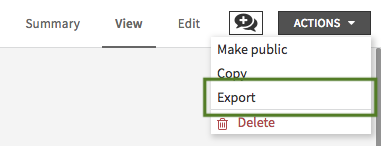
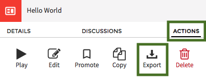
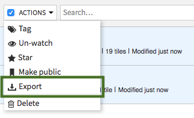
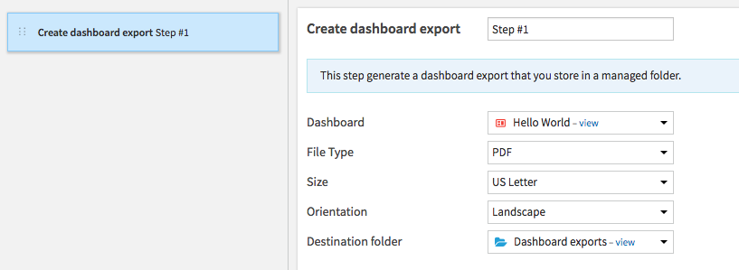
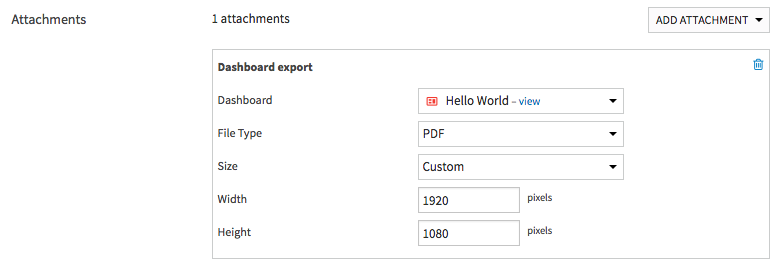

Exporting dashboards to PDF or images
######################################

Dashboards can be exported to PDF or image (PNG, JPG) files in order to propagate information inside your organization more easily.

Dashboard exports can be:

* created and downloaded manually from the dashboard interface
* created automatically and sent by mail using the "mail reporters" mechanism in a scenario
* created automatically and stored in a managed folder using a dedicated scenario step

If the exported dashboard has filters applied to it, these filters will be re-used to build the export.

Setup
======

The dashboards export feature must be setup prior to being usable.

Follow :doc:`/installation/custom/graphics-export` to enable the export feature on your DSS instance.

Manual usage
=============

In dashboard tab, there are three ways to download it directly:

- Inside dashboard menu in edit and view mode. In view mode, any filter changes will be used to build the export even if they are not persisted in the dashboard itself.

- After selecting a dashboard in the list, go to actions tab.

- Inside dashboard menu in list mode. With this one, you can select multiple dashboard exports and export it in one click. Pretty neat, right?

Automatic usage
=================

In a scenario, there are two ways to create dashboard exports:

- Create a "dashboard export" step that allows you to store an export in a local managed folder.

- With a mail reporter and a valid mail channel, you can select a "dashboard export" attachment. The dashboard will be attached to the mail

Settings
===========

Files generated are fully customizable so users are fully in control over what they obtain. There are several parameters that will enable it:

- File type, to select the type of files to generate (PDF, PNG or JPEG).
- Export format, to determine images dimensions.
- If a standard format (A4 or US Letter) is chosen, images dimensions will be calculated based on your screen resolution and the chosen orientation (Landscape or Portrait). On the contrary, Custom format allow to set custom width and height.
