Filters
#######

| Filters can be applied to a dashboard page to refine its insights.
| They remove data from all filterable insights on the page, enabling you to explore the data and focus on what matters.

Filterable insights are:

* charts
* dataset tables

.. note::
    Chart and dataset insights can be filtered themselves. Dashboard filters are applied on top of insight filters.

The filters panel
=================

You can add filters to the filters panel in edit mode, or through cross-filtering from the chart and dataset table insights in view mode.

For more information about cross-filtering, see the :ref:`Cross-Filtering` section below.

The filters panel offers different options depending on the mode you are in.

* In View mode, you can interact with any filters that already exist in the panel. You can only add new filters using cross-filtering (if enabled).
* In Edit mode, you can add and remove filters as well as configure their default states. You can also access the individual filter settings or the panel configuration options.

.. note::
    Both modes allow disabling all the filters in the panel as well as expanding or collapsing all the filters at once. Please note that these options won't be saved, even in Edit mode.  

Filters in View mode
--------------------

In View mode, you can explore the data by interacting with the filters created by the dashboard owner. If cross-filtering is enabled, you can also create new filters from chart and dataset table insights.

You are only modifying your local instance of the dashboard page. Any changes made in View mode will be lost when exiting the dashboard.
If you want to save or share the modifications you applied on filters, see :doc:`Filtering a dashboard using a query parameter in the URL <url-filters-query-param>`.

Filters in Edit mode
--------------------

In Edit mode, you can define which filters will be applied to the dashboard page as well as how they will be presented on the page.

When adding your first filters on a page, you will need to select a dataset. You can either pick an existing tile to automatically reuse its underlying dataset, or manually search for a dataset.

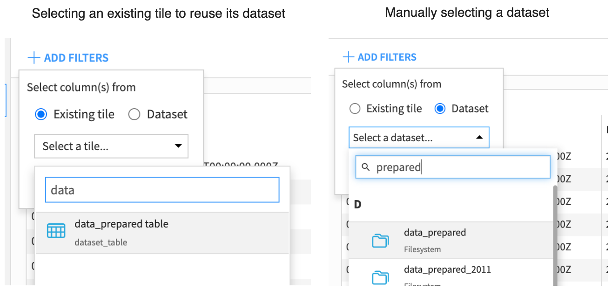

The columns of the chosen dataset can then be selected to create filters.

When adding filters on a page that already had filters, you will only need to choose from which columns.

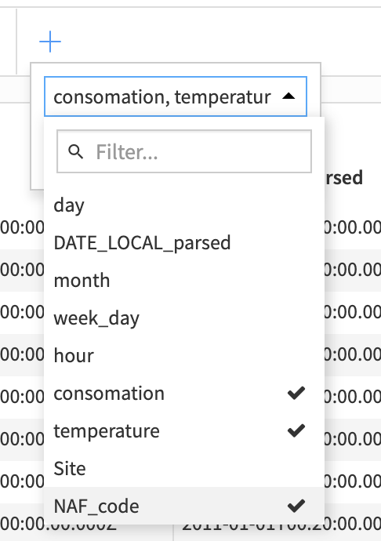

To change from which dataset to add filters from, start by removing all the filters in the filters panel, and start again the process of adding filters. This way, you'll be asked to select a dataset.

You can quickly remove all filters in the panel using the "Remove all filters" entry in the panel menu.

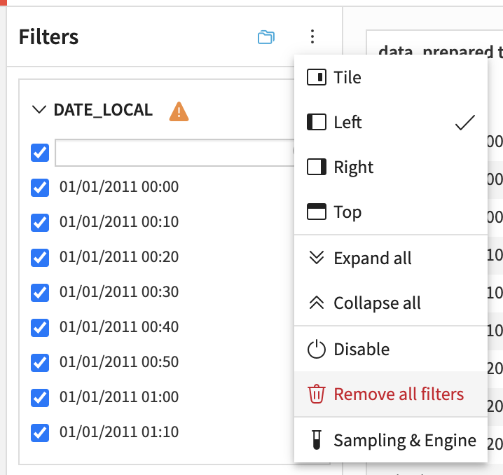

.. note::
    To reorder filters, use your mouse to drag and drop them at the preferred locations. 

In Edit mode, filter default states can be defined in the filter settings menu. You will also decide if their facet should display "Only relevant values" - the values remaining after other filters are applied, or if it should display "All values in sample" - every value regardless of other filters.

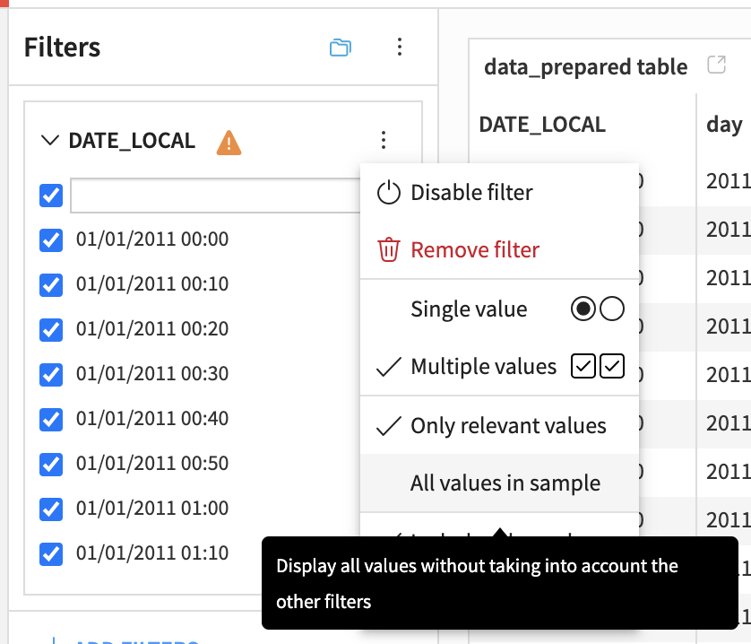

In the filter settings menu, you can also choose between "Include other values" or "Exclude other values." This allows you to decide if new values added to the dataset or values absent from the filter facet but present in other insight samples should be included or excluded.

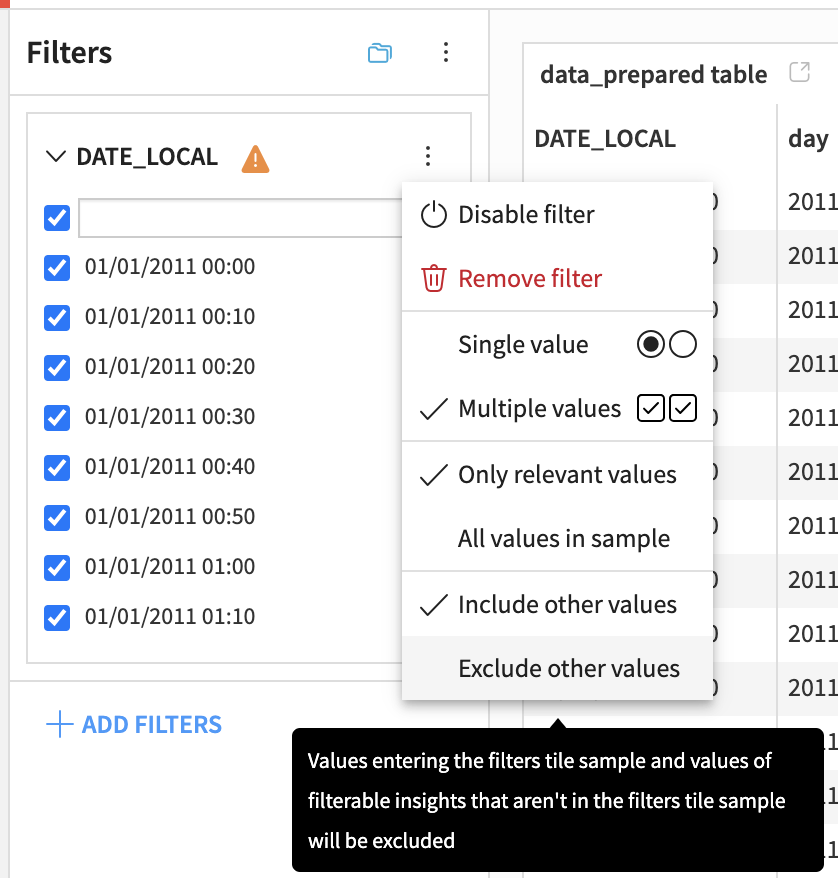

For more information about filter settings, see :doc:`charts filter settings </visualization/filter-settings>`.

In Edit mode, you can choose where the filters panel will be positioned. The available positions are at the top, at the left, at the right, or inside the page as a tile.

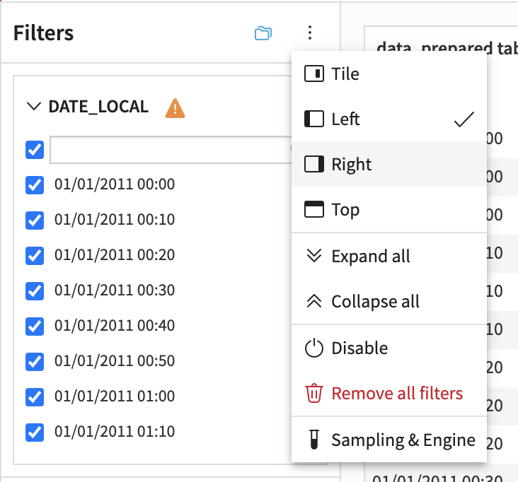

.. note::
    While it is not encouraged, you can change which engine (DSS or SQL) is used to process the filters, and which sampling to apply using the "Sampling & Engine" entry in the panel menu.
    By default, the filters panel uses the same engine as the selected dataset and uses all its data (no sampling).

.. _Cross-filtering:

Cross-filtering
===============

In view mode, you can create filters from chart and dataset insights. This action is called cross-filtering.
Filters created using cross-filtering are added to the filters panel and applied to all filterable tiles on the dashboard page.

Two kinds of filters can be created using cross-filtering:  
- "Include only": only the filtered value will be kept and displayed in the filterable tiles.  
- "Exclude": the filtered value will be discarded from the filterable tiles.  

If your chart is multidimensional you'll be able to choose between including/excluding all dimensions at once and selecting which dimension to include/exclude.

.. note::
    Using the multidimensional "Include only" will give the same result as using the unidimensional "Include only" on all the dimensions.  
    However, using the multidimensional "Exclude" will discard the rows satisfying all the conditions, while using the unidimensional "Exclude" on all the dimensions will discard the rows satisfying at least one of the conditions.

From a chart insight
--------------------

To cross-filter from a chart insight, you can hover the data point of interest and then either:

1. right-click to open a contextual menu from which all filtering actions are available.

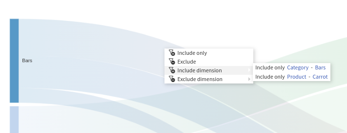

2. click on the data point to pin the tooltip. Once the tooltip is pinned, a filter icon will appear next to each dimension, allowing cross-filtering.

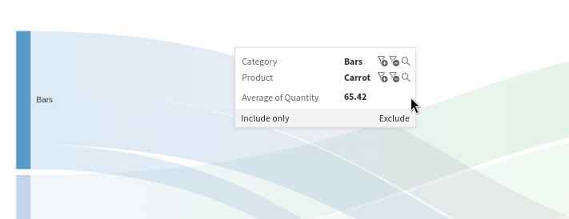

From a dataset insight
----------------------

To cross-filter from a dataset insight, hover the cell of interest and open the contextual menu by right-clicking on it.
In the contextual menu, click on the "Include only" entry to cross-filter.

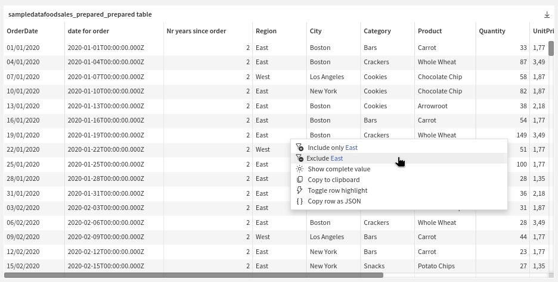

Filters created using cross-filtering
--------------------------------------

When possible, cross-filtering updates the filters present in the filters panel.
For example, suppose the filters panel contains a filter on the numerical column "Age" and the filter is created using cross-filtering on the same column. In that case, the cross-filtering value will be applied to the existing filter.

When updating an existing filter is impossible, either because there is no matching filter in the filters panel or because of a filter type incompatibility, a new filter with a minimal UI will be created. In this case, the filter's value won't be editable, but the filter will be deactivatable and removable.

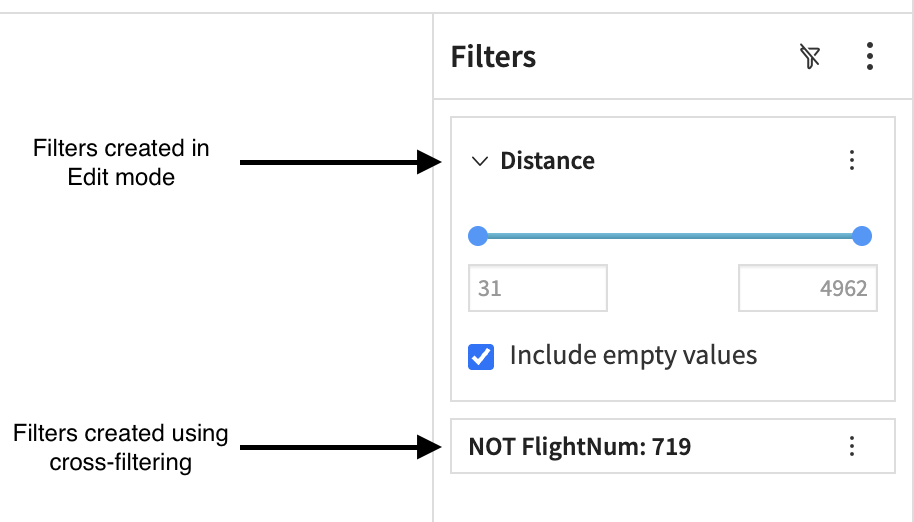

Turning cross-filtering on or off
--------------------------------------

Cross-filtering is enabled by default for dashboard pages containing a filters panel. To disable cross-filtering in this case, switch to edit mode, and in the "Slide" tab, uncheck the "Cross-Filtering" option under the "Filters" section.

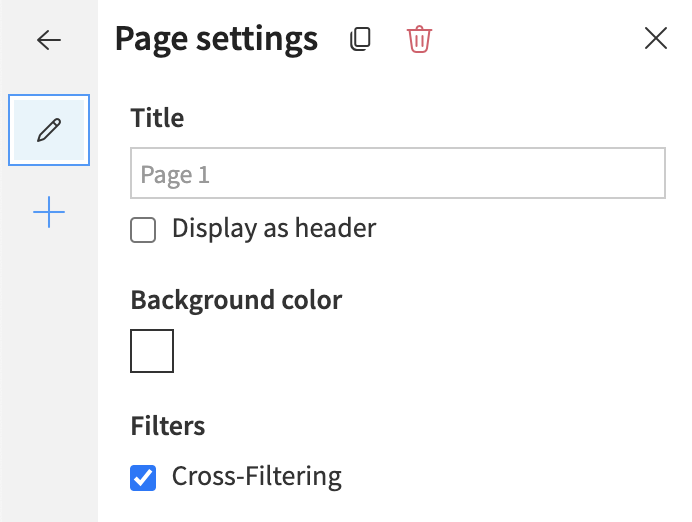

If a dashboard page doesn't contain a filters panel, cross-filtering is disabled, and a filters panel needs to be added to enable cross-filtering.
