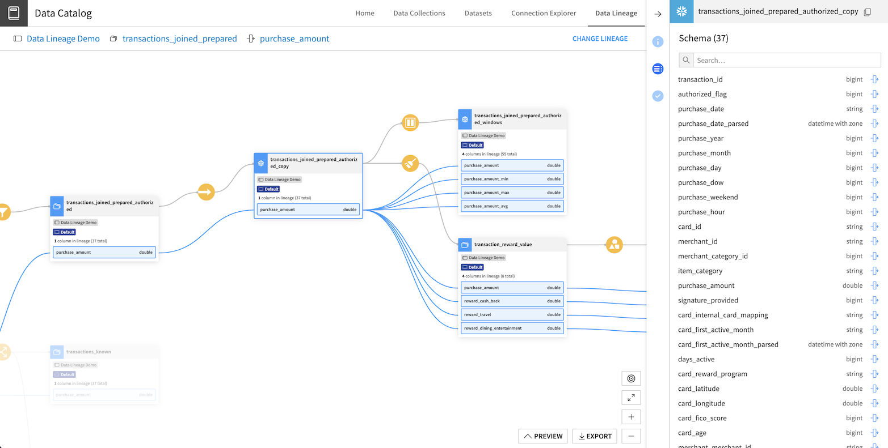

Data Lineage
##########################

With **Data Lineage**, you can track how column-level data is transformed across datasets and projects within your organization’s Dataiku instance.
The data lineage view captures "direct" lineage between columns, which means that the transformation impacts the values of the output column directly.

From this view, you can investigate a column's lineage both upstream and downstream to track the origin of a data issue or notify stakeholders of changes to downstream pipelines.

.. toctree::
    :maxdepth: 2

    access
    manual-lineage
    graphics-export
