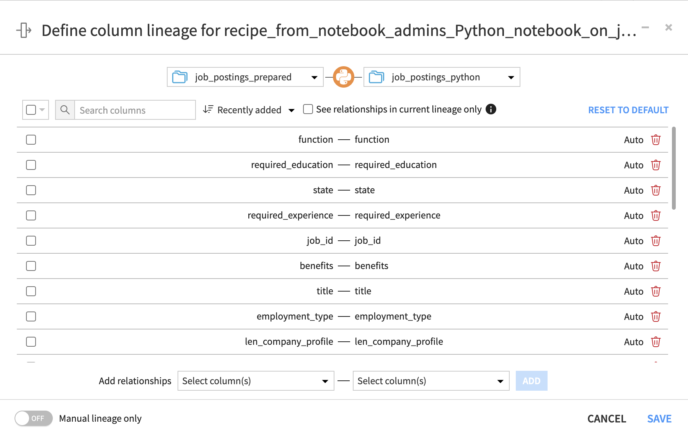

Manual lineage
##############

For some recipes and prepare recipe steps, column lineage might not be certain. For example, it's not currently possible to generate certain lineage for code recipes or transformations that create new columns from rows (e.g. pivot recipe, split and unfold processor, etc). 
In these scenarios, the lineage is built with simple name-based matching, and you're able to manually edit the lineage easily from the UI.

You can access the manual lineage settings from:

* The Data Lineage view: blue icon on uncertain recipes.
* The advanced settings tab of a recipe.

.. note::

    "Manual lineage only" mode allows you to restrict the Data Lineage to columns manually selected in the modal, removing any automatically computed lineage for a given recipe.
