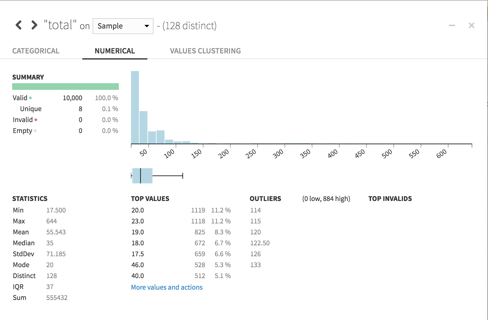
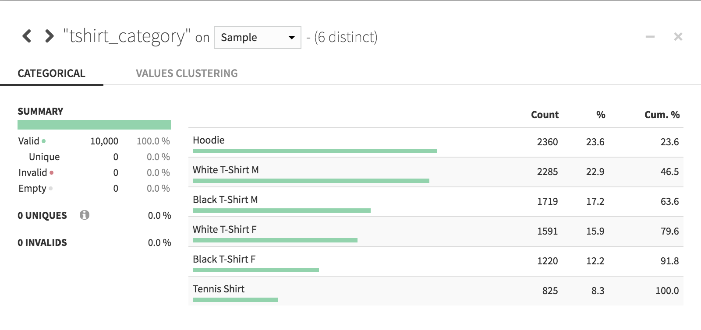

Analyze
########

In the Explore tab of your dataset, you can do some exploratory analysis by clicking on a column and choosing **Analyze** from the dropdown menu.

The resulting modal dialog provides some appropriate statistics and visualizations depending on whether your data are numeric:

... or categorical:

In both cases, the default analysis is based on your :doc:`Design Sample <sampling>`.  Choose **Whole data** from the dropdown menu to base the analysis on the entire dataset.
